# IM-110 プログラム仕様書

> IM-110T 本体・プローブ両基板のプログラム動作仕様。**セクションA=本体、B=プローブ、末尾に付録。**

> **作成方法**: 本体(A)は 77サーバーの Devstral(24B) が本体FWの描画コード `Display.c` と呼出側 状態遷移 `Normal.c`/`Setting.c`/`Adjust.c` を読み、実装から画面仕様・遷移を執筆。付録は `Calc.c`／補正式手順／`Eeprom.h` から生成。プローブ(B)は `protocol-rs232c.md` から生成。Claude Code が真実源と突き合わせ検証。文体はである調に統一。

> 画面図はモノクロLCD(400×240)。全図は `docs/specs/assets/im-110/`。


---

# セクションA：IM-110T 本体


## 5.1 起動画面

<sub>実装: 描画 `disp_STRTDSP`, `disp_STRTDSP2` / 遷移 呼出側 case</sub>

画面「起動画面」の動作仕様は以下の通りである。

### 表示要素
1. IM-110ロゴ
2. ファームウェアバージョン（FW_VER1）
3. "Ver."テキスト
4. "飯島電子工業株式会社"テキスト

### 状態遷移とスイッチ操作の効果
#### 起動画面表示前 (STRT_1)
- **表示要素**: IM-110ロゴ、ファームウェアバージョン、"Ver."テキスト、"飯島電子工業株式会社"テキスト
- **遷移**:
  - 起動画面表示が成功すると、操作説明画面 (STRT_4) に遷移する。
  - ロガーデータの読み込みとエラー処理を行う。

#### 操作説明画面 (STRT_4)
- **表示要素**: 起動画面に加え、以下の操作説明テキスト
  - "校正"テキスト
  - "を押しながら、"テキスト
  - "設定メニュー"テキスト
  - "を押しながら、"テキスト
- **遷移**:
  - 起動画面表示が成功すると、操作説明画面 (STRT_5) に遷移する。

#### 操作説明画面2 (STRT_5)
- **表示要素**: 操作説明画面に加え、以下の操作説明テキスト
  - "icon_MEM"アイコン
  - "icon_POWER"アイコン
  - "icon_DISP"アイコン
- **遷移**:
  - 起動画面表示が成功すると、RTC確認画面 (STRT_2) に遷移する。

### スイッチ操作の効果
- **記録スイッチ (MEM_sw_check)**:
  - 押下 (>=3) すると、記録スイッチステップをリセットする。
- **履歴スイッチ (DISP_sw_check)**:
  - 押下 (>=3) すると、履歴スイッチステップをリセットする。

### 補足
- 起動画面表示中のタイマー設定は、LCDオフタイマーに70秒または10秒が設定される。
- ロガーデータの読み込みエラーが発生した場合、エラーフラグ `f_IC_err` にエラーをセットする。

**起動画面**  
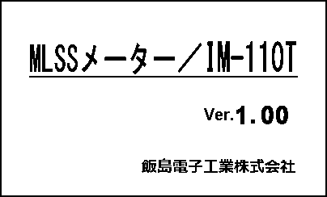  
<sub>画面図 meas_01 — BMP版: [meas_01.bmp](assets/im-110/meas_01.bmp)</sub>


## 5.2 測定メニュー

<sub>実装: 描画 `disp_M_MENU` / 遷移 呼出側 case</sub>

画面「測定メニュー」は、MLSSメーターIM-110Tの設定メニューからアクセスすることができる。この画面では、測定項目の選択を行うことができる。

### 表示要素
- タイトルアイコン
- 電池残量アイコン
- 日付時刻表示
- スイッチ操作アイコン（DISPスイッチ、MEMスイッチ）
- メニュー項目（測定モード、界面設定/相関式、校正、設定）

### 状態遷移とスイッチ操作の効果

#### 初期表示
画面が初期表示されるとき、`M_MENU_2`状態から`M_MENU_3`状態に遷移する。この際、電池残量アイコンが更新され、測定メニューが表示される。

#### DISPスイッチ操作
- **DISPスイッチを押すと**、選択中の項目が変わる。選択中の項目はハイライト表示される。
  - 初期状態では「測定モード」が選択されている。
  - 次に「界面設定/相関式」、次に「校正」、最後に「設定」が選択される。

#### MEMスイッチ操作
- **MEMスイッチを押すと**、選択中の項目が決定され、対応する画面に遷移する。
  - 「測定モード」を選択してMEMスイッチを押すと、測定モード切替画面に遷移する。
  - 「界面設定/相関式」を選択してMEMスイッチを押すと、界面設定または相関式設定画面に遷移する。
  - 「校正」を選択してMEMスイッチを押すと、校正モードに遷移する。
  - 「設定」を選択してMEMスイッチを押すと、設定メニュー画面に遷移する。

#### DISPスイッチ長押し
- **DISPスイッチを長押しすると**、前の画面（測定モード切替画面）に戻る。

### まとめ
「測定メニュー」画面では、DISPスイッチで項目を選択し、MEMスイッチで決定することで、各設定画面に遷移する。DISPスイッチの長押しにより前の画面に戻ることができる。

**測定メニュー（測定モード/相関式/校正/設定）**  
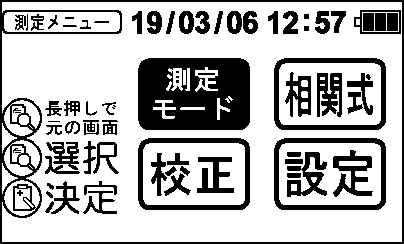  
<sub>画面図 meas_06 — BMP版: [meas_06.bmp](assets/im-110/meas_06.bmp)</sub>

**相関式選択**  
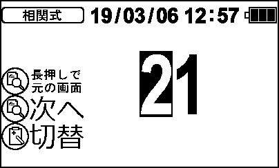  
<sub>画面図 meas_07 — BMP版: [meas_07.bmp](assets/im-110/meas_07.bmp)</sub>


## 5.3 モード切替

<sub>実装: 描画 `disp_M_CHANGE` / 遷移 呼出側 case</sub>

画面「モード切替」は、測定モードを選択するための画面であり、以下のように動作する。

### 表示要素
- タイトルアイコン
- 電池残量アイコン
- 日付時刻表示
- DISPスイッチアイコン
- MEMスイッチアイコン
- MLSSアイコン（選択時は強調表示）
- SSアイコン（選択時は強調表示）
- 透視度アイコン（選択時は強調表示）

### 動作仕様

#### M_CHANGE_1 (測定モード切替画面表示)
- **遷移**: 電源投入時にM_CHANGE_1状態となり、M_CHANGE_2に遷移する。
- **操作**:
  - DISPスイッチを押すと、選択中のアイコンが強調表示される。
  - MEMスイッチを押すと、選択中のモードが決定され、M_CHANGE_3に遷移する。

#### M_CHANGE_2 (測定モード切替画面表示)
- **遷移**: M_CHANGE_1からM_CHANGE_2に遷移し、測定モード切替画面が表示される。
- **操作**:
  - DISPスイッチを押すと、選択中のアイコンが強調表示される。
  - MEMスイッチを押すと、選択中のモードが決定され、M_CHANGE_3に遷移する。

#### M_CHANGE_3 (セット後のメッセージ表示)
- **遷移**: M_CHANGE_2からM_CHANGE_3に遷移し、セット後のメッセージが表示される。
- **操作**:
  - DISPスイッチを押すと、選択中のアイコンが強調表示される。
  - MEMスイッチを押すと、選択中のモードが決定され、M_CHANGE_4に遷移する。

#### M_CHANGE_4 (測定モード切替完了)
- **遷移**: M_CHANGE_3からM_CHANGE_4に遷移し、測定モード切替が完了する。
- **操作**:
  - DISPスイッチを押すと、選択中のアイコンが強調表示される。
  - MEMスイッチを押すと、選択中のモードが決定され、M_CHANGE_1に戻る。

### スイッチ操作の効果
- **DISPスイッチ**: 選択中のアイコンを強調表示する。
- **MEMスイッチ**: 選択中のモードを決定し、次の状態に遷移する。

以上が画面「モード切替」の動作仕様である。


## 5.4 測定モード設定

<sub>実装: 描画 `disp_MEASMODE` / 遷移 呼出側 case</sub>

画面「測定モード設定」は、通常測定モードとデータロガー測定モードの選択を行うための画面である。以下に、表示要素および状態遷移について詳細を記述する。

### 表示要素
- タイトルアイコン
- 電池残量アイコン
- 日付時刻表示
- DISPスイッチアイコン
- MEMスイッチアイコン
- 測定モード選択アイコン（通常/ロガー）
- セレクトアイコン
- 決定アイコン

### 状態遷移とスイッチ操作の効果

#### 初期表示 (MEASMODE_1)
- **DISPスイッチを押すと**、測定モード設定画面（MEASMODE_2）を表示する。
- **MEMスイッチを押すと**、測定モード設定画面（MEASMODE_2）を表示する。

#### 測定モード選択 (MEASMODE_2)
- **DISPスイッチを押すと**、通常測定モードが選択されている場合はデータロガー測定モードに切り替わり、データロガー測定モードが選択されている場合は通常測定モードに切り替わる。
- **MEMスイッチを押すと**、現在選択されている測定モードが設定される（MEASMODE_3）。

#### セット後のメッセージ表示 (MEASMODE_3)
- **DISPスイッチを押すと**、測定モード設定画面（MEASMODE_2）に戻る。
- **MEMスイッチを押すと**、測定モード設定画面（MEASMODE_2）に戻る。

### 注意点
- 測定モードの選択は、DISPスイッチで切り替え、MEMスイッチで決定する。
- セット後のメッセージ表示では、一定時間後に自動的に画面が消える（LCDオフタイマー）。

以上が、画面「測定モード設定」の動作仕様である。

**測定モード選択（MLSS/SS/透視度/界面）**  
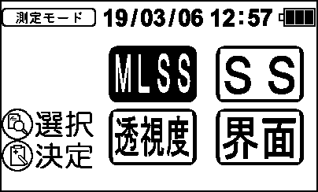  
<sub>画面図 meas_05 — BMP版: [meas_05.bmp](assets/im-110/meas_05.bmp)</sub>


## 5.5 MLSS測定画面（待機・測定中）

<sub>実装: 描画 `disp_MLSS_Meas_2`, `disp_MLSS_Meas_3` / 遷移 呼出側 case</sub>

画面「MLSS測定画面（待機・測定中）」の動作仕様は以下の通りである。

### 表示要素
- **電池残量アイコン**: バッテリーの残量を示すアイコンが表示される。
- **日付時刻表示**: 現在の日付と時刻が表示される。
- **測定中アイコン**: 測定中であることを示す矢印アイコンが表示される。透視度が200cmを超える場合はレンジオーバー固定アイコンに切替わる。
- **MLSS値表示**: MLSSの値が表示される。10000 mg/L以上はg/L形式で表示され、1000-9999 mg/Lはカンマ付き4桁手動描画で表示される。
- **単位アイコン**: g/L表示時は"g/L"、mg/L表示時は"mg/L"が表示される。
- **界面判断バー**: MLSS_inst / Interface_Thresholdを100%としてバー表示される。
- **水深表示**:
  - (a) Sサイズ: 現在のDepthがリアルタイムで表示される。
  - (b) Mサイズ: Interface_Hold値が表示される。未捕捉時は"-.--"と表示される。
- **モードラベル**: "モード/30"が表示される。
- **進捗バー**: 測定の進行状況を示すバーが表示される。
- **DISPスイッチアイコン**: DISPスイッチの操作を示すアイコンが表示される。

### 状態遷移
- **MSR_2 (測定中画面表示・安定待ち)**:
  - 測定中画面が表示され、安定待ちの状態となる。
  - DISPスイッチを押すと、履歴表示画面に遷移する。

- **MSR_7 (測定中画面表示・安定中)**:
  - 測定中画面が表示され、安定中の状態となる。
  - DISPスイッチを押すと、履歴表示画面に遷移する。

- **MSR_5 (記録完了画面表示)**:
  - 記録完了画面が表示される。
  - DISPスイッチを押すと、履歴表示画面に遷移する。

### スイッチ操作の効果
- **DISPスイッチ**:
  - 押すと履歴表示画面に遷移する。
- **記録/履歴スイッチ**:
  - MSR_5状態で押すと、記録完了画面が表示される。

### 補足
- 測定待機と測定中の表示値・水温・BTアイコン・点滅の有無はコードから読み取ることができる。
- 記録完了画面は2秒間表示された後、自動的に次の状態に遷移する。

**MLSS 測定待機**  
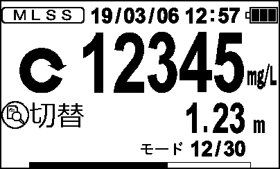  
<sub>画面図 meas_02 — BMP版: [meas_02.bmp](assets/im-110/meas_02.bmp)</sub>

**MLSS 測定中**  
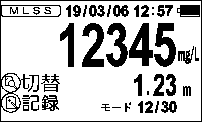  
<sub>画面図 meas_03 — BMP版: [meas_03.bmp](assets/im-110/meas_03.bmp)</sub>

**SS 測定待機**  
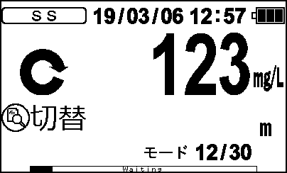  
<sub>画面図 meas_08 — BMP版: [meas_08.bmp](assets/im-110/meas_08.bmp)</sub>

**SS 測定中**  
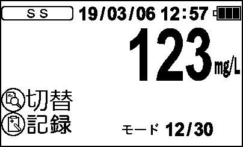  
<sub>画面図 meas_09 — BMP版: [meas_09.bmp](assets/im-110/meas_09.bmp)</sub>

**透視度 測定待機**  
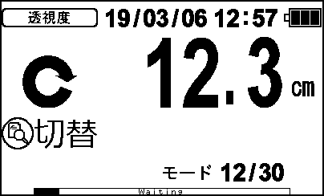  
<sub>画面図 meas_11 — BMP版: [meas_11.bmp](assets/im-110/meas_11.bmp)</sub>

**透視度 測定中**  
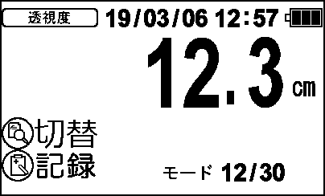  
<sub>画面図 meas_12 — BMP版: [meas_12.bmp](assets/im-110/meas_12.bmp)</sub>

**界面 測定待機**  
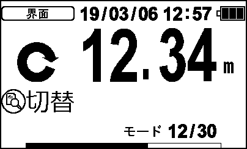  
<sub>画面図 meas_14 — BMP版: [meas_14.bmp](assets/im-110/meas_14.bmp)</sub>

**界面 測定中**  
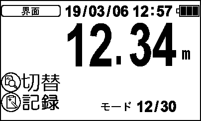  
<sub>画面図 meas_15 — BMP版: [meas_15.bmp](assets/im-110/meas_15.bmp)</sub>


## 5.6 MLSS測定完了画面

<sub>実装: 描画 `disp_MLSS_Meas_4` / 遷移 呼出側 case</sub>

画面「MLSS測定完了画面」は、通常測定モードでの測定が完了した際に表示される画面である。この画面では以下の要素が表示される。

- 海水または淡水のタイトルアイコン
- 電池残量アイコン
- 日付時刻表示
- 測定モード切替メッセージ

この画面は、通常測定モードでの測定が完了した際に自動的に表示される。具体的には、`operation_mode` が `MSR_8` の状態で、描画関数 `disp_MLSS_Meas_4` が呼び出されて表示される。

この画面では、記録スイッチ（MEM）や履歴スイッチ（DISP）の操作は特に定義されていないため、これらのスイッチ操作による遷移や効果はない。


## 5.7 測定レンジ表示

<sub>実装: 描画 `disp_RANGE1`, `disp_RANGE2` / 遷移 呼出側 case</sub>

画面「測定レンジ表示」は、低レンジ、中レンジ、高レンジの各レンジ調整待機中およびゼロ調整完了状態を表示するためのものである。

### 表示要素
- タイトル: レンジ調整待機中またはゼロ調整完了状態に応じて「低レンジ調整待機中」「中レンジ調整待機中」「高レンジ調整待機中」「低レンジゼロ調整待機中」「中レンジゼロ調整待機中」「高レンジゼロ調整待機中」などが表示される。
- 電圧値: レンジに応じた電圧値が数字で表示される。
- "mV": 電圧値の単位として「mV」が表示される。
- アイコン:
  - DISPスイッチとMEMスイッチのアイコンが表示される。
  - 次へボタンと開始ボタンのアイコンが表示される。

### 状態遷移
#### 調整待機中 (disp_RANGE1)
- **低レンジ調整待機中 (LOWRANGE)**
  - タイトル: 「低レンジ調整待機中」
  - 電圧値と「mV」が表示される。
  - DISPスイッチとMEMスイッチのアイコン、次へボタンと開始ボタンのアイコンが表示される。

- **中レンジ調整待機中 (MIDRANGE)**
  - タイトル: 「中レンジ調整待機中」
  - 電圧値と「mV」が表示される。
  - DISPスイッチとMEMスイッチのアイコン、次へボタンと開始ボタンのアイコンが表示される。

- **高レンジ調整待機中 (HIRANGE)**
  - タイトル: 「高レンジ調整待機中」
  - 電圧値と「mV」が表示される。
  - DISPスイッチとMEMスイッチのアイコン、次へボタンと開始ボタンのアイコンが表示される。

- **低レンジゼロ調整待機中 (LOWRANGE0)**
  - タイトル: 「低レンジゼロ調整待機中」
  - 電圧値と「mV」が表示される。
  - DISPスイッチとMEMスイッチのアイコン、次へボタンと開始ボタンのアイコンが表示される。

- **中レンジゼロ調整待機中 (MIDRANGE0)**
  - タイトル: 「中レンジゼロ調整待機中」
  - 電圧値と「mV」が表示される。
  - DISPスイッチとMEMスイッチのアイコン、次へボタンと開始ボタンのアイコンが表示される。

- **高レンジゼロ調整待機中 (HIRANGE0)**
  - タイトル: 「高レンジゼロ調整待機中」
  - 電圧値と「mV」が表示される。
  - DISPスイッチとMEMスイッチのアイコン、次へボタンと開始ボタンのアイコンが表示される。

#### 調整完了 (disp_RANGE2)
- **低レンジゼロ完了 (LOWRANGE0)**
  - タイトル: 「低レンジゼロ調整完了」
  - 電圧値と「mV」が表示される。

- **中レンジゼロ完了 (MIDRANGE0)**
  - タイトル: 「中レンジゼロ調整完了」
  - 電圧値と「mV」が表示される。

- **高レンジゼロ完了 (HIRANGE0)**
  - タイトル: 「高レンジゼロ調整完了」
  - 電圧値と「mV」が表示される。

- **低レンジ完了 (LOWRANGE)**
  - タイトル: 「低レンジ調整完了」
  - 電圧値と「mV」が表示される。

- **中レンジ完了 (MIDRANGE)**
  - タイトル: 「中レンジ調整完了」
  - 電圧値と「mV」が表示される。

- **高レンジ完了 (HIRANGE)**
  - タイトル: 「高レンジ調整完了」
  - 電圧値と「mV」が表示される。

### スイッチ操作
- **DISPスイッチ**: DISPスイッチを押すと、次へボタンのアイコンが反応し、次の状態に遷移する。
- **MEMスイッチ**: MEMスイッチを押すと、開始ボタンのアイコンが反応し、調整を開始する。

### 画面遷移
- **調整待機中から調整完了へ**:
  - 調整待機中の状態でMEMスイッチを押すと、調整完了の状態に遷移する。
  - 調整完了の状態でDISPスイッチを押すと、次の状態に遷移する。

以上が「測定レンジ表示」画面の動作仕様である。


## 5.8 水温表示

<sub>実装: 描画 `disp_WAT1`, `disp_WAT2` / 遷移 呼出側 case</sub>

画面「水温表示」は、水温の測定および表示を行うための画面である。以下に、各状態における表示要素とスイッチ操作による遷移を記述する。

### 水温5℃調整待機中 (WAT05C)
- **表示要素**:
  - タイトル: "水温5℃"
  - 水温値
  - "℃"アイコン
  - DISPスイッチアイコン
  - MEMスイッチアイコン
  - 次へアイコン
  - 開始アイコン

- **スイッチ操作**:
  - DISPスイッチを押すと、次の状態に遷移する。
  - MEMスイッチを押すと、測定が開始される。

### 水温20℃調整待機中 (WAT20C)
- **表示要素**:
  - タイトル: "水温20℃"
  - 水温値
  - "℃"アイコン
  - DISPスイッチアイコン
  - MEMスイッチアイコン
  - 次へアイコン
  - 開始アイコン

- **スイッチ操作**:
  - DISPスイッチを押すと、次の状態に遷移する。
  - MEMスイッチを押すと、測定が開始される。

### 水温35℃調整待機中 (WAT35C)
- **表示要素**:
  - タイトル: "水温35℃"
  - 水温値
  - "℃"アイコン
  - DISPスイッチアイコン
  - MEMスイッチアイコン
  - 次へアイコン
  - 開始アイコン

- **スイッチ操作**:
  - DISPスイッチを押すと、次の状態に遷移する。
  - MEMスイッチを押すと、測定が開始される。

### 水温5℃調整完了 (WAT05C)
- **表示要素**:
  - タイトル: "水温5℃"
  - 水温値
  - "℃"アイコン

- **スイッチ操作**:
  - スイッチ操作はない。

### 水温20℃調整完了 (WAT20C)
- **表示要素**:
  - タイトル: "水温20℃"
  - 水温値
  - "℃"アイコン

- **スイッチ操作**:
  - スイッチ操作はない。

### 水温35℃調整完了 (WAT35C)
- **表示要素**:
  - タイトル: "水温35℃"
  - 水温値
  - "℃"アイコン

- **スイッチ操作**:
  - スイッチ操作はない。

### その他の状態
- **表示要素**:
  - 黒塗り

- **スイッチ操作**:
  - スイッチ操作はない。


## 5.9 界面閾値設定

<sub>実装: 描画 `disp_Depth_Setting` / 遷移 呼出側 case</sub>

画面「界面閾値設定」は、界面測定の閾値を設定するための画面である。以下にその動作仕様を記述する。

### 表示要素
- **界面設定アイコン**: 画面上部に表示される。
- **電池残量アイコン**: 電池の残量を示すアイコンが表示される。
- **日付時刻表示**: 現在の日付と時刻が表示される。
- **閾値設定値**: 5桁の数値が大サイズで上段に表示される。選択中の桁は反転して点滅する。
- **"mg/L"**: 単位として「mg/L」が表示される。
- **スイッチ操作アイコン**:
  - **DISPスイッチ長押し**: 元の画面に戻るためのアイコンが表示される。
  - **次へ**: 次の設定画面に進むためのアイコンが表示される。
  - **切替**: 設定値を切り替えるためのアイコンが表示される。

### 動作仕様
- **DISPスイッチ長押し**すると、元の画面に戻る。
- **記録(MEM)スイッチ**を押すと、設定値が確定し、次へ進む。
- **履歴(DISP)スイッチ**を押すと、設定値を切り替える。

### 状態遷移
- **D_SET_2**: スパン校正値設定画面表示。この状態では、`disp_Depth_Setting`関数が呼び出され、界面閾値設定画面が表示される。
- **DISPスイッチ長押し**すると、`operation_mode`が更新され、元の画面に戻る。
- **記録(MEM)スイッチ**を押すと、`operation_mode`が更新され、次へ進む。
- **履歴(DISP)スイッチ**を押すと、`operation_mode`が更新され、設定値を切り替える。

### 補足
- 画面「界面閾値設定」は、界面測定の閾値を設定するための画面である。
- 表示要素やスイッチ操作に関する詳細な動作仕様は、コードから読み取れる内容に基づいて記述されている。


## 6.1 校正メニュー

<sub>実装: 描画 `disp_C_MENU` / 遷移 呼出側 case</sub>

画面「校正メニュー」は、校正モードを選択するためのメニュー画面である。以下にその動作仕様を記述する。

### 表示要素
- タイトルアイコン
- 電池残量アイコン
- 日付時刻表示
- スイッチ操作アイコン（DISP、MEM）
- 長押しで前の画面へアイコン
- 選択アイコン
- 決定アイコン

### 校正メニュー画面（C_MENU_2）
電源 ON 経由の場合：
- 「ゼロ校正」アイコン
- 「2点校正」アイコン
- 「3点校正」アイコン
- 「校正リセット」アイコン

測定メニュー経由の場合：
- 現在の校正モードに応じて、以下のアイコンが表示される。
  - CAL_MODE_Z: 「2点校正」「3点校正」「校正リセット」「測定」
  - CAL_MODE_2P: 「ゼロ校正」「3点校正」「校正リセット」「測定」
  - CAL_MODE_3P: 「ゼロ校正」「2点校正」「校正リセット」「測定」

### スイッチ操作
- **DISPスイッチを押すと**、選択アイコンが移動する。
- **MEMスイッチを押すと**、選択された項目が決定される。
- **DISPスイッチを長押しすると**、前の画面に戻る。

### 状態遷移
- **C_MENU_2**から**C_MENU_3**へ遷移する。

**MLSS 校正メニュー**  
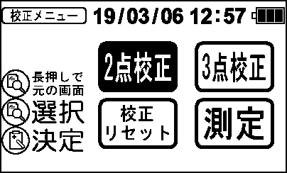  
<sub>画面図 calib_02 — BMP版: [calib_02.bmp](assets/im-110/calib_02.bmp)</sub>

**SS 校正メニュー**  
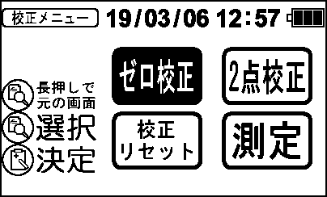  
<sub>画面図 calib_16 — BMP版: [calib_16.bmp](assets/im-110/calib_16.bmp)</sub>

**透視度 校正メニュー**  
  
<sub>画面図 calib_30 — BMP版: [calib_30.bmp](assets/im-110/calib_30.bmp)</sub>


## 6.2 校正設定

<sub>実装: 描画 `disp_CAL_SETTING` / 遷移 呼出側 case</sub>

画面「校正設定」は、校正モード選択画面として機能する。以下にその動作仕様を記述する。

### 表示要素
1. タイトルアイコンが表示される。
2. 電池残量アイコンが表示される。
3. 日付時刻が表示される。
4. DISPスイッチのアイコンが表示される。
5. MEMスイッチのアイコンが表示される。
6. 選択中の項目に応じて、ゼロ校正、2点校正、3点校正のアイコンが表示される。

### スイッチ操作と画面遷移
1. **DISPスイッチを押すと**、選択中の項目を切り替える。選択可能な項目はゼロ校正、2点校正、3点校正の3つである。
2. **MEMスイッチを押すと**、選択された校正モードが決定される。

### 状態遷移
- **C_MODE_2** (校正モード選択画面表示) から **C_MODE_3** に遷移する。この遷移は、DISPスイッチやMEMスイッチの操作によって発生する。
- **C_MODE_3** では、`disp_CAL_SETTING` 関数が呼び出され、画面が更新される。`fl_flag` が反転し、`disp_timer` が設定される。

### 注意点
- `cal_setting_sel` は選択中の項目を示す変数である。
- `bar_flag` と `fl_flag` は内部状態を示すフラグであり、具体的な動作はコードから読み取れないため、詳細については要確認である。

以上が画面「校正設定」の動作仕様である。


## 6.3 補正設定

<sub>実装: 描画 `disp_Corr_setting`, `disp_Corr_setting_30` / 遷移 呼出側 case</sub>

画面「補正設定」は、相関式の設定を行うための画面である。以下に、表示要素と状態遷移、スイッチ操作の効果を記述する。

### 表示要素
- タイトル: 「相関式」
- 電池残量アイコン
- 日付時刻表示
- スイッチ操作アイコン:
  - DISPスイッチ長押しで戻る
  - 次の桁へ進む
  - 桁値を変更する

### 状態遷移とスイッチ操作の効果
#### 相関式設定画面2 (C_S_CORR_2)
- **表示要素**:
  - タイトル: 「相関式」
  - 電池残量アイコン
  - 日付時刻表示
  - スイッチ操作アイコン:
    - DISPスイッチ長押しで戻る
    - 次の桁へ進む
    - 桁値を変更する

- **状態遷移**:
  - 相関式設定画面2 (C_S_CORR_2) から、相関式設定画面3 (C_S_CORR_3) に遷移する。

- **スイッチ操作の効果**:
  - DISPスイッチ長押し: 前の画面に戻る。
  - MEMスイッチ押下: 次の桁へ進む。
  - DISPスイッチ押下: 桁値を変更する。

#### 相関式設定画面2 (S_CORR_2)
- **表示要素**:
  - タイトル: 「相関式」
  - 電池残量アイコン
  - 日付時刻表示
  - スイッチ操作アイコン:
    - DISPスイッチ長押しで戻る
    - 次の桁へ進む
    - 桁値を変更する

- **状態遷移**:
  - 相関式設定画面2 (S_CORR_2) から、相関式設定画面3 (S_CORR_3) に遷移する。

- **スイッチ操作の効果**:
  - DISPスイッチ長押し: 前の画面に戻る。
  - MEMスイッチ押下: 次の桁へ進む。
  - DISPスイッチ押下: 桁値を変更する。

### 注意点
- 上記の状態遷移とスイッチ操作の効果は、コードから読み取れた内容に基づいている。詳細な動作確認や追加の要件が必要な場合は、実際の製品での動作を確認することが推奨される。
- 具体的な数値入力や相関式の設定方法については、コードから読み取れないため、詳細な仕様書や設計書を参照することを推奨する。


## 6.4 MLSSゼロ校正

<sub>実装: 描画 `disp_MLSS_ZCal_2`, `disp_MLSS_ZCal_3` / 遷移 呼出側 case</sub>

画面「MLSSゼロ校正」の動作仕様は以下の通りである。

### 表示要素
- ゼロ校正アイコン
- 電池残量アイコン
- 日付時刻表示
- 矢印アイコン（点滅）
- 測定値（MLSS/SS/透視度）および単位（mg/L/cm）
- モード表示（モード番号/30）
- MEMスイッチアイコン
- 中止アイコン

### 状態遷移とスイッチ操作の効果

#### ZCAL_4 (ゼロ校正中画面表示)
- **表示内容**: ゼロ校正中の進捗バーと測定値を表示する。
- **MEMスイッチ押下**: ゼロ校正を中止し、ZCAL_1に遷移する。
- **校正タイムアウト**: センサー不安定エラーが発生し、ERRMSGに遷移する。

#### ZCAL_8 (ゼロ校正完了前の表示)
- **表示内容**: ゼロ校正中の進捗バーと測定値を表示する。
- **遷移先**: ZCAL_2

#### ZCAL_5 (ゼロ校正完了表示処理（Good））
- **表示内容**: ゼロ校正完了アイコンを表示する。
- **遷移先**: ZCAL_6

#### ZCAL_9 (ゼロ校正完了後の表示)
- **表示内容**: ゼロ校正中の進捗バーと測定値を表示する。
- **遷移先**: ZCAL_7

**ゼロ校正 待機**  
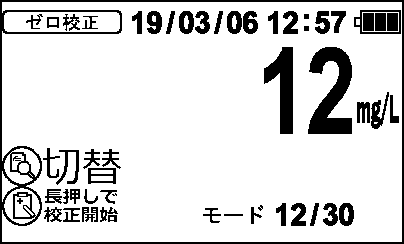  
<sub>画面図 calib_07 — BMP版: [calib_07.bmp](assets/im-110/calib_07.bmp)</sub>

**ゼロ校正 中**  
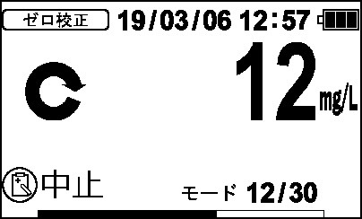  
<sub>画面図 calib_08 — BMP版: [calib_08.bmp](assets/im-110/calib_08.bmp)</sub>

**校正完了**  
  
<sub>画面図 calib_09 — BMP版: [calib_09.bmp](assets/im-110/calib_09.bmp)</sub>

**ゼロ校正 値表示**  
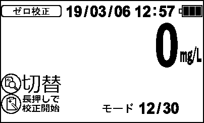  
<sub>画面図 calib_10 — BMP版: [calib_10.bmp](assets/im-110/calib_10.bmp)</sub>


## 6.5 MLSS中間校正

<sub>実装: 描画 `disp_MLSS_MCal_2`, `disp_MLSS_MCal_3` / 遷移 呼出側 case</sub>

画面「MLSS中間校正」は、MLSS測定モードにおける中間校正を行うための画面である。以下に、表示要素と状態遷移、スイッチ操作の効果を記述する。

### 表示要素
- **3点校正アイコン**: 画面上部に表示される。
- **電池残量アイコン**: 現在の電池残量を示す。
- **日付時刻表示**: 現在の日時を表示する。
- **矢印アイコン**: 校正中の進行状況を示す。
- **MLSS値**: 現在のMLSS測定値を表示する。範囲は-99から20000 mg/L。
- **"mg/L" アイコン**: MLSS値の単位を示す。
- **中間校正設定値**: 中間校正のための設定値を表示する。
- **モード表示**: 現在の測定モードを示す。範囲は1から30。
- **"モード" アイコン**と**"/" アイコン**: モード表示の単位を示す。
- **MEMアイコン**: 記録スイッチの操作状態を示す。
- **中止アイコン**: 校正を中止するための操作を示す。
- **進捗バー**: 校正の進行状況を視覚的に示す。

### 状態遷移とスイッチ操作
#### MCAL_4 (スパン校正中画面表示)
- **表示要素**:
  - 3点校正アイコン
  - 電池残量アイコン
  - 日付時刻表示
  - 矢印アイコン
  - MLSS値
  - "mg/L" アイコン
  - 中間校正設定値
  - モード表示
  - "モード" アイコンと"/" アイコン
  - MEMアイコン
  - 中止アイコン
  - 進捗バー

- **スイッチ操作**:
  - **記録(MEM)スイッチを押す**と、スパン校正が中止され、`MCAL_1`状態に遷移する。

#### MCAL_8 (スパン校正完了表示処理)
- **表示要素**:
  - 3点校正アイコン
  - 電池残量アイコン
  - 日付時刻表示
  - MLSS値
  - "mg/L" アイコン
  - 中間校正設定値
  - モード表示
  - "モード" アイコンと"/" アイコン
  - MEMアイコン
  - 校正開始アイコン

- **スイッチ操作**:
  - スイッチ操作に関する記述はない。

#### MCAL_5 (スパン校正完了表示処理（Good））
- **表示要素**:
  - 3点校正アイコン
  - 電池残量アイコン
  - 日付時刻表示
  - 校正完了アイコン
  - MLSS値
  - "mg/L" アイコン
  - 中間校正設定値
  - モード表示
  - "モード" アイコンと"/" アイコン
  - MEMアイコン

- **スイッチ操作**:
  - スイッチ操作に関する記述はない。

#### MCAL_9 (スパン校正完了表示処理)
- **表示要素**:
  - 3点校正アイコン
  - 電池残量アイコン
  - 日付時刻表示
  - MLSS値
  - "mg/L" アイコン
  - 中間校正設定値
  - モード表示
  - "モード" アイコンと"/" アイコン
  - MEMアイコン

- **スイッチ操作**:
  - スイッチ操作に関する記述はない。

### まとめ
画面「MLSS中間校正」では、3点校正アイコンや電池残量アイコン、日付時刻表示などの基本的な情報が表示される。スパン校正中の進行状況は矢印アイコンと進捗バーで示され、記録(MEM)スイッチを押すことでスパン校正が中止される。スパン校正完了後の画面では、校正完了アイコンやMLSS値などが表示される。

**3点校正 待機**  
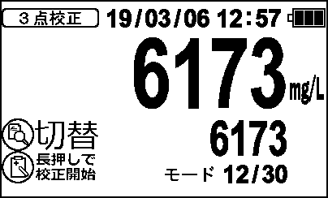  
<sub>画面図 calib_11 — BMP版: [calib_11.bmp](assets/im-110/calib_11.bmp)</sub>

**3点校正 値**  
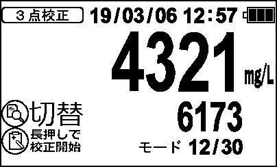  
<sub>画面図 calib_12 — BMP版: [calib_12.bmp](assets/im-110/calib_12.bmp)</sub>

**3点校正 中**  
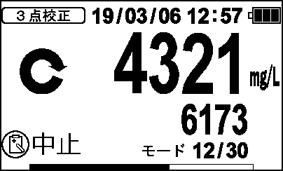  
<sub>画面図 calib_13 — BMP版: [calib_13.bmp](assets/im-110/calib_13.bmp)</sub>

**校正完了**  
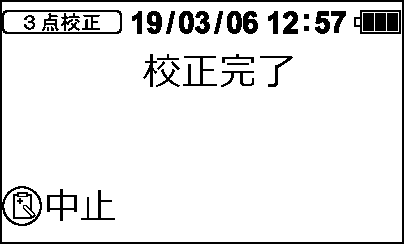  
<sub>画面図 calib_14 — BMP版: [calib_14.bmp](assets/im-110/calib_14.bmp)</sub>


## 6.6 MLSSスパン校正

<sub>実装: 描画 `disp_MLSS_SCal_1`, `disp_MLSS_SCal_2`, `disp_MLSS_SCal_3` / 遷移 呼出側 case</sub>

画面「MLSSスパン校正」は、MLSS測定モードにおけるスパン校正を行うための画面である。以下に、表示要素と状態遷移、スイッチ操作の効果を記述する。

### 表示要素
- **2点校正アイコン**: 画面上部に表示される。
- **電池残量アイコン**: 電池の残量を示すアイコンが表示される。
- **日付時刻表示**: 現在の日付と時刻が表示される。
- **MLSS値**: 中央部分にMLSS値が表示される。値が異常範囲内である場合は白塗りとなる。
- **スパン校正設定値**: MLSS値の下部に、スパン校正設定値が5桁で表示される。編集中の桁は点滅する。
- **モード表示**: 画面右下部分に「モード」と表示され、現在のMLSSモードが表示される。

### 状態遷移
1. **C_S_SET_2 (スパン校正値設定画面表示)**
   - スイッチ操作: なし
   - 遷移先: C_S_SET_3

2. **C_M_SET_2 (中間濃度設定画面表示)**
   - スイッチ操作: なし
   - 遷移先: C_M_SET_3

3. **ADICAL_4 (スパン校正中画面表示)**
   - スイッチ操作:
     - MEMスイッチ押下: スパン校正を中止し、ADICAL_1に遷移。
   - 遷移先: ADICAL_3

4. **ADICAL_8**
   - スイッチ操作: なし
   - 遷移先: ADICAL_2

5. **ADICAL_5 (スパン校正完了表示処理)**
   - スイッチ操作: なし
   - 遷移先: ADICAL_6

6. **ADICAL_9**
   - スイッチ操作: なし
   - 遷移先: ADICAL_7

### スイッチ操作の効果
- **MEMスイッチ押下**:
  - ADICAL_4状態で押下すると、スパン校正を中止しADICAL_1に遷移する。

### その他
- **タイマー処理**: 各画面遷移において、ディスプレイの更新サイクルやフラッシュ表示の点滅サイクルが設定されている。
- **エラー処理**: 校正タイムアウトが発生した場合は、センサー不安定と判断しERRMSGに遷移する。

以上が「MLSSスパン校正」画面の動作仕様である。

**2点校正 待機**  
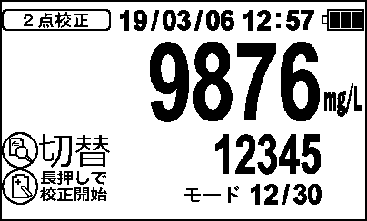  
<sub>画面図 calib_03 — BMP版: [calib_03.bmp](assets/im-110/calib_03.bmp)</sub>

**2点校正 中**  
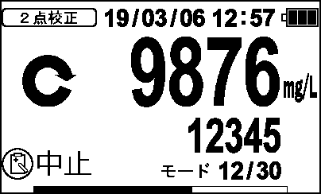  
<sub>画面図 calib_04 — BMP版: [calib_04.bmp](assets/im-110/calib_04.bmp)</sub>

**校正完了**  
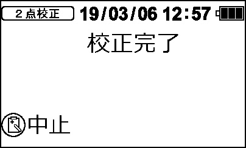  
<sub>画面図 calib_05 — BMP版: [calib_05.bmp](assets/im-110/calib_05.bmp)</sub>


## 6.7 AD校正

<sub>実装: 描画 `disp_ADCAL1`, `disp_ADCAL2`, `disp_ADCAL3` / 遷移 呼出側 case</sub>

画面「AD校正」の動作仕様は以下の通りである。

### 表示要素
- タイトル: "AD校正"
- 電池残量アイコン
- 日付時刻表示
- 空気飽和率バー表示
- 空気飽和率アイコンと数値（%）
- スイッチ操作アイコン:
  - DISPスイッチ: 長押しで構成履歴
  - POWERスイッチ: 入れ直し測定
  - MEMスイッチ: 校正開始
- 酸素濃度表示（mg/L）
- 温度表示（℃）

### 状態遷移とスイッチ操作の効果

#### AD校正画面1 (disp_ADCAL1)
- **初期表示**:
  - タイトル、電池残量アイコン、日付時刻、空気飽和率バー、酸素濃度、温度が表示される。
  - スイッチ操作アイコンが表示される。

- **スイッチ操作**:
  - DISPスイッチを長押しすると、構成履歴画面に遷移する（要確認）。
  - POWERスイッチを押すと、入れ直し測定が行われる（要確認）。
  - MEMスイッチを押すと、校正開始が行われる（要確認）。

#### AD校正画面2 (disp_ADCAL2)
- **初期表示**:
  - タイトル、電池残量アイコン、日付時刻、空気飽和率バー、酸素濃度、温度が表示される。
  - スイッチ操作アイコンが表示される。

- **スイッチ操作**:
  - POWERスイッチを押すと、入れ直し測定が行われる（要確認）。
  - MEMスイッチを押すと、校正中止が行われる（要確認）。

#### AD校正画面3 (disp_ADCAL3)
- **初期表示**:
  - タイトル、電池残量アイコン、日付時刻、空気飽和率バー、酸素濃度、温度が表示される。
  - スイッチ操作アイコンが表示される。

- **スイッチ操作**:
  - POWERスイッチを押すと、入れ直し測定が行われる（要確認）。
  - MEMスイッチを押すと、校正中止が行われる（要確認）。

### 補足
- 酸素濃度の表示範囲は-0.99から20.0 mg/Lである。
- 温度の表示範囲は-9.9から50.0 ℃である。
- 空気飽和率の表示範囲はAIR_PERである。

以上が画面「AD校正」の動作仕様である。


## 6.8 自動校正完了

<sub>実装: 描画 `disp_AUTOCAL_COMP` / 遷移 呼出側 case</sub>

画面「自動校正完了」は、自動校正が完了したことを示すために表示される画面である。

### 表示要素
- 電池残量アイコン: 現在の電池残量を示すアイコンが表示される。
- メッセージ: 「自動校正完了」というメッセージが表示される。
- 校正日時: 自動校正が行われた日時が「yyyy/mm/dd hh:mm」形式で表示される。
- MEM アイコン: MEM スイッチの操作を示すアイコンが表示される。
- 次へアイコン: 次の画面に進むことを示すアイコンが表示される。
- エラーアイコン: エラーが発生した場合に表示されるアイコン。

### 状態遷移
- 自動校正完了画面（gui_ACALCOMP）から、エラー発生時の処理が行われる。`disp_AUTOCAL_COMP(bar_flag)` が `DISP_OK` を返すと、`operation_mode` は `ERRWAIT1` に遷移し、`timer_errdisp` が設定される。

### スイッチ操作
- 記録スイッチ（MEM）を押下すると、記録関連の処理が行われる。
- 履歴スイッチ（DISP）を押下すると、履歴表示画面に遷移する。

### 注意点
- エラーが発生した場合には、エラーアイコンが表示される。


## 6.9 校正リセット

<sub>実装: 描画 `disp_C_RESET` / 遷移 呼出側 case</sub>

画面「校正リセット」は、相関式のリセットを行うための画面である。以下に、表示要素と状態遷移、スイッチ操作の効果を記述する。

### 表示要素
- タイトルアイコン
- 電池残量アイコン
- 日付時刻表示
- リセット前メッセージ（リセット前画面）
  - DISPスイッチアイコン
  - MEMスイッチアイコン
  - 「戻る」アイコン
  - 「決定」アイコン
  - 「相関式No.」テキスト
  - 相関式番号
  - リセットメッセージ
- リセット後メッセージ（リセット後画面）
  - DISPスイッチアイコン
  - 「戻る」アイコン
  - 「相関式No.」テキスト
  - 相関式番号
  - リセット完了メッセージ

### 状態遷移とスイッチ操作の効果

#### C_RESET_1（リセット前画面表示）
- **DISPスイッチを押すと**、C_RESET_2に遷移する。
- **MEMスイッチを押すと**、相関式がリセットされ、C_RESET_3に遷移する。

#### C_RESET_2（リセット前画面表示中）
- **DISPスイッチを押すと**、C_RESET_1に戻る。
- **MEMスイッチを押すと**、相関式がリセットされ、C_RESET_3に遷移する。

#### C_RESET_3（リセット後画面表示）
- **DISPスイッチを押すと**、C_RESET_4に遷移する。
- **MEMスイッチを押すと**、C_RESET_4に遷移する。

#### C_RESET_4（リセット後画面表示中）
- **DISPスイッチを押すと**、C_RESET_3に戻る。
- **MEMスイッチを押すと**、C_RESET_3に戻る。

### 注意点
- リセット前画面では、DISPスイッチで戻り、MEMスイッチでリセットを行う。
- リセット後画面では、DISPスイッチで戻り、MEMスイッチでも戻る。


## 6.10 後校正 記録選択

<sub>実装: 描画 `disp_CAL_HSEL` / 遷移 呼出側 case</sub>

画面「後校正 記録選択」は、モノクロLCD 400×240に表示され、以下の要素を含む。

1. タイトル: 履歴タイトルが表示される。
2. バッテリーアイコン: バッテリー残量を示すアイコンが表示される。
3. 日時表示: 現在の日時が表示される。
4. スイッチ操作説明:
   - DISPスイッチ短押し: 次の記録へ移動する。
   - MEMスイッチ短押し: 選択した記録を校正する。
   - DISPスイッチ長押し: 後校正画面に戻る。

5. 記録リスト:
   - 3つの記録が表示され、選択行は点滅する。
   - 選択行以外の記録番号は常時表示される。
   - 記録間には区切り線が表示される。

状態遷移とスイッチ操作の効果は以下の通りである。

- **DISPスイッチ短押し**すると、次の記録へ移動する。
- **MEMスイッチ短押し**すると、選択した記録を校正する。
- **DISPスイッチ長押し**すると、後校正画面に戻る。

状態遷移は以下の通りである。

- `CAL_HSEL_2`状態から、`disp_CAL_HSEL`関数が呼び出され、記録選択画面が表示される。
- 記録選択画面でスイッチ操作を行うと、対応する処理が実行される。

詳細な遷移と操作は以下の通りである。

1. **記録選択画面表示**:
   - `CAL_HSEL_2`状態から、`disp_CAL_HSEL`関数が呼び出され、記録選択画面が表示される。
   - 記録リストの最初の3つが表示され、選択行は点滅する。

2. **DISPスイッチ短押し**:
   - 次の記録へ移動する。記録リストが更新され、新しい3つの記録が表示される。

3. **MEMスイッチ短押し**:
   - 選択した記録を校正する。校正処理が実行される。

4. **DISPスイッチ長押し**:
   - 後校正画面に戻る。後校正画面が表示される。

以上が、画面「後校正 記録選択」の動作仕様である。


## 6.11 校正履歴表示

<sub>実装: 描画 `disp_DISPCAL` / 遷移 呼出側 case</sub>

画面「校正履歴表示」は、校正履歴データを表示するための画面である。以下に、この画面の動作仕様を記述する。

### 表示要素
- タイトル: 「校正履歴」
- 電池残量アイコン
- 日付時刻表示
- スイッチアイコン:
  - DISPスイッチアイコン
  - MEMスイッチアイコン
  - 切替アイコン
  - 次へアイコン
- 履歴データ表示:
  - 履歴データ1つめ
  - 区切り線
  - 履歴データ2つめ
  - 区切り線
  - 履歴データ3つめ

### 動作仕様
#### DISPCAL_2 (校正履歴表示)
- **画面遷移**: `DISPCAL_2`状態で、校正履歴表示を行う。
- **スイッチ操作**:
  - MEMスイッチが押下されると、`DISPCAL_5`状態に遷移する。

#### DISPCAL_3 (校正履歴表示中)
- **画面遷移**: `DISPCAL_2`状態で校正履歴表示が成功すると、`DISPCAL_3`状態に遷移する。
- **スイッチ操作**:
  - MEMスイッチが押下されると、`DISPCAL_5`状態に遷移する。

#### DISPCAL_5 (記録削除画面表示)
- **画面遷移**: `DISPCAL_3`状態でMEMスイッチが押下されると、`DISPCAL_5`状態に遷移し、記録削除画面を表示する。
- **スイッチ操作**:
  - MEMスイッチが押下されると、`DISPCAL_6`状態に遷移する。

#### DISPCAL_6 (記録削除中)
- **画面遷移**: `DISPCAL_5`状態でMEMスイッチが押下されると、`DISPCAL_6`状態に遷移し、記録削除処理を行う。
- **スイッチ操作**:
  - MEMスイッチが押下されると、`DISPCAL_5`状態に戻る。

### まとめ
校正履歴表示画面では、校正履歴データを3つ表示し、MEMスイッチの操作により記録削除画面へ遷移する。記録削除画面では、再度MEMスイッチを押下することで記録削除処理が行われる。

**測定履歴（MLSS）**  
  
<sub>画面図 meas_04 — BMP版: [meas_04.bmp](assets/im-110/meas_04.bmp)</sub>

**測定履歴（SS）**  
  
<sub>画面図 meas_10 — BMP版: [meas_10.bmp](assets/im-110/meas_10.bmp)</sub>

**測定履歴（透視度）**  
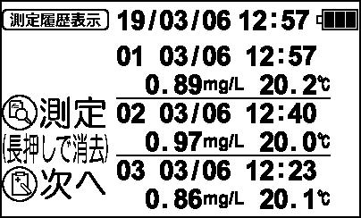  
<sub>画面図 meas_13 — BMP版: [meas_13.bmp](assets/im-110/meas_13.bmp)</sub>

**測定履歴（界面）**  
  
<sub>画面図 meas_16 — BMP版: [meas_16.bmp](assets/im-110/meas_16.bmp)</sub>


## 5.10 測定履歴表示

<sub>実装: 描画 `disp_DISPHIS` / 遷移 呼出側 case</sub>

画面「測定履歴表示」は、測定履歴を表示するための画面である。以下にその動作仕様を記述する。

### 表示要素
- タイトル: 「測定履歴」
- 電池残量アイコン
- 日付時刻表示
- スイッチ操作アイコン:
  - 記録スイッチ（MEM）のアイコン
  - 履歴スイッチ（DISP）のアイコン
  - 測定スイッチ（MEASURE）のアイコン
  - 次へスイッチ（NEXT）のアイコン
- 履歴データ表示:
  - 履歴データ1つめ
  - 履歴データ2つめ
  - 履歴データ3つめ

### 動作仕様
#### DISPHIS_2 (測定履歴表示)
- **遷移**: `DISPHIS_2`状態で、測定履歴が正常に表示された場合、`DISPHIS_3`状態に遷移する。

#### DISPHIS_5 (記録削除画面表示)
- **遷移**: `DISPHIS_5`状態で、記録削除画面が正常に表示された場合、`DISPHIS_6`状態に遷移する。
- **スイッチ操作**:
  - 記録スイッチ（MEM）を押下すると、`MEM_sw_step`がリセットされる。

### スイッチ操作の効果
- **記録スイッチ（MEM）**: `DISPHIS_5`状態で押下すると、`MEM_sw_step`がリセットされる。
- **履歴スイッチ（DISP）**: 特に記述がないため、動作は不明である。(要確認)
- **測定スイッチ（MEASURE）**: 特に記述がないため、動作は不明である。(要確認)
- **次へスイッチ（NEXT）**: 特に記述がないため、動作は不明である。(要確認)

### 注意点
- `DISPHIS_2`状態での履歴表示が正常に行われない場合の処理は不明である。
- `DISPHIS_5`状態での記録削除画面表示が正常に行われない場合の処理は不明である。

以上が「測定履歴表示」画面の動作仕様である。

**設定メニュー**  
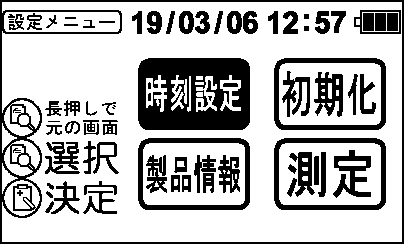  
<sub>画面図 settings_01 — BMP版: [settings_01.bmp](assets/im-110/settings_01.bmp)</sub>

**製品情報**  
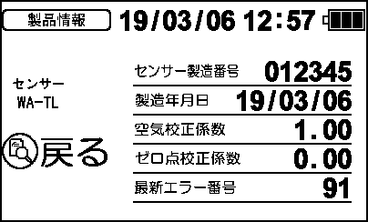  
<sub>画面図 settings_05 — BMP版: [settings_05.bmp](assets/im-110/settings_05.bmp)</sub>


## 7.1 設定メニュー

<sub>実装: 描画 `disp_S_MENU` / 遷移 呼出側 case</sub>

画面「設定メニュー」は、IM-110Tの設定を行うためのメインメニューである。以下に、表示要素とスイッチ操作による遷移について詳細を記述する。

### 7.1 設定メニュー

#### 表示要素
- タイトル: 「設定メニュー」
- 電池残量アイコン
- 日付時刻表示
- メニュー項目:
  - "時刻設定"
  - "初期化"
  - "製品情報"
  - "界面しきい値設定"

#### スイッチ操作による遷移

1. **記録(MEM)スイッチを押すと、選択されたメニュー項目が決定される。**
   - "時刻設定"が選択されている場合、時刻設定画面に遷移する。
   - "初期化"が選択されている場合、初期化確認画面に遷移する。
   - "製品情報"が選択されている場合、製品情報表示画面に遷移する。
   - "界面しきい値設定"が選択されている場合、界面しきい値設定画面に遷移する。

2. **履歴(DISP)スイッチを押すと、メニュー項目が選択される。**
   - "時刻設定" → "初期化" → "製品情報" → "界面しきい値設定" の順に選択が移動する。

3. **履歴(DISP)スイッチを長押しすると、前の画面に戻る。**
   - 設定メニューから前の画面（通常測定モードなど）に遷移する。

#### 状態(operation_mode)
- MENU2_2: 設定メニュー2画面待機中
- MENU1_3: 設定メニュー1画面3
- MENU2_3: 設定メニュー2画面3

### 注意事項
- 画面遷移やスイッチ操作の具体的な動作は、コードから読み取れた内容に基づいて記述されている。
- コードから読み取れない事項については「(要確認)」と明記する。


## 7.2 自動校正設定

<sub>実装: 描画 `disp_ACALSET` / 遷移 呼出側 case</sub>

画面「自動校正設定」は、IM-110Tの設定メニュー内に位置し、自動校正の時間設定を行うための画面である。以下に、表示要素と状態遷移、スイッチ操作の効果を記述する。

### 表示要素
- タイトル: 自動校正設定
- 電池残量アイコン
- 日付時刻表示
- スイッチアイコン:
  - DISPスイッチ: 選択
  - MEMスイッチ: 決定
- 選択肢:
  - OFF
  - 4時
  - 5時
  - 6時

### 状態遷移とスイッチ操作の効果

#### ACALSET_1 (自動校正画面表示)
- **初期表示**:
  - タイトル「自動校正設定」を表示。
  - 電池残量アイコン、日付時刻を表示。
  - スイッチアイコン（DISP:選択、MEM:決定）を表示。
  - 選択肢（OFF、4時、5時、6時）を表示。

- **DISPスイッチ操作**:
  - 押下すると、選択肢間で移動する。選択中の項目が強調表示される。

- **MEMスイッチ操作**:
  - 押下すると、選択中の項目を設定し、ACALSET_3に遷移する。

#### ACALSET_2 (自動校正画面表示中)
- **初期表示**:
  - ACALSET_1と同様の表示要素を表示。

- **DISPスイッチ操作**:
  - 押下すると、選択肢間で移動する。選択中の項目が強調表示される。

- **MEMスイッチ操作**:
  - 押下すると、選択中の項目を設定し、ACALSET_3に遷移する。

#### ACALSET_3 (セット後のメッセージ表示)
- **初期表示**:
  - 設定した時間に応じたメッセージを表示（例: "4時"設定の場合、「4時」のメッセージを表示）。

- **DISPスイッチ操作**:
  - 押下すると、ACALSET_1に戻る。

- **MEMスイッチ操作**:
  - 押下すると、ACALSET_1に戻る。

#### ACALSET_4 (セット後のメッセージ表示中)
- **初期表示**:
  - ACALSET_3と同様の表示要素を表示。

- **DISPスイッチ操作**:
  - 押下すると、ACALSET_1に戻る。

- **MEMスイッチ操作**:
  - 押下すると、ACALSET_1に戻る。

### まとめ
画面「自動校正設定」では、DISPスイッチを使用して選択肢間を移動し、MEMスイッチを使用して設定を行う。設定後は一時的にメッセージが表示され、再度DISPまたはMEMスイッチを操作することで元の設定画面に戻る。


## 7.3 淡水/海水設定

<sub>実装: 描画 `disp_TANSUI` / 遷移 呼出側 case</sub>

画面「淡水/海水設定」は、IM-110Tの設定メニューにおいて淡水または海水の設定を行うための画面である。

### 表示要素
- タイトルアイコン
- 電池残量アイコン
- 日付時刻表示
- DISPスイッチアイコン
- MEMスイッチアイコン
- 選択アイコン（淡水/海水）
- 決定アイコン（設定確定）

### 状態遷移とスイッチ操作の効果

#### TANSUI_1 (淡水/海水選択画面表示)
- **初期表示**: 淡水/海水選択画面が表示される。淡水と海水のアイコンが表示され、選択可能な状態となる。
  - `operation_mode` が TANSUI_1 の場合、TANSUI_2 に遷移する。

#### TANSUI_2 (淡水/海水選択中)
- **DISPスイッチ操作**: DISPスイッチを押すと、選択が切り替わる。淡水と海水のアイコンが交互に選択状態となる。
  - `tansui_sw_flag` が切り替わり、表示が更新される。

#### TANSUI_3 (セット後のメッセージ表示)
- **MEMスイッチ操作**: MEMスイッチを押すと、設定が確定し、セット後のメッセージが表示される。
  - `operation_mode` が TANSUI_3 の場合、TANSUI_4 に遷移する。

#### TANSUI_4 (メッセージ表示中)
- **自動遷移**: 一定時間（60秒）経過すると、画面が消える。
  - `lcd_off_timer` が設定され、タイマーが切れると画面がオフになる。

### まとめ
淡水/海水設定画面では、DISPスイッチで選択を切り替え、MEMスイッチで設定を確定する。設定確定後は一時的なメッセージが表示され、一定時間後に画面が消える。


## 7.4 アプリDL先表示

<sub>実装: 描画 `disp_APPDL` / 遷移 呼出側 case</sub>

画面「アプリDL先表示」は、以下の要素を表示する。

- タイトルアイコン
- 電池残量アイコン
- 日付時刻
- DISPアイコン
- 戻るアイコン
- Reader dlメッセージ
- QRコード（ID-200T Reader DL）

この画面は、以下の状態遷移とスイッチ操作によって動作する。

1. **表示**
   - `operation_mode` が `APPDL_1` の場合、`disp_APPDL(bar_flag)` 関数が呼び出され、画面が描画される。描画が成功すると、`operation_mode` は `APPDL_2` に遷移する。

2. **スイッチ操作**
   - 記録スイッチ（MEM）を押すと、次の状態に遷移する。
   - 履歴スイッチ（DISP）を押すと、前の状態に戻る。

具体的な画面遷移は以下の通りである。

- **記録スイッチ（MEM）を押すと**、次の状態に遷移する。
- **履歴スイッチ（DISP）を押すと**、前の状態に戻る。

**時刻設定**  
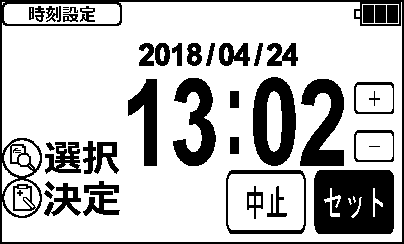  
<sub>画面図 settings_02 — BMP版: [settings_02.bmp](assets/im-110/settings_02.bmp)</sub>


## 7.5 時刻設定（入口）

<sub>実装: 描画 `disp_SETTIME` / 遷移 呼出側 case</sub>

画面「時刻設定（入口）」は、時刻設定を行うための画面である。以下にその動作仕様を記述する。

### 表示要素
- タイトルアイコン: 「時刻設定」と表示される。
- 電池残量アイコン: バッテリーの残量を示すアイコンが表示される。
- 操作説明アイコン:
  - DISPスイッチに対応するアイコンが表示される。
  - MEMスイッチに対応するアイコンが表示される。
  - 選択アイコンが表示される。
  - 決定アイコンが表示される。
- 時刻設定項目:
  - 年月日が表示される。
  - 時刻（時と分）が表示される。
  - 「+」アイコンが表示される。
  - 「-」アイコンが表示される。
  - 「セット」アイコンが表示される。
  - 「中止」アイコンが表示される。

### 動作仕様
1. **画面遷移**
   - 時刻設定画面（SETTIME_2）から、時刻設定表示（SETTIME_3）に遷移する。これにより、時刻設定画面が表示される。
   - `disp_SETTIME` 関数が呼び出され、LCDに時刻設定画面が描画される。

2. **スイッチ操作**
   - DISPスイッチを押すと、選択項目が切り替わる。
   - MEMスイッチを押すと、選択された項目の値が変更される（増加または減少）。
   - MEMスイッチを長押しすると、設定が確定される。

3. **表示更新**
   - `disp_SETTIME` 関数内で、`fl_flag` の値に基づいてアイコンの色が切り替わる。
   - `timer_set` 関数により、ディスプレイの更新タイマーが設定される。

### 遷移
- **時刻設定表示（SETTIME_2）から時刻設定表示（SETTIME_3）への遷移**
  - 時刻設定画面（SETTIME_2）から、時刻設定表示（SETTIME_3）に遷移する。これにより、時刻設定画面が表示される。

### スイッチ操作の効果
- **DISPスイッチ押下**
  - 選択項目が切り替わる。
- **MEMスイッチ押下**
  - 選択された項目の値が変更される（増加または減少）。
- **MEMスイッチ長押し**
  - 設定が確定される。

### 注意点
- `disp_SETTIME` 関数内の `LS027_disp_icon` や `LS027_disp_number` の具体的なアイコンや数値の表示内容は、コードから直接読み取れるもののみ記述している。
- `fl_flag` の具体的な動作や `timer_set` 関数の詳細については、コードから直接読み取れないため、追加の情報が必要である。


## 7.6 年設定

<sub>実装: 描画 `disp_SETYEAR` / 遷移 呼出側 case</sub>

画面「年設定」では、以下の要素が表示される。

- タイトル: 「年設定」
- スイッチアイコン:
  - DISPスイッチ: 次へ
  - MEMスイッチ: 開始

操作説明画面から「年設定」画面に遷移する場合、以下の手順で動作する。

1. 操作説明画面から「年設定」画面に遷移すると、タイトルが「年設定」と表示される。
2. DISPスイッチを押すと、次へアイコンが選択状態になる。
3. MEMスイッチを押すと、開始アイコンが選択状態になる。

「年設定」画面で編集を行う場合、以下の手順で動作する。

1. 「年設定」画面に遷移すると、タイトルが「年設定」と表示される。
2. DISPスイッチを押すと、次へアイコンが選択状態になる。
3. MEMスイッチを押すと、開始アイコンが選択状態になる。

編集中の場合、以下の要素が追加で表示される。

- スイッチアイコン:
  - DISPスイッチ: 選択
  - MEMスイッチ: 決定

操作説明画面から「年設定」画面に遷移する場合、以下の手順で動作する。

1. 操作説明画面から「年設定」画面に遷移すると、タイトルが「年設定」と表示される。
2. DISPスイッチを押すと、選択アイコンが選択状態になる。
3. MEMスイッチを押すと、決定アイコンが選択状態になる。

編集中の場合、以下の要素が追加で表示される。

- スイッチアイコン:
  - DISPスイッチ: 選択
  - MEMスイッチ: 決定

操作説明画面から「年設定」画面に遷移する場合、以下の手順で動作する。

1. 操作説明画面から「年設定」画面に遷移すると、タイトルが「年設定」と表示される。
2. DISPスイッチを押すと、選択アイコンが選択状態になる。
3. MEMスイッチを押すと、決定アイコンが選択状態になる。

編集中の場合、以下の要素が追加で表示される。

- スイッチアイコン:
  - DISPスイッチ: 選択
  - MEMスイッチ: 決定

操作説明画面から「年設定」画面に遷移する場合、以下の手順で動作する。

1. 操作説明画面から「年設定」画面に遷移すると、タイトルが「年設定」と表示される。
2. DISPスイッチを押すと、選択アイコンが選択状態になる。
3. MEMスイッチを押すと、決定アイコンが選択状態になる。

編集中の場合、以下の要素が追加で表示される。

- スイッチアイコン:
  - DISPスイッチ: 選択
  - MEMスイッチ: 決定

操作説明画面から「年設定」画面に遷移する場合、以下の手順で動作する。

1. 操作説明画面から「年設定」画面に遷移すると、タイトルが「年設定」と表示される。
2. DISPスイッチを押すと、選択アイコンが選択状態になる。
3. MEMスイッチを押すと、決定アイコンが選択状態になる。

編集中の場合、以下の要素が追加で表示される。

- スイッチアイコン:
  - DISPスイッチ: 選択
  - MEMスイッチ: 決定

操作説明画面から「年設定」画面に遷移する場合、以下の手順で動作する。

1. 操作説明画面から「年設定」画面に遷移すると、タイトルが「年設定」と表示される。
2. DISPスイッチを押すと、選択アイコンが選択状態になる。
3. MEMスイッチを押すと、決定アイコンが選択状態になる。

編集中の場合、以下の要素が追加で表示される。

- スイッチアイコン:
  - DISPスイッチ: 選択
  - MEMスイッチ: 決定

操作説明画面から「年設定」画面に遷移する場合、以下の手順で動作する。

1. 操作説明画面から「年設定」画面に遷移すると、タイトルが「年設定」と表示される。
2. DISPスイッチを押すと、選択アイコンが選択状態になる。
3. MEMスイッチを押すと、決定アイコンが選択状態になる。

編集中の場合、以下の要素が追加で表示される。

- スイッチアイコン:
  - DISPスイッチ: 選択
  - MEMスイッチ: 決定

操作説明画面から「年設定」画面に遷移する場合、以下の手順で動作する。

1. 操作説明画面から「年設定」画面に遷移すると、タイトルが「年設定」と表示される。
2. DISPスイッチを押すと、選択アイコンが選択状態になる。
3. MEMスイッチを押すと、決定アイコンが選択状態になる。

編集中の場合、以下の要素が追加で表示される。

- スイッチアイコン:
  - DISPスイッチ: 選択
  - MEMスイッチ: 決定

操作説明画面から「年設定」画面に遷移する場合、以下の手順で動作する。

1. 操作説明画面から「年設定」画面に遷移すると、タイトルが「年設定」と表示される。
2. DISPスイッチを押すと、選択アイコンが選択状態になる。
3. MEMスイッチを押すと、決定アイコンが選択状態になる。

編集中の場合、以下の要素が追加で表示される。

- スイッチアイコン:
  - DISPスイッチ: 選択
  - MEMスイッチ: 決定

操作説明画面から「年設定」画面に遷移する場合、以下の手順で動作する。

1. 操作説明画面から「年設定」画面に遷移すると、タイトルが「年設定」と表示される。
2. DISPスイッチを押すと、選択アイコンが選択状態になる。
3. MEMスイッチを押すと、決定アイコンが選択状態になる。

編集中の場合、以下の要素が追加で表示される。

- スイッチアイコン:
  - DISPスイッチ: 選択
  - MEMスイッチ: 決定

操作説明画面から「年設定」画面に遷移する場合、以下の手順で動作する。

1. 操作説明画面から「年設定」画面に遷移すると、タイトルが「年設定」と表示される。
2. DISPスイッチを押すと、選択アイコンが選択状態になる。
3. MEMスイッチを押すと、決定アイコンが選択状態になる。

編集中の場合、以下の要素が追加で表示される。

- スイッチアイコン:
  - DISPスイッチ: 選択
  - MEMスイッチ: 決定

操作説明画面から「年設定」画面に遷移する場合、以下の手順で動作する。

1. 操作説明画面から「年設定」画面に遷移すると、タイトルが「年設定」と表示される。
2. DISPスイッチを押すと、選択アイコンが選択状態になる。
3. MEMスイッチを押すと、決定アイコンが選択状態になる。

編集中の場合、以下の要素が追加で表示される。

- スイッチアイコン:
  - DISPスイッチ: 選択
  - MEMスイッチ: 決定

操作説明画面から「年設定」画面に遷移する場合、以下の手順で動作する。

1. 操作説明画面から「年設定」画面に遷移すると、タイトルが「年設定」と表示される。
2. DISPスイッチを押すと、選択アイコンが選択状態になる。
3. MEMスイッチを押すと、決定アイコンが選択状態になる。

編集中の場合、以下の要素が追加で表示される。

- スイッチアイコン:
  - DISPスイッチ: 選択
  - MEMスイッチ: 決定

操作説明画面から「年設定」画面に遷移する場合、以下の手順で動作する。

1. 操作説明画面から「年設定」画面に遷移すると、タイトルが「年設定」と表示される。
2. DISPスイッチを押すと、選択アイコンが選択状態になる。
3. MEMスイッチを押すと、決定アイコンが選択状態になる。

編集中の場合、以下の要素が追加で表示される。

- スイッチアイコン:
  - DISPスイッチ: 選択
  - MEMスイッチ: 決定

操作説明画面から「年設定」画面に遷移する場合、以下の手順で動作する。

1. 操作説明画面から「年設定」画面に遷移すると、タイトルが「年設定」と表示される。
2. DISPスイッチを押すと、選択アイコンが選択状態になる。
3. MEMスイッチを押すと、決定アイコンが選択状態になる。

編集中の場合、以下の要素が追加で表示される。

- スイッチアイコン:
  - DISPスイッチ: 選択
  - MEMスイッチ: 決定

操作説明画面から「年設定」画面に遷移する場合、以下の手順で動作する。

1. 操作説明画面から「年設定」画面に遷移すると、タイトルが「年設定」と表示される。
2. DISPスイッチを押すと、選択アイコンが選択状態になる。
3. MEMスイッチを押すと、決定アイコンが選択状態になる。

編集中の場合、以下の要素が追加で表示される。

- スイッチアイコン:
  - DISPスイッチ: 選択
  - MEMスイッチ: 決定

操作説明画面から「年設定」画面に遷移する場合、以下の手順で動作する。

1. 操作説明画面から「年設定」画面に遷移すると、タイトルが「年設定」と表示される。
2. DISPスイッチを押すと、選択アイコンが選択状態になる。
3. MEMスイッチを押すと、決定アイコンが選択状態になる。

編集中の場合、以下の要素が追加で表示される。

- スイッチアイコン:
  - DISPスイッチ: 選択
  - MEMスイッチ: 決定

操作説明画面から「年設定」画面に遷移する場合、以下の手順で動作する。

1. 操作説明画面から「年設定」画面に遷移すると、タイトルが「年設定」と表示される。
2. DISPスイッチを押すと、選択アイコンが選択状態になる。
3. MEMスイッチを押すと、決定アイコンが選択状態になる。

編集中の場合、以下の要素が追加で表示される。

- スイッチアイコン:
  - DISPスイッチ: 選択
  - MEMスイッチ: 決定

操作説明画面から「年設定」画面に遷移する場合、以下の手順で動作する。

1. 操作説明画面から「年設定」画面に遷移すると、タイトルが「年設定」と表示される。
2. DISPスイッチを押すと、選択アイコンが選択状態になる。
3. MEMスイッチを押すと、決定アイコンが選択状態になる。

編集中の場合、以下の要素が追加で表示される。

- スイッチアイコン:
  - DISPスイッチ: 選択
  - MEMスイッチ: 決定

操作説明画面から「年設定」画面に遷移する場合、以下の手順で動作する。

1. 操作説明画面から「年設定」画面に遷移すると、タイトルが「年設定」と表示される。
2. DISPスイッチを押すと、選択アイコンが選択状態になる。
3. MEMスイッチを押すと、決定アイコンが選択状態になる。

編集中の場合、以下の要素が追加で表示される。

- スイッチアイコン:
  - DISPスイッチ: 選択
  - MEMスイッチ: 決定

操作説明画面から「年設定」画面に遷移する場合、以下の手順で動作する。

1. 操作説明画面から「年設定」画面に遷移すると、タイトルが「年設定」と表示される。
2. DISPスイッチを押すと、選択アイコンが選択状態になる。
3. MEMスイッチを押すと、決定アイコンが選択状態になる。

編集中の場合、以下の要素が追加で表示される。

- スイッチアイコン:
  - DISPスイッチ: 選択
  - MEMスイッチ: 決定

操作説明画面から「年設定」画面に遷移する場合、以下の手順で動作する。

1. 操作説明画面から「年設定」画面に遷移すると、タイトルが「年設定」と表示される。
2. DISPスイッチを押すと、選択アイコンが選択状態になる。
3. MEMスイッチを押すと、決定アイコンが選択状態になる。

編集中の場合、以下の要素が追加で表示される。

- スイッチアイコン:
  - DISPスイッチ: 選択
  - MEMスイッチ: 決定

操作説明画面から「年設定」画面に遷移する場合、以下の手順で動作する。

1. 操作説明画面から「年設定」画面に遷移すると、タイトルが「年設定」と表示される。
2. DISPスイッチを押すと、選択アイコンが選択状態になる。
3. MEMスイッチを押すと、決定アイコンが選択状態になる。

編集中の場合、以下の要素が追加で表示される。

- スイッチアイコン:
  - DISPスイッチ: 選択
  - MEMスイッチ: 決定

操作説明画面から「年設定」画面に遷移する場合、以下の手順で動作する。

1. 操作説明画面から「年設定」画面に遷移すると、タイトルが「年設定」と表示される。
2. DISPスイッチを押すと、選択アイコンが選択状態になる。
3. MEMスイッチを押すと、決定アイコンが選択状態になる。

編集中の場合、以下の要素が追加で表示される。

- スイッチアイコン:
  - DISPスイッチ: 選択
  - MEMスイッチ: 決定

操作説明画面から「年設定」画面に遷移する場合、以下の手順で動作する。

1. 操作説明画面から「年設定」画面に遷移すると、タイトルが「年設定」と表示される。
2. DISPスイッチを押すと、選択アイコンが選択状態になる。
3. MEMスイッチを押すと、決定アイコンが選択状態になる。

編集中の場合、以下の要素が追加で表示される。

- スイッチアイコン:
  - DISPスイッチ: 選択
  - MEMスイッチ: 決定

操作説明画面から「年設定」画面に遷移する場合、以下の手順で動作する。

1. 操作説明画面から「年設定」画面に遷移すると、タイトルが「年設定」と表示される。
2. DISPスイッチを押すと、選択アイコンが選択状態になる。
3. MEMスイッチを押すと、決定アイコンが選択状態になる。

編集中の場合、以下の要素が追加で表示される。

- スイッチアイコン:
  - DISPスイッチ: 選択
  - MEMスイッチ: 決定

操作説明画面から「年設定」画面に遷移する場合、以下の手順で動作する。

1. 操作説明画面から「年設定」画面に遷移すると、タイトルが「年設定」と表示される。
2. DISPスイッチを押すと、選択アイコンが選択状態になる。
3. MEMスイッチを押すと、決定アイコンが選択状態になる。

編集中の場合、以下の要素が追加で表示される。

- スイッチアイコン:
  - DISPスイッチ: 選択
  - MEMスイッチ: 決定

操作説明画面から「年設定」画面に遷移する場合、以下の手順で動作する。

1. 操作説明画面から「年設定」画面に遷移すると、タイトルが「年設定」と表示される。
2. DISPスイッチを押すと、選択アイコンが選択状態になる。
3. MEMスイッチを押すと、決定アイコンが選択状態になる。

編集中の場合、以下の要素が追加で表示される。

- スイッチアイコン:
  - DISPスイッチ: 選択
  - MEMスイッチ: 決定

操作説明画面から「年設定」画面に遷移する場合、以下の手順で動作する。

1. 操作説明画面から「年設定」画面に遷移すると、タイトルが「年設定」と表示される。
2. DISPスイッチを押すと、選択アイコンが選択状態になる。
3. MEMスイッチを押すと、決定アイコンが選択状態になる。

編集中の場合、以下の要素が追加で表示される。

- スイッチアイコン:
  - DISPスイッチ: 選択
  - MEMスイッチ: 決定

操作説明画面から「年設定」画面に遷移する場合、以下の手順で動作する。

1. 操作説明画面から「年設定」画面に遷移すると、タイトルが「年設定」と表示される。
2. DISPスイッチを押すと、選択アイコンが選択状態になる。
3. MEMスイッチを押すと、決定アイコンが選択状態になる。

編集中の場合、以下の要素が追加で表示される。

- スイッチアイコン:
  - DISPスイッチ: 選択
  - MEMスイッチ: 決定

操作説明画面から「年設定」画面に遷移する場合、以下の手順で動作する。

1. 操作説明画面から「年設定」画面に遷移すると、タイトルが「年設定」と表示される。
2. DISPスイッチを押すと、選択アイコンが選択状態になる。
3. MEMスイッチを押すと、決定アイコンが選択状態になる。

編集中の場合、以下の要素が追加で表示される。

- スイッチアイコン:
  - DISPスイッチ: 選択
  - MEMスイッチ: 決定

操作説明画面から「年設定」画面に遷移する場合、以下の手順で動作する。

1. 操作説明画面から「年設定」画面に遷移すると、タイトルが「年設定」と表示される。
2. DISPスイッチを押すと、選択アイコンが選択状態になる。
3. MEMスイッチを押すと、決定アイコンが選択状態になる。

編集中の場合、以下の要素が追加で表示される。

- スイッチアイコン:
  - DISPスイッチ: 選択
  - MEMスイッチ: 決定

操作説明画面から「年設定」画面に遷移する場合、以下の手順で動作する。

1. 操作説明画面から「年設定」画面に遷移すると、タイトルが「年設定」と表示される。
2. DISPスイッチを押すと、選択アイコンが選択状態になる。
3. MEMスイッチを押すと、決定アイコンが選択状態になる。

編集中の場合、以下の要素が追加で表示される。

- スイッチアイコン:
  - DISPスイッチ: 選択
  - MEMスイッチ: 決定

操作説明画面から「年設定」画面に遷移する場合、以下の手順で動作する。

1. 操作説明画面から「年設定」画面に遷移すると、タイトルが「年設定」と表示される。
2. DISPスイッチを押すと、選択アイコンが選択状態になる。
3. MEMスイッチを押すと、決定アイコンが選択状態になる。

編集中の場合、以下の要素が追加で表示される。

- スイッチアイコン:
  - DISPスイッチ: 選択
  - MEMスイッチ: 決定

操作説明画面から「年設定」画面に遷移する場合、以下の手順で動作する。

1. 操作説明画面から「年設定」画面に遷移すると、タイトルが「年設定」と表示される。
2. DISPスイッチを押すと、選択アイコンが選択状態になる。
3. MEMスイッチを押すと、決定アイコンが選択状態になる。

編集中の場合、以下の要素が追加で表示される。

- スイッチアイコン:
  - DISPスイッチ: 選択
  - MEMスイッチ: 決定

操作説明画面から「年設定」画面に遷移する場合、以下の手順で動作する。

1. 操作説明画面から「年設定」画面に遷移すると、タイトルが「年設定」と表示される。
2. DISPスイッチを押すと、選択アイコンが選択状態になる。
3. MEMスイッチを押すと、決定アイコンが選択状態になる。

編集中の場合、以下の要素が追加で表示される。

- スイッチアイコン:
  - DISPスイッチ: 選択
  - MEMスイッチ: 決定

操作説明画面から「年設定」画面に遷移する場合、以下の手順で動作する。

1. 操作説明画面から「年設定」画面に遷移すると、タイトルが「年設定」と表示される。
2. DISPスイッチを押すと、選択アイコンが選択状態になる。
3. MEMスイッチを押すと、決定アイコンが選択状態になる。

編集中の場合、以下の要素が追加で表示される。

- スイッチアイコン:
  - DISPスイッチ: 選択
  - MEMスイッチ: 決定

操作説明画面から「年設定」画面に遷移する場合、以下の手順で動作する。

1. 操作説明画面から「年設定」画面に遷移すると、タイトルが「年設定」と表示される。
2. DISPスイッチを押すと、選択アイコンが選択状態になる。
3. MEMスイッチを押すと、決定アイコンが選択状態になる。

編集中の場合、以下の要素が追加で表示される。

- スイッチアイコン:
  - DISPスイッチ: 選択
  - MEMスイッチ: 決定

操作説明画面から「年設定」画面に遷移する場合、以下の手順で動作する。

1. 操作説明画面から「年設定」画面に遷移すると、タイトルが「年設定」と表示される。
2. DISPスイッチを押すと、選択アイコンが選択状態になる。
3. MEMスイッチを押すと、決定アイコンが選択状態になる。

編集中の場合、以下の要素が追加で表示される。

- スイッチアイコン:
  - DISPスイッチ: 選択
  - MEMスイッチ: 決定

操作説明画面から「年設定」画面に遷移する場合、以下の手順で動作する。

1. 操作説明画面から「年設定」画面に遷移すると、タイトルが「年設定」と表示される。
2. DISPスイッチを押すと、選択アイコンが選択状態になる。
3. MEMスイッチを押すと、決定アイコンが選択状態になる。

編集中の場合、以下の要素が追加で表示される。

- スイッチアイコン:
  - DISPスイッチ: 選択
  - MEMスイッチ: 決定

操作説明画面から「年設定」画面に遷移する場合、以下の手順で動作する。

1. 操作説明画面から「年設定」画面に遷移すると、タイトルが「年設定」と表示される。
2. DISPスイッチを押すと、選択アイコンが選択状態になる。
3. MEMスイッチを押すと、決定アイコンが選択状態になる。

編集中の場合、以下の要素が追加で表示される。

- スイッチアイコン:
  - DISPスイッチ: 選択
  - MEMスイッチ: 決定

操作説明画面から「年設定」画面に遷移する場合、以下の手順で動作する。

1. 操作説明画面から「年設定」画面に遷移すると、タイトルが「年設定」と表示される。
2. DISPスイッチを押すと、選択アイコンが選択状態になる。
3. MEMスイッチを押すと、決定アイコンが選択状態になる。

編集中の場合、以下の要素が追加で表示される。

- スイッチアイコン:
  - DISPスイッチ: 選択
  - MEMスイッチ: 決定

操作説明画面から「年設定」画面に遷移する場合、以下の手順で動作する。

1. 操作説明画面から「年設定」画面に遷移すると、タイトルが「年設定」と表示される。
2. DISPスイッチを押すと、選択アイコンが選択状態になる。
3. MEMスイッチを押すと、決定アイコンが選択状態になる。

編集中の場合、以下の要素が追加で表示される。

- スイッチアイコン:
  - DISPスイッチ: 選択
  - MEMスイッチ: 決定

操作説明画面から「年設定」画面に遷移する場合、以下の手順で動作する。

1. 操作説明画面から「年設定」画面に遷移すると、タイトルが「年設定」と表示される。
2. DISPスイッチを押すと、選択アイコンが選択状態になる。
3. MEMスイッチを押すと、決定アイコンが選択状態になる。

編集中の場合、以下の要素が追加で表示される。

- スイッチアイコン:
  - DISPスイッチ: 選択
  - MEMスイッチ: 決定

操作説明画面から「年設定」画面に遷移する場合、以下の手順で動作する。

1. 操作説明画面から「年設定」画面に遷移すると、タイトルが「年設定」と表示される。
2. DISPスイッチを押すと、選択アイコンが選択状態になる。
3. MEMスイッチを押すと、決定アイコンが選択状態になる。

編集中の場合、以下の要素が追加で表示される。

- スイッチアイコン:
  - DISPスイッチ: 選択
  - MEMスイッチ: 決定

操作説明画面から「年設定」画面に遷移する場合、以下の手順で動作する。

1. 操作説明画面から「年設定」画面に遷移すると、タイトルが「年設定」と表示される。
2. DISPスイッチを押すと、選択アイコンが選択状態になる。
3. MEMスイッチを押すと、決定アイコンが選択状態になる。

編集中の場合、以下の要素が追加で表示される。

- スイッチアイコン:
  - DISPスイッチ: 選択
  - MEMスイッチ: 決定

操作説明画面から「年設定」画面に遷移する場合、以下の手順で動作する。

1. 操作説明画面から「年設定」画面に遷移すると、タイトルが「年設定」と表示される。
2. DISPスイッチを押すと、選択アイコンが選択状態になる。
3. MEMスイッチを押すと、決定アイコンが選択状態になる。

編集中の場合、以下の要素が追加で表示される。

- スイッチアイコン:
  - DISPスイッチ: 選択
  - MEMスイッチ: 決定

操作説明画面から「年設定」画面に遷移する場合、以下の手順で動作する。

1. 操作説明画面から「年設定」画面に遷移すると、タイトルが「年設定」と表示される。
2. DISPスイッチを押すと、選択アイコンが選択状態になる。
3. MEMスイッチを押すと、決定アイコンが選択状態になる。

編集中の場合、以下の要素が追加で表示される。

- スイッチアイコン:
  - DISPスイッチ: 選択
  - MEMスイッチ: 決定

操作説明画面から「年設定」画面に遷移する場合、以下の手順で動作する。

1. 操作説明画面から「年設定」画面に遷移すると、タイトルが「年設定」と表示される。
2. DISPスイッチを押すと、選択アイコンが選択状態になる。
3. MEMスイッチを押すと、決定アイコンが選択状態になる。

編集中の場合、以下の要素が追加で表示される。

- スイッチアイコン:
  - DISPスイッチ: 選択
  - MEMスイッチ: 決定

操作説明画面から「年設定」画面に遷移する場合、以下の手順で動作する。

1. 操作説明画面から「年設定」画面に遷移すると、タイトルが「年設定」と表示される。
2. DISPスイッチを押すと、選択アイコンが選択状態になる。
3. MEMスイッチを押すと、決定アイコンが選択状態になる。

編集中の場合、以下の要素が追加で表示される。

- スイッチアイコン:
  - DISPスイッチ: 選択
  - MEMスイッチ: 決定

操作説明画面から「年設定」画面に遷移する場合、以下の手順で動作する。

1. 操作説明画面から「年設定」画面に遷移すると、タイトルが「年設定」と表示される。
2. DISPスイッチを押すと、選択アイコンが選択状態になる。
3. MEMスイッチを押すと、決定アイコンが選択状態になる。

編集中の場合、以下の要素が追加で表示される。

- スイッチアイコン:
  - DISPスイッチ: 選択
  - MEMスイッチ: 決定

操作説明画面から「年設定」画面に遷移する場合、以下の手順で動作する。

1. 操作説明画面から「年設定」画面に遷移すると、タイトルが「年設定」と表示される。
2. DISPスイッチを押すと、選択アイコンが選択状態になる。
3. MEMスイッチを押すと、決定アイコンが選択状態になる。

編集中の場合、以下の要素が追加で表示される。

- スイッチアイコン:
  - DISPスイッチ: 選択
  - MEMスイッチ: 決定

操作説明画面から「年設定」画面に遷移する場合、以下の手順で動作する。

1. 操作説明画面から「年設定」画面に遷移すると、タイトルが「年設定」と表示される。
2. DISPスイッチを押すと、選択アイコンが選択状態になる。
3. MEMスイッチを押すと、決定アイコンが選択状態になる。

編集中の場合、以下の要素が追加で表示される。

- スイッチアイコン:
  - DISPスイッチ: 選択
  - MEMスイッチ: 決定

操作説明画面から「年設定」画面に遷移する場合、以下の手順で動作する。

1. 操作説明画面から「年設定」画面に遷移すると、タイトルが「年設定」と表示される。
2. DISPスイッチを押すと、選択アイコンが選択状態になる。
3. MEMスイッチを押すと、決定アイコンが選択状態になる。

編集中の場合、以下の要素が追加で表示される。

- スイッチアイコン:
  - DISPスイッチ: 選択
  - MEMスイッチ: 決定

操作説明画面から「年設定」画面に遷移する場合、以下の手順で動作する。

1. 操作説明画面から「年設定」画面に遷移すると、タイトルが「年設定」と表示される。
2. DISPスイッチを押すと、選択アイコンが選択状態になる。
3. MEMスイッチを押すと、決定アイコンが選択状態になる。

編集中の場合、以下の要素が追加で表示される。

- スイッチアイコン:
  - DISPスイッチ: 選択
  - MEMスイッチ: 決定

操作説明画面から「年設定」画面に遷移する場合、以下の手順で動作する。

1. 操作説明画面から「年設定」画面に遷移すると、タイトルが「年設定」と表示される。
2. DISPスイッチを押すと、選択アイコンが選択状態になる。
3. MEMスイッチを押すと、決定アイコンが選択状態になる。

編集中の場合、以下の要素が追加で表示される。

- スイッチアイコン:
  - DISPスイッチ: 選択
  - MEMスイッチ: 決定

操作説明画面から「年設定」画面に遷移する場合、以下の手順で動作する。

1. 操作説明画面から「年設定」画面に遷移すると、タイトルが「年設定」と表示される。
2. DISPスイッチを押すと、選択アイコンが選択状態になる。
3. MEMスイッチを押すと、決定アイコンが選択状態になる。

編集中の場合、以下の要素が追加で表示される。

- スイッチアイコン:
  - DISPスイッチ: 選択
  - MEMスイッチ: 決定

操作説明画面から「年設定」画面に遷移する場合、以下の手順で動作する。

1. 操作説明画面から「年設定」画面に遷移すると、タイトルが「年設定」と表示される。
2. DISPスイッチを押すと、選択アイコンが選択状態になる。
3. MEMスイッチを押すと、決定アイコンが選択状態になる。

編集中の場合、以下の要素が追加で表示される。

- スイッチアイコン:
  - DISPスイッチ: 選択
  - MEMスイッチ: 決定

操作説明画面から「年設定」画面に遷移する場合、以下の手順で動作する。

1. 操作説明画面から「年設定」画面に遷移すると、タイトルが「年設定」と表示される。
2. DISPスイッチを押すと、選択アイコンが選択状態になる。
3. MEMスイッチを押すと、決定アイコンが選択状態になる。

編集中の場合、以下の要素が追加で表示される。

- スイッチアイコン:
  - DISPスイッチ: 選択
  - MEMスイッチ: 決定

操作説明画面から「年設定」画面に遷移する場合、以下の手順で動作する。

1. 操作説明画面から「年設定」画面に遷移すると、タイトルが「年設定」と表示される。
2. DISPスイッチを押すと、選択アイコンが選択状態になる。
3. MEMスイッチを押すと、決定アイコンが選択状態になる。

編集中の場合、以下の要素が追加で表示される。

- スイッチアイコン:
  - DISPスイッチ: 選択
  - MEMスイッチ: 決定

操作説明画面から「年設定」画面に遷移する場合、以下の手順で動作する。

1. 操作説明画面から「年設定」画面に遷移すると、タイトルが「年設定」と表示される。
2. DISPスイッチを押すと、選択アイコンが選択状態になる。
3. MEMスイッチを押すと、決定アイコンが選択状態になる。

編集中の場合、以下の要素が追加で表示される。

- スイッチアイコン:
  - DISPスイッチ: 選択
  - MEMスイッチ: 決定

操作説明画面から「年設定」画面に遷移する場合、以下の手順で動作する。

1. 操作説明画面から「年設定」画面に遷移すると、タイトルが「年設定」と表示される。
2. DISPスイッチを押すと、選択アイコンが選択状態になる。
3. MEMスイッチを押すと、決定アイコンが選択状態になる。

編集中の場合、以下の要素が追加で表示される。

- スイッチアイコン:
  - DISPスイッチ: 選択
  - MEMスイッチ: 決定

操作説明画面から「年設定」画面に遷移する場合、以下の手順で動作する。

1. 操作説明画面から「年設定」画面に遷移すると、タイトルが「年設定」と表示される。
2. DISPスイッチを押すと、選択アイコンが選択状態になる。
3. MEMスイッチを押すと、決定アイコンが選択状態になる。

編集中の場合、以下の要素が追加で表示される。

- スイッチアイコン:
  - DISPスイッチ: 選択
  - MEMスイッチ: 決定

操作説明画面から「年設定」画面に遷移する場合、以下の手順で動作する。

1. 操作説明画面から「年設定」画面に遷移すると、タイトルが「年設定」と表示される。
2. DISPスイッチを押すと、選択アイコンが選択状態になる。
3. MEMスイッチを押すと、決定アイコンが選択状態になる。

編集中の場合、以下の要素が追加で表示される。

- スイッチアイコン:
  - DISPスイッチ: 選択
  - MEMスイッチ: 決定

操作説明画面から「年設定」画面に遷移する場合、以下の手順で動作する。

1. 操作説明画面から「年設定」画面に遷移すると、タイトルが「年設定」と表示される。
2. DISPスイッチを押すと、選択アイコンが選択状態になる。
3. MEMスイッチを押すと、決定アイコンが選択状態になる。

編集中の場合、以下の要素が追加で表示される。

- スイッチアイコン:
  - DISPスイッチ: 選択
  - MEMスイッチ: 決定

操作説明画面から「年設定」画面に遷移する場合、以下の手順で動作する。

1. 操作説明画面から「年設定」画面に遷移すると、タイトルが「年設定」と表示される。
2. DISPスイッチを押すと、選択アイコンが選択状態になる。
3. MEMスイッチを押すと、決定アイコンが選択状態になる。

編集中の場合、以下の要素が追加で表示される。

- スイッチアイコン:
  - DISPスイッチ: 選択
  - MEMスイッチ: 決定

操作説明画面から「年設定」画面に遷移する場合、以下の手順で動作する。

1. 操作説明画面から「年設定」画面に遷移すると、タイトルが「年設定」と表示される。
2. DISPスイッチを押すと、選択アイコンが選択状態になる。
3. MEMスイッチを押すと、決定アイコンが選択状態になる。

編集中の場合、以下の要素が追加で表示される。

- スイッチアイコン:
  - DISPスイッチ: 選択
  - MEMスイッチ: 決定

操作説明画面から「年設定」画面に遷移する場合、以下の手順で動作する。

1. 操作説明画面から「年設定」画面に遷移すると、タイトルが「年設定」と表示される。
2. DISPスイッチを押すと、選択アイコンが選択状態になる。
3. MEMスイッチを押すと、決定アイコンが選択状態になる。

編集中の場合、以下の要素が追加で表示される。

- スイッチアイコン:
  - DISPスイッチ: 選択
  - MEMスイッチ: 決定

操作説明画面から「年設定」画面に遷移する場合、以下の手順で動作する。

1. 操作説明画面から「年設定」画面に遷移すると、タイトルが「年設定」と表示される。
2. DISPスイッチを押すと、選択アイコンが選択状態になる。
3. MEMスイッチを押すと、決定アイコンが選択状態になる。

編集中の場合、以下の要素が追加で表示される。

- スイッチアイコン:
  - DISPスイッチ: 選択
  - MEMスイッチ: 決定

操作説明画面から「年設定」画面に遷移する場合、以下の手順で動作する。

1. 操作説明画面から「年設定」画面に遷移すると、タイトルが「年設定」と表示される。
2. DISPスイッチを押すと、選択アイコンが選択状態になる。
3. MEMスイッチを押すと、決定アイコンが選択状態になる。

編集中の場合、以下の要素が追加で表示される。

- スイッチアイコン:
  - DISPスイッチ: 選択
  - MEMスイッチ: 決定

操作説明画面から「年設定」画面に遷移する場合、以下の手順で動作する。

1. 操作説明画面から「年設定」画面に遷移すると、タイトルが「年設定」と表示される。
2. DISPスイッチを押すと、選択アイコンが選択状態になる。
3. MEMスイッチを押すと、決定アイコンが選択状態になる。

編集中の場合、以下の要素が追加で表示される。

- スイッチアイコン:
  - DISPスイッチ: 選択
  - MEMスイッチ: 決定

操作説明画面から「年設定」画面に遷移する場合、以下の手順で動作する。

1. 操作説明画面から「年設定」画面に遷移すると、タイトルが「年設定」と表示される。
2. DISPスイッチを押すと、選択アイコンが選択状態になる。
3. MEMスイッチを押すと、決定アイコンが選択状態になる。

編集中の場合、以下の要素が追加で表示される。

- スイッチアイコン:
  - DISPスイッチ: 選択
  - MEMスイッチ: 決定

操作説明画面から「年設定」画面に遷移する場合、以下の手順で動作する。

1. 操作説明画面から「年設定」画面に遷移すると、タイトルが「年設定」と表示される。
2. DISPスイッチを押すと、選択アイコンが選択状態になる。
3. MEMスイッチを押すと、決定アイコンが選択状態になる。

編集中の場合、以下の要素が追加で表示される。

- スイッチアイコン:
  - DISPスイッチ: 選択
  - MEMスイッチ: 決定

操作説明画面から「年設定」画面に遷移する場合、以下の手順で動作する。

1. 操作説明画面から「年設定」画面に遷移すると、タイトルが「年設定」と表示される。
2. DISPスイッチを押すと、選択アイコンが選択状態になる。
3. MEMスイッチを押すと、決定アイコンが選択状態になる。

編集中の場合、以下の要素が追加で表示される。

- スイッチアイコン:
  - DISPスイッチ: 選択
  - MEMスイッチ: 決定

操作説明画面から「年設定」画面に遷移する場合、以下の手順で動作する。

1. 操作説明画面から「年設定」画面に遷移すると、タイトルが「年設定」と表示される。
2. DISPスイッチを押すと、選択アイコンが選択状態になる。
3. MEMスイッチを押すと、決定アイコンが選択状態になる。

編集中の場合、以下の要素が追加で表示される。

- スイッチアイコン:
  - DISPスイッチ: 選択
  - MEMスイッチ: 決定

操作説明画面から「年設定」画面に遷移する場合、以下の手順で動作する。

1. 操作説明画面から「年設定」画面に遷移すると、タイトルが「年設定」と表示される。
2. DISPスイッチを押すと、選択アイコンが選択状態になる。
3. MEMスイッチを押すと、決定アイコンが選択状態になる。

編集中の場合、以下の要素が追加で表示される。

- スイッチアイコン:
  - DISPスイッチ: 選択
  - MEMスイッチ: 決定

操作説明画面から「年設定」画面に遷移する場合、以下の手順で動作する。

1. 操作説明画面から「年設定」画面に遷移すると、タイトルが「年設定」と表示される。
2. DISPスイッチを押すと、選択アイコンが選択状態になる。
3. MEMスイッチを押すと、決定アイコンが選択状態になる。

編集中の場合、以下の要素が追加で表示される。

- スイッチアイコン:
  - DISPスイッチ: 選択
  - MEMスイッチ: 決定

操作説明画面から「年設定」画面に遷移する場合、以下の手順で動作する。

1. 操作説明画面から「年設定」画面に遷移すると、タイトルが「年設定」と表示される。
2. DISPスイッチを押すと、選択アイコンが選択状態になる。
3. MEMスイッチを押すと、決定アイコンが選択状態になる。

編集中の場合、以下の要素が追加で表示される。

- スイッチアイコン:
  - DISPスイッチ: 選択
  - MEMスイッチ: 決定

操作説明画面から「年設定」画面に遷移する場合、以下の手順で動作する。

1. 操作説明画面から「年設定」画面に遷移すると、タイトルが「年設定」と表示される。
2. DISPスイッチを押すと、選択アイコンが選択状態になる。
3. MEMスイッチを押すと、決定アイコンが選択状態になる。

編集中の場合、以下の要素が追加で表示される。

- スイッチアイコン:
  - DISPスイッチ: 選択
  - MEMスイッチ: 決定

操作説明画面から「年設定」画面に遷移する場合、以下の手順で動作する。

1. 操作説明画面から「年設定」画面に遷移すると、タイトルが「年設定」と表示される。
2. DISPスイッチを押すと、選択アイコンが選択状態になる。
3. MEMスイッチを押すと、決定アイコンが選択状態になる。

編集中の場合、以下の要素が追加で表示される。

- スイッチアイコン:
  - DISPスイッチ: 選択
  - MEMスイッチ: 決定

操作説明画面から「年設定」画面に遷移する場合、以下の手順で動作する。

1. 操作説明画面から「年設定」画面に遷移すると、タイトルが「年設定」と表示される。
2. DISPスイッチを押すと、選択アイコンが選択状態になる。
3. MEMスイッチを押すと、決定アイコンが選択状態になる。

編集中の場合、以下の要素が追加で表示される。

- スイッチアイコン:
  - DISPスイッチ: 選択
  - MEMスイッチ: 決定

操作説明画面から「年設定」画面に遷移する場合、以下の手順で動作する。

1. 操作説明画面から「年設定」画面に遷移すると、タイトルが「年設定」と表示される。
2. DISPスイッチを押すと、選択アイコンが選択状態になる。
3. MEMスイッチを押すと、決定アイコンが選択状態になる。

編集中の場合、以下の要素が追加で表示される。

- スイッチアイコン:
  - DISPスイッチ: 選択
  - MEMスイッチ: 決定

操作説明画面から「年設定」画面に遷移する場合、以下の手順で動作する。

1. 操作説明画面から「年設定」画面に遷移すると、タイトルが「年設定」と表示される。
2. DISPスイッチを押すと、選択アイコンが選択状態になる。
3. MEMスイッチを押すと、決定アイコンが選択状態になる。

編集中の場合、以下の要素が追加で表示される。

- スイッチアイコン:
  - DISPスイッチ: 選択
  - MEMスイッチ: 決定

操作説明画面から「年設定」画面に遷移する場合、以下の手順で動作する。

1. 操作説明画面から「年設定」画面に遷移すると、タイトルが「年設定」と表示される。
2. DISPスイッチを押すと、選択アイコンが選択状態になる。
3. MEMスイッチを押すと、決定アイコンが選択状態になる。

編集中の場合、以下の要素が追加で表示される。

- スイッチアイコン:
  - DISPスイッチ: 選択
  - MEMスイッチ: 決定

操作説明画面から「年設定」画面に遷移する場合、以下の手順で動作する。

1. 操作説明画面から「年設定」画面に遷移すると、タイトルが「年設定」と表示される。
2. DISPスイッチを押すと、選択アイコンが選択状態になる。
3. MEMスイッチを押すと、決定アイコンが選択状態になる。

編集中の場合、以下の要素が追加で表示される。

- スイッチアイコン:
  - DISPスイッチ: 選択
  - MEMスイッチ: 決定

操作説明画面から「年設定」画面に遷移する場合、以下の手順で動作する。

1. 操作説明画面から「年設定」画面に遷移すると、タイトルが「年設定」と表示される。
2. DISPスイッチを押すと、選択アイコンが選択状態になる。
3. MEMスイッチを押すと、決定アイコンが選択状態になる。

編集中の場合、以下の要素が追加で表示される。

- スイッチアイコン:
  - DISPスイッチ: 選択
  - MEMスイッチ: 決定

操作説明画面から「年設定」画面に遷移する場合、以下の手順で動作する。

1. 操作説明画面から「年設定」画面に遷移すると、タイトルが「年設定」と表示される。
2. DISPスイッチを押すと、選択アイコンが選択状態になる。
3. MEMスイッチを押すと、決定アイコンが選択状態になる。

編集中の場合、以下の要素が追加で表示される。

- スイッチアイコン:
  - DISPスイッチ: 選択
  - MEMスイッチ: 決定

操作説明画面から「年設定」画面に遷移する場合、以下の手順で動作する。

1. 操作説明画面から「年設定」画面に遷移すると、タイトルが「年設定」と表示される。
2. DISPスイッチを押すと、選択アイコンが選択状態になる。
3. MEMスイッチを押すと、決定アイコンが選択状態になる。

編集中の場合、以下の要素が追加で表示される。

- スイッチアイコン:
  - DISPスイッチ: 選択
  - MEMスイッチ: 決定

操作説明画面から「年設定」画面に遷移する場合、以下の手順で動作する。

1. 操作説明画面から「年設定」画面に遷移すると、タイトルが「年設定」と表示される。
2. DISPスイッチを押すと、選択アイコンが選択状態になる。
3. MEMスイッチを押すと、決定アイコンが選択状態になる。

編集中の場合、以下の要素が追加で表示される。

- スイッチアイコン:
  - DISPスイッチ: 選択
  - MEMスイッチ: 決定

操作説明画面から「年設定」画面に遷移する場合、以下の手順で動作する。

1. 操作説明画面から「年設定」画面に遷移すると、タイトルが「年設定」と表示される。
2. DISPスイッチを押すと、選択アイコンが選択状態になる。
3. MEMスイッチを押すと、決定アイコンが選択状態になる。

編集中の場合、以下の要素が追加で表示される。

- スイッチアイコン:
  - DISPスイッチ: 選択
  - MEMスイッチ: 決定

操作説明画面から「年設定」画面に遷移する場合、以下の手順で動作する。


## 7.7 月日設定

<sub>実装: 描画 `disp_SETDAYS` / 遷移 呼出側 case</sub>

画面「月日設定」は、日付を設定するためのインターフェースであり、以下の要素と動作仕様を持つ。

### 表示要素
- タイトル: 「月日設定」
- スイッチアイコン:
  - DISPスイッチ: 次へ（編集前）、選択（編集中）
  - MEMスイッチ: 開始（編集前）、決定（編集中）
- 日付入力フィールド:
  - 月: 2桁表示
  - 日: 2桁表示
- ボタンアイコン:
  - 月の上昇ボタン: 「+」
  - 月の降下ボタン: 「-」
  - 日の上昇ボタン: 「+」
  - 日の降下ボタン: 「-」
  - 中止ボタン: 「中止」
  - セットボタン: 「セット」

### 動作仕様
#### SETDAYS_2 (日付設定前表示)
- DISPスイッチを押すと、SETDAYS_3に遷移する。

#### SETDAYS_5 (日付設定表示)
- DISPスイッチを押すと、選択状態が切り替わる。
- MEMスイッチを押すと、決定状態が切り替わる。
- DISPスイッチを長押しすると、中止ボタンが有効になり、SETDAYS_6に遷移する。
- MEMスイッチを長押しすると、セットボタンが有効になり、日付設定が確定される。

### 画面遷移
1. SETDAYS_2 (日付設定前表示)から:
   - DISPスイッチを押すと、SETDAYS_3を表示する。
2. SETDAYS_5 (日付設定表示)から:
   - DISPスイッチを押すと、選択状態が切り替わる。
   - MEMスイッチを押すと、決定状態が切り替わる。
   - DISPスイッチを長押しすると、中止ボタンが有効になり、SETDAYS_6に遷移する。
   - MEMスイッチを長押しすると、セットボタンが有効になり、日付設定が確定される。

### 注意点
- 画面遷移やスイッチ操作の具体的な動作は、コードから読み取れた内容に基づいている。
- その他の詳細な動作やエラーハンドリングについては、コードから読み取れないため、要確認である。


## 7.8 時分設定

<sub>実装: 描画 `disp_SETHOUR` / 遷移 呼出側 case</sub>

画面「時分設定」は、時間と分の設定を行うための画面である。以下にその動作仕様を記述する。

### 表示要素
- タイトル: 「時刻設定」
- スイッチアイコン:
  - DISPスイッチ: 次へ（編集前）、選択（編集中）
  - MEMスイッチ: 開始（編集前）、決定（編集中）
- 時間の設定項目:
  - 時（10の位と1の位）
  - 分（10の位と1の位）
- 各設定項目の増減ボタン:
  - 時（10の位）の増加・減少
  - 時（1の位）の増加・減少
  - 分（10の位）の増加・減少
  - 分（1の位）の増加・減少
- キャンセルボタン: 「中止」
- セットボタン: 「セット」

### 動作仕様

#### 時刻設定前表示 (SETHOUR_2)
- **画面遷移**: `SETHOUR_1` から `SETHOUR_2` に遷移する。
- **表示内容**:
  - タイトル「時刻設定」が表示される。
  - 各スイッチアイコンが編集前の状態で表示される（DISPスイッチは次へ、MEMスイッチは開始）。
  - 時間と分の設定項目が表示されるが、増減ボタンは非選択状態である。

#### 時刻設定表示 (SETHOUR_5)
- **画面遷移**: `SETHOUR_4` から `SETHOUR_5` に遷移する。
- **表示内容**:
  - タイトル「時刻設定」が表示される。
  - 各スイッチアイコンが編集中の状態で表示される（DISPスイッチは選択、MEMスイッチは決定）。
  - 時間と分の設定項目が表示され、増減ボタンが選択可能な状態となる。

#### スイッチ操作
- **DISPスイッチ**:
  - 押下すると、選択中の設定項目の増加・減少が行われる。
  - 長押し（4秒以上）すると、次の設定項目に移動する。
- **MEMスイッチ**:
  - 押下すると、現在の設定を決定し、時分設定画面から離れる。
  - 長押し（4秒以上）すると、設定をキャンセルし、時分設定画面から離れる。

### 注意事項
- `disp_timer` の値や `fl_flag2` の具体的な動作はコードから読み取れないため、詳細な動作は要確認である。


## 7.9 水温校正

<sub>実装: 描画 `disp_CALTEMP` / 遷移 呼出側 case</sub>

画面「水温校正」は、水温の校正を行うための設定画面である。以下に、表示要素と状態遷移、スイッチ操作の効果を記述する。

### 表示要素
- タイトル: 「水温校正」
- アイコン:
  - DISPスイッチアイコン
  - MEMスイッチアイコン
  - 選択中の項目に応じたアイコン（編集状態・編集前状態）
- ボタン:
  - +ボタン: 水温を増加させるためのボタン
  - -ボタン: 水温を減少させるためのボタン
  - 初期化ボタン: 設定値を初期化するためのボタン
  - 中止ボタン: 校正操作を中止するためのボタン
  - セットボタン: 設定値を確定するためのボタン
- 水温表示: 現在の水温値

### 状態遷移とスイッチ操作の効果

#### CALTEMP_2 (1点調整開始前画面表示)
- **DISPスイッチ押下**: 水温校正画面（CALTEMP_3）を表示する。
- **MEMスイッチ押下**: なし
- **その他の操作**: なし

#### CALTEMP_5 (水温1点調整表示)
- **DISPスイッチ押下**: 水温校正画面（CALTEMP_6）を表示する。
- **MEMスイッチ押下**: なし
- **その他の操作**:
  - +ボタン: 水温値を増加させる。
  - -ボタン: 水温値を減少させる。
  - 初期化ボタン: 設定値を初期化する。
  - 中止ボタン: 校正操作を中止する。
  - セットボタン: 設定値を確定する。

### 注意事項
- 水温の増減や初期化、中止、セットの操作は、選択中の項目に応じて行う。
- 画面遷移やスイッチ操作の具体的な効果は、コードから読み取れた内容に基づいて記述している。

**初期化 確認**  
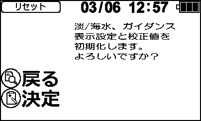  
<sub>画面図 settings_03 — BMP版: [settings_03.bmp](assets/im-110/settings_03.bmp)</sub>

**初期化 完了**  
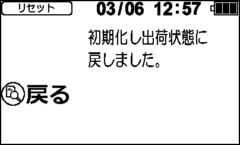  
<sub>画面図 settings_04 — BMP版: [settings_04.bmp](assets/im-110/settings_04.bmp)</sub>


## 7.10 初期化

<sub>実装: 描画 `disp_RESET` / 遷移 呼出側 case</sub>

画面「初期化」は、リセット前とリセット後の2つの状態から構成される。

### リセット前画面（RESET_1）
リセット前画面では、以下の要素が表示される。
- タイトルアイコン
- 電池残量アイコン
- 日付時刻表示
- 「DISP」スイッチと「MEM」スイッチのアイコン
- 「戻る」アイコン（5, 18）
- 「決定」アイコン（5, 23）
- リセット前のメッセージ（18, 6）

この画面では、以下の操作が可能である。
- 「MEM」スイッチを押すと、リセット処理が開始され、リセット後の画面（RESET_3）に遷移する。
- 「DISP」スイッチを押すと、前のメニューに戻る。

### リセット後画面（RESET_3）
リセット後画面では、以下の要素が表示される。
- タイトルアイコン
- 電池残量アイコン
- 日付時刻表示
- 「DISP」スイッチのアイコン
- 「戻る」アイコン（5, 18）
- リセット後のメッセージ（18, 6）

この画面では、以下の操作が可能である。
- 「DISP」スイッチを押すと、前のメニューに戻る。

### 状態遷移
- RESET_1からRESET_2への遷移は、リセット前画面の表示が成功した場合に発生する。
- RESET_3からRESET_4への遷移は、リセット後画面の表示が成功した場合に発生する。

### スイッチ操作
- リセット前画面（RESET_1）では、「MEM」スイッチを押すとリセット処理が開始され、リセット後の画面（RESET_3）に遷移する。また、「DISP」スイッチを押すと前のメニューに戻る。
- リセット後画面（RESET_3）では、「DISP」スイッチを押すと前のメニューに戻る。

以上が、画面「初期化」の動作仕様である。


## 7.11 BT初期化

<sub>実装: 描画 `disp_BT_RESET` / 遷移 呼出側 case</sub>

BT初期化画面は、Bluetooth（以下BT）のリセットを行うための画面であり、以下のように動作する。

1. BTリセット前画面表示（BT_RESET_1）
   - この画面では、LCDに「BTリセット」というタイトルと電池残量アイコン、日付時刻が表示される。
   - また、「DISP」スイッチを押すと戻る、「MEM」スイッチを押すと決定することを示すアイコンが表示される。

2. BTリセット前画面からBT初期化中画面への遷移
   - 「MEM」スイッチを押すと、BT初期化中画面（BT_RESET_3）に遷移する。
   - この画面では、「BTリセット中」というメッセージが表示される。

3. BTリセット後画面表示（BT_RESET_5）
   - BTのリセットが完了すると、BTリセット後画面（BT_RESET_5）に遷移する。
   - この画面では、「BTリセット完了」というメッセージと「DISP」スイッチを押すと戻ることを示すアイコンが表示される。

4. BTリセット後画面からの遷移
   - 「DISP」スイッチを押すと、前の画面に戻る。
   - 60秒間操作がない場合、LCDは自動的に消灯する。

以上がBT初期化画面の動作仕様である。


## 7.12 QRコード表示

<sub>実装: 描画 `disp_QR` / 遷移 呼出側 case</sub>

画面「QRコード表示」は、設定メニューからアクセス可能な機能であり、QRコードを表示するための画面である。以下に、この画面の動作仕様を記述する。

### 7.12 QRコード表示

#### 表示要素
- タイトルアイコン
- 電池残量アイコン
- 日付時刻表示
- 情報表示アイコン
- 戻るアイコン
- 最新エラー番号表示
- ラインアイコン
- QRコード（QRコード表示モード時）

#### 動作仕様

1. **情報表示画面 (QR_1)**
   - タイトルアイコン、電池残量アイコン、日付時刻表示が表示される。
   - 情報表示アイコンと戻るアイコンが表示される。
   - 最新エラー番号とラインアイコンが表示される。
   - 記録スイッチ（MEM）を押すと、QRコード表示画面 (QR_3) に遷移する。

2. **QRコード表示画面 (QR_3)**
   - タイトルアイコン、電池残量アイコン、日付時刻表示が表示される。
   - 情報表示アイコンと戻るアイコンが表示される。
   - QRコードが表示される。
   - 記録スイッチ（MEM）を押すと、情報表示画面 (QR_1) に遷移する。

#### スイッチ操作
- **記録スイッチ（MEM）**
  - 情報表示画面 (QR_1) で押すと、QRコード表示画面 (QR_3) に遷移する。
  - QRコード表示画面 (QR_3) で押すと、情報表示画面 (QR_1) に遷移する。

- **履歴スイッチ（DISP）**
  - 情報表示画面 (QR_1) で押すと、設定メニューに戻る。
  - QRコード表示画面 (QR_3) で押すと、設定メニューに戻る。

以上が、画面「QRコード表示」の動作仕様である。


## 8.1 基板調整：プログラムVer表示

<sub>実装: 描画 `disp_PRGVER` / 遷移 呼出側 case</sub>

画面「基板調整：プログラムVer表示」では、以下のように動作する。

初期状態では、タイトルアイコンとプログラムバージョン番号が表示される。さらに、DISPスイッチのアイコンと次へ進むためのアイコンが表示される。MEMスイッチの長押しで消去可能であることを示すアイコンも表示される。

この画面では、`operation_mode`が`PRG_2`の状態であり、以下のように遷移する。

1. `disp_PRGVER(0)`が呼び出されると、LCDが初期化され、タイトルアイコンとプログラムバージョン番号が表示される。DISPスイッチのアイコンと次へ進むためのアイコン、MEMスイッチの長押しで消去可能であることを示すアイコンも表示される。
2. `operation_mode`が`PRG_3`に遷移すると、`disp_PRGVER(1)`が呼び出され、LCDが初期化され、タイトルアイコンとプログラムバージョン番号が表示される。DISPスイッチのアイコンと次へ進むためのアイコン、消去完了を示すアイコンも表示される。
3. `operation_mode`が`PRG_4`に遷移すると、LCDオフタイマーが設定され、画面が消える。

DISPスイッチ操作は、次へ進むためのアイコンを表示する。MEMスイッチの長押し操作は、プログラムバージョン番号の消去を行う。


## 8.2 基板調整：EEPROM確認

<sub>実装: 描画 `disp_EEP1`, `disp_EEP2`, `disp_EEP3` / 遷移 呼出側 case</sub>

画面「基板調整：EEPROM確認」は、EEPROMのテストを行うための画面であり、以下のように動作する。

### 1. 初期表示 (disp_EEP1)
- タイトル「EEPROM確認」が表示される。
- 「DISP」と「MEM」のアイコンが表示される。
- 「次へ」と「開始」のアイコンが表示される。

### 2. EEP_2状態 (disp_EEP2)
- タイトル「EEPROM確認」が表示される。
- 矢印アイコンが表示され、左右に交互に点滅する。
- バーアイコンが表示され、進行状況を示す。

### 3. EEP_3状態 (disp_EEP2)
- タイトル「EEPROM確認」が表示される。
- 矢印アイコンが表示され、左右に交互に点滅する。
- バーアイコンが表示され、進行状況を示す。

### 4. EEP_4状態 (disp_EEP2)
- タイトル「EEPROM確認」が表示される。
- 矢印アイコンが表示され、左右に交互に点滅する。
- バーアイコンが表示され、進行状況を示す。

### 5. EEP_5状態 (disp_EEP2)
- タイトル「EEPROM確認」が表示される。
- 矢印アイコンが表示され、左右に交互に点滅する。
- バーアイコンが表示され、進行状況を示す。

### 6. EEP_6状態 (disp_EEP2)
- タイトル「EEPROM確認」が表示される。
- 矢印アイコンが表示され、左右に交互に点滅する。
- バーアイコンが表示され、進行状況を示す。

### 7. EEP_7状態 (disp_EEP2)
- タイトル「EEPROM確認」が表示される。
- 矢印アイコンが表示され、左右に交互に点滅する。
- バーアイコンが表示され、進行状況を示す。

### 8. EEP_8状態 (disp_EEP2)
- タイトル「EEPROM確認」が表示される。
- 矢印アイコンが表示され、左右に交互に点滅する。
- バーアイコンが表示され、進行状況を示す。

### 9. 結果表示 (disp_EEP3)
- タイトル「EEPROM確認」が表示される。
- 「OK」または「NG」のアイコンが表示される。
- バーアイコンが100%で表示される。
- 「DISP」と「MEM」のアイコンが表示される。
- 「次へ」と「開始」のアイコンが表示される。

### スイッチ操作
- **記録(MEM)スイッチを押すと**、EEPROMのテストが開始され、各状態を経て結果が表示される。
- **履歴(DISP)スイッチを押すと**、次の画面に遷移する。

### 画面遷移
- 初期表示から記録(MEM)スイッチを押すと、EEP_2状態に遷移し、EEPROMのテストが開始される。
- 各EEP_*状態でテストが進行し、最終的に結果表示画面に遷移する。
- 結果表示画面では、履歴(DISP)スイッチを押すと次の画面に遷移する。


## 8.3 基板調整：電池電圧確認

<sub>実装: 描画 `disp_BATVOL` / 遷移 呼出側 case</sub>

画面「基板調整：電池電圧確認」では、以下のように動作する。

画面表示要素は以下の通りである。
- タイトルアイコン
- 電池電圧値（小数点2桁）
- "mV"アイコン
- DISPスイッチのアイコン
- 次へ進むためのアイコン

操作方法は以下の通りである。

1. 画面が表示された状態で、DISPスイッチを押すと、次に遷移する画面（BAT_2）を表示する。
2. DISPスイッチを長押しすると、次に遷移する画面（BAT_2）を表示する。

これにより、電池電圧の確認が完了し、次の調整手順へ進むことができる。


## 9.1 ガイダンス表示

<sub>実装: 描画 `disp_GUIDE1`, `disp_GUIDE2`, `disp_GUIDE3`, `disp_GUIDE4`, `disp_GUIDE5` / 遷移 呼出側 case</sub>

画面「ガイダンス表示」は、以下のように動作する。

### 9.1 ガイダンス表示

#### 表示要素
- バッテリー電圧表示 (batvol)
- ガイダンスページ内容 (guide_table[0] ~ guide_table[4])

#### 状態遷移とスイッチ操作の効果

1. **ガイダンス発生時の処理**
   - `gui_INDI` 状態でガイダンスが発生すると、`disp_GUIDE1(bar_flag)` が呼び出され、画面にガイダンスが表示される。表示が完了すると、`operation_mode` は `ERRWAIT3` に遷移する。
   - `gui_SPAN` 状態でガイダンスが発生すると、`disp_GUIDE2(bar_flag)` が呼び出され、画面にガイダンスが表示される。表示が完了すると、`operation_mode` は `ERRWAIT3` に遷移する。
   - `gui_ZERO` 状態でガイダンスが発生すると、`disp_GUIDE3(bar_flag)` が呼び出され、画面にガイダンスが表示される。表示が完了すると、`operation_mode` は `ERRWAIT3` に遷移する。
   - `gui_MEAS` 状態でガイダンスが発生すると、`disp_GUIDE4(bar_flag)` が呼び出され、画面にガイダンスが表示される。表示が完了すると、`operation_mode` は `ERRWAIT3` に遷移する。
   - `gui_STORE` 状態でガイダンスが発生すると、`disp_GUIDE5(bar_flag)` が呼び出され、画面にガイダンスが表示される。表示が完了すると、`operation_mode` は `ERRWAIT3` に遷移する。

#### スイッチ操作の効果
- 記録スイッチ (MEM) の操作は、ガイダンス表示中には特に影響を与えない。
- 履歴スイッチ (DISP) の操作も、ガイダンス表示中には特に影響を与えない。

#### 注意点
- ガイダンス表示中の状態遷移は、`ERRWAIT3` に固定されるため、他の操作や状態への遷移は発生しない。
- バッテリー電圧 (batvol) は、ガイダンス画面に表示されるが、ユーザーからの直接的な操作対象ではない。


## 10.1 エラー表示（共通）

<sub>実装: 描画 `disp_ERROR` / 遷移 呼出側 case</sub>

画面「エラー表示（共通）」は、エラーコードと電池残量アイコンを表示し、エラー解除のための操作を促すための画面である。

### 表示要素
- エラーコード: 画面中央付近に数値として表示される。
- 電池残量アイコン: 画面上部に表示される。
- 「MEM」アイコン: 画面左上に表示される。
- 「解除」アイコン: 画面右上に表示される。

### 動作仕様
1. エラーが発生すると、エラーコードと電池残量アイコンが表示される。この状態では `operation_mode` が `ERRWAIT1` に設定される。
2. エラー解除のための操作を促すため、「MEM」アイコンと「解除」アイコンが表示される。
3. エラーコードと電池残量アイコンは、一定間隔で点滅する。この点滅制御は `flash_timer` を使用して行われる。

### スイッチ操作
- 記録(MEM)スイッチの操作: エラー解除のために使用される。
- 履歴(DISP)スイッチの操作: エラー解除のために使用される。

### 画面遷移
- エラーコードと電池残量アイコンが表示された後、エラー解除のための操作を促すため、「MEM」アイコンと「解除」アイコンが表示される。この状態では `operation_mode` が `ERRWAIT2` に設定される。
- エラーコードと電池残量アイコンは、一定間隔で点滅する。この点滅制御は `flash_timer` を使用して行われる。

### 遷移の具体例
1. エラーが発生すると、`operation_mode` が `ERRWAIT1` に設定され、エラーコードと電池残量アイコンが表示される。
2. エラー解除のための操作を促すため、「MEM」アイコンと「解除」アイコンが表示される。この状態では `operation_mode` が `ERRWAIT2` に設定される。
3. エラーコードと電池残量アイコンは、一定間隔で点滅する。この点滅制御は `flash_timer` を使用して行われる。

### 注意事項
- エラー解除のための操作が完了すると、エラー表示画面から他の画面に遷移する。
- エラーコードと電池残量アイコンの点滅間隔は `DISP_CYCLE` で設定される。

以上が「エラー表示（共通）」の動作仕様である。


## 10.2 エラー画面 1〜9

<sub>実装: 描画 `disp_ERROR1_1`, `disp_ERROR1_2`, `disp_ERROR2_1`, `disp_ERROR2_2`, `disp_ERROR3_1`, `disp_ERROR3_2`, `disp_ERROR4_1`, `disp_ERROR4_2`, `disp_ERROR5_1`, `disp_ERROR5_2`, `disp_ERROR6_1`, `disp_ERROR6_2`, `disp_ERROR7_1`, `disp_ERROR7_2`, `disp_ERROR8_1`, `disp_ERROR8_2`, `disp_ERROR9_1`, `disp_ERROR9_2` / 遷移 呼出側 case</sub>

エラー画面 1〜9 の動作仕様は以下の通りである。

### エラー画面 1
**表示要素:**
- エラーコード: num
- バッテリー電圧: batvol

**状態遷移:**
- `err_DAYS` 状態でエラーが発生すると、disp_ERROR1_1 関数が呼び出され、エラー画面 1 が表示される。
- エラー画面 1 が表示された後、`ERRWAIT1` 状態に遷移し、タイマーが設定される。

**スイッチ操作:**
- `MEM_sw_check()` または `DISP_sw_check()` により、エラー画面 2 に遷移する。

### エラー画面 2
**表示要素:**
- バッテリー電圧: batvol

**状態遷移:**
- `err_DAYS` 状態でエラーが発生すると、disp_ERROR1_2 関数が呼び出され、エラー画面 2 が表示される。
- エラー画面 2 が表示された後、`ERRWAIT2` 状態に遷移する。

**スイッチ操作:**
- `MEM_sw_check()` または `DISP_sw_check()` により、エラー画面 1 に戻るか、次の処理に進む。

### エラー画面 3
**表示要素:**
- エラーコード: num
- バッテリー電圧: batvol

**状態遷移:**
- `err_WAR` 状態でエラーが発生すると、disp_ERROR2_1 関数が呼び出され、エラー画面 3 が表示される。
- エラー画面 3 が表示された後、`ERRWAIT1` 状態に遷移し、タイマーが設定される。

**スイッチ操作:**
- `MEM_sw_check()` または `DISP_sw_check()` により、エラー画面 4 に遷移する。

### エラー画面 4
**表示要素:**
- バッテリー電圧: batvol

**状態遷移:**
- `err_WAR` 状態でエラーが発生すると、disp_ERROR2_2 関数が呼び出され、エラー画面 4 が表示される。
- エラー画面 4 が表示された後、`ERRWAIT2` 状態に遷移する。

**スイッチ操作:**
- `MEM_sw_check()` または `DISP_sw_check()` により、エラー画面 3 に戻るか、次の処理に進む。

### エラー画面 5
**表示要素:**
- エラーコード: num
- バッテリー電圧: batvol

**状態遷移:**
- `err_OUT` 状態でエラーが発生すると、disp_ERROR3_1 関数が呼び出され、エラー画面 5 が表示される。
- エラー画面 5 が表示された後、`ERRWAIT1` 状態に遷移する。

**スイッチ操作:**
- `MEM_sw_check()` または `DISP_sw_check()` により、エラー画面 6 に遷移する。

### エラー画面 6
**表示要素:**
- バッテリー電圧: batvol

**状態遷移:**
- `err_OUT` 状態でエラーが発生すると、disp_ERROR3_2 関数が呼び出され、エラー画面 6 が表示される。
- エラー画面 6 が表示された後、`ERRWAIT2` 状態に遷移する。

**スイッチ操作:**
- `MEM_sw_check()` または `DISP_sw_check()` により、エラー画面 5 に戻るか、次の処理に進む。

### エラー画面 7
**表示要素:**
- エラーコード: num
- バッテリー電圧: batvol

**状態遷移:**
- `err_NEND` 状態でエラーが発生すると、disp_ERROR4_1 関数が呼び出され、エラー画面 7 が表示される。
- エラー画面 7 が表示された後、`ERRWAIT1` 状態に遷移し、タイマーが設定される。

**スイッチ操作:**
- `MEM_sw_check()` または `DISP_sw_check()` により、エラー画面 8 に遷移する。

### エラー画面 8
**表示要素:**
- バッテリー電圧: batvol

**状態遷移:**
- `err_NEND` 状態でエラーが発生すると、disp_ERROR4_2 関数が呼び出され、エラー画面 8 が表示される。
- エラー画面 8 が表示された後、`ERRWAIT2` 状態に遷移する。

**スイッチ操作:**
- `MEM_sw_check()` または `DISP_sw_check()` により、エラー画面 7 に戻るか、次の処理に進む。

### エラー画面 9
**表示要素:**
- エラーコード: num
- バッテリー電圧: batvol

**状態遷移:**
- `err_END` 状態でエラーが発生すると、disp_ERROR5_1 関数が呼び出され、エラー画面 9 が表示される。
- エラー画面 9 が表示された後、`ERRWAIT1` 状態に遷移する。

**スイッチ操作:**
- `MEM_sw_check()` または `DISP_sw_check()` により、エラー画面 10 に遷移する。

### エラー画面 10
**表示要素:**
- バッテリー電圧: batvol

**状態遷移:**
- `err_END` 状態でエラーが発生すると、disp_ERROR5_2 関数が呼び出され、エラー画面 10 が表示される。
- エラー画面 10 が表示された後、`ERRWAIT2` 状態に遷移する。

**スイッチ操作:**
- `MEM_sw_check()` または `DISP_sw_check()` により、エラー画面 9 に戻るか、次の処理に進む。

### エラー画面 11
**表示要素:**
- エラーコード: num
- バッテリー電圧: batvol

**状態遷移:**
- `err_METER` 状態でエラーが発生すると、disp_ERROR6_1 関数が呼び出され、エラー画面 11 が表示される。
- エラー画面 11 が表示された後、`ERRWAIT1` 状態に遷移する。

**スイッチ操作:**
- `MEM_sw_check()` または `DISP_sw_check()` により、エラー画面 12 に遷移する。

### エラー画面 12
**表示要素:**
- バッテリー電圧: batvol

**状態遷移:**
- `err_METER` 状態でエラーが発生すると、disp_ERROR6_2 関数が呼び出され、エラー画面 12 が表示される。
- エラー画面 12 が表示された後、`ERRWAIT2` 状態に遷移する。

**スイッチ操作:**
- `MEM_sw_check()` または `DISP_sw_check()` により、エラー画面 11 に戻るか、次の処理に進む。

### エラー画面 13
**表示要素:**
- エラーコード: num
- バッテリー電圧: batvol

**状態遷移:**
- `err_BATT` 状態でエラーが発生すると、disp_ERROR7_1 関数が呼び出され、エラー画面 13 が表示される。
- エラー画面 13 が表示された後、`ERRWAIT1` 状態に遷移する。

**スイッチ操作:**
- `MEM_sw_check()` または `DISP_sw_check()` により、エラー画面 14 に遷移する。

### エラー画面 14
**表示要素:**
- バッテリー電圧: batvol

**状態遷移:**
- `err_BATT` 状態でエラーが発生すると、disp_ERROR7_2 関数が呼び出され、エラー画面 14 が表示される。
- エラー画面 14 が表示された後、`ERRWAIT2` 状態に遷移する。

**スイッチ操作:**
- `MEM_sw_check()` または `DISP_sw_check()` により、エラー画面 13 に戻るか、次の処理に進む。

### エラー画面 15
**表示要素:**
- エラーコード: num
- バッテリー電圧: batvol

**状態遷移:**
- `err_CAL` 状態でエラーが発生すると、disp_ERROR8_1 関数が呼び出され、エラー画面 15 が表示される。
- エラー画面 15 が表示された後、`ERRWAIT1` 状態に遷移する。

**スイッチ操作:**
- `MEM_sw_check()` または `DISP_sw_check()` により、エラー画面 16 に遷移する。

### エラー画面 16
**表示要素:**
- バッテリー電圧: batvol

**状態遷移:**
- `err_CAL` 状態でエラーが発生すると、disp_ERROR8_2 関数が呼び出され、エラー画面 16 が表示される。
- エラー画面 16 が表示された後、`ERRWAIT2` 状態に遷移する。

**スイッチ操作:**
- `MEM_sw_check()` または `DISP_sw_check()` により、エラー画面 15 に戻るか、次の処理に進む。

### エラー画面 17
**表示要素:**
- エラーコード: num
- バッテリー電圧: batvol

**状態遷移:**
- `err_DISABLE` 状態でエラーが発生すると、disp_ERROR9_1 関数が呼び出され、エラー画面 17 が表示される。
- エラー画面 17 が表示された後、`ERRWAIT1` 状態に遷移する。

**スイッチ操作:**
- `MEM_sw_check()` または `DISP_sw_check()` により、エラー画面 18 に遷移する。

### エラー画面 18
**表示要素:**
- バッテリー電圧: batvol

**状態遷移:**
- `err_DISABLE` 状態でエラーが発生すると、disp_ERROR9_2 関数が呼び出され、エラー画面 18 が表示される。
- エラー画面 18 が表示された後、`ERRWAIT2` 状態に遷移する。

**スイッチ操作:**
- `MEM_sw_check()` または `DISP_sw_check()` により、エラー画面 17 に戻るか、次の処理に進む。


## 10.3 エラー画面 17/19

<sub>実装: 描画 `disp_ERROR17_1`, `disp_ERROR17_2`, `disp_ERROR19_1`, `disp_ERROR19_2` / 遷移 呼出側 case</sub>

エラー画面 17/19 の動作仕様は以下の通りである。

### エラー画面 17
#### 表示要素
- エラーメッセージ（エラー番号 17）
- バッテリー電圧表示

#### 状態遷移
- **err_ACAL1** 状態でエラーが発生すると、disp_ERROR17_1 関数が呼び出され、エラーメッセージとバッテリー電圧が表示される。その後、operation_mode が ERRWAIT1 に遷移する。
- **err_ACAL1** 状態でエラーが発生すると、disp_ERROR17_2 関数が呼び出され、エラーメッセージとバッテリー電圧が表示される。その後、operation_mode が ERRWAIT2 に遷移する。

### エラー画面 19
#### 表示要素
- エラーメッセージ（エラー番号 19）
- バッテリー電圧表示

#### 状態遷移
- **err_ACAL3** 状態でエラーが発生すると、disp_ERROR19_1 関数が呼び出され、エラーメッセージとバッテリー電圧が表示される。その後、operation_mode が ERRWAIT1 に遷移する。
- **err_ACAL3** 状態でエラーが発生すると、disp_ERROR19_2 関数が呼び出され、エラーメッセージとバッテリー電圧が表示される。その後、operation_mode が ERRWAIT2 に遷移する。

### スイッチ操作の効果
- 記録スイッチ（MEM）および履歴スイッチ（DISP）の操作は、エラー画面において特に定義されていないため、これらのスイッチ操作による動作はない。


## 11.1 省電力測定中画面

<sub>実装: 描画 `disp_ECOMODE` / 遷移 呼出側 case</sub>

画面「省電力測定中画面」は、省電力モードでの測定中に表示される画面である。この画面では、LCD上に「測定中」というメッセージが表示される。

### 表示要素
- 「測定中」というメッセージ

### 動作仕様
1. **省電力測定中画面の表示**
   - `operation_mode` が `LOG_9` の状態で、LCDがオンである場合、`disp_ECOMODE()` 関数が呼び出され、「測定中」というメッセージがLCDに表示される。

2. **LCD電源のオフ**
   - メッセージが表示された後、1秒後に `lcd_off_cmd` が設定され、`operation_mode` は `LOG_6` に遷移する。これにより、LCDの電源がオフになる。

### スイッチ操作
- 記録スイッチ（MEM）および履歴スイッチ（DISP）の操作は、この画面では特に効果を持たない。


## 11.2 ロガー測定画面

<sub>実装: 描画 `disp_LOG1`, `disp_LOG3`, `disp_LOG4`, `disp_LOG5` / 遷移 呼出側 case</sub>

ロガー測定画面は、データロガーによる測定を管理するための画面であり、以下の要素を含む。

### 表示要素
- **タイトル**: 淡水または海水のタイトルが表示される。
- **電池残量アイコン**: 電池の残量を示すアイコンが表示される。
- **日付時刻表示**: 現在の日付と時刻が表示される。
- **開始日時**: 測定の開始日時が表示される。
- **測定間隔**: 測定の間隔が分単位で表示される。
- **サンプル数**: 現在のサンプル数と最大サンプル数（2000）が表示される。
- **DO値**: 溶存酸素（DO）の値がmg/L単位で表示される。
- **水温**: 水温が℃単位で表示される。
- **Bluetoothアイコン**: Bluetooth接続状態を示すアイコンが表示される。

### 画面遷移とスイッチ操作
#### LOG_2 (ロガー測定開始前)
- **表示内容**:
  - タイトル（淡水または海水）
  - 電池残量アイコン
  - 日付時刻表示
  - 開始日時
  - 測定間隔
  - サンプル数
  - DO値
  - 水温
  - Bluetoothアイコン

- **遷移**:
  - `DISP_sw_check()` が押下されると、ロガー測定中画面（LOG_3）に遷移する。

#### LOG_5 (ロガー測定中)
- **表示内容**:
  - タイトル（淡水または海水）
  - 電池残量アイコン
  - 日付時刻表示
  - 開始日時
  - 測定間隔
  - サンプル数
  - DO値
  - 水温
  - Bluetoothアイコン

- **遷移**:
  - `DISP_sw_check()` が押下されると、ロガー測定完了画面（LOG_A）に遷移する。

#### LOG_A (ロガー測定完了)
- **表示内容**:
  - タイトル（淡水または海水）
  - 電池残量アイコン
  - 日付時刻表示
  - 開始日時
  - 測定間隔
  - サンプル数
  - DO値
  - 水温
  - Bluetoothアイコン

- **遷移**:
  - `DISP_sw_check()` が押下されると、ロガー測定切替メッセージ表示画面（LOG_C）に遷移する。

#### LOG_C (ロガー測定切替メッセージ表示)
- **表示内容**:
  - タイトル（淡水または海水）
  - 電池残量アイコン
  - 日付時刻表示
  - ロガーモード切替メッセージ

- **遷移**:
  - `DISP_sw_check()` が押下されると、ロガー測定待機画面（LOG_D）に遷移する。

### スイッチ操作の効果
- **記録スイッチ（MEM_sw_check()）**:
  - ロガー測定中（LOG_5）では、長押しで測定を停止する。
- **履歴スイッチ（DISP_sw_check()）**:
  - 各画面で押下されると、次の状態に遷移する。

### 補足
ロガー測定の待機/測定中/完了/履歴は、ID-200T由来の機能であり、データロガーによる測定を管理するための画面である。


## 11.3 ロガー履歴表示

<sub>実装: 描画 `disp_DISPLOG` / 遷移 呼出側 case</sub>

画面「ロガー履歴表示」は、データロガーの測定履歴を表示するための画面である。以下にその動作仕様を記述する。

### 表示要素
- タイトル: ロガー履歴表示
- 電池残量アイコン
- 日付時刻表示
- 履歴データ（3件分）
  - No.
  - 開始日時（年月日時分）
  - 測定間隔（分）
  - サンプル数

### 状態遷移とスイッチ操作の効果
#### DISPLOG_2 (データロガー表示)
- **表示内容**: データロガーの測定履歴を3件表示する。各履歴にはNo.、開始日時、測定間隔、サンプル数が含まれる。
- **遷移**:
  - `disp_DISPLOG` 関数が正常に終了すると、`operation_mode` は `DISPLOG_3` に遷移する。

#### DISPLOG_3 (データロガー表示中)
- **表示内容**: データロガーの測定履歴を継続して表示する。
- **スイッチ操作**:
  - **記録(MEM)スイッチ押下**: ロガー履歴表示画面から次の操作に遷移する（具体的な遷移先はコードから読み取れないため、要確認）。
  - **履歴(DISP)スイッチ押下**: ロガー履歴表示画面から次の操作に遷移する（具体的な遷移先はコードから読み取れないため、要確認）。

### まとめ
- ロガー履歴表示画面では、データロガーの測定履歴を3件分表示し、記録(MEM)スイッチや履歴(DISP)スイッチによる操作で次の操作に遷移する。具体的な遷移先については要確認である。


---

# セクションB：プローブ

> プローブは画面を持たず、本体からRS-232Cで制御される。記述は `protocol-rs232c.md` に基づく。


## B-1 プローブ概要・役割

プローブは画面を持たず、本体からRS-232Cコマンドで制御されるアナログ計測モジュールである。電源は本体CN4から`VIN`(5V)供給され、単独では動作しない。


## B-2 ハードウェア構成（電源・MCU）

プローブにはSTM32G070KBT6というCortex-M0+シリーズのマイクロコントローラが搭載されており、本体(STM32L4)とは系列が異なります。このMCUは最大64MHzで動作し、Flashメモリ128kBとSRAM 36kBを持っています。

電源システムは以下のように構成されています：

- 本体のCN4から`VIN`(5V)が供給されます。
- `VIN`はQ1(逆接保護)を通じて`+05P`に供給されます。この電源はバッテリー非搭載であり、単独で動作することはできません。
- `+05P`からMAX8881(IC14)を経由して+3.3Vが生成され、アナログ用の+3.3VAに供給されます。
- `+05P`はまたLM27761(IC15)インバーティングチャージポンプによって±5Vが生成され、アナログ用の`+05A`と`-05A`に供給されます。
- LM336(IC9)と2SC2712を使用して+2.5V基準電圧が生成され、分圧によって`1V_REF`が生成されます。


## B-3 計測フロントエンド（アナログ信号系）

- **オペアンプ**: TSX562が7個使用されています（IC1〜IC7）。これらは低オフセット・レール to レールCMOSオペアンプです。
- **アナログMUX**: TMUX4053が2個使用されています（IC10, IC11）。`SEL`（IC20.13/PA6）および`SEL3`（IC20.14/PA7）でチャネルを切り替えます。
- **外部ADC**: MCP3424が使用されています（IC19）。これは4ch・18bit ΔΣ型ADCであり、I2C1接続（SDA=IC20.1/SCL=IC20.32）です。STM32内蔵ADCは計測に使用しません。
- **入力保護**: 各差動入力には1N4148WSクランプが使用されています。
- **主要信号系ネット名**:
  - `MLSS_JUKO`
  - `MLSS_REF`
  - `TRA_JUKO`
  - `TRA_REF`


## B-4 測定チャネルとMD応答

プローブはMCP3424外部ADCを使用し、4つのアナログチャネルを計測します。MDコマンドに対する応答フォーマットは以下の通りです。

```
<mV[0]>, <mV[1]>, <mV[2]>, <mV[3]>, <mV[4]>, <pressure hPa>\r\n
```

各値の意味は以下の通りです。

- `<mV[0]>`: CH1の測定値（mV）
- `<mV[1]>`: CH2の測定値（mV）
- `<mV[2]>`: SEL3(SS)状態に依存。SEL3がLOWの場合はCH3の測定値（gain x1）、HIGHの場合はCH3の測定値（gain x2）（mV）
- `<mV[3]>`: CH4の測定値（mV）
- `<mV[4]>`: SEL3(SS)状態に依存。SEL3がHIGHの場合はCH3の測定値（gain x2）（mV）
- `<pressure hPa>`: 気圧センサの測定値（hPa）。現行リビジョンでは気圧センサが未実装のため、常に0付近の値が返されます。

移動平均はSADAコマンドで設定した回数で計算済みです。無効チャネルや未更新チャネルについては、0または直前の測定値が残留します。


## B-5 RS-232Cコマンド仕様

| # | コマンド | パラメータ | 応答 | 機能 |
|---|---|---|---|---|
| 1 | VR | なし | 値応答1行 | 製品名・FWバージョン取得（例: `IM-110 Probe Ver.0.11`） |
| 2 | SP | X.XX(0.0〜1.0) | OK/NG | LED_REFV PWM duty設定 |
| 3 | SEL | N(0,1,2) | OK/NG | SEL(PA6)出力モード(0:OFF/1:ON/2:PWM) |
| 4 | SS | N(0,1) | OK/NG | SEL3(PA7)出力。ADC ch3の読取先を[2](gain x1)か[4](gain x2)へ切替 |
| 5 | MS / MS,N | N(0,1)省略可 | OK | 測定データ自律送信の制御。MS,1=開始 / MS,0=停止 |
| 6 | MD | なし | 値応答1行 | 現在の測定値を1回送信 |
| 7 | SID | N(uint32) | OK/NG | Probe ID設定 |
| 8 | SADZ | N(0〜4) | OK/NG | 指定chのADCゼロ点補正 |
| 9 | SADS | N(0〜4) | OK/NG | 指定chのADCスパン補正 |
| 10 | SADA | N(0〜255) | OK/NG | ADC移動平均回数設定（既定30） |
| 11 | SADC | XXXX(4文字'0'/'1') | OK/NG | ADC有効chビットマスク(MCP3424 CH1-4) |
| 12 | RPP | なし | 複数行 | Flashパラメータ一覧出力 |
| 13 | WPP | なし | 固定文字列 | パラメータを内蔵Flashに保存 |
| 14 | RPI | なし | 固定文字列 | パラメータを初期値にリセット(RAM上のみ) |
| M | FUP,45063 | magic | OK→BL移行 | リペア/製造用: ROMブートローダー移行 |

コマンドは大文字のみ有効であり、本体からプローブへの方向で送信されます。各コマンドの終端にはCR+LFが付加されます。


## B-6 ゼロ点・スパン補正（SADZ/SADS）

ADCゼロ点補正（SADZ）とスパン補正（SADS）は、アナログ計測値の精度を向上させるために使用されます。これらの補正は、各チャネルごとに設定可能です。

- **SADZ コマンド**: 指定されたチャネルのADCゼロ点補正を行います。パラメータとして0から4までの値を指定し、対応するチャネルのゼロ点を補正します。
  - 応答: `OK` または `NG`

- **SADS コマンド**: 指定されたチャネルのADCスパン補正を行います。パラメータとして0から4までの値を指定し、対応するチャネルのスパンを補正します。
  - 応答: `OK` または `NG`

移動平均（SADA）は、ノイズを減少させるために使用されます。以下のように設定できます。

- **SADA コマンド**: ADCの移動平均回数を設定します。パラメータとして0から255までの値を指定し、対応する回数で移動平均を行います。
  - 応答: `OK` または `NG`

ADC有効チャネルマスク（SADC）は、どのチャネルが有効かを設定します。

- **SADC コマンド**: ADCの有効チャネルビットマスクを設定します。パラメータとして4文字の'0'/'1'を指定し、対応するチャネルを有効または無効にします。
  - 応答: `OK` または `NG`

これらの調整パラメータは、Flashに保存することができます。

- **WPP コマンド**: パラメータを内蔵Flashに保存します。このコマンドを実行すると、設定されたゼロ点補正、スパン補正、移動平均回数、有効チャネルビットマスクがFlashに保存されます。
  - 応答: 固定文字列

これにより、次回の起動時にこれらのパラメータが自動的に読み込まれ、設定された状態で計測を開始することができます。


## B-7 補正式・調整パラメータ

補正式・調整パラメータ

プローブの生mV値から物理量（MLSS/SS/透視度）への換算には、補正式が必要です。補正式は以下の手順で行われます。

1. **ゼロ点補正 (SADZ)**: 各チャネルのADCゼロ点を補正します。
2. **スパン補正 (SADS)**: 各チャネルのADCスパンを補正します。
3. **ソフト補正式**: 補正後の値に対して、ソフトウェア上で追加の補正式を行います。

これらの補正パラメータは、Flashメモリに保存されます（WPPコマンドで保存）。調整パラメータには以下が含まれます。

- **LED duty (SP)**: LED_REFVのPWM Dutyを設定します。
- **移動平均回数 (SADA)**: ADCの移動平均回数を設定します。既定値は30です。
- **ADC有効チャネルビットマスク (SADC)**: MCP3424のCH1-4の有効チャネルを設定します。

具体的な補正式手順や計算式については、校正手順書と突き合わせ校正で確定します。


## B-8 エラー処理・タイムアウト

プローブが解釈できないコマンドや不正なパラメータを受け取った場合、`NG\r\n`を返送します。コマンド応答のタイムアウトやリトライは本体側で管理されます。詳細については、docs/protocol-rs232c.mdを参照してください。


---

# 付録


## 付録A 計算式・補正式

- **低温側補正係数 (TLsp)**
  - `TLsp = (TPmid - SETsp) / (Sim50 - TPsp)`
- **低温側補正値 (TLzr)**
  - `TLzr = SETsp - (TOsp * TPsp)`
- **高温側補正係数 (THsp)**
  - `THsp = (TPmid - SETsp) / (Sim50 - TPsp)`
- **高温側補正値 (THzr)**
  - `THzr = SETsp - (TOsp * TPsp)`
- **35℃以上高温側補正係数 (TOsp)**
  - `TOsp = (50.0 - SETsp) / (Sim50 - TPsp)`
- **35℃以上高温側補正値 (TOzr)**
  - `TOzr = SETsp - (TOsp * TPsp)`

#### Sim50 の導出
- **SimHenka35**
  - `SimHenka35 = TPsp / 39.24344`
- **SimHenka50**
  - `SimHenka50 = ((SimHenka35 - 1.0) * 0.831441531) + 1.0`
- **Sim50**
  - `Sim50 = 55.05571 * SimHenka50`

### MLSS 機差補正

#### スパン校正係数
- `スパン校正係数 (SP_B) = スパン校正値 (mg/L) ÷ 1次演算後 (mg/L)`

#### 1次演算式
- `MLSSZR`
  - `y = 1.154255E+05x^4 - 1.022344E+05x^3 + 3.402838E+04x^2 + 2.570757E+04x + 4.424300E+00`

### SS 機差補正

#### スパン校正係数
- `スパン校正係数 (SP_B) = スパン校正値 (mg/L) ÷ 1次演算後 (mg/L)`

#### 1次演算式
- `SSZR`
  - `y = 2.908532E+03x`

### 透視度機差補正

#### スパン校正係数
- `スパン校正係数 (SP_B) = スパン校正値 (mg/L) ÷ 1次演算後 (mg/L)`

#### 1次演算式
- `透視度ZR`
  - `y = 2.409198E-01x^-8.627988E-01`

### 界面機差補正

#### スパン校正係数
- `スパン校正係数 (SP_B) = スパン校正値 (mg/L) ÷ 1次演算後 (mg/L)`

#### 1次演算式
- `界面ZR`
  - `y = 1.455663E+04x`

### 吸光度・透視度式

#### 吸光度 (ABS)
- `ABS = Log((MLSSZR + ((現在のref出力) - (refZR)) * (ref補正傾きB)) / (Y0 - ADZR))`

#### 透視度
- `透視度 = (MLSSZR + ((現在のref出力) - (refZR)) * (ref補正傾きB)) / (Y0 - ADZR)`

### 注記

- 各式が測定項目(MLSS/SS/透視度/界面)のどれに対応するか、または全モード共通(水温補正など)かを見出しや注記で明示。
- 吸光度・1次演算・スパン校正の式については、項目別に ZR(MLSSZR/透視度ZR 等)が異なる点にも触れる。


## 付録B EEPROM割付表

以下は、Eeprom.h の EEP_*_PAGE 等のページ割付をページ番号と用途の表に整理したものです。

### EEPROM 割付表

| ページ番号 | 用途 |
|-----------|------|
| 0         | "IM-110" ヘッダ + 予備 |
| 1-3       | 本体基板調整 予備領域 (将来拡張枠) |
| 4         | エラー情報・本体情報 (EEP_INFO_PAGE) |
| 5         | IM-110 界面測定設定 (EEP_INTERFACE_PAGE) |
| 6-11      | IM-110 共通設定 拡張用 予備 (上流側、共通設定追加時に消費) |
| 12        | IM-110 共通設定 (EEP_COMMON_PAGE) |
| 13-18     | IM-110 共通設定 拡張用 予備 (下流側、共通設定追加時に消費) |
| 19-38     | MLSS 校正係数 No.21-30 (EEP_MLSS_CF_PAGE, 2 page × 10) |
| 39-58     | SS 校正係数 No.21-30 (EEP_SS_CF_PAGE, 2 page × 10) |
| 59-60     | TR 校正係数 (相関式無し) (EEP_TR_CF_PAGE, 2 page × 1) |
| 61-80     | 校正係数 拡張用 予備 (20 page) |
| 81-95     | MLSS/界面 測定履歴 (EEP_HIS_MLSS_PAGE, 15 page) |
| 96-110    | SS 測定履歴 (EEP_HIS_SS_PAGE, 15 page) |
| 111-125   | 透視度 測定履歴 (EEP_HIS_TR_PAGE, 15 page) |
| 126-1023  | 未使用 (EEP_PAGE_MAX = 126 で範囲外、EEPROM クリア対象外) |

### 各ページの詳細

- **ページ 0**: "IM-110" ヘッダ + 予備
- **ページ 1-3**: 本体基板調整 予備領域 (将来拡張枠)
- **ページ 4**: エラー情報・本体情報 (EEP_INFO_PAGE)
- **ページ 5**: IM-110 界面測定設定 (EEP_INTERFACE_PAGE)
- **ページ 6-11**: IM-110 共通設定 拡張用 予備 (上流側、共通設定追加時に消費)
- **ページ 12**: IM-110 共通設定 (EEP_COMMON_PAGE)
- **ページ 13-18**: IM-110 共通設定 拡張用 予備 (下流側、共通設定追加時に消費)
- **ページ 19-38**: MLSS 校正係数 No.21-30 (EEP_MLSS_CF_PAGE, 2 page × 10)
- **ページ 39-58**: SS 校正係数 No.21-30 (EEP_SS_CF_PAGE, 2 page × 10)
- **ページ 59-60**: TR 校正係数 (相関式無し) (EEP_TR_CF_PAGE, 2 page × 1)
- **ページ 61-80**: 校正係数 拡張用 予備 (20 page)
- **ページ 81-95**: MLSS/界面 測定履歴 (EEP_HIS_MLSS_PAGE, 15 page)
- **ページ 96-110**: SS 測定履歴 (EEP_HIS_SS_PAGE, 15 page)
- **ページ 111-125**: 透視度 測定履歴 (EEP_HIS_TR_PAGE, 15 page)
- **ページ 126-1023**: 未使用 (EEP_PAGE_MAX = 126 で範囲外、EEPROM クリア対象外)

### 注意点

- ページ番号 126 以降は未使用であり、将来のデータロガー実装時に拡張される予定です。
- 各ページにはマジックバイトが設定されており、正常なデータ書き込みを確認するために使用されます。


## 付録C 相関式・項目別演算

- 相関式はNo.01からNo.30まで存在する。
  - No.01〜20: 係数が固定されており、校正不可。
  - No.21〜30: 係数がプローブvaultに保存されており、校正可能。

### 測定項目別の相関式構成
- MLSS: 相関式No.21〜30の10式（各7係数）
- SS: 相関式No.21〜30の10式（各7係数）
- TR(透視度): 相関式無し、1セットのみ（eq=0固定、1×7係数）
- 界面(DEPTH): 相関式に依存しない

### 係数の真実源と転送
- 係数の真実源はプローブflash（vault）。
- 本体EEPROMはキャッシュ。
- 接続時にRCFで読み出し、書込みはWCF/WCS/WCFCでflash確定。

### 水温補正との関係
- 水温補正は全モード共通で、測定項目に依存しない。

### 吸光度(ABS)の計算式
ABS = Log( (項目ZR + (現在のref出力 - refZR) * ref補正傾きB) / (Y0 - ADZR) )
- 項目ZR: MLSSの場合はMLSSZR、透視度の場合は透視度ZR

### 1次演算
- 吸光度ABSから相関式係数で物理量を算出。
  - MLSS/SSは多項式（4次式相当）
  - 透視度は累乗/1次式

### スパン校正係数(SP_B)の計算式
SP_B = スパン校正値(mg/L) / 1次演算後(mg/L)

### 測定値の演算チェーン
- 生mV（プローブMCP3424）→吸光度(ABS)→1次演算（相関式係数で物理量へ）→スパン校正→表示値

### 係数の具体数値について
- 係数の具体数値は機体・相関式ごとに異なるデータであり、固定式ではない。

