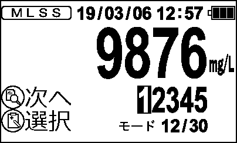

# IM-110 プログラム仕様書

> IM-110T 本体・プローブ両基板のプログラム動作仕様。**セクションA=本体、B=プローブ、末尾に付録。**

> **作成方法**: 本体(A)は 77サーバーの Devstral(24B) が本体FWの描画コード `Display.c` と呼出側 状態遷移 `Normal.c`/`Setting.c`/`Adjust.c` を読み、実装から画面仕様・遷移を執筆。付録は `Calc.c`／補正式手順／`Eeprom.h` から生成。プローブ(B)は `protocol-rs232c.md` から生成。Claude Code が真実源と突き合わせ検証。文体はである調に統一。

> 画面図はモノクロLCD(400×240)。全図は `docs/specs/assets/im-110/`。


---

# セクションA：IM-110T 本体


## 5.1 起動画面

<sub>実装: 描画 `disp_STRTDSP`, `disp_STRTDSP2` / 遷移 呼出側 case</sub>

画面「起動画面」の動作仕様は以下の通りである。

### 表示要素
1. IM-110ロゴ
2. ファームウェアバージョン（FW_VER1）
3. "Ver."テキスト
4. "飯島電子工業株式会社"テキスト

### 状態遷移とスイッチ操作の効果

#### 状態: CALDSP_1
- **表示要素**: IM-110ロゴ、ファームウェアバージョン、"Ver."テキスト、"飯島電子工業株式会社"テキスト
- **遷移**:
  - `disp_STRTDSP()`が成功すると、`operation_mode`はCALDSP_2に遷移する。
- **スイッチ操作**:
  - MEMスイッチが押下されると、MEM_sw_stepが0にリセットされる。
  - DISPスイッチが押下されると、DISP_sw_stepが0にリセットされる。

#### 状態: STRT_1
- **表示要素**: IM-110ロゴ、ファームウェアバージョン、"Ver."テキスト、"飯島電子工業株式会社"テキスト
- **遷移**:
  - `disp_STRTDSP()`が成功すると、`operation_mode`はSTRT_4に遷移する。
  - ロガーデータの読み込みとエラー処理が行われる。
- **スイッチ操作**:
  - MEMスイッチやDISPスイッチの押下による特定の動作は記述されていない。

#### 状態: SETDSP_1
- **表示要素**: IM-110ロゴ、ファームウェアバージョン、"Ver."テキスト、"飯島電子工業株式会社"テキスト
- **遷移**:
  - `disp_STRTDSP()`が成功すると、`operation_mode`はSETDSP_2に遷移する。
- **スイッチ操作**:
  - MEMスイッチやDISPスイッチの押下による特定の動作は記述されていない。

#### 状態: STRT_5
- **表示要素**: "校正"テキスト、"画面へ"テキスト、MEMアイコン、"を押しながら、"テキスト、POWERアイコン、"を押しながら,"テキスト、"設定メニュー"テキスト、"画面へ"テキスト、DISPアイコン、"を押しながら,"テキスト、POWERアイコン、"を押しながら,"テキスト
- **遷移**:
  - `disp_STRTDSP2()`が成功すると、`operation_mode`はSTRT_2に遷移する。
- **スイッチ操作**:
  - MEMスイッチやDISPスイッチの押下による特定の動作は記述されていない。

### 補足
- 電源ON直後のロゴ/バージョン表示と操作説明表示が行われる。
- 各状態での遷移とスイッチ操作の効果は、コードから読み取れた内容に基づいて記述されている。


<sub>画面図 meas_01 — BMP版: [meas_01.bmp](assets/im-110/meas_01.bmp)</sub>


## 5.2 測定メニュー

<sub>実装: 描画 `disp_M_MENU` / 遷移 呼出側 case</sub>

画面「測定メニュー」は、IM-110Tの測定項目を選択するためのメニュー画面である。以下にその動作仕様を記述する。

### 表示要素
- タイトルアイコン
- 電池残量アイコン
- 日付時刻表示
- スイッチ操作アイコン（記録(MEM)/履歴(DISP)スイッチの長押し・押下）
- メニュー項目（測定モード、界面設定/相関式、校正、設定）

### 状態遷移
- **M_MENU_2**: 測定メニュー画面表示中
  - 操作: MEMスイッチ長押し
    - 遷移先: M_CHANGE_1（測定モード切替画面1）
  - 操作: DISPスイッチ長押し
    - 遷移先: MENU1（設定メニュー）

### スイッチ操作の効果
- **記録(MEM)スイッチ**:
  - 押下: メニュー項目の選択が切り替わる。
  - 長押し: 測定モード切替画面に遷移する。

- **履歴(DISP)スイッチ**:
  - 押下: メニュー項目の選択が切り替わる。
  - 長押し: 設定メニューに遷移する。

### 描画処理
- `disp_M_MENU`関数が呼び出され、以下の要素が描画される。
  - タイトルアイコン
  - 電池残量アイコン
  - 日付時刻表示
  - スイッチ操作アイコン（記録(MEM)/履歴(DISP)スイッチの長押し・押下）
  - メニュー項目（測定モード、界面設定/相関式、校正、設定）

### 補足
- 測定モードが「界面測定モード」の場合、「相関式」アイコンは「界面設定」アイコンに差し替えられる。
- メニュー項目の選択状態は、`meas_menu_sel`変数で管理され、選択されている項目は強調表示される。

以上が画面「測定メニュー」の動作仕様である。


## 5.3 モード切替

<sub>実装: 描画 `disp_M_CHANGE` / 遷移 呼出側 case</sub>

画面「モード切替」は、MLSSメーターIM-110Tの測定モードを切り替えるためのインターフェースである。以下に、表示要素と状態遷移、記録(MEM)/履歴(DISP)スイッチ操作の効果について詳述する。

### 表示要素
- タイトル: 「t_measure」アイコンが表示される。
- 電池残量アイコン: バッテリーの残り量を示すアイコンが表示される。
- 日付時刻表示: 現在の日付と時刻が表示される。
- スイッチアイコン:
  - DISPスイッチに対応する「icon_DISP」アイコンが表示される。
  - MEMスイッチに対応する「icon_MEM」アイコンが表示される。
- モード選択アイコン:
  - 「MLSS」: 選択時は「b_MLSS」、非選択時は「w_MLSS」アイコンが表示される。
  - 「SS」: 選択時は「b_SS」、非選択時は「w_SS」アイコンが表示される。
  - 「透視度」: 選択時は「b_Transparency」、非選択時は「w_Transparency」アイコンが表示される。

### 状態遷移とスイッチ操作の効果
#### M_CHANGE_1 (測定モード切替画面表示)
- **初期状態**: `operation_mode` が `M_CHANGE_1` に設定されている。
- **処理内容**:
  - `operation_mode` を `M_CHANGE_2` に遷移させる。
  - バッテリーの計算を行う。
  - `disp_M_CHANGE` 関数を呼び出し、モード切替画面を表示する。
  - `fl_flag` の値をトグルする。
  - ディスプレイタイマーを設定する。

#### M_CHANGE_3 (セット後のメッセージ表示)
- **初期状態**: `operation_mode` が `M_CHANGE_3` に設定されている。
- **処理内容**:
  - バッテリーの計算を行う。
  - `disp_M_CHANGE` 関数を呼び出し、モード切替画面を表示する。
  - LCDオフタイマーとフラッシュタイマーを設定する。
  - モード切替処理を行い、`Change_Meas_Mode` 関数を呼び出す。
  - 履歴バンクを読み込む。
  - 安定判断をリセットする。
  - `operation_mode` を `M_CHANGE_4` に遷移させる。

### スイッチ操作の効果
- **記録(MEM)スイッチ**:
  - 押下時: モード選択アイコンが切り替わる。具体的には、現在選択されているモードが決定され、次のモードに移動する。
  - 長押し時: (要確認)

- **履歴(DISP)スイッチ**:
  - 押下時: モード選択アイコンが切り替わる。具体的には、現在選択されているモードが決定され、次のモードに移動する。
  - 長押し時: (要確認)

### 注意点
- コードから読み取れない事項については『(要確認)』と明記している。具体的には、記録(MEM)スイッチおよび履歴(DISP)スイッチの長押し時の動作が不明であるため、追加の情報が必要である。

以上が、画面「モード切替」の動作仕様である。


## 5.4 測定モード設定

<sub>実装: 描画 `disp_MEASMODE` / 遷移 呼出側 case</sub>

画面「測定モード設定」は、MLSSメーターIM-110Tにおいて測定モードを選択するための画面である。以下に、表示要素と状態遷移、スイッチ操作の効果について詳細を記述する。

### 表示要素
- タイトル: 測定モード設定
- 電池残量アイコン: バッテリーの残り量を示すアイコン
- 日付時刻表示: 現在の日付と時刻
- スイッチ操作説明:
  - DISPスイッチ: 選択
  - MEMスイッチ: 決定

### 状態遷移とスイッチ操作の効果

#### MEASMODE_1 (測定モード設定画面表示)
- **表示内容**:
  - タイトル: 測定モード設定
  - 電池残量アイコン
  - 日付時刻表示
  - スイッチ操作説明（DISPスイッチ: 選択、MEMスイッチ: 決定）
  - 測定モードの選択肢:
    - 通常測定 (通常)
    - データロガー測定 (ロガー)

- **遷移**:
  - 次状態: MEASMODE_2

#### MEASMODE_2 (測定モード設定画面表示中)
- **表示内容**:
  - タイトル: 測定モード設定
  - 電池残量アイコン
  - 日付時刻表示
  - スイッチ操作説明（DISPスイッチ: 選択、MEMスイッチ: 決定）
  - 測定モードの選択肢:
    - 通常測定 (通常)
    - データロガー測定 (ロガー)

- **遷移**:
  - 次状態: MEASMODE_3

#### MEASMODE_3 (セット後のメッセージ表示)
- **表示内容**:
  - タイトル: 測定モード設定
  - 電池残量アイコン
  - 日付時刻表示
  - スイッチ操作説明（DISPスイッチ: 選択、MEMスイッチ: 決定）
  - セット後のメッセージ:
    - 通常測定が設定された場合: "通常測定モードが設定されました"
    - データロガー測定が設定された場合: "データロガー測定モードが設定されました"

- **遷移**:
  - 次状態: MEASMODE_4

#### MEASMODE_4 (セット後のメッセージ表示中)
- **表示内容**:
  - タイトル: 測定モード設定
  - 電池残量アイコン
  - 日付時刻表示
  - スイッチ操作説明（DISPスイッチ: 選択、MEMスイッチ: 決定）
  - セット後のメッセージ:
    - 通常測定が設定された場合: "通常測定モードが設定されました"
    - データロガー測定が設定された場合: "データロガー測定モードが設定されました"

- **遷移**:
  - 次状態: (要確認)

### スイッチ操作の効果
- **DISPスイッチ押下**:
  - 測定モードの選択肢を切り替える（通常測定とデータロガー測定の間で切り替わる）。

- **MEMスイッチ押下**:
  - 現在選択されている測定モードを決定し、セット後のメッセージ表示に遷移する。

以上が、画面「測定モード設定」の動作仕様である。


## 5.5 MLSS測定画面（待機・測定中）

<sub>実装: 描画 `disp_MLSS_Meas_2`, `disp_MLSS_Meas_3` / 遷移 呼出側 case</sub>

画面「MLSS測定画面（待機・測定中）」の動作仕様は以下の通りである。

### 表示要素
- **電池残量アイコン**: LCD上部に表示される。
- **日付時刻表示**: LCD上部に表示される。
- **矢印 (測定中) アイコン**:
  - 測定中の場合、透視度が200cmを超えるときはレンジオーバー固定アイコンに切替わり、それ以外は通常のwaitアニメーションが表示される。
- **MLSS値表示**:
  - MLSS値がFLT_MAXまたは範囲外（20000以上または-99以下）の場合、点滅する白塗り表示となる。
  - 10000 mg/L以上はg/L形式で表示され、1000-9999 mg/Lはカンマ付き4桁手動描画で表示される。それ以外はmg/L整数で表示される。
- **単位アイコン**:
  - MLSS値が10000以上の場合は"g/L"、それ以下の場合は"mg/L"と表示される。
- **界面判断バー**:
  - MLSS_inst / Interface_Thresholdを100%としてバー表示される。右端は118.75%まで伸びる。
- **水深表示**:
  - 現在のDepth（リアルタイム）がSサイズでbar3の右隣に表示される。
  - Interface_Hold値がMサイズで右上に表示される。未捕捉時は"-.--"と表示される。
- **モードラベル「モード/30」**:
  - MLSS/SS/TRすべてy=5（上段表示）で統一され、DEPTHはUI到達不能である。
- **進捗バー**: 現在の進行状況を示すバーが表示される。
- **DISPアイコンと切替アイコン**: LCD下部に表示される。

### 状態遷移
- **MSR_2 (測定中画面表示・安定待ち)**:
  - `disp_timer`が0の場合、表示用数値計算と点滅制御を行い、`disp_MLSS_Meas_2`関数を呼び出して測定中画面を表示する。
  - 表示が成功した場合、`operation_mode`はMSR_1に遷移する。

- **MSR_7 (安定中表示)**:
  - `disp_MLSS_Meas_3`関数を呼び出して安定中画面を表示する。
  - 表示が成功した場合、`operation_mode`はMSR_3に遷移する。

- **MSR_5 (記録完了画面表示)**:
  - `normal_disp`関数を呼び出し、その後`disp_MLSS_Meas_3`関数を呼び出して記録完了画面を表示する。
  - 表示が成功した場合、`operation_mode`はMSR_6に遷移する。

### スイッチ操作
- **記録(MEM)スイッチ**:
  - 押下時: 測定値を記録する。
  - 長押し時: (要確認)

- **履歴(DISP)スイッチ**:
  - 押下時: 測定履歴を表示する。
  - 長押し時: (要確認)

### 補足
- **点滅制御**: `WAG_flash_flag`が1の場合、特定の値が白塗りで点滅表示される。
- **進捗バー**: `bar_flag`に基づいて進捗状況が表示される。

以上が画面「MLSS測定画面（待機・測定中）」の動作仕様である。


<sub>画面図 meas_04 — BMP版: [meas_04.bmp](assets/im-110/meas_04.bmp)</sub>


## 5.6 MLSS測定完了画面

<sub>実装: 描画 `disp_MLSS_Meas_4` / 遷移 呼出側 case</sub>

画面「MLSS測定完了画面」は、通常測定モードでの測定が完了した際に表示される画面である。以下にその動作仕様を記述する。

### 表示要素
- **海水/淡水タイトル**: `tansui_sw_flag` の値により、海水タイトルまたは淡水タイトルが表示される。
- **電池残量アイコン**: `batvol` に基づいて電池の残量を示すアイコンが表示される。
- **日付時刻表示**: 現在の日付と時刻が表示される。
- **測定モード切替メッセージ**: 測定モードを切り替えるためのメッセージが表示される。

### 状態遷移
- **MSR_8 (通常測定切替メッセージ表示)**: この状態では、画面に「MLSS測定完了画面」が表示される。`disp_MLSS_Meas_4(bar_flag)` が `DISP_OK` を返すと、`operation_mode` は `MSR_9` に遷移する。

### 記録/履歴スイッチ操作
- **記録スイッチ (MEM)**: この画面では、記録スイッチの操作による状態遷移は記述されていない。
- **履歴スイッチ (DISP)**: この画面でも、履歴スイッチの操作による状態遷移は記述されていない。

### その他
- `timer_set(&lcd_off_timer, 60)`: LCDオフタイマーを60秒に設定する。
- `timer_set(&flash_timer, DISP_CYCLE)`: ディスプレイサイクルタイマーを設定する。

以上が「MLSS測定完了画面」の動作仕様である。


<sub>画面図 meas_05 — BMP版: [meas_05.bmp](assets/im-110/meas_05.bmp)</sub>


## 5.7 測定レンジ表示

<sub>実装: 描画 `disp_RANGE1`, `disp_RANGE2` / 遷移 呼出側 case</sub>

画面「測定レンジ表示」は、IM-110Tの測定レンジ調整および完了表示を行うための画面である。以下に、各状態における表示要素とスイッチ操作による遷移を記述する。

### 低レンジ調整待機中 (LOWRANGE)
- **表示要素**:
  - タイトル: 「低レンジ調整待機中」
  - 電圧値: `range_mv` の値
  - アイコン:
    - DISPスイッチアイコン
    - MEMスイッチアイコン
    - 次へアイコン
    - 開始アイコン

- **スイッチ操作**:
  - **DISPスイッチ押下**: 次の状態に遷移 (LOWRANGE0)
  - **MEMスイッチ押下**: 調整値ホールド画面表示 (ADJ_4)

### 中レンジ調整待機中 (MIDRANGE)
- **表示要素**:
  - タイトル: 「中レンジ調整待機中」
  - 電圧値: `range_mv` の値
  - アイコン:
    - DISPスイッチアイコン
    - MEMスイッチアイコン
    - 次へアイコン
    - 開始アイコン

- **スイッチ操作**:
  - **DISPスイッチ押下**: 次の状態に遷移 (MIDRANGE0)
  - **MEMスイッチ押下**: 調整値ホールド画面表示 (ADJ_4)

### 高レンジ調整待機中 (HIRANGE)
- **表示要素**:
  - タイトル: 「高レンジ調整待機中」
  - 電圧値: `range_mv` の値
  - アイコン:
    - DISPスイッチアイコン
    - MEMスイッチアイコン
    - 次へアイコン
    - 開始アイコン

- **スイッチ操作**:
  - **DISPスイッチ押下**: 次の状態に遷移 (HIRANGE0)
  - **MEMスイッチ押下**: 調整値ホールド画面表示 (ADJ_4)

### 低レンジゼロ調整待機中 (LOWRANGE0)
- **表示要素**:
  - タイトル: 「低レンジゼロ調整待機中」
  - 電圧値: `range_mv` の値
  - アイコン:
    - DISPスイッチアイコン
    - MEMスイッチアイコン
    - 次へアイコン
    - 開始アイコン

- **スイッチ操作**:
  - **DISPスイッチ押下**: 次の状態に遷移 (LOWRANGE)
  - **MEMスイッチ押下**: 調整値ホールド画面表示 (ADJ_4)

### 中レンジゼロ調整待機中 (MIDRANGE0)
- **表示要素**:
  - タイトル: 「中レンジゼロ調整待機中」
  - 電圧値: `range_mv` の値
  - アイコン:
    - DISPスイッチアイコン
    - MEMスイッチアイコン
    - 次へアイコン
    - 開始アイコン

- **スイッチ操作**:
  - **DISPスイッチ押下**: 次の状態に遷移 (MIDRANGE)
  - **MEMスイッチ押下**: 調整値ホールド画面表示 (ADJ_4)

### 高レンジゼロ調整待機中 (HIRANGE0)
- **表示要素**:
  - タイトル: 「高レンジゼロ調整待機中」
  - 電圧値: `range_mv` の値
  - アイコン:
    - DISPスイッチアイコン
    - MEMスイッチアイコン
    - 次へアイコン
    - 開始アイコン

- **スイッチ操作**:
  - **DISPスイッチ押下**: 次の状態に遷移 (HIRANGE)
  - **MEMスイッチ押下**: 調整値ホールド画面表示 (ADJ_4)

### 調整値ホールド画面表示 (ADJ_4)
- **表示要素**:
  - タイトル: 各レンジのゼロ調整完了タイトル
  - 電圧値: `range_mv` の値
  - アイコン:
    - DISPスイッチアイコン
    - MEMスイッチアイコン

- **スイッチ操作**:
  - **DISPスイッチ押下**: 次の状態に遷移 (ADJ_5)
  - **MEMスイッチ押下**: 調整値ホールド画面表示 (ADJ_4)

### 調整値ホールド完了表示 (ADJ_5)
- **表示要素**:
  - タイトル: 各レンジのゼロ調整完了タイトル
  - 電圧値: `range_mv` の値

- **スイッチ操作**:
  - **DISPスイッチ押下**: 次の状態に遷移 (ADJ_6)
  - **MEMスイッチ押下**: 調整値ホールド画面表示 (ADJ_4)

### その他 (default)
- **表示要素**:
  - タイトル: 黒塗り
  - 電圧値: `range_mv` の値

- **スイッチ操作**:
  - **DISPスイッチ押下**: 次の状態に遷移 (ADJ_2)
  - **MEMスイッチ押下**: 調整値ホールド画面表示 (ADJ_4)

以上が、測定レンジ表示画面における各状態の表示要素とスイッチ操作による遷移である。


## 5.8 水温表示

<sub>実装: 描画 `disp_WAT1`, `disp_WAT2` / 遷移 呼出側 case</sub>

画面「水温表示」は、IM-110Tの調整モードにおいて水温の表示を行う機能である。以下に、各状態およびスイッチ操作による遷移について詳細を記述する。

### 状態定義
- **WAT05C**: 水温5℃調整待機中
- **WAT20C**: 水温20℃調整待機中
- **WAT35C**: 水温35℃調整待機中

### 表示要素
- **タイトル**: 水温の設定値（5℃、20℃、35℃）に応じて表示される。
- **水温値**: 現在の水温を数字で表示する。
- **単位**: "℃"と表示される。
- **アイコン**:
  - **DISPスイッチ**: 履歴表示用のアイコン。
  - **MEMスイッチ**: 記録用のアイコン。
  - **次へ**: 次の操作に進むためのアイコン。
  - **開始**: 調整を開始するためのアイコン。

### 状態遷移とスイッチ操作
- **調整待機中（WAT05C/WAT20C/WAT35C）**:
  - **DISPスイッチ押下**: 履歴表示画面へ遷移する。
  - **MEMスイッチ押下**: 記録操作が行われる。
  - **次へアイコン選択**: 次の調整ステップへ進む。
  - **開始アイコン選択**: 調整を開始し、水温調整完了画面へ遷移する。

- **水温調整完了（WAT05C/WAT20C/WAT35C）**:
  - 水温の設定値に応じて、調整が完了した旨を表示する。
  - スイッチ操作による遷移はない。

### コードから読み取れない事項
- **DISPスイッチ長押し時の動作**: (要確認)
- **MEMスイッチ長押し時の動作**: (要確認)

以上が、画面「水温表示」における動作仕様である。


## 5.9 界面閾値設定

<sub>実装: 描画 `disp_Depth_Setting` / 遷移 呼出側 case</sub>

画面「界面閾値設定」は、界面測定の閾値を設定するための画面である。以下にその動作仕様を記述する。

### 表示要素
- **界面設定アイコン**: 画面上部に表示される。
- **電池残量アイコン**: 電池の残量を示すアイコンが表示される。
- **日付時刻表示**: 現在の日付と時間が表示される。
- **閾値設定値**: 5桁の界面閾値設定値が大サイズで上段に表示される。選択中の桁は反転で点滅する。
- **"mg/L"**: 単位として "mg/L" が表示される。
- **スイッチ操作アイコン**:
  - **DISP スイッチ長押し**: 元の画面に戻るためのアイコンが表示される。
  - **次へ**: 次の設定画面に進むためのアイコンが表示される。
  - **切替**: 設定値を変更するためのアイコンが表示される。

### 動作仕様
- **状態遷移**:
  - `D_SET_2` (スパン校正値設定画面表示) から `D_SET_3` に遷移する。
  - `disp_Depth_Setting` 関数が呼び出され、画面が更新される。

- **記録(MEM)/履歴(DISP)スイッチ操作**:
  - **DISP スイッチ長押し**: 元の画面に戻る。
  - **次へ**: 次の設定画面に進む。
  - **切替**: 設定値を変更する。

### 補足
- `disp_Depth_Setting` 関数は、界面閾値設定画面を描画するための関数である。選択中の桁が反転で点滅し、スイッチ操作に応じて画面が更新される。
- `operation_mode` が `D_SET_2` の場合、`disp_Depth_Setting` 関数が呼び出され、画面が更新される。その後、`operation_mode` は `D_SET_3` に遷移する。

以上が「界面閾値設定」画面の動作仕様である。


## 6.1 校正メニュー

<sub>実装: 描画 `disp_C_MENU` / 遷移 呼出側 case</sub>

画面「校正メニュー」は、IM-110Tの校正設定を行うための画面である。以下に、表示要素と状態遷移、スイッチ操作の効果を記述する。

### 表示要素
- タイトル: 「校正メニュー」
- 電池残量アイコン
- 日付時刻表示
- スイッチ操作アイコン:
  - DISPスイッチ: 長押しで前の画面へ
  - MEMスイッチ: 選択
  - MEMスイッチ長押し: 決定

### 状態遷移とスイッチ操作の効果
- **C_MENU_2**: 校正メニュー画面表示
  - 初期状態として、`operation_mode`が`C_MENU_2`に設定される。
  - `disp_C_MENU`関数を呼び出し、校正メニュー画面を表示する。
  - MEMスイッチ操作:
    - 押下: 選択項目が切り替わる。
    - 長押し: 決定操作が行われ、選択された校正モードに遷移する。
  - DISPスイッチ操作:
    - 長押し: 前の画面へ戻る。

### 校正メニューの表示内容
- **電源ON経由の場合**:
  - 4つのボタンが表示される:
    - ゼロ校正
    - 2点校正
    - 3点校正
    - 校正リセット

- **測定メニュー経由の場合**:
  - 現在の校正モードに応じて、以下のように表示される:
    - **ゼロ校正モード**:
      - 2点校正
      - 3点校正 (相関式に依存)
      - 校正リセット
      - 測定 (復帰)
    - **2点校正モード**:
      - ゼロ校正
      - 3点校正
      - 校正リセット
      - 測定 (復帰)
    - **3点校正モード**:
      - ゼロ校正
      - 2点校正
      - 校正リセット
      - 測定 (復帰)

### スイッチ操作の詳細
- **MEMスイッチ**:
  - 押下: 選択項目が切り替わる。
  - 長押し: 決定操作が行われ、選択された校正モードに遷移する。

- **DISPスイッチ**:
  - 長押し: 前の画面へ戻る。

### 注意点
- calmode 引数で校正対象が変わるため、表示内容が異なる。
- 相関式に依存して、2点/3点校正が表示されるかどうかが決定される。


<sub>画面図 calib_01 — BMP版: [calib_01.bmp](assets/im-110/calib_01.bmp)</sub>


## 6.2 校正設定

<sub>実装: 描画 `disp_CAL_SETTING` / 遷移 呼出側 case</sub>

画面「校正設定」は、校正モードを選択するための画面であり、以下の要素が表示される。

1. タイトル: 「校正モード」
2. 電池残量アイコン
3. 日付時刻表示
4. 記録スイッチ（MEM）アイコン
5. 履歴スイッチ（DISP）アイコン
6. 選択中の項目に対応するアイコン
7. 決定アイコン

校正モードの選択肢は以下の通りである。
- ゼロ校正
- 2点校正
- 3点校正

これらの選択肢は、選択中の項目に応じてハイライト表示される。

画面遷移とスイッチ操作の効果は以下の通りである。

1. 初期状態: `C_MODE_2`
   - 記録スイッチ（MEM）を押下することで、選択中の項目が切り替わる。
   - 履歴スイッチ（DISP）を押下することで、選択中の項目が決定され、`C_MODE_3`に遷移する。

2. 状態 `C_MODE_3`
   - 記録スイッチ（MEM）を押下することで、選択中の項目が切り替わる。
   - 履歴スイッチ（DISP）を押下することで、選択中の項目が決定され、`C_MODE_3`に遷移する。

この画面では、校正モードを選択し、決定するための操作を行う。


## 6.3 補正設定

<sub>実装: 描画 `disp_Corr_setting`, `disp_Corr_setting_30` / 遷移 呼出側 case</sub>

画面「補正設定」は、相関式の設定を行うための画面である。以下に、表示要素および状態遷移、記録(MEM)/履歴(DISP)スイッチ操作の効果を記述する。

### 表示要素
- タイトル: 「相関式」
- 電池残量アイコン
- 日付時刻表示
- スイッチアイコン:
  - DISPスイッチアイコン (2つ)
  - MEMスイッチアイコン
- 数字選択:
  - 1から9までの数字が表示される。選択中の数字は点滅する。
- スイッチ操作アイコン:
  - 長押しで戻る (DISPスイッチ)
  - 次へ (DISPスイッチ)
  - 切替 (MEMスイッチ)

### 状態遷移
#### S_CORR_2: 相関式設定画面2 (表示)
- **操作**: 相関式の数字を選択・編集する。
- **DISPスイッチ**:
  - 長押し: 前の画面に戻る (要確認)
  - 押下: 次の桁へ移動
- **MEMスイッチ**:
  - 押下: 数字を切り替える

#### S_CORR_3: 相関式設定画面3
- **操作**: 相関式の数字を選択・編集する。
- **DISPスイッチ**:
  - 長押し: 前の画面に戻る (要確認)
  - 押下: 次の桁へ移動
- **MEMスイッチ**:
  - 押下: 数字を切り替える

### 描画関数
#### disp_Corr_setting_30
- **引数**:
  - `corr_val_disp`: 表示値 (0..30、内部値 + 1)
  - `num_sel`: 編集中の桁 (0=10の位、1=1の位)
  - `batvol`: 電池残量
  - `fl`: 点滅フラグ
- **動作**:
  - タイトル「相関式」を表示
  - 電池残量アイコンを表示
  - 日付時刻を表示
  - 大サイズ数字2桁を表示 (編集中の桁は点滅)
  - スイッチ操作アイコンを表示

### 注意事項
- `disp_Corr_setting_30` 関数内で、LCDの初期化が失敗した場合には描画処理を終了する。
- `fl_flag` は点滅フラグとして使用され、タイマーによって制御される。

以上が「補正設定」画面の動作仕様である。


## 6.4 MLSSゼロ校正

<sub>実装: 描画 `disp_MLSS_ZCal_2`, `disp_MLSS_ZCal_3` / 遷移 呼出側 case</sub>

画面「MLSSゼロ校正」は、MLSS測定値のゼロ校正を行うための画面である。以下に、表示要素と状態遷移、スイッチ操作の効果を記述する。

### 表示要素
- **ゼロ校正アイコン**: 画面上部に「ゼロ校正」というテキストが表示される。
- **電池残量アイコン**: 電池の残量を示すアイコンが表示される。
- **日付時刻表示**: 現在の日付と時間が表示される。
- **測定値表示**: MLSS、SS、透視度、界面の測定値が表示される。測定値が異常な場合は白塗りとなる。
- **モード表示**: 測定モードとその番号（/30）が表示される。
- **進捗バー**: 校正の進行状況を示すバーが表示される。
- **スイッチアイコン**:
  - **MEMスイッチ**: 記録スイッチのアイコンが表示される。
  - **DISPスイッチ**: 履歴スイッチのアイコンが表示される。
  - **中止アイコン**: 校正を中止するためのアイコンが表示される。

### 状態遷移とスイッチ操作
- **ZCAL_4**:
  - **表示内容**: ゼロ校正中画面が表示される。測定値、モード表示、進捗バーなどが表示される。
  - **MEMスイッチ押下**: ゼロ校正を中止し、`operation_mode`がZCAL_1に遷移する。
  - **校正タイムアウト**: 60秒経過するとセンサー不安定と判断され、エラーメッセージ画面（ERRMSG）に遷移する。

- **ZCAL_8**:
  - **表示内容**: ゼロ校正完了前の画面が表示される。測定値、モード表示などが表示される。
  - **遷移先**: `operation_mode`がZCAL_2に遷移する。

- **ZCAL_5**:
  - **表示内容**: ゼロ校正完了（Good）の画面が表示される。測定値、モード表示などが表示される。
  - **遷移先**: `operation_mode`がZCAL_6に遷移する。

- **ZCAL_9**:
  - **表示内容**: ゼロ校正完了後の画面が表示される。測定値、モード表示などが表示される。
  - **遷移先**: `operation_mode`がZCAL_7に遷移する。

### まとめ
画面「MLSSゼロ校正」は、MLSS測定値のゼロ校正を行うための画面であり、測定値や進捗状況を表示しながら、MEMスイッチによる中止操作やタイムアウトによるエラーハンドリングを行う。各状態遷移に応じて適切な画面が表示され、ユーザーはゼロ校正の進行状況を確認することができる。


## 6.5 MLSS中間校正

<sub>実装: 描画 `disp_MLSS_MCal_2`, `disp_MLSS_MCal_3` / 遷移 呼出側 case</sub>

画面「MLSS中間校正」は、MLSS測定項目の中間校正を行うための画面である。以下に、表示要素と状態遷移、スイッチ操作の効果を記述する。

### 表示要素
- **3点校正アイコン**: 画面上部に表示される。
- **電池残量アイコン**: 電池の残量を示すアイコンが表示される。
- **日付時刻表示**: 現在の日付と時刻が表示される。
- **矢印アイコン**: 校正中の進行状況を示す矢印アイコンが表示される。
- **MLSS値**: MLSSの測定値が「mg/L」単位で表示される。値が異常な場合は白塗りとなる。
- **中間校正設定値**: 中間校正の設定値が表示される。
- **モード表示**: 「モード/30」と表示され、測定モードが示される。
- **MEMアイコン**: 記録スイッチのアイコンが表示される。
- **中止アイコン**: 校正を中止するためのアイコンが表示される。
- **進捗バー**: 校正の進行状況を示す進捗バーが表示される。

### 状態遷移とスイッチ操作
#### MCAL_4 (スパン校正中)
- **表示要素**: 上記の表示要素が表示される。
- **スイッチ操作**:
  - **記録(MEM)スイッチ押下**: スパン校正を中止し、MCAL_1状態に遷移する。
  - **校正タイムアウト**: 60秒経過するとセンサー不安定と判断され、ERRMSG状態に遷移する。

#### MCAL_8
- **表示要素**: 上記の表示要素が表示される。
- **スイッチ操作**:
  - **記録(MEM)スイッチ押下**: スパン校正を中止し、MCAL_1状態に遷移する。

#### MCAL_5 (スパン校正完了)
- **表示要素**: 上記の表示要素が表示され、「校正完了」アイコンが追加で表示される。
- **スイッチ操作**:
  - **記録(MEM)スイッチ押下**: スパン校正を中止し、MCAL_1状態に遷移する。

#### MCAL_9
- **表示要素**: 上記の表示要素が表示される。
- **スイッチ操作**:
  - **記録(MEM)スイッチ押下**: スパン校正を中止し、MCAL_1状態に遷移する。

### その他の注意点
- **校正タイムアウト**: 60秒経過するとセンサー不安定と判断され、ERRMSG状態に遷移する。
- **進捗バー**: 校正の進行状況を示すために表示される。


## 6.6 MLSSスパン校正

<sub>実装: 描画 `disp_MLSS_SCal_1`, `disp_MLSS_SCal_2`, `disp_MLSS_SCal_3` / 遷移 呼出側 case</sub>

画面「MLSSスパン校正」は、MLSS測定モードにおけるスパン校正を行うための画面であり、以下の状態と遷移を持つ。

### 状態: C_S_SET_2 (スパン校正値設定画面表示)
- **表示要素**:
  - 2点校正アイコン
  - 電池残量アイコン
  - 日付時刻表示
  - MLSS値（mg/L）
  - スパン校正設定値（5桁）
  - モード表示（モード/30）
  - DISPスイッチアイコン（長押しで元の画面）
  - NEXTスイッチアイコン（次へ）
  - CHANGEスイッチアイコン（切替）

- **操作**:
  - MEMスイッチ: スパン校正値設定
  - DISPスイッチ: 長押しで前の画面に戻る

### 状態: C_M_SET_2 (中間濃度設定画面表示)
- **表示要素**:
  - 2点校正アイコン
  - 電池残量アイコン
  - 日付時刻表示
  - MLSS値（mg/L）
  - スパン校正設定値（5桁）
  - モード表示（モード/30）
  - DISPスイッチアイコン（長押しで元の画面）
  - NEXTスイッチアイコン（次へ）
  - CHANGEスイッチアイコン（切替）

- **操作**:
  - MEMスイッチ: 中間濃度設定
  - DISPスイッチ: 長押しで前の画面に戻る

### 状態: ADCAL_4 (スパン校正中画面表示)
- **表示要素**:
  - 2点校正アイコン
  - 電池残量アイコン
  - 日付時刻表示
  - MLSS値（mg/L）
  - スパン校正設定値
  - モード表示（モード/30）
  - MEMスイッチアイコン（中止）

- **操作**:
  - MEMスイッチ: スパン校正中止
  - タイムアウト: センサー不安定エラー

### 状態: ADCAL_8 (スパン校正完了表示処理)
- **表示要素**:
  - 2点校正アイコン
  - 電池残量アイコン
  - 日付時刻表示
  - MLSS値（mg/L）
  - スパン校正設定値
  - モード表示（モード/30）
  - DISPスイッチアイコン（設定）
  - MEMスイッチアイコン（校正開始）

- **操作**:
  - MEMスイッチ: 校正開始

### 状態: ADCAL_5 (スパン校正完了表示処理（Good））
- **表示要素**:
  - 2点校正アイコン
  - 電池残量アイコン
  - 日付時刻表示
  - MLSS値（mg/L）
  - スパン校正設定値
  - モード表示（モード/30）
  - DISPスイッチアイコン（設定）
  - MEMスイッチアイコン（校正開始）

- **操作**:
  - MEMスイッチ: 校正開始

### 状態: ADCAL_9 (スパン校正完了表示処理)
- **表示要素**:
  - 2点校正アイコン
  - 電池残量アイコン
  - 日付時刻表示
  - MLSS値（mg/L）
  - スパン校正設定値
  - モード表示（モード/30）
  - DISPスイッチアイコン（設定）
  - MEMスイッチアイコン（校正開始）

- **操作**:
  - MEMスイッチ: 校正開始

### まとめ
画面「MLSSスパン校正」は、スパン校正値の設定から校正中、そして完了までの一連の流れを表示する。各状態において、MEMスイッチとDISPスイッチによる操作が可能であり、特にMEMスイッチは校正の開始や中止に使用される。


<sub>画面図 calib_10 — BMP版: [calib_10.bmp](assets/im-110/calib_10.bmp)</sub>


## 6.7 AD校正

<sub>実装: 描画 `disp_ADCAL1`, `disp_ADCAL2`, `disp_ADCAL3` / 遷移 呼出側 case</sub>

画面「AD校正」の動作仕様は以下の通りである。

### 表示要素
1. **タイトル**: 「AD校正」と表示される。
2. **電池残量アイコン**: 電池の残量を示すアイコンが表示される。
3. **日付時刻表示**: 現在の日付と時刻が表示される。
4. **空気飽和率バー表示**: 空気飽和率を示すバーが表示される。
5. **空気飽和率**: 「%」のアイコンとともに数値で表示される。
6. **操作説明アイコン**:
   - **DISPスイッチ長押し**: 構成履歴への遷移を示すアイコンが表示される。
   - **電源スイッチ**: 入れ直し測定を示すアイコンが表示される。
   - **MEMスイッチ**: 校正開始を示すアイコンが表示される。
7. **酸素濃度表示**: 酸素濃度が「mg/L」の単位で表示される。値が範囲外の場合は白塗りとなる。
8. **温度表示**: 温度が「℃」の単位で表示される。値が範囲外の場合は白塗りとなる。

### 状態遷移とスイッチ操作
#### 操作モード: ADCAL1
- **DISPスイッチ長押し**: 構成履歴画面へ遷移する。
- **電源スイッチ押下**: 入れ直し測定を行う。
- **MEMスイッチ押下**: 校正を開始する。

#### 操作モード: ADCAL2
- **DISPスイッチ長押し**: 構成履歴画面へ遷移する。
- **電源スイッチ押下**: 入れ直し測定を行う。
- **MEMスイッチ押下**: 校正を中止する。

#### 操作モード: ADCAL3
- **DISPスイッチ長押し**: 構成履歴画面へ遷移する。
- **電源スイッチ押下**: 入れ直し測定を行う。
- **MEMスイッチ押下**: 校正を開始する。

### メッセージ表示
- **校正後メッセージ**: 校正が完了した場合、特定のメッセージが表示される。

以上が画面「AD校正」の動作仕様である。


## 6.8 自動校正完了

<sub>実装: 描画 `disp_AUTOCAL_COMP` / 遷移 呼出側 case</sub>

画面「自動校正完了」は、LCDに以下の要素を表示する。

1. 電池残量アイコン
2. 自動校正完了メッセージ
3. 校正日時（yyyy/mm/dd hh:mm形式）
4. MEMアイコン
5. 次へアイコン
6. エラーアイコン

この画面は、自動校正が完了した際に表示される。状態変数 `operation_mode` は `gui_ACALCOMP` である。

### 表示要素の詳細
- **電池残量アイコン**: バッテリーの残量を示すアイコンが表示される。
- **自動校正完了メッセージ**: 自動校正が完了したことを示すメッセージが表示される。
- **校正日時**: 校正が行われた日時が表示される。形式は `yyyy/mm/dd hh:mm` である。
- **MEMアイコン**: 記録スイッチ（MEM）のアイコンが表示される。
- **次へアイコン**: 次の操作に進むためのアイコンが表示される。
- **エラーアイコン**: エラーが発生した場合に表示されるアイコン。

### スイッチ操作と画面遷移
- **記録スイッチ（MEM）押下**: 記録スイッチを押下すると、次の状態 `ERRWAIT1` に遷移する。この状態ではエラーディスプレイのタイマーが設定される。
- **履歴スイッチ（DISP）押下**: 履歴スイッチを押下しても特に動作は変わらない。

### エラー発生時の処理
自動校正完了画面でエラーが発生した場合、エラーディスプレイのタイマーが設定され、`ERRWAIT1` 状態に遷移する。


## 6.9 校正リセット

<sub>実装: 描画 `disp_C_RESET` / 遷移 呼出側 case</sub>

画面「校正リセット」は、相関式のリセットを行うための画面であり、以下のように動作する。

### 6.9 校正リセット

#### リセット前画面表示 (C_RESET_1)
- **表示要素**:
  - タイトルアイコン
  - 電池残量アイコン
  - 日付時刻表示
  - 「相関式No.」テキスト
  - 相関式番号
  - リセット前メッセージ
  - 戻るアイコン (DISPスイッチ)
  - 決定アイコン (MEMスイッチ)

- **動作**:
  - `disp_C_RESET(0, corr_sel + 1, bar_flag)` が成功すると、タイマーが設定され、`operation_mode` は C_RESET_2 に遷移する。

#### リセット前画面待機 (C_RESET_2)
- **スイッチ操作**:
  - DISPスイッチ押下: 前のメニューに戻る。
  - MEMスイッチ押下: 相関式リセット処理を実行し、C_RESET_3 に遷移する。

#### リセット後画面表示 (C_RESET_3)
- **表示要素**:
  - タイトルアイコン
  - 電池残量アイコン
  - 日付時刻表示
  - 「相関式No.」テキスト
  - 相関式番号
  - リセット完了メッセージ
  - 戻るアイコン (DISPスイッチ)

- **動作**:
  - `disp_C_RESET(1, corr_sel + 1, bar_flag)` が成功すると、タイマーが設定され、`operation_mode` は C_RESET_4 に遷移する。

#### リセット後画面待機 (C_RESET_4)
- **スイッチ操作**:
  - DISPスイッチ押下: 前のメニューに戻る。


## 6.10 後校正 記録選択

<sub>実装: 描画 `disp_CAL_HSEL` / 遷移 呼出側 case</sub>

画面「後校正 記録選択」は、モノクロLCD 400×240に表示され、以下の要素を含む。

### 表示要素
- タイトル: 履歴流用のアイコンが表示される。
- バッテリーアイコン: バッテリーレベルに応じたアイコンが表示される。
- 日時表示: 現在の日時が表示される。
- スイッチ操作説明:
  - DISPスイッチ短押し: 次へ (No.送り)
  - MEMスイッチ短押し: 校正
  - DISPスイッチ長押し: 校正画面へ戻る

### 状態遷移とスイッチ操作の効果
- **CAL_HSEL_2**:
  - 記録選択画面が表示される。
  - `operation_mode` が `CAL_HSEL_3` に設定される。
  - `flash_calc` 関数が呼び出され、バッテリーの点滅フラグが計算される。
  - `disp_CAL_HSEL` 関数が呼び出され、画面が描画される。描画が成功すると、`fl_flag` が反転し、`disp_timer` が設定される。

### スイッチ操作の効果
- **DISPスイッチ短押し**:
  - 次の記録を選択する (No.送り)。
- **MEMスイッチ短押し**:
  - 校正を行う。
- **DISPスイッチ長押し**:
  - 校正画面に戻る。

### 注意点
- コードから読み取れない事項は『(要確認)』と明記する。


## 6.11 校正履歴表示

<sub>実装: 描画 `disp_DISPCAL` / 遷移 呼出側 case</sub>

画面「校正履歴表示」は、MLSSメーターIM-110Tにおいて校正履歴を表示するための画面である。以下に、この画面の動作仕様を詳細に記述する。

### 表示要素
- タイトル: 「校正履歴」と表示される。
- 電池残量アイコン: バッテリーの残り量を示すアイコンが表示される。
- 日付時刻表示: 現在の日付と時刻が表示される。
- スイッチアイコン:
  - DISPスイッチ: 履歴表示用のアイコンが表示される。
  - MEMスイッチ: 記録用のアイコンが表示される。
  - 切替アイコン: モード切替用のアイコンが表示される。
  - 次へアイコン: 次の履歴データへ移動するためのアイコンが表示される。
- 履歴データ:
  - 履歴データ1つめ: 現在のインデックスに基づく校正履歴データが表示される。
  - 履歴データ2つめ: 現在のインデックス+1に基づく校正履歴データが表示される。
  - 履歴データ3つめ: 現在のインデックス+2に基づく校正履歴データが表示される。
- 区切り線: 各履歴データの間に区切り線が表示される。

### 状態遷移とスイッチ操作
#### DISPCAL_2 (測定履歴表示)
- **表示内容**: `disp_DISPCAL` 関数を呼び出し、校正履歴データを表示する。
- **遷移先**: 描画が成功した場合、`operation_mode` は `DISPCAL_3` に設定される。

#### DISPCAL_5 (記録削除画面表示)
- **表示内容**: `disp_DISPCAL` 関数を呼び出し、校正履歴データを表示する。
- **遷移先**: 描画が成功した場合、`operation_mode` は `DISPCAL_6` に設定され、LCDオフタイマーが20秒に設定される。
- **スイッチ操作**:
  - MEMスイッチが押下された場合 (`MEM_sw_check() >= 3`), `MEM_sw_step` は 0 にリセットされる。

### スイッチ操作の効果
- **DISPスイッチ**: 履歴データを表示するためのスイッチである。
- **MEMスイッチ**:
  - 押下時 (`MEM_sw_check() >= 3`): `MEM_sw_step` がリセットされる。
  - 長押し時 (`MEM_sw_check() == 4`): 特定の操作が行われる（詳細不明）。

### 注意点
- コードから読み取れない事項については『(要確認)』と明記する。


<sub>画面図 meas_14 — BMP版: [meas_14.bmp](assets/im-110/meas_14.bmp)</sub>


## 5.10 測定履歴表示

<sub>実装: 描画 `disp_DISPHIS` / 遷移 呼出側 case</sub>

画面「測定履歴表示」は、IM-110TのモノクロLCD 400×240上で動作する。以下に、各状態およびスイッチ操作による遷移を記述する。

### DISPHIS_2: 測定履歴表示
- **表示要素**:
  - タイトルアイコン
  - 電池残量アイコン
  - 日付時刻表示
  - スイッチアイコン（記録(MEM)、履歴(DISP)、長押し消去、次へ）
  - 履歴データ1つめ、2つめ、3つめの表示

- **遷移**:
  - `disp_DISPHIS(index, 0, bar_flag)` が成功すると、`operation_mode` は `DISPHIS_3` に遷移する。

### DISPHIS_5: 記録削除画面表示
- **表示要素**:
  - タイトルアイコン
  - 電池残量アイコン
  - 日付時刻表示
  - スイッチアイコン（記録(MEM)、履歴(DISP)、長押し消去、次へ）
  - 履歴データ1つめ、2つめ、3つめの表示

- **遷移**:
  - `disp_DISPHIS(index, 1, bar_flag)` が成功すると、`operation_mode` は `DISPHIS_6` に遷移する。
  - `MEM_sw_check()` が 3以上（記録スイッチ押下）の場合、`MEM_sw_step` は 0 にリセットされる。

### スイッチ操作
- **記録(MEM)スイッチ**:
  - `DISPHIS_5` 状態で押下 (`MEM_sw_check() >= 3`) の場合、`MEM_sw_step` は 0 にリセットされる。

- **履歴(DISP)スイッチ**:
  - コードからの明示的な遷移は見られないが、通常の操作で `DISPHIS_2` 状態に戻ることが想定される。

### 注意点
- `disp_DISPHIS` 関数内での具体的なスイッチ操作による遷移は明示されていないため、詳細な動作はコード外の設定や他の関数で管理されている可能性がある。
- `DISPHIS_2` および `DISPHIS_5` の状態間の具体的なスイッチ操作による遷移は明示されていないため、詳細な動作はコード外の設定や他の関数で管理されている可能性がある。


<sub>画面図 settings_01 — BMP版: [settings_01.bmp](assets/im-110/settings_01.bmp)</sub>


## 7.1 設定メニュー

<sub>実装: 描画 `disp_S_MENU` / 遷移 呼出側 case</sub>

画面「設定メニュー」は、IM-110Tの設定項目を選択・設定するためのインターフェースである。以下に、表示要素と状態遷移、スイッチ操作の効果を記述する。

### 表示要素
画面には以下の要素が表示される。
- タイトル: 「設定メニュー」
- 電池残量アイコン
- 日付時刻表示
- スイッチ操作の説明アイコン:
  - 記録(MEM)スイッチ長押しで前の画面へ戻る
  - 履歴(DISP)スイッチで選択
  - 記録(MEM)スイッチで決定

### メニュー項目
- 「時刻設定」
- 「初期化」
- 「製品情報」
- 「界面しきい値設定」

### 状態遷移とスイッチ操作の効果
#### 状態: MENU2_2 (設定メニュー2画面待機中)
- **表示**: `disp_S_MENU` 関数が呼び出され、設定メニューの各項目が表示される。
- **遷移**:
  - `operation_mode` が `MENU1_2` の場合、`MENU1_3` に遷移する。
  - `operation_mode` が `MENU2_2` の場合、`MENU2_3` に遷移する。
- **スイッチ操作**:
  - **記録(MEM)スイッチ長押し**: 前の画面に戻る。
  - **履歴(DISP)スイッチ**: メニュー項目を選択する。
  - **記録(MEM)スイッチ**: 選択したメニュー項目を決定する。

### その他
- `fl_flag` が `0` の場合、`1` に設定される。`1` の場合、`0` に設定される。
- `disp_timer` が `DISP_CYCLE` でセットされる。

以上が、画面「設定メニュー」の動作仕様である。


## 7.2 自動校正設定

<sub>実装: 描画 `disp_ACALSET` / 遷移 呼出側 case</sub>

画面「自動校正設定」は、IM-110Tの設定メニュー内に位置し、自動校正の時間を設定するための画面である。以下に、表示要素と状態遷移、スイッチ操作の効果について詳述する。

### 表示要素
- タイトル: 自動校正設定
- 電池残量アイコン
- 日付時刻表示
- スイッチアイコン:
  - DISPスイッチ: 選択
  - MEMスイッチ: 決定

### 状態遷移とスイッチ操作の効果

#### ACALSET_1 (自動校正画面表示)
- **表示内容**:
  - 自動校正設定タイトル
  - 電池残量アイコン
  - 日付時刻表示
  - スイッチアイコン（選択・決定）
  - 自動校正時間の選択肢（OFF, 4時, 5時, 6時）

- **遷移**:
  - 次状態: ACALSET_2

#### ACALSET_2 (自動校正画面表示中)
- **スイッチ操作**:
  - DISPスイッチ押下:
    - 選択肢を順に切り替える（OFF → 4時 → 5時 → 6時 → OFF）
  - MEMスイッチ押下:
    - 選択された時間設定が決定され、ACALSET_3へ遷移

#### ACALSET_3 (セット後のメッセージ表示)
- **表示内容**:
  - 自動校正設定タイトル
  - 電池残量アイコン
  - 日付時刻表示
  - スイッチアイコン（選択・決定）
  - 設定された自動校正時間のメッセージ

- **遷移**:
  - 次状態: ACALSET_4

#### ACALSET_4 (セット後のメッセージ表示中)
- **スイッチ操作**:
  - DISPスイッチ押下・MEMスイッチ押下:
    - メッセージが表示された後、一定時間経過で設定画面に戻る

### まとめ
自動校正設定画面では、DISPスイッチを使用して自動校正の時間を選択し、MEMスイッチを使用してその設定を決定する。設定が完了すると、確認メッセージが表示され、一定時間経過後に元の設定画面に戻る。


## 7.3 淡水/海水設定

<sub>実装: 描画 `disp_TANSUI` / 遷移 呼出側 case</sub>

画面「淡水/海水設定」の動作仕様は以下の通りである。

### 表示要素
- タイトルアイコン: 淡水/海水設定のタイトルが表示される。
- 電池残量アイコン: バッテリーの残量がアイコンで表示される。
- 日付時刻表示: 現在の日付と時刻が表示される。
- スイッチ操作アイコン:
  - 記録(MEM)スイッチ: 選択アイコンが表示される。
  - 履歴(DISP)スイッチ: 決定アイコンが表示される。

### 状態遷移
#### TANSUI_1 (淡水/海水選択画面表示)
- 操作モード: `TANSUI_2` に遷移する。
- 描画処理:
  - `disp_TANSUI(tansui_sw_flag, 0, bar_flag, fl_flag)` が呼び出される。
  - `fl_flag` が 0 の場合、1 に設定され、それ以外の場合は 0 に設定される。
  - タイマーが設定される。

#### TANSUI_3 (セット後のメッセージ表示)
- 描画処理:
  - `disp_TANSUI(tansui_sw_flag, tansui_sw_flag + 1, bar_flag, fl_flag)` が呼び出される。
  - LCDオフタイマーとフラッシュタイマーが設定される。
- 操作モード: `TANSUI_4` に遷移する。

### スイッチ操作の効果
#### 記録(MEM)スイッチ押下・長押し時
- 押下時:
  - 選択アイコンが表示される。
- 長押し時:
  - 決定アイコンが表示される。

#### 履歴(DISP)スイッチ押下・長押し時
- 押下時:
  - 決定アイコンが表示される。
- 長押し時:
  - 選択アイコンが表示される。

### 補足事項
- `tansui_sw_flag` の具体的な値や動作はコードから読み取れないため、詳細については要確認である。


## 7.4 アプリDL先表示

<sub>実装: 描画 `disp_APPDL` / 遷移 呼出側 case</sub>

画面「アプリDL先表示」は、以下の要素を表示する。

1. タイトルアイコン
2. 電池残量アイコン
3. 日付時刻
4. DISPアイコン
5. 戻るアイコン
6. Reader dlメッセージ
7. QRコード（ID-200T Reader DL）

この画面は、状態変数 `operation_mode` が `APPDL_1` のときに表示される。表示が成功すると、`operation_mode` は `APPDL_2` に遷移する。

記録スイッチ（MEM）および履歴スイッチ（DISP）の操作は、この画面では特に記述されていないため、動作しないと考えられる。(要確認)


## 7.5 時刻設定（入口）

<sub>実装: 描画 `disp_SETTIME` / 遷移 呼出側 case</sub>

画面「時刻設定（入口）」は、IM-110Tの時刻設定を行うための画面である。以下に、表示要素と状態遷移、スイッチ操作の効果を記述する。

### 表示要素
- タイトル: 「時刻設定」と表示される。
- 電池残量アイコン: バッテリーの残量を示すアイコンが表示される。
- スイッチ操作説明:
  - `DISP`スイッチ: 選択操作を示すアイコンが表示される。
  - `MEM`スイッチ: 決定操作を示すアイコンが表示される。
- 操作ボタン:
  - `+`ボタン: 時刻の増加を示すアイコンが表示される。選択されている場合は黒色、それ以外は白色で表示される。
  - `-`ボタン: 時刻の減少を示すアイコンが表示される。選択されている場合は黒色、それ以外は白色で表示される。
  - `セット`ボタン: 設定を確定するためのアイコンが表示される。選択されている場合は黒色、それ以外は白色で表示される。
  - `中止`ボタン: 設定をキャンセルするためのアイコンが表示される。選択されている場合は黒色、それ以外は白色で表示される。
- 年月日: 現在の年月日が表示される。
- 時刻: 現在の時刻（時と分）がコロンを挟んで表示される。

### 状態遷移
- `SETTIME_2`: 時刻設定画面に入る。`operation_mode`が`SETTIME_3`に遷移する。
- `SETTIME_3`: 時刻設定画面の描画が行われる。

### スイッチ操作の効果
- `DISP`スイッチ:
  - 押下: 選択操作を行う。選択されているボタン（`+`、`-`、`セット`、`中止`）が黒色で表示される。
  - 長押し: (要確認)
- `MEM`スイッチ:
  - 押下: 決定操作を行う。選択されているボタンが決定される。
  - 長押し: (要確認)

### その他
- `disp_SETTIME`関数は、LCDの初期化と各アイコン・テキストの描画を行い、LCDに表示する。
- `timer_set`関数を用いてディスプレイタイマーが設定される。

以上が、「時刻設定（入口）」画面の動作仕様である。


## 7.6 年設定

<sub>実装: 描画 `disp_SETYEAR` / 遷移 呼出側 case</sub>

画面「年設定」の動作仕様は以下の通りである。

### 表示要素
- タイトル: 「年設定」
- スイッチアイコン:
  - 記録(MEM)スイッチ: 編集前は「開始」、編集中は「決定」
  - 履歴(DISP)スイッチ: 編集前は「次へ」、編集中は「選択」
- 年の表示位置: (37, 9)
- ボタンアイコン:
  - 「+」ボタン: (44, 10)
  - 「-」ボタン: (44, 16)
  - 「中止」ボタン: (28, 21)
  - 「セット」ボタン: (39, 21)

### 状態遷移とスイッチ操作の効果

#### SETYEAR_2
- **状態説明**: 日付設定前画面表示
- **記録(MEM)スイッチ押下**: なし
- **履歴(DISP)スイッチ押下**: なし
- **遷移先**: SETYEAR_3

#### SETYEAR_5
- **状態説明**: 日付設定表示
- **記録(MEM)スイッチ押下**:
  - 編集前: 「開始」ボタンが表示される。
  - 編集中: 「決定」ボタンが表示される。
- **履歴(DISP)スイッチ押下**:
  - 編集前: 「次へ」ボタンが表示される。
  - 編集中: 「選択」ボタンが表示される。
- **遷移先**: SETYEAR_6

### その他
- 年の表示は、編集状態に応じて「+」「-」「中止」「セット」ボタンのアイコンが変更される。
- 画面の更新は `disp_SETYEAR` 関数によって行われる。


## 7.7 月日設定

<sub>実装: 描画 `disp_SETDAYS` / 遷移 呼出側 case</sub>

画面「月日設定」は、IM-110Tの設定メニューにおいて日付を設定するための画面である。以下に、表示要素および状態遷移、スイッチ操作の効果について詳細を記述する。

### 表示要素
- タイトル: 「月日設定」
- スイッチアイコン:
  - DISPスイッチ: 選択中は「選択」、編集前は「次へ」
  - MEMスイッチ: 選択中は「決定」、編集前は「開始」
- 日付表示:
  - 月: 10の位と1の位で表示
  - 日: 10の位と1の位で表示
- ボタンアイコン:
  - 月の10の位を増減するボタン: 「+」「-」
  - 月の1の位を増減するボタン: 「+」「-」
  - 日の10の位を増減するボタン: 「+」「-」
  - 日の1の位を増減するボタン: 「+」「-」
  - 中止ボタン: 「中止」
  - セットボタン: 「セット」

### 状態遷移
#### SETDAYS_2 (日付設定前表示)
- 描画関数 `disp_SETDAYS` を呼び出し、編集前の状態で日付設定画面を表示する。
- 次の状態に遷移: `SETDAYS_3`

#### SETDAYS_5 (日付設定表示)
- 定期的に描画関数 `disp_SETDAYS` を呼び出し、編集中の状態で日付設定画面を表示する。
- `fl_flag2` の値を切り替える。

### スイッチ操作の効果
#### DISPスイッチ押下・長押し時
- 選択中の項目を変更する。具体的な動作はコードから読み取れないため、詳細については要確認である。

#### MEMスイッチ押下・長押し時
- 選択中の項目の値を決定する。具体的な動作はコードから読み取れないため、詳細については要確認である。

### 注意点
- コードから読み取れない部分については「要確認」と明記した。
- スイッチ操作による具体的な項目選択や値の変更については、コードから詳細が読み取れなかったため、要確認である。


## 7.8 時分設定

<sub>実装: 描画 `disp_SETHOUR` / 遷移 呼出側 case</sub>

画面「時分設定」は、時間と分の設定を行うための画面であり、以下のように動作する。

### 表示要素
- タイトル: 「時刻設定」
- スイッチアイコン:
  - DISPスイッチ: 次へ（編集前）、選択（編集中）
  - MEMスイッチ: 開始（編集前）、決定（編集中）
- 時間と分の表示:
  - 時: 10の位と1の位で表示
  - 分: 10の位と1の位で表示
- 「+」と「-」アイコン:
  - 時の10の位、1の位、分の10の位、1の位それぞれに対して設定可能
- 「中止」アイコン: 中止操作
- 「セット」アイコン: 設定完了

### 状態遷移とスイッチ操作
#### SETHOUR_2 (時刻設定前表示)
- DISPスイッチ押下: 次の状態（SETHOUR_3）に遷移
- MEMスイッチ押下: 次の状態（SETHOUR_3）に遷移

#### SETHOUR_5 (時刻設定表示)
- DISPスイッチ押下:
  - 選択中の項目が「+」または「-」アイコンに対応する場合、該当する時間や分の値を増減
  - 「中止」アイコンに対応する場合、設定を中止し前の状態に戻る
- MEMスイッチ押下:
  - 選択中の項目が「+」または「-」アイコンに対応する場合、該当する時間や分の値を増減
  - 「セット」アイコンに対応する場合、設定を完了し次の状態（SETHOUR_6）に遷移

### 注意点
- DISPスイッチとMEMスイッチの長押し操作については、コードから明確な記述が見当たらないため、『(要確認)』とする。


## 7.9 水温校正

<sub>実装: 描画 `disp_CALTEMP` / 遷移 呼出側 case</sub>

画面「水温校正」の動作仕様は以下の通りである。

### 表示要素
- タイトル: 水温校正
- スイッチアイコン:
  - DISPスイッチ: 次へ（編集前）、選択（編集状態）
  - MEMスイッチ: 開始（編集前）、決定（編集状態）
- アイコン:
  - +: 水温を上げるためのボタン
  - -: 水温を下げるためのボタン
  - 初期化: 初期設定に戻すためのボタン
  - 中止: 作業を中止するためのボタン
  - セット: 設定値を確定するためのボタン
- 水温表示: 現在の水温

### 状態遷移とスイッチ操作
#### CALTEMP_2 (1点調整開始前画面表示)
- 初期化時に `disp_CALTEMP` 関数を呼び出し、水温校正画面を表示する。
- DISPスイッチが押下されると、次へアイコンが表示される。
- MEMスイッチが押下されると、開始アイコンが表示される。
- 画面表示が成功すると、`operation_mode` が `CALTEMP_3` に遷移する。

#### CALTEMP_5 (水温1点調整表示)
- `disp_CALTEMP` 関数を呼び出し、水温校正画面を表示する。
- DISPスイッチが押下されると、選択アイコンが表示される。
- MEMスイッチが押下されると、決定アイコンが表示される。
- `disp_timer` が 0 になると、`operation_mode` が `CALTEMP_6` に遷移する。
- 水温の設定値を変更するための + と - のボタンが表示される。
- 初期化、中止、セットのボタンも表示される。

### スイッチ操作の効果
- DISPスイッチ:
  - 押下: 次へ（編集前）、選択（編集状態）
- MEMスイッチ:
  - 押下: 開始（編集前）、決定（編集状態）

### 注意事項
- `fl_flag2` の値に基づいて、アイコンの表示が切り替わる。
- `disp_timer` が 0 になるタイミングで画面の更新が行われる。

以上が「水温校正」画面の動作仕様である。


## 7.10 初期化

<sub>実装: 描画 `disp_RESET` / 遷移 呼出側 case</sub>

画面「初期化」は、リセット前とリセット後の2つの状態から構成される。

### リセット前画面（RESET_1）
- **表示要素**:
  - タイトルアイコン
  - 電池残量アイコン
  - 日付時刻表示
  - 「DISP」スイッチアイコン
  - 「MEM」スイッチアイコン
  - 「戻る」アイコン
  - 「決定」アイコン
  - リセット前のメッセージ

- **遷移**:
  - `disp_RESET(0, bar_flag)` が成功すると、タイマーを設定し、`operation_mode` を RESET_2 に遷移する。

### リセット後画面（RESET_3）
- **表示要素**:
  - タイトルアイコン
  - 電池残量アイコン
  - 日付時刻表示
  - 「DISP」スイッチアイコン
  - 「戻る」アイコン
  - リセット後のメッセージ

- **遷移**:
  - `disp_RESET(1, bar_flag)` が成功すると、タイマーを設定し、`operation_mode` を RESET_4 に遷移する。

### スイッチ操作の効果
- **記録スイッチ（MEM）押下・長押し**:
  - リセット前画面（RESET_1）では、リセット処理が開始される。
  - リセット後画面（RESET_3）では、特に記述がないため効果は不明である。

- **履歴スイッチ（DISP）押下・長押し**:
  - リセット前画面（RESET_1）では、リセット処理が開始される。
  - リセット後画面（RESET_3）では、特に記述がないため効果は不明である。

### 注意点
- コードから読み取れない事項については『(要確認)』と明記する。


## 7.11 BT初期化

<sub>実装: 描画 `disp_BT_RESET` / 遷移 呼出側 case</sub>

画面「BT初期化」は、Bluetoothリセットを行うための設定画面である。以下に、表示要素と状態遷移、記録(MEM)/履歴(DISP)スイッチ操作の効果を記述する。

### 7.11 BT初期化

#### BT_RESET_1: BTリセット前画面表示
- **表示要素**:
  - タイトルアイコン
  - 電池残量アイコン
  - 日付時刻表示
  - DISPスイッチのアイコン (0, 18)
  - MEMスイッチのアイコン (0, 23)
  - 「戻る」アイコン (5, 18)
  - 「決定」アイコン (5, 23)
  - リセット前のメッセージ (18, 6)

- **遷移**:
  - `disp_BT_RESET(0, bar_flag)` が成功すると、`operation_mode` は `BT_RESET_2` に遷移する。

#### BT_RESET_2: BTリセット中画面表示
- **表示要素**:
  - タイトルアイコン
  - 電池残量アイコン
  - 日付時刻表示
  - リセット後のメッセージ (18, 6)

- **遷移**:
  - `disp_BT_RESET(1, bar_flag)` が成功すると、`operation_mode` は `BT_RESET_4` に遷移する。

#### BT_RESET_3: BT初期化中画面表示
- **表示要素**:
  - タイトルアイコン
  - 電池残量アイコン
  - 日付時刻表示
  - リセット後のメッセージ (18, 6)

- **遷移**:
  - `disp_BT_RESET(2, bar_flag)` が成功すると、`operation_mode` は `BT_RESET_5` に遷移する。

#### BT_RESET_4: BTリセット後画面表示
- **表示要素**:
  - タイトルアイコン
  - 電池残量アイコン
  - 日付時刻表示
  - DISPスイッチのアイコン (0, 18)
  - 「戻る」アイコン (5, 18)
  - リセット完了メッセージ (18, 6)

- **遷移**:
  - `disp_BT_RESET(2, bar_flag)` が成功すると、`operation_mode` は `BT_RESET_6` に遷移する。

#### BT_RESET_5: BTリセット後画面表示
- **表示要素**:
  - タイトルアイコン
  - 電池残量アイコン
  - 日付時刻表示
  - DISPスイッチのアイコン (0, 18)
  - 「戻る」アイコン (5, 18)
  - リセット完了メッセージ (18, 6)

- **遷移**:
  - `disp_BT_RESET(2, bar_flag)` が成功すると、`operation_mode` は `BT_RESET_6` に遷移する。

#### BT_RESET_6: BTリセット後画面表示
- **表示要素**:
  - タイトルアイコン
  - 電池残量アイコン
  - 日付時刻表示
  - DISPスイッチのアイコン (0, 18)
  - 「戻る」アイコン (5, 18)
  - リセット完了メッセージ (18, 6)

- **遷移**:
  - `disp_BT_RESET(2, bar_flag)` が成功すると、`operation_mode` は `BT_RESET_6` に遷移する。

### スイッチ操作の効果
- **記録(MEM)スイッチ押下**: リセット処理を開始する。
- **履歴(DISP)スイッチ押下**: 画面を戻る。

以上が、画面「BT初期化」の動作仕様である。


## 7.12 QRコード表示

<sub>実装: 描画 `disp_QR` / 遷移 呼出側 case</sub>

画面「QRコード表示」は、情報表示モードとQRコード表示モードの2つの状態を持つ。以下にそれぞれの状態における動作仕様を記述する。

### 情報表示モード (QR_1)
- **表示要素**:
  - タイトルアイコン
  - 電池残量アイコン
  - 日付時刻表示
  - 「情報表示」アイコン
  - 「戻る」アイコン
  - 最新エラー番号アイコンと数値
  - ラインアイコン

- **状態遷移**:
  - `QR_1`状態で`disp_QR(0, bar_flag)`が成功すると、`operation_mode`は`QR_2`に遷移する。

### 情報表示モード (QR_2)
- **表示要素**:
  - タイトルアイコン
  - 電池残量アイコン
  - 日付時刻表示
  - 「情報表示」アイコン
  - 「戻る」アイコン
  - 最新エラー番号アイコンと数値
  - ラインアイコン

- **状態遷移**:
  - `QR_2`状態で`disp_QR(0, bar_flag)`が成功すると、`operation_mode`は`QR_3`に遷移する。

### QRコード表示モード (QR_3)
- **表示要素**:
  - タイトルアイコン
  - 電池残量アイコン
  - 日付時刻表示
  - 「情報表示」アイコン
  - 「戻る」アイコン
  - 「記録」アイコン
  - 「情報表示」アイコン
  - QRコード

- **状態遷移**:
  - `QR_3`状態で`disp_QR(1, bar_flag)`が成功すると、`operation_mode`は`QR_4`に遷移する。

### QRコード表示モード (QR_4)
- **表示要素**:
  - タイトルアイコン
  - 電池残量アイコン
  - 日付時刻表示
  - 「情報表示」アイコン
  - 「戻る」アイコン
  - 「記録」アイコン
  - 「情報表示」アイコン
  - QRコード

- **状態遷移**:
  - `QR_4`状態で`disp_QR(1, bar_flag)`が成功すると、`operation_mode`は`QR_5`に遷移する。

### スイッチ操作の効果
- **記録スイッチ (MEM)**:
  - 情報表示モード (`QR_1`, `QR_2`)では、記録スイッチを押下するとQRコード表示モード (`QR_3`, `QR_4`)に遷移する。
  - QRコード表示モード (`QR_3`, `QR_4`)では、記録スイッチを押下すると情報表示モード (`QR_1`, `QR_2`)に遷移する。

- **履歴スイッチ (DISP)**:
  - 情報表示モード (`QR_1`, `QR_2`)では、履歴スイッチを押下するとQRコード表示モード (`QR_3`, `QR_4`)に遷移する。
  - QRコード表示モード (`QR_3`, `QR_4`)では、履歴スイッチを押下すると情報表示モード (`QR_1`, `QR_2`)に遷移する。

### 注意事項
- コードから読み取れない事項は『(要確認)』と明記する。
- 具体的なスイッチ操作による状態遷移は、コードから直接読み取れる部分のみ記述する。


## 8.1 基板調整：プログラムVer表示

<sub>実装: 描画 `disp_PRGVER` / 遷移 呼出側 case</sub>

画面「基板調整：プログラムVer表示」は、IM-110Tの設定メニュー内でプログラムバージョンを表示するための画面である。以下にその動作仕様を記述する。

### 表示要素
- タイトルアイコン: プログラムバージョンのタイトルを示すアイコンが表示される。
- プログラムバージョン: プログラムのバージョン番号が数値形式で表示される。
- DISPスイッチアイコン: DISPスイッチに対応するアイコンが表示される。
- 次へアイコン: 次の画面へ進むためのアイコンが表示される。
- MEMスイッチアイコン: MEMスイッチに対応するアイコンが表示される。長押しで消去可能を示すアイコンも併せて表示される。

### 状態遷移とスイッチ操作
#### 初期状態 (default)
- `disp_PRGVER(0)` が呼び出され、プログラムバージョンが表示される。
- MEMスイッチの長押しで消去可能を示すアイコンが表示される。
- 成功時、`operation_mode` は `PRG_2` に遷移する。

#### PRG_3
- `disp_PRGVER(1)` が呼び出され、プログラムバージョンが再度表示される。
- MEMスイッチの長押しで消去完了を示すアイコンが表示される。
- 成功時、`operation_mode` は `PRG_4` に遷移する。

### スイッチ操作
- **MEMスイッチ**:
  - 押下: プログラムバージョンの消去可能状態を示すアイコンが表示される。
  - 長押し: プログラムバージョンの消去完了を示すアイコンが表示される。

- **DISPスイッチ**:
  - 押下: 次の画面へ進むためのアイコンが表示される。具体的な遷移先はコードから読み取れないため、要確認である。

### まとめ
画面「基板調整：プログラムVer表示」では、プログラムバージョンを表示し、MEMスイッチの長押しで消去可能な状態を示す。DISPスイッチの操作により次へ進むことができる。具体的な遷移先については要確認である。


## 8.2 基板調整：EEPROM確認

<sub>実装: 描画 `disp_EEP1`, `disp_EEP2`, `disp_EEP3` / 遷移 呼出側 case</sub>

画面「基板調整：EEPROM確認」は、EEPROMの動作確認を行うための画面である。以下に、表示要素、状態遷移、記録/履歴スイッチ操作の効果を記述する。

### 表示要素
- タイトル: "基板調整：EEPROM確認"
- アイコン:
  - DISPスイッチアイコン
  - MEMスイッチアイコン
  - 次へアイコン
  - 開始アイコン

### 状態遷移とスイッチ操作の効果

#### 初期表示 (default)
- **表示内容**: タイトル、DISPスイッチアイコン、MEMスイッチアイコン、次へアイコン、開始アイコンが表示される。
- **遷移先**: `EEP_2` 状態に遷移する。

#### EEPROM書込み中 (EEP_3)
- **表示内容**: タイトル、矢印アイコン（左右交互に点滅）、進捗バーが表示される。
- **スイッチ操作**:
  - MEMスイッチ押下: 次の状態 `EEP_4` に遷移する。
  - DISPスイッチ押下: 次の状態 `EEP_4` に遷移する。

#### EEPROMベリファイ中 (EEP_4)
- **表示内容**: タイトル、矢印アイコン（左右交互に点滅）、進捗バーが表示される。
- **スイッチ操作**:
  - MEMスイッチ押下: 次の状態 `EEP_5` に遷移する。
  - DISPスイッチ押下: 次の状態 `EEP_5` に遷移する。

#### EEPROM書込み中 (EEP_5)
- **表示内容**: タイトル、矢印アイコン（左右交互に点滅）、進捗バーが表示される。
- **スイッチ操作**:
  - MEMスイッチ押下: 次の状態 `EEP_6` に遷移する。
  - DISPスイッチ押下: 次の状態 `EEP_6` に遷移する。

#### EEPROMベリファイ中 (EEP_6)
- **表示内容**: タイトル、矢印アイコン（左右交互に点滅）、進捗バーが表示される。
- **スイッチ操作**:
  - MEMスイッチ押下: 次の状態 `EEP_7` に遷移する。
  - DISPスイッチ押下: 次の状態 `EEP_7` に遷移する。

#### EEPROM書込み中 (EEP_7)
- **表示内容**: タイトル、矢印アイコン（左右交互に点滅）、進捗バーが表示される。
- **スイッチ操作**:
  - MEMスイッチ押下: 次の状態 `EEP_8` に遷移する。
  - DISPスイッチ押下: 次の状態 `EEP_8` に遷移する。

#### EEPROMベリファイ中 (EEP_8)
- **表示内容**: タイトル、矢印アイコン（左右交互に点滅）、進捗バーが表示される。
- **スイッチ操作**:
  - MEMスイッチ押下: 次の状態 `EEP_9` に遷移する。
  - DISPスイッチ押下: 次の状態 `EEP_9` に遷移する。

#### 結果表示 (EEP_9)
- **表示内容**: タイトル、結果アイコン（OKまたはNG）、進捗バーが100%で表示される。
- **スイッチ操作**:
  - MEMスイッチ押下: 次の状態 `EEP_A` に遷移する。
  - DISPスイッチ押下: 次の状態 `EEP_A` に遷移する。

### 注意事項
- 各状態での進捗バーは、EEPROMの書込みおよびベリファイの進行具合を示す。
- 矢印アイコンは、左右交互に点滅して進行中であることを示す。


## 8.3 基板調整：電池電圧確認

<sub>実装: 描画 `disp_BATVOL` / 遷移 呼出側 case</sub>

画面「基板調整：電池電圧確認」では、以下の要素が表示される。

1. タイトルアイコン
2. 電池電圧の数値（小数点以下2桁）
3. "mV" の単位アイコン
4. DISPスイッチのアイコン
5. 次へ進むためのアイコン

この画面は、基板調整モードにおいて電池電圧を確認するためのものである。

状態遷移とスイッチ操作の効果については以下の通りである。

- 初期状態（BAT_1）では、`disp_BATVOL` 関数が呼び出され、上記の要素が表示される。
- 記録(MEM)スイッチを押下または長押しした場合、特に何らかの動作は発生しない。
- 履歴(DISP)スイッチを押下または長押しした場合、状態遷移が発生する。具体的には、`operation_mode` が `BAT_2` に設定され、表示タイマーがセットされる。

この画面では、電池電圧の確認が主な目的であり、DISPスイッチを用いて次の状態へ遷移することができる。


## 9.1 ガイダンス表示

<sub>実装: 描画 `disp_GUIDE1`, `disp_GUIDE2`, `disp_GUIDE3`, `disp_GUIDE4`, `disp_GUIDE5` / 遷移 呼出側 case</sub>

画面「ガイダンス表示」は、IM-110Tの操作ガイドをユーザーに提供するためのものである。以下に、各状態（operation_mode）ごとの遷移とスイッチ操作の効果について詳細に記述する。

### 9.1 ガイダンス表示

#### 状態: gui_INDI
- **描画コード**: `disp_GUIDE1(bar_flag)`
- **遷移先**: `ERRWAIT3`
- **スイッチ操作**:
  - 記録(MEM)スイッチ押下・長押し時の遷移先: (要確認)
  - 履歴(DISP)スイッチ押下・長押し時の遷移先: (要確認)

#### 状態: gui_SPAN
- **描画コード**: `disp_GUIDE2(bar_flag)`
- **遷移先**: `ERRWAIT3`
- **スイッチ操作**:
  - 記録(MEM)スイッチ押下・長押し時の遷移先: (要確認)
  - 履歴(DISP)スイッチ押下・長押し時の遷移先: (要確認)

#### 状態: gui_ZERO
- **描画コード**: `disp_GUIDE3(bar_flag)`
- **遷移先**: `ERRWAIT3`
- **スイッチ操作**:
  - 記録(MEM)スイッチ押下・長押し時の遷移先: (要確認)
  - 履歴(DISP)スイッチ押下・長押し時の遷移先: (要確認)

#### 状態: gui_MEAS
- **描画コード**: `disp_GUIDE4(bar_flag)`
- **遷移先**: `ERRWAIT3`
- **スイッチ操作**:
  - 記録(MEM)スイッチ押下・長押し時の遷移先: (要確認)
  - 履歴(DISP)スイッチ押下・長押し時の遷移先: (要確認)

#### 状態: gui_STORE
- **描画コード**: `disp_GUIDE5(bar_flag)`
- **遷移先**: `ERRWAIT3`
- **スイッチ操作**:
  - 記録(MEM)スイッチ押下・長押し時の遷移先: (要確認)
  - 履歴(DISP)スイッチ押下・長押し時の遷移先: (要確認)

### 補足
- 各ガイダンス画面は、特定の操作ガイドを表示するためのものであり、ユーザーに対して適切な操作手順を示す役割を持つ。
- 記録(MEM)スイッチおよび履歴(DISP)スイッチの押下・長押し時の遷移先については、コードから明確に読み取れないため、要確認である。


## 10.1 エラー表示（共通）

<sub>実装: 描画 `disp_ERROR` / 遷移 呼出側 case</sub>

画面「エラー表示（共通）」の動作仕様は以下の通りである。

### 表示要素
1. エラーコード番号: LCDの(44, 5)位置に表示される。
2. 電池残量アイコン: 電池残量に応じて表示される。
3. MEMアイコン: (0, 23)位置に表示される。
4. 解除アイコン: (5, 23)位置に表示される。

### 状態遷移
1. **ERRWAIT1**
   - エラー表示が正常に描画された場合、operation_modeはERRWAIT1に設定される。
   - 記録(MEM)/履歴(DISP)スイッチの操作はこの状態では特に記述されていないため、効果は不明である。

2. **ERRWAIT2**
   - エラー表示が正常に描画された場合、operation_modeはERRWAIT2に設定される。
   - 記録(MEM)/履歴(DISP)スイッチの操作はこの状態では特に記述されていないため、効果は不明である。

### スイッチ操作
- **記録(MEM)スイッチ押下・長押し**
  - ERRWAIT1およびERRWAIT2状態での記録(MEM)スイッチの操作に関する具体的な遷移先や効果はコードから読み取れないため、要確認である。

- **履歴(DISP)スイッチ押下・長押し**
  - ERRWAIT1およびERRWAIT2状態での履歴(DISP)スイッチの操作に関する具体的な遷移先や効果はコードから読み取れないため、要確認である。

### その他
- エラー表示中には、電池残量アイコンが点滅制御される。点滅制御は`flash_calc`関数によって行われ、タイマーが設定されている。


## 10.2 エラー画面 1〜9

<sub>実装: 描画 `disp_ERROR1_1`, `disp_ERROR1_2`, `disp_ERROR2_1`, `disp_ERROR2_2`, `disp_ERROR3_1`, `disp_ERROR3_2`, `disp_ERROR4_1`, `disp_ERROR4_2`, `disp_ERROR5_1`, `disp_ERROR5_2`, `disp_ERROR6_1`, `disp_ERROR6_2`, `disp_ERROR7_1`, `disp_ERROR7_2`, `disp_ERROR8_1`, `disp_ERROR8_2`, `disp_ERROR9_1`, `disp_ERROR9_2` / 遷移 呼出側 case</sub>

エラー画面 1〜9 の動作仕様は以下の通りである。

### エラーメッセージ表示
各エラー発生時、対応するエラーメッセージが表示される。エラーメッセージは2ページに分かれており、1ページ目と2ページ目の切り替えが可能である。

### 状態遷移
エラーが発生した場合、以下の状態に遷移する。
- `err_DAYS` : エラーメッセージ1（1ページ目）を表示し、`ERRWAIT1` に遷移する。タイマーが設定される。
- `err_WAR` : エラーメッセージ2（1ページ目）を表示し、`ERRWAIT1` に遷移する。タイマーが設定される。
- `err_OUT` : エラーメッセージ3（1ページ目）を表示し、`ERRWAIT1` に遷移する。
- `err_NEND` : エラーメッセージ4（1ページ目）を表示し、`ERRWAIT1` に遷移する。タイマーが設定される。
- `err_END` : エラーメッセージ5（1ページ目）を表示し、`ERRWAIT1` に遷移する。
- `err_METER` : エラーメッセージ6（1ページ目）を表示し、`ERRWAIT1` に遷移する。
- `err_BATT` : エラーメッセージ7（1ページ目）を表示し、`ERRWAIT1` に遷移する。
- `err_CAL` : エラーメッセージ8（1ページ目）を表示し、`ERRWAIT1` に遷移する。
- `err_DISABLE` : エラーメッセージ9（1ページ目）を表示し、`ERRWAIT1` に遷移する。

### スイッチ操作
記録(MEM)スイッチと履歴(DISP)スイッチの操作により、エラーメッセージのページが切り替わる。
- `ERRWAIT1` 状態で DISP スイッチを押下すると、`ERRWAIT2` に遷移し、エラーメッセージの2ページ目が表示される。

### エラー画面の詳細
各エラー画面の詳細な内容は以下の通りである。
- `err_DAYS` : エラーメッセージ1（1ページ目）と（2ページ目）
- `err_WAR` : エラーメッセージ2（1ページ目）と（2ページ目）
- `err_OUT` : エラーメッセージ3（1ページ目）と（2ページ目）
- `err_NEND` : エラーメッセージ4（1ページ目）と（2ページ目）
- `err_END` : エラーメッセージ5（1ページ目）と（2ページ目）
- `err_METER` : エラーメッセージ6（1ページ目）と（2ページ目）
- `err_BATT` : エラーメッセージ7（1ページ目）と（2ページ目）
- `err_CAL` : エラーメッセージ8（1ページ目）と（2ページ目）
- `err_DISABLE` : エラーメッセージ9（1ページ目）と（2ページ目）

### まとめ
エラー画面は、各エラー発生時に対応するエラーメッセージを表示し、記録(MEM)スイッチと履歴(DISP)スイッチによりページが切り替わる。エラーメッセージの詳細内容は、各エラーに対して1ページ目と2ページ目の2つのページで構成されている。


## 10.3 エラー画面 17/19

<sub>実装: 描画 `disp_ERROR17_1`, `disp_ERROR17_2`, `disp_ERROR19_1`, `disp_ERROR19_2` / 遷移 呼出側 case</sub>

エラー画面 17/19 の動作仕様は以下の通りである。

### エラー画面 17
#### 描画要素
- エラーメッセージ（error1_table[9]）
- バッテリー電圧表示

#### 状態遷移
- **err_ACAL1**: エラー発生時の処理が行われ、disp_ERROR17_1 関数が呼び出される。描画が成功した場合（DISP_OK が返る）、operation_mode は ERRWAIT1 に遷移する。
- **ERRWAIT1**: disp_ERROR17_2 関数が呼び出され、エラーメッセージとバッテリー電圧表示が更新される。描画が成功した場合（DISP_OK が返る）、operation_mode は ERRWAIT2 に遷移する。

### エラー画面 19
#### 描画要素
- エラーメッセージ（error1_table[10]）
- バッテリー電圧表示

#### 状態遷移
- **err_ACAL3**: エラー発生時の処理が行われ、disp_ERROR19_1 関数が呼び出される。描画が成功した場合（DISP_OK が返る）、operation_mode は ERRWAIT1 に遷移する。
- **ERRWAIT1**: disp_ERROR19_2 関数が呼び出され、エラーメッセージとバッテリー電圧表示が更新される。描画が成功した場合（DISP_OK が返る）、operation_mode は ERRWAIT2 に遷移する。

### 記録(MEM)/履歴(DISP)スイッチ操作
- エラー画面において、記録(MEM)および履歴(DISP)スイッチの押下・長押しに対する具体的な動作はコードから読み取れないため、『要確認』とする。


## 11.1 省電力測定中画面

<sub>実装: 描画 `disp_ECOMODE` / 遷移 呼出側 case</sub>

画面「省電力測定中画面」は、IM-110Tの省電力モード中に表示される画面である。この画面では、LCD上にメッセージが表示され、一定時間後にLCDの電源がオフになる。

### 表示要素
- メッセージ: 「測定中」というテキストが表示される。

### 動作仕様
1. **状態遷移**
   - `operation_mode` が `LOG_9` のときに、省電力測定中画面が表示される。
   - LCDの初期化が成功した場合、`disp_ECOMODE()` 関数が呼び出され、メッセージが表示される。

2. **LCD電源オフ**
   - メッセージ表示後、1秒後に `lcd_off_cmd` が設定され、LCDの電源がオフになる。
   - これにより、`operation_mode` は `LOG_6` に遷移する。

3. **スイッチ操作**
   - 記録(MEM)スイッチおよび履歴(DISP)スイッチの操作は、この画面では特に処理されない。
   - スイッチ操作による状態遷移や動作変更はない。

### まとめ
省電力測定中画面は、省電力モード中にLCD上に「測定中」というメッセージを表示し、1秒後にLCDの電源をオフする。記録(MEM)スイッチおよび履歴(DISP)スイッチの操作はこの画面では特に処理されない。


## 11.2 ロガー測定画面

<sub>実装: 描画 `disp_LOG1`, `disp_LOG3`, `disp_LOG4`, `disp_LOG5` / 遷移 呼出側 case</sub>

ロガー測定画面は、データロガーによる測定を管理するための画面であり、以下の状態遷移とスイッチ操作によって動作する。

### LOG_2 (ロガー測定開始前)
- **表示要素**:
  - 海水/淡水タイトル
  - 電池残量アイコン
  - 日付時刻表示
  - DISPスイッチアイコン
  - MEMスイッチアイコン
  - 開始日時（年月日時分）
  - 測定間隔（分）
  - サンプル数（No./2000点）
  - DO値（mg/L）
  - 水温（℃）
  - Bluetooth接続アイコン（bt_flagがtrueの場合）

- **遷移**:
  - `disp_LOG1`関数で画面を描画し、成功するとタイマーを設定して`operation_mode`をLOG_3に遷移する。

### LOG_5 (ロガー測定中)
- **表示要素**:
  - 海水/淡水タイトル
  - 電池残量アイコン
  - 日付時刻表示
  - アニメーションアイコン（waitLRがtrueの場合）
  - MEMスイッチアイコン
  - ロガー停止アイコン（log_stop_flagがtrueの場合）
  - 開始日時（年月日時分）
  - 測定間隔（分）
  - サンプル数（No./2000点）
  - DO値（mg/L）
  - 水温（℃）
  - Bluetooth接続アイコン（bt_flagがtrueの場合）

- **遷移**:
  - `disp_LOG3`関数で画面を描画し、成功するとタイマーを設定して`operation_mode`をLOG_6に遷移する。

### LOG_A (ロガー測定完了)
- **表示要素**:
  - 海水/淡水タイトル
  - 電池残量アイコン
  - 日付時刻表示
  - DISPスイッチアイコン
  - MEMスイッチアイコン
  - 開始日時（年月日時分）
  - 測定間隔（分）
  - サンプル数（No./2000点）
  - DO値（mg/L）
  - 水温（℃）
  - Bluetooth接続アイコン（bt_flagがtrueの場合）

- **遷移**:
  - `disp_LOG4`関数で画面を描画し、成功するとタイマーを設定して`operation_mode`をLOG_Bに遷移する。

### LOG_C (ロガーモード切替メッセージ表示)
- **表示要素**:
  - 海水/淡水タイトル
  - 電池残量アイコン
  - 日付時刻表示
  - DISPスイッチアイコン
  - MEMスイッチアイコン
  - ロガーモード切替メッセージ

- **遷移**:
  - `disp_LOG5`関数で画面を描画し、成功するとタイマーを設定して`operation_mode`をLOG_Dに遷移する。

### スイッチ操作
- **記録(MEM)スイッチ押下**:
  - 各状態において、記録(MEM)スイッチの押下により測定の開始や停止が行われる。具体的な動作は各状態の処理に依存する。

- **履歴(DISP)スイッチ押下**:
  - 各状態において、履歴(DISP)スイッチの押下により画面の切替やモードの変更が行われる。具体的な動作は各状態の処理に依存する。

以上がロガー測定画面の動作仕様である。


## 11.3 ロガー履歴表示

<sub>実装: 描画 `disp_DISPLOG` / 遷移 呼出側 case</sub>

画面「ロガー履歴表示」は、データロガーの測定履歴を表示するための画面である。以下にその動作仕様を記述する。

### 表示要素
- タイトル: ロガー履歴表示
- 電池残量アイコン
- 日付時刻表示
- ロガー履歴の各項目（No.、開始日時、測定間隔、サンプル数）が3行分表示される。

### 状態遷移とスイッチ操作

#### DISPLOG_2 (データロガー表示)
- **表示内容**:
  - タイトル: ロガー履歴表示
  - 電池残量アイコン
  - 日付時刻表示
  - 各項目（No.、開始日時、測定間隔、サンプル数）が3行分表示される。
- **遷移**:
  - `disp_DISPLOG` 関数が正常に実行された場合、`operation_mode` は `DISPLOG_3` に遷移する。

#### DISPLOG_3 (データロガー表示中)
- **表示内容**:
  - `DISPLOG_2` と同じ。
- **スイッチ操作**:
  - **記録(MEM) スイッチ押下**: 次の履歴ページに遷移する。
  - **記録(MEM) スイッチ長押し**: 前の履歴ページに遷移する。
  - **履歴(DISP) スイッチ押下**: ロガー履歴表示画面を終了し、通常測定モードに戻る。

### まとめ
- ロガー履歴表示画面では、データロガーの測定履歴が3行分表示される。
- 記録(MEM) スイッチでページ送りが行われ、長押しで前のページに戻ることができる。
- 履歴(DISP) スイッチを押下すると、ロガー履歴表示画面を終了し、通常測定モードに戻る。


---

# セクションB：プローブ

> プローブは画面を持たず、本体からRS-232Cで制御される。記述は `protocol-rs232c.md` に基づく。


## B-1 プローブ概要・役割

プローブは画面を持たず、本体からRS-232Cコマンドで制御されるアナログ計測モジュールである。電源は本体CN4から`VIN`(5V)供給され、単独では動作しない。


## B-2 ハードウェア構成（電源・MCU）

プローブにはSTM32G070KBT6というCortex-M0+シリーズのマイクロコントローラが搭載されており、本体(STM32L4)とは系列が異なります。このMCUは最大64MHzで動作し、Flashメモリ128kBとSRAM 36kBを持っています。

電源システムは以下のように構成されています：

- 本体のCN4から`VIN`(5V)が供給されます。
- `VIN`はQ1(逆接保護)を通じて`+05P`に供給されます。この電源はバッテリー非搭載であり、単独で動作することはできません。
- `+05P`からMAX8881(IC14)を経由して+3.3Vが生成され、アナログ用の+3.3VAに供給されます。
- `+05P`はまたLM27761(IC15)インバーティングチャージポンプによって±5Vが生成され、アナログ用の`+05A`と`-05A`に供給されます。
- LM336(IC9)と2SC2712を使用して+2.5V基準電圧が生成され、分圧によって`1V_REF`が生成されます。


## B-3 計測フロントエンド（アナログ信号系）

- **オペアンプ**: TSX562が7個使用されています（IC1〜IC7）。これらは低オフセット・レール to レールCMOSオペアンプです。
- **アナログMUX**: TMUX4053が2個使用されています（IC10, IC11）。`SEL`（IC20.13/PA6）および`SEL3`（IC20.14/PA7）でチャネルを切り替えます。
- **外部ADC**: MCP3424が使用されています（IC19）。これは4ch・18bit ΔΣ型ADCであり、I2C1接続（SDA=IC20.1/SCL=IC20.32）です。STM32内蔵ADCは計測に使用しません。
- **入力保護**: 各差動入力には1N4148WSクランプが使用されています。
- **主要信号系ネット名**:
  - `MLSS_JUKO`
  - `MLSS_REF`
  - `TRA_JUKO`
  - `TRA_REF`


## B-4 測定チャネルとMD応答

プローブはMCP3424外部ADCを使用し、4つのアナログチャネルを計測します。MDコマンドに対する応答フォーマットは以下の通りです。

```
<mV[0]>, <mV[1]>, <mV[2]>, <mV[3]>, <mV[4]>, <pressure hPa>\r\n
```

各値の意味は以下の通りです。

- `<mV[0]>`: CH1の測定値（mV）
- `<mV[1]>`: CH2の測定値（mV）
- `<mV[2]>`: SEL3(SS)状態に依存。SEL3がLOWの場合はCH3の測定値（gain x1）、HIGHの場合はCH3の測定値（gain x2）（mV）
- `<mV[3]>`: CH4の測定値（mV）
- `<mV[4]>`: SEL3(SS)状態に依存。SEL3がHIGHの場合はCH3の測定値（gain x2）（mV）
- `<pressure hPa>`: 気圧センサの測定値（hPa）。現行リビジョンでは気圧センサが未実装のため、常に0付近の値が返されます。

移動平均はSADAコマンドで設定した回数で計算済みです。無効チャネルや未更新チャネルについては、0または直前の測定値が残留します。


## B-5 RS-232Cコマンド仕様

| # | コマンド | パラメータ | 応答 | 機能 |
|---|---|---|---|---|
| 1 | VR | なし | 値応答1行 | 製品名・FWバージョン取得（例: `IM-110 Probe Ver.0.11`） |
| 2 | SP | X.XX(0.0〜1.0) | OK/NG | LED_REFV PWM duty設定 |
| 3 | SEL | N(0,1,2) | OK/NG | SEL(PA6)出力モード(0:OFF/1:ON/2:PWM) |
| 4 | SS | N(0,1) | OK/NG | SEL3(PA7)出力。ADC ch3の読取先を[2](gain x1)か[4](gain x2)へ切替 |
| 5 | MS / MS,N | N(0,1)省略可 | OK | 測定データ自律送信の制御。MS,1=開始 / MS,0=停止 |
| 6 | MD | なし | 値応答1行 | 現在の測定値を1回送信 |
| 7 | SID | N(uint32) | OK/NG | Probe ID設定 |
| 8 | SADZ | N(0〜4) | OK/NG | 指定chのADCゼロ点補正 |
| 9 | SADS | N(0〜4) | OK/NG | 指定chのADCスパン補正 |
| 10 | SADA | N(0〜255) | OK/NG | ADC移動平均回数設定（既定30） |
| 11 | SADC | XXXX(4文字'0'/'1') | OK/NG | ADC有効chビットマスク(MCP3424 CH1-4) |
| 12 | RPP | なし | 複数行 | Flashパラメータ一覧出力 |
| 13 | WPP | なし | 固定文字列 | パラメータを内蔵Flashに保存 |
| 14 | RPI | なし | 固定文字列 | パラメータを初期値にリセット(RAM上のみ) |
| M | FUP,45063 | magic | OK→BL移行 | リペア/製造用: ROMブートローダー移行 |

コマンドは大文字のみ有効であり、本体からプローブへの方向で送信されます。各コマンドの終端にはCR+LFが付加されます。


## B-6 ゼロ点・スパン補正（SADZ/SADS）

ADCゼロ点補正（SADZ）とスパン補正（SADS）は、アナログ計測値の精度を向上させるために使用されます。これらの補正は、各チャネルごとに設定可能です。

- **SADZ コマンド**: 指定されたチャネルのADCゼロ点補正を行います。パラメータとして0から4までの値を指定し、対応するチャネルのゼロ点を補正します。
  - 応答: `OK` または `NG`

- **SADS コマンド**: 指定されたチャネルのADCスパン補正を行います。パラメータとして0から4までの値を指定し、対応するチャネルのスパンを補正します。
  - 応答: `OK` または `NG`

移動平均（SADA）は、ノイズを減少させるために使用されます。以下のように設定できます。

- **SADA コマンド**: ADCの移動平均回数を設定します。パラメータとして0から255までの値を指定し、対応する回数で移動平均を行います。
  - 応答: `OK` または `NG`

ADC有効チャネルマスク（SADC）は、どのチャネルが有効かを設定します。

- **SADC コマンド**: ADCの有効チャネルビットマスクを設定します。パラメータとして4文字の'0'/'1'を指定し、対応するチャネルを有効または無効にします。
  - 応答: `OK` または `NG`

これらの調整パラメータは、Flashに保存することができます。

- **WPP コマンド**: パラメータを内蔵Flashに保存します。このコマンドを実行すると、設定されたゼロ点補正、スパン補正、移動平均回数、有効チャネルビットマスクがFlashに保存されます。
  - 応答: 固定文字列

これにより、次回の起動時にこれらのパラメータが自動的に読み込まれ、設定された状態で計測を開始することができます。


## B-7 補正式・調整パラメータ

補正式・調整パラメータ

プローブの生mV値から物理量（MLSS/SS/透視度）への換算には、補正式が必要です。補正式は以下の手順で行われます。

1. **ゼロ点補正 (SADZ)**: 各チャネルのADCゼロ点を補正します。
2. **スパン補正 (SADS)**: 各チャネルのADCスパンを補正します。
3. **ソフト補正式**: 補正後の値に対して、ソフトウェア上で追加の補正式を行います。

これらの補正パラメータは、Flashメモリに保存されます（WPPコマンドで保存）。調整パラメータには以下が含まれます。

- **LED duty (SP)**: LED_REFVのPWM Dutyを設定します。
- **移動平均回数 (SADA)**: ADCの移動平均回数を設定します。既定値は30です。
- **ADC有効チャネルビットマスク (SADC)**: MCP3424のCH1-4の有効チャネルを設定します。

具体的な補正式手順や計算式については、校正手順書と突き合わせ校正で確定します。


## B-8 エラー処理・タイムアウト

プローブが解釈できないコマンドや不正なパラメータを受け取った場合、`NG\r\n`を返送します。コマンド応答のタイムアウトやリトライは本体側で管理されます。詳細については、docs/protocol-rs232c.mdを参照してください。


---

# 付録


## 付録A 計算式・補正式

以下は、Calc.c の水温補正等の計算と、補正式作成手順(xlsx)の校正・補正式(スパン校正係数・1次演算式・吸光度/透視度式)を日本語で整理したものです。

### 計算式

#### 水温補正
1. **低温側調整係数 TLsp**
   \[
   \text{TLsp} = \frac{\text{SETmid} - \text{SETzr}}{\text{TPmid} - \text{TPzr}}
   \]

2. **低温側調整係数 TLzr**
   \[
   \text{TLzr} = \text{SETzr} - (\text{TLsp} \times \text{TPzr})
   \]

3. **高温側調整係数 THsp**
   \[
   \text{THsp} = \frac{\text{SETsp} - \text{SETmid}}{\text{TPsp} - \text{TPmid}}
   \]

4. **高温側調整係数 THzr**
   \[
   \text{THzr} = \text{SETmid} - (\text{THsp} \times \text{TPmid})
   \]

5. **35℃以上高温側調整係数 TOsp**
   \[
   \text{TOsp} = \frac{50.0 - \text{SETsp}}{\text{Sim50} - \text{TPsp}}
   \]
   ここで、\(\text{Sim50}\) は以下のように計算される：
   \[
   \text{SimHenka35} = \frac{\text{TPsp}}{39.24344}
   \]
   \[
   \text{SimHenka50} = ((\text{SimHenka35} - 1.0) \times 0.831441531) + 1.0
   \]
   \[
   \text{Sim50} = 55.05571 \times \text{SimHenka50}
   \]

6. **35℃以上高温側調整係数 TOzr**
   \[
   \text{TOzr} = \text{SETsp} - (\text{TOsp} \times \text{TPsp})
   \]

### 補正式作成手順

#### 透視度の器差調整
1. **吸光度と透視度の測定**
   - 2、10、20、30、60、100cm付近の6点の吸光度とTP-M100（オプティクス透視度計）測定値をエクセルに入力し、近似式（累乗式）を作成する。

2. **各種白絵具溶液の受光出力、Ref出力の取得**
   - 各種20℃恒温水槽で温度安定した白絵具溶液にプローブを浸漬し、受光出力、Ref出力を取得する。

3. **透視度1次演算式の作成**
   - 吸光度とTP-M100（オプティクス透視度計）測定値からスパン校正係数を求める。
   \[
   \text{スパン校正係数（SP_B）} = \frac{\text{スパン校正値（mg/L）}}{\text{1次演算後（mg/L）}}
   \]

#### SS機差補正（スパン校正）
1. **吸光度と基準器測定値の入力**
   - 0、2,000、1,000、500、250、125mg/Lの6点の吸光度とIM-100P基準器測定値をエクセルに入力し、MLSSモード5相当の1次演算式（4次式）を作成する。

2. **各種白絵具溶液の受光出力、Ref出力の取得**
   - 各種20℃恒温水槽で温度安定した白絵具溶液にプローブを浸漬し、受光出力、Ref出力を取得する。

3. **基準器1次演算式の作成**
   - 吸光度とIM-100P基準器測定値からスパン校正係数を求める。
   \[
   \text{スパン校正係数（SP_B）} = \frac{\text{スパン校正値（mg/L）}}{\text{1次演算後（mg/L）}}
   \]

#### MLSS機差補正（スパン校正）
1. **吸光度と基準器測定値の入力**
   - 0、8,000、4,000、2,000、1,000、500mg/L付近の6点の吸光度とIM-100P基準器測定値をエクセルに入力し、MLSSモード5相当の1次演算式（4次式）を作成する。

2. **各種黒絵具溶液の受光出力、Ref出力の取得**
   - 各種20℃恒温水槽で温度安定した黒絵具溶液にプローブを浸漬し、受光出力、Ref出力を取得する。

3. **基準器1次演算式の作成**
   - 吸光度とIM-100P基準器測定値からスパン校正係数を求める。
   \[
   \text{スパン校正係数（SP_B）} = \frac{\text{スパン校正値（mg/L）}}{\text{1次演算後（mg/L）}}
   \]

### 吸光度/透視度式

#### 吸光度（ABS）
\[
\text{ABS} = \log\left(\frac{\text{I(0)}}{Y0 - ADZR}\right)
\]
ここで、\(\text{I(0)}\) は以下のように計算される：
\[
\text{I(0)} = ZR + ((\text{現在のref出力}) - (\text{refZR})) \times B
\]

#### 透視度（トウシド）
\[
\text{ABS} = \log\left(\frac{\text{ZR} + ((\text{現在のref出力}) - (\text{refZR})) \times B}{Y0 - ADZR}\right)
\]

### まとめ
- **水温補正**: 低温側・高温側・35℃以上高温側の調整係数を計算する。
- **透視度の器差調整**: 吸光度と透視度の測定、各種白絵具溶液の受光出力、Ref出力の取得、透視度1次演算式の作成。
- **SS機差補正（スパン校正）**: 吸光度と基準器測定値の入力、各種白絵具溶液の受光出力、Ref出力の取得、基準器1次演算式の作成。
- **MLSS機差補正（スパン校正）**: 吸光度と基準器測定値の入力、各種黒絵具溶液の受光出力、Ref出力の取得、基準器1次演算式の作成。
- **吸光度/透視度式**: 吸光度（ABS）と透視度（トウシド）の計算式。

これらの手順と計算式を用いて、水温補正や透視度・吸光度の校正を行います。


## 付録B EEPROM割付表

以下は、Eeprom.h の EEP_*_PAGE 等のページ割付を整理したものです。

### EEPROM 割付表

| ページ番号 | 用途 |
|-----------|------|
| 0         | "IM-110" ヘッダ + 予備 |
| 1-3       | 本体基板調整 予備領域 (将来拡張枠) |
| 4         | エラー情報・本体情報 (EEP_INFO_PAGE) |
| 5         | IM-110 界面測定設定 (Interface_Threshold + 予備) (EEP_INTERFACE_PAGE) |
| 6-11      | IM-110 共通設定 拡張用 予備 (上流側、共通設定追加時に消費) |
| 12        | IM-110 共通設定 (測定モード/相関式選択/SP濃度) (EEP_COMMON_PAGE) |
| 13-18     | IM-110 共通設定 拡張用 予備 (下流側、共通設定追加時に消費) |
| 19-38     | MLSS 校正係数 No.21-30 (EEP_MLSS_CF_PAGE, 2 page × 10) |
| 39-58     | SS 校正係数 No.21-30 (EEP_SS_CF_PAGE, 2 page × 10) |
| 59-60     | TR 校正係数 (相関式無し) (EEP_TR_CF_PAGE, 2 page × 1) |
| 61-80     | 校正係数 拡張用 予備 (20 page) |
| 81-95     | MLSS/界面 測定履歴 (EEP_HIS_MLSS_PAGE, 15 page) |
| 96-110    | SS 測定履歴 (EEP_HIS_SS_PAGE, 15 page) |
| 111-125   | 透視度 測定履歴 (EEP_HIS_TR_PAGE, 15 page) |
| 126-1023  | 未使用 (EEP_PAGE_MAX = 126 で範囲外、EEPROM クリア対象外) |

### 各測定履歴レコード (15B、2件 + 末尾 CS で 1 page = 31B 使用)

| オフセット | 用途 |
|-----------|------|
| 0         | year (uint8, 西暦下2桁) |
| 1         | month (uint8) |
| 2         | day (uint8) |
| 3         | hour (uint8) |
| 4         | min (uint8) |
| 5-8       | value (float, 測定値 MLSS/SS mg/L・透視度 度・界面 水深 m) |
| 9-12      | depth (float, 水深 m) |
| 13-14     | raw_mv_x10 (int16, 透過光電圧 0.1mV 単位、後校正の逆算用) |

### 相関式と校正の関係

- MLSS / SS: 相関式 No.1-30 (内部値 0-29)、No.1-20 は固定係数 (校正不可)、No.21-30 は校正可能 (EEPROM に係数を保存)
- TR: 相関式選択無し、校正係数は 1 セットのみ (page 59-60 を直接読み書き)

### 1 相関式あたりの校正係数ページ配置 (2 page = 64B 枠)

| ページ | オフセット | 用途 |
|-----------|------|------|
| A         | 0     | EEP_CF_MAGIC (= 0x5A、未書込判定用) |
|           | 1-4   | ZR (float, ゼロ点校正係数 mV) |
|           | 5-8   | FABS_SPAN (float, 器差校正係数) |
|           | 9-12  | SP_A (float, スパン係数 y=Ax^2+Bx+C) |
|           | 13-16 | SP_B |
|           | 17-20 | SP_C |
|           | 21-24 | 1A (float, フルスパン基準) |
|           | 25-28 | 1B (float, 1/2 スパン基準) |
|           | 29-30 | 予備 (2B) |
|           | 31    | XOR checksum |
| B         |       | 予備、将来 ADZR 等を追加する余地 |

以上が Eeprom.h のページ割付表です。

