# IM-110 プログラム仕様書

> **対象ファームウェア**: 本体 Ver.0.44 × プローブ Ver.0.27（RS-232C プロトコル 0.6.6）
>
> **構成**: セクションA=本体（ユーザー操作フロー単位）／セクションB=プローブ／付録（計算式・EEPROM・相関式・パラメータ記憶）／巻末=未使用機能一覧。
> 本書は現在の動作のみを現在形で記述する。変更履歴は各リポジトリの Changelog および `docs/handoff.md` を参照。
>
> **関連文書（真実源）**: 本体⇔プローブ通信 = `docs/protocol-rs232c.md`／計算式・係数記憶 = `docs/mlss-calc-reference.md`／基板調整（ADBOAD）の仕様真実源 = `docs/adboad.md`（画面仕様は本書 §5 に統合。旧別冊『IM-110プローブ調整機能仕様書』は本書へ統合済み）／調整用 CN2 UART コマンド = `docs/protocol-adjust-uart.md`。
>
> **画面図**: 実装の描画コードとアイコンビットマップから再現生成した図であり、実機の撮影画像ではない。表示値は代表値、QR コードの中身は省略している。生成スクリプトは `tools/spec-gen/main-screens/gen_main.py`（基板調整画面は `tools/spec-gen/adboad/`）。

---

# セクションA：IM-110T 本体

## 1. 概要

### 1.1 システム構成と関連文書

IM-110 は本体基板（STM32L452RET6）とプローブ基板（STM32G070KBT6）の 2 基板構成の水質計測器である。プローブは MLSS／SS／透視度の受光・Ref の AD 値（mV）と気圧を取得して RS-232C（38400bps）で本体へ送り、物理量への換算・校正・表示・記録はすべて本体が行う。本体はプローブへ 500ms 周期で `MD` コマンドを送って測定値をポーリングする。通信仕様はセクションB および `protocol-rs232c.md`、換算式は付録A を参照。

表示器はモノクロ LCD 400×240（Sharp LS027B7）、操作スイッチは記録（MEM）スイッチと履歴（DISP）スイッチの 2 個＋電源スイッチである。全画面は描画に先立ち表示バッファをクリア（`lcd_init`）し、失敗時はその周期の描画を行わない。

### 1.2 動作モードと電源ONの分岐

本体は電源 ON 時のスイッチ状態で動作モードを決定する（`main.c` の起動分岐）。**電源を入れ直さない限りモードは切り替わらない。**

| 電源ONの仕方 | モード | 説明 |
|---|---|---|
| そのまま電源 ON | 測定（NORMAL） | 起動画面 → 測定画面 |
| 記録（MEM）スイッチを押しながら電源 ON | 校正（CAL） | 起動画面 → ゼロ校正 |
| 履歴（DISP）スイッチを押しながら電源 ON | 設定（SETTING） | 起動画面 → 設定メニュー |
| 調整ケーブル接続（PC4=LOW） | 基板調整（ADBOAD） | プログラムVer表示から開始 |

エラー表示（ERRMSG）は全モードから遷移し、解除後は発生元（`ret_mode`）へ復帰する。

### 1.3 状態と節の対応表

到達可能な画面状態の全数と本書の節の対応を示す（網羅性の担保。ここに無い状態は巻末「未使用機能一覧」参照）。

| モード | 状態 | 画面 | 節 |
|---|---|---|---|
| NORMAL | STRTDSP | 起動画面・操作説明 | §2.1 |
| NORMAL | MEASURE | 測定画面 | §2.2〜2.5 |
| NORMAL | M_CHANGE | 測定モード選択 | §2.6 |
| NORMAL | S_CORR | 相関式選択 | §2.7 |
| NORMAL | D_SET | 界面しきい値設定 | §2.8 |
| NORMAL | DISPHIS | 測定履歴表示 | §2.9 |
| CAL | CALDSP / C_MENU / C_MODE | 校正起動・校正メニュー・校正モード選択 | §3.1 |
| CAL | ZCAL | ゼロ校正 | §3.2 |
| CAL | ADCAL / C_S_SET | 2点校正（スパン）・設定値入力 | §3.3 |
| CAL | MCAL / C_M_SET | 3点校正（中間）・設定値入力 | §3.4 |
| CAL | C_RESET | 校正リセット | §3.6 |
| CAL | CAL_HSEL | 後校正値選択 | §3.7 |
| SETTING | SETDSP / MENU1 | 設定起動・設定メニュー | §4.1 |
| SETTING | SETTIME | 時刻設定 | §4.2 |
| SETTING | RESET | 初期化 | §4.3 |
| SETTING | QR | 製品情報 | §4.4 |
| ADBOAD | PRGVER / EEPTEST / BATVOL / LOWRANGE0帯 / SETYEAR / SETDAYS / SETHOUR | 基板調整 | §5 |
| ERRMSG | ERRDSP1/2・ERRWAIT1/2 | エラー表示 | §7 |
| （割込表示） | — | ガイダンス表示 | §6 |

---

## 2. 測定

### 2.1 起動画面・操作説明

<sub>実装: STRTDSP（STRT_1〜5）／描画 `disp_STRTDSP`, `disp_STRTDSP2`</sub>

電源 ON 直後に起動画面を表示する。表示要素は起動ロゴ「MLSS,SS,透視度,界面計 IM-110T」（`msg_IM110`）、ファームウェアバージョン（「Ver.」＋ `FW_VER1`/100 を小数第 2 位まで）、製造者名「飯島電子工業株式会社」である。

続いて操作説明画面を表示する。上段に「校正 画面へ」＝記録（MEM）スイッチを押しながら電源 ON、下段に「設定メニュー 画面へ」＝履歴（DISP）スイッチを押しながら電源 ON の操作を、各スイッチアイコンとともに案内する。表示保持タイマーの満了後、測定画面（MEASURE）へ遷移する。

校正起動時（CALDSP）・設定起動時（SETDSP）も同じ起動画面を表示してから、それぞれゼロ校正（§3.1）・設定メニュー（§4.1）へ進む。

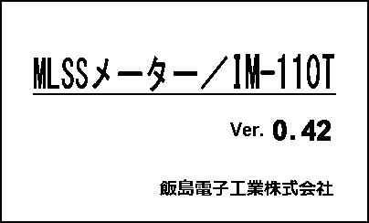
<sub>起動画面</sub>

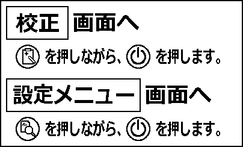
<sub>操作説明画面</sub>

### 2.2 測定画面 共通動作

<sub>実装: MEASURE（MSR_1〜7、MSR_10/11）／描画 `disp_MLSS_Meas_2`（測定中）, `disp_MLSS_Meas_3`（安定中ホールド）</sub>

測定画面は、測定値の安定を待つ**測定中画面**と、安定成立後に値を保持して記録操作を受け付ける**安定中（ホールド）画面**の 2 つで構成される。描画関数は 1 本で MLSS／SS／透視度を `Meas_Mode` 分岐により共用する（関数名の「MLSS」は流用元由来の名称）。モード別の主表示は §2.3〜2.5 に示す。

**共通の表示要素**

- 電池残量アイコン（右上、残量 0〜3 の 4 段階。約 500ms 周期で更新）と日付時刻。
- 測定中画面: 測定中を示す矢印アイコン（`icon_wait1`/`icon_wait2` を約 1Hz で交互表示）と、画面下端の安定進捗バー。画面左下に履歴（DISP）スイッチ＋「履歴」の操作案内。
- 安定中画面: 画面左列に上から 履歴（DISP）＋「履歴」／記録（MEM）＋「記録」／記録（MEM）＋「長押しで校正記録」の 3 段の操作案内。測定履歴の記録完了時は「記録」の段が「記録 完了」に、後校正記録の完了時は「長押しで校正記録」の段が「記録 完了」に置き換わる（安定解除時は「解除 完了」）。

**安定判断**（`check_stable`、全モード共通）

- 成立（入り）: 監視窓 10 秒内の測定値の全幅が測定値の 10% 以下（下限フロア: MLSS 50mg/L／SS 5mg/L／TR 1.0〜2.0cm）。
- 解除（出）: 表示値（ホールド値）±5%（下限フロア: MLSS 50mg/L／SS 5mg/L／TR 2.0cm）を外れたとき。解除すると測定中画面へ戻る。
- 安定中の表示値（ホールド値）は 3 秒間隔で現在値に更新する。解除の基準もこの値のため、ゆっくりした変動では解除されず、3 秒内に ±5% 動いたときに解除される。

**プローブ無応答**

プローブが無応答・切断となり測定値の鮮度が切れた場合（`Probe_Data_Valid` 偽）、測定中画面の主表示欄を「----」に置き換える（進捗バー・操作案内は表示継続）。ホールド画面には適用しない（捕捉済みの結果を消さないため）。

**スイッチ操作（測定画面共通）**

- 記録（MEM）スイッチ 短押し（安定中。離した時点で確定）: 測定値を測定履歴（各モード 30 件、§2.9）へ記録する。記録完了表示を約 2 秒保持して安定中画面へ戻る。
- 記録（MEM）スイッチ 長押し（安定中）: 測定値と記録時の生 mV を**後校正記録**（種別ごと 3 件リング、EEPROM page16〜18。付録B）へ記録する。最下段に「記録完了」を約 3 秒表示して安定中画面へ戻る。この記録が 2 点／3 点校正の後校正値選択（§3.7）の対象になる。
- いずれの記録も EEPROM 書込失敗時は本体故障エラー（ERROR6、本体エラー番号 94。§7）を表示する。
- 履歴（DISP）スイッチ 短押し: 測定履歴表示（§2.9）へ。
- 履歴（DISP）スイッチ 長押し: 測定モード選択（§2.6）へ（画面に案内表示は無い）。


<sub>安定中 測定履歴の記録完了（MLSS）</sub>

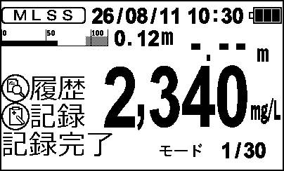
<sub>安定中 後校正記録の記録完了（MLSS）</sub>

### 2.3 MLSS測定

<sub>実装: `disp_MLSS_Meas_2/3` の MLSS 分岐</sub>

- タイトル「MLSS」。測定値は 10mg/L 単位に丸めて表示する。1000〜9999mg/L はカンマ区切り 4 桁＋「mg/L」、10000mg/L 以上は g/L 形式（例 10.0、分解能 0.1g/L）＋「g/L」、1000mg/L 未満は整数＋「mg/L」。
- 測定値が無効（FLT_MAX）・20000 以上・-99 以下のときは主表示欄を白塗り点滅させる。
- 相関式のモード番号を「モード N /30」形式で表示する（N = 選択中相関式 No.）。
- **界面機能**: 界面判断バー（瞬時 MLSS ÷ 界面しきい値を 0〜100% 超で表示）、現在水深（小サイズ、m）、界面深度ホールド値（中サイズ、m）を併記する。界面深度ホールドは、瞬時 MLSS が界面しきい値（§2.8）を下から上へ越えた瞬間の水深を捕捉した値で、未捕捉のときは「-.--」を定常表示する。

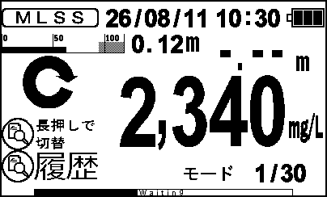
<sub>MLSS 測定中（界面バー・現在水深・界面深度ホールド未捕捉）</sub>

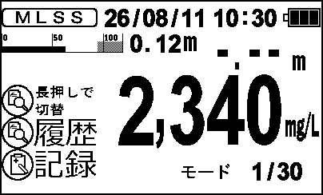
<sub>MLSS 安定中（記録待ち）</sub>

### 2.4 SS測定

<sub>実装: `disp_MLSS_Meas_2/3` の SS 分岐</sub>

- タイトル「SS」。測定値は整数 mg/L で表示する（表示は 1000／-99 でクランプ）。
- 測定値が無効（FLT_MAX）・1000 以上・-99 以下のときは白塗り点滅させる。
- SS は相関式 No. を持たないため「モード /30」表示は無い。水深も表示しない。

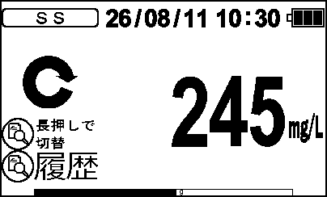
<sub>SS 測定中</sub>

### 2.5 透視度測定

<sub>実装: `disp_MLSS_Meas_2/3` の TR 分岐</sub>

- タイトル「透視度」。測定値は小数第 1 位まで cm で表示する。
- **100cm 超**: 点滅させず 100.0 の頭打ち表示とし、矢印アイコンの位置にレンジオーバー固定アイコン（OVER）を表示する（清水中は理論上 100cm 超のため安定して 100.0＋OVER となる）。
- **0cm 以下**（空中・暗すぎ等で演算が負に発散した場合）: 数値でなく「-.-」を点滅なしで常時表示する。0＜値＜2.0cm は実値を表示する。
- 無効（FLT_MAX）のときのみ白塗り点滅させる。
- 透視度は相関式 No. を持たないため「モード /30」表示は無い。水深も表示しない。

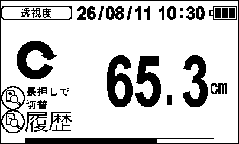
<sub>透視度 測定中</sub>

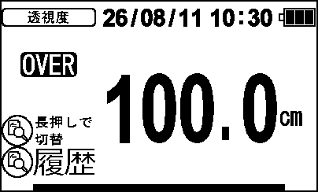
<sub>透視度 100cm 超（100.0＋OVER）</sub>

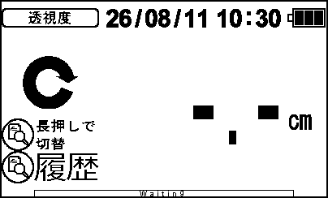
<sub>透視度 0cm 以下（-.- 表示）</sub>

### 2.6 測定モード選択

<sub>実装: M_CHANGE（M_CHANGE_1〜4）／描画 `disp_M_CHANGE`</sub>

測定画面で DISP 長押しすると測定モード選択画面へ入る。

- 「MLSS」「SS」「透視度」の 3 択。DISP=選択移動（3 つを循環）、MEM=決定。中止経路は無い。
- 決定すると ADC の有効チャネルをプローブへ設定（MLSS=ch1,2／SS・透視度=ch3,4）し、安定判断をリセットして対応する測定履歴バンクを読み込む。
- **MLSS を決定した場合は先に相関式選択（§2.7）を表示し、それを抜けてから「MLSSに設定しました」の確定メッセージを約 3 秒表示して**測定画面へ戻る。SS／透視度は決定直後に確定メッセージ（「SSに設定しました」等）を表示して測定画面へ戻る。
- 校正・設定はここからは入れない。電源 ON 時のスイッチ押下起動（§1.2）で入る。

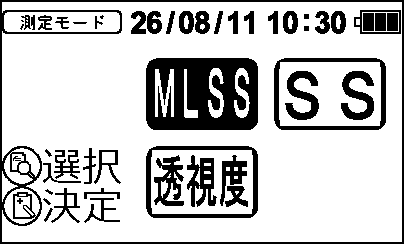
<sub>測定モード選択（MLSS／SS／透視度）</sub>

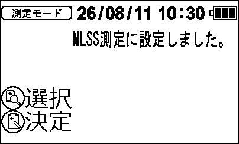
<sub>確定メッセージ「MLSSに設定しました」</sub>

### 2.7 相関式選択

<sub>実装: S_CORR（S_CORR_1〜3）／描画 `disp_Corr_setting_30`</sub>

MLSS の相関式 No.（01〜30）を 2 桁のインクリメント入力で選択する。No.1〜20 は固定係数（傾きゲイン切替、校正不可）、No.21〜30 は校正可能な独立式である（付録C）。測定モード選択（§2.6）で MLSS を決定すると本画面が続けて表示される。

- 大サイズ 2 桁で相関式 No. を表示し、編集中の桁を反転点滅させる。入力は 01〜30 に制限される（十の位が 3 のとき一の位は 0 固定、00 は 01 に矯正）。
- 下段に、入力中の相関式で計算した MLSS 試算値（10mg/L 単位）を表示する。プローブ無応答時は「----」。
- **数値設定系の共通操作**（§2.8・§3.3・§3.4・§5.5 の設定値入力画面と共通）: MEM=次の桁へ（最終桁の次は先頭桁へ戻るループ）、DISP 短押し=編集中の桁の数値を +1、**DISP 長押し=確定して元の画面へ戻る**。破棄・中止の経路は無い。画面左列の案内は上から DISP＋「長押しで戻る」／DISP＋「切替」／MEM＋「次へ」。
- 確定すると相関式選択を EEPROM（page12）へ保存し、相関式が変わった場合は次回の校正開始種別をゼロ校正へ戻す。その後「MLSSに設定しました」の確定メッセージ（§2.6）を経て測定画面へ戻る。

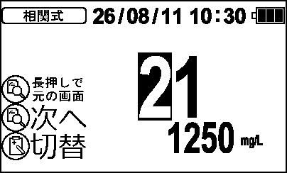
<sub>相関式選択（2桁入力・試算値付き）</sub>

### 2.8 界面しきい値設定

<sub>実装: D_SET（D_SET_1〜3）／描画 `disp_Depth_Setting`</sub>

界面深度ホールド（§2.3）の判定に使う界面しきい値（`Interface_Threshold`、mg/L）を設定する。設定メニュー（§4.1）の「界面しきい値設定」から入る。

- しきい値を整数 5 桁の大サイズ数字で表示し、編集中の桁を反転点滅させる。
- 操作は数値設定系の共通操作（§2.7）: MEM=桁送り（ループ）、DISP 短押し=数値 +1、DISP 長押し=確定して設定メニューへ戻る。画面左列の案内は「長押しで元の画面」「切替」「次へ」。
- 確定した値は EEPROM の界面測定設定ページ（page5）に保存される。

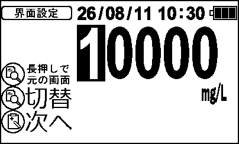
<sub>界面しきい値設定</sub>

### 2.9 測定履歴表示

<sub>実装: DISPHIS／描画 `disp_DISPHIS`</sub>

現在の測定モードの測定履歴（各モード 30 件、付録B）を新しい順に 3 件ずつ表示する。各行は番号・時刻・月日と、測定値・単位、（MLSS のみ）水深である。

- 測定値の表示形式はモード別: MLSS = 5 桁整数（9999 以下は 10mg/L 単位、10000 以上は 100mg/L 単位に丸め）、SS = 4 桁整数（1000／-99 クランプ）、透視度 = 2.0〜100.0cm 小数第 1 位。単位アイコンもモード別（mg/L／cm）。
- SS・透視度は水深を扱わないため、水深は表示せず記録も 0 固定である。
- MEM=次の 3 件へ送り、DISP 短押し=測定画面へ戻る、DISP 長押し（先頭 3 件表示中のみ）=全件消去（消去確認表示を経て実行）。

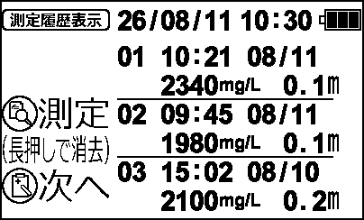
<sub>測定履歴表示（MLSS）</sub>

---

## 3. 校正

### 3.1 校正起動と校正メニュー

<sub>実装: CALDSP／C_MENU／C_MODE／描画 `disp_C_MENU`, `disp_CAL_SETTING`</sub>

校正モードへは**記録（MEM）スイッチを押しながら電源 ON** で入る。起動画面の後、まずゼロ校正（§3.2）の待機画面となる。校正メニューへはゼロ校正等の画面から DISP 長押しで移る。

**校正メニュー**

- 「ゼロ校正」「2点校正」「3点校正」「校正リセット」の 4 項目を表示する。ただし**透視度モードでは「3点校正」を表示せず選択もスキップする**（透視度の校正は清水ゼロ＋スパン 1 点の k 方式のため。§3.5）。
- DISP 短押し=選択移動、MEM=決定、DISP 長押し=前の画面へ戻る。

**校正モード選択**（C_MODE、`disp_CAL_SETTING`）は「ゼロ校正」「2点校正」「3点校正」を縦に並べた選択画面で、校正種別の切替に用いる。

MLSS で選択中の相関式が校正不可（No.1〜20）の場合、実施できる校正はゼロ校正のみである（2点・3点校正の選択肢を表示しない）。

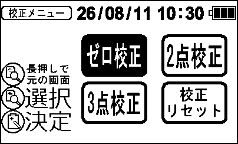
<sub>校正メニュー（MLSS/SS: 4項目）</sub>

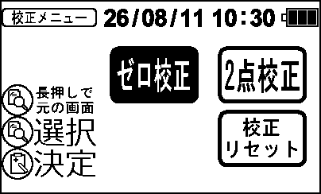
<sub>校正メニュー（透視度: 3点校正なし）</sub>

### 3.2 ゼロ校正

<sub>実装: ZCAL（ZCAL_1〜9）／描画 `disp_MLSS_ZCal_2`（校正中）, `disp_MLSS_ZCal_3`（待機・完了）</sub>

清水中で測定値のゼロ基準（*_ZR、清水中受光 mV）を取り直す校正である。MLSS／SS／透視度共通の画面構成で、モード別の値表示規則は測定画面（§2.3〜2.5）と同じである（透視度は 100cm 超=100.0＋OVER、0cm 以下=-.-。校正中画面では OVER アイコンは待機アニメと位置が重なるため表示しない）。

- 待機画面: 現在の測定値と、MEM＋「長押しで校正開始」の案内を表示する。**MEM 長押し**で校正を開始する（MEM 短押しは何もしない）。DISP 長押しで校正メニュー（§3.1）へ移る。
- 校正中画面: 矢印アニメ・進捗バーを表示し、安定を待つ。MEM=中止。制限時間（60 秒）内に安定しない場合はセンサー不安定のエラー表示となる。
- 安定が成立すると、採用前に**妥当性チェック**を行う（MLSS/SS/透視度共通）:
  - **エラー No.2（出力低下）**: 新ゼロ候補が出荷時ゼロ×0.70 未満（優先判定。受光量低下＝寿命予告）。
  - **エラー No.1（前回ゼロとの差大）**: 新ゼロ候補と前回ゼロの差が前回ゼロの 10% 超。
  - いずれも係数不変・校正不成立でエラー画面（§7）を表示し、ゼロ校正画面へ復帰する。
- チェック通過で新ゼロを採用し、校正完了メッセージを表示する。

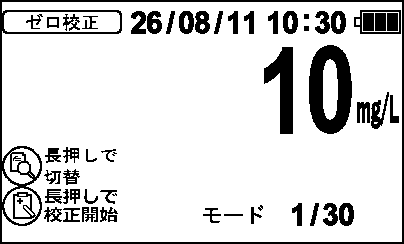
<sub>ゼロ校正 待機（MEM 長押しで開始）</sub>

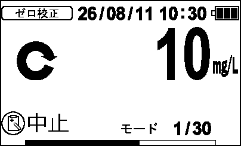
<sub>ゼロ校正 校正中</sub>

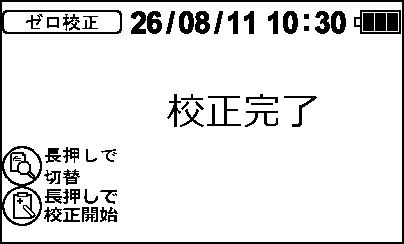
<sub>校正完了</sub>

### 3.3 2点校正（スパン）

<sub>実装: ADCAL（ADCAL_1〜9）／C_S_SET／描画 `disp_MLSS_SCal_1`（設定値入力）, `disp_MLSS_SCal_2`（校正中）, `disp_MLSS_SCal_3`（待機・完了）</sub>

上限側の基準液で測定値を合わせる校正である。ゼロ点とスパン点の 2 点で校正式を作る（中間点は破棄され直線となる。式の詳細は付録A）。

**待機画面**: 上段に現在の測定値、中段にスパン校正設定値、（MLSS）下段に相関式 No. を表示する。画面左列の案内は上から DISP＋「設定」／MEM＋「校正開始」／MEM＋「長押しで後校正選択」の 3 段。

- DISP 短押し: 設定値入力画面へ。
- DISP 長押し: 校正メニュー（§3.1）へ。
- **MEM 短押し（離した時点で確定）: 安定判断校正を開始する。**
- **MEM 長押し: 後校正値選択（§3.7）へ。**後校正記録が 0 件のときは待機画面に留まる。

**設定値入力画面**: 上段に現在の測定値、中段に校正設定値を桁ごとに表示し、編集中の桁を反転点滅させる。桁数と範囲はモード別（MLSS=5 桁／SS=4 桁 0001〜2000／透視度=4 桁＋小数点 000.1〜200.0）。操作は数値設定系の共通操作（§2.7）で、DISP 長押しで確定して待機画面へ戻る。

**安定判断校正**（MEM 短押し）: 校正中画面で基準液中の安定を待つ（安定判断は開始時点からやり直す）。表示（矢印アニメ・進捗バー）・MEM=中止（待機画面へ）・60 秒タイムアウト（センサー不安定＝演算エラー No.3）はゼロ校正と同様。安定が成立すると、その時点の生 mV（移動平均。後校正記録と同じ 0.1mV 量子化）をスパン点として捕捉点ストアへ記録し、ゼロ点との 2 点で係数を再計算する。演算は後校正（§3.7）と共通で、成立すると校正完了メッセージを約 3 秒表示して待機画面へ戻る。演算不成立は演算エラー（No.3）を表示する。

**完了画面**の操作は待機画面と同じ（MEM 短押し=安定判断校正のやり直し／MEM 長押し=後校正値選択／DISP 短押し=設定値入力／DISP 長押し=校正メニュー）。

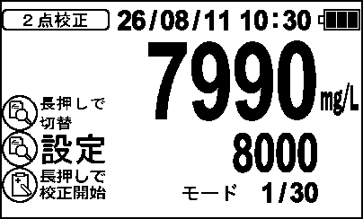
<sub>2点校正 待機（設定／校正開始／長押しで後校正選択）</sub>

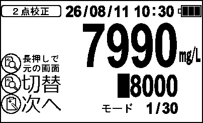
<sub>2点校正 設定値入力（編集桁反転）</sub>

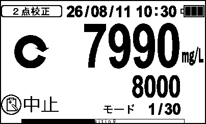
<sub>2点校正 校正中（安定判断校正）</sub>

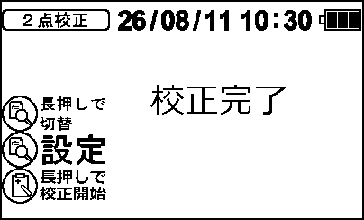
<sub>2点校正 校正完了</sub>

### 3.4 3点校正（中間）

<sub>実装: MCAL（MCAL_1〜9）／C_M_SET／描画 `disp_MLSS_SCal_1`（中間濃度設定、タイトル「3点校正」）, `disp_MLSS_MCal_2`（校正中）, `disp_MLSS_MCal_3`（待機・完了）</sub>

ゼロとスパンの中間の基準液で中間点を取り、2 次の校正式にする校正である。**MLSS（No.21〜30）と SS のみ**実施できる（透視度は 3 点校正なし）。保存済みのスパン点はそのままに中間点だけを取り直す（スパン点は捕捉点ストアの保存値＝前回の 2 点校正の点を使う。スパン点が未捕捉なら演算エラー No.3 となるため、先に 2 点校正を行う）。

画面構成・操作は 2 点校正（§3.3）と同じ（MEM 短押し=安定判断校正で中間点を採用／MEM 長押し=後校正値選択で中間点を採用／DISP 短押し=中間濃度設定／DISP 長押し=校正メニュー）。

- 中間濃度設定画面（DISP 短押しで遷移）: タイトル「3点校正」で、**中間濃度（SetVal_2、初期 MLSS 4000／SS 500）のみ**を設定する（スパン設定値は 2 点校正の設定値入力画面の管轄）。桁数・操作は 2 点校正の設定値入力と同じ（MLSS=5 桁／SS=4 桁 0001〜2000）。

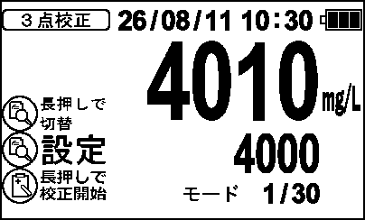
<sub>3点校正 待機</sub>

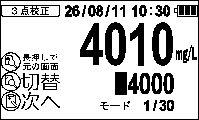
<sub>3点校正 中間濃度設定</sub>

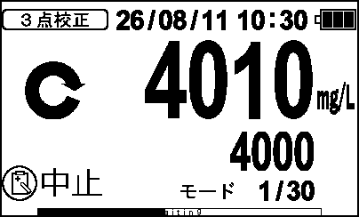
<sub>3点校正 校正中</sub>


<sub>3点校正 校正完了</sub>

### 3.5 透視度の校正

透視度の現場校正は「**清水ゼロ ＋ スパン 1 点の k 傾き算出**」方式である。

- ゼロ校正（§3.2）: 清水中の受光 mV でゼロ基準 TR_ZR を取り直す。
- 2点校正（§3.3）: 標準液 1 点で k = 設定値 ÷ 実測値 を算出し、スパン係数を SP_A=0／SP_B=k／SP_C=0 とする（実質比例補正）。k には 0.7〜1.3 のガードがあり、範囲外は係数不変で演算エラー（No.3）を表示する。
- カーブ形状（4 点 3 次式）は出荷時調整だけが持ち、現場はゼロ＋k のドリフト補正のみを行う（付録A）。3 点校正のメニューは表示されない。

### 3.6 校正リセット

<sub>実装: C_RESET／描画 `disp_C_RESET`</sub>

現場校正を破棄して出荷時調整状態へ戻す。実行内容（`Calib_Reset_Current`）:

- ゼロ点: 現場ゼロ（*_ZR）へ出荷時枠（*_ZR_Ship）をコピー。
- 中間・フル点: 現場スパン校正の捕捉点をクリア。
- スパン補正式: SP 係数を恒等（A=0, B=1, C=0）へ。
- MLSS は選択中の相関式で対象が変わる: No.1〜20（ゼロ校正のみ可）=ゼロ点のみ、No.21〜30 = 3 点フルリセット。SS／透視度は常に 3 点フルリセット。
- 出荷時側（ZR_Ship・ベースカーブ・出荷時 3 点）には触れない。

画面には確認メッセージと、MLSS で校正可能相関式（No.21〜30）選択中の場合のみ「相関式No.」と番号を表示する。DISP=戻る、MEM=実行。実行後は完了メッセージを表示して戻る。なおタイトルアイコンは設定メニューの初期化画面（§4.3）と共通の「初期化」（`t_reset`）である。

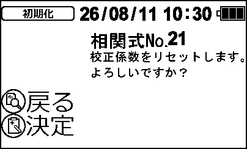
<sub>校正リセット確認（MLSS No.21 選択中）</sub>

### 3.7 後校正

<sub>実装: CAL_HSEL（CAL_HSEL_1〜3）／描画 `disp_CAL_HSEL`</sub>

**後校正記録**（測定安定中の MEM 長押しで残す専用記録。記録時の測定値と生 mV を保持する。§2.2）を使って、後からスパン点（2 点校正）または中間点（3 点校正）を取り直す機能である。参照するのは後校正記録のみで、測定履歴（30 件）は使わない。

- 後校正値選択画面（タイトル `t_pcal_select`）: 現在の測定モードの後校正記録を新しい順に最大 3 件表示し、選択中の行番号を点滅させる。各行の表示形式は測定履歴（§2.9）と同じ（MLSS は水深欄を持つが、後校正記録は水深を保存しないため 0.0 と表示される）。
- DISP 短押し=決定（選択した記録の生 mV で校正演算へ）、MEM=次の記録へ（末尾の次は先頭へ）、DISP 長押し=校正の待機画面へ戻る。画面左列の案内は DISP＋「決定」／MEM＋「次へ」。
- 記録が 0 件のときは選択画面に入らず、校正の待機画面に留まる。
- 校正演算は記録時の生 mV から行う（温度補正は適用しない。付録A）。成立すると校正完了メッセージを約 3 秒表示して待機画面へ戻る。

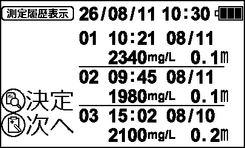
<sub>後校正値選択</sub>

### 3.8 校正値の保存

校正確定時に即時のフラッシュ書込は行わない。校正・調整で更新された係数は本体 RAM（グローバル変数群）に反映され、**電源 OFF 時の一括書戻し**（§8）でプローブフラッシュ（最終真実源）と本体 EEPROM 控えへ永続化される。したがって**正規の電源 OFF を経ない電池抜きでは校正が失われる**。

---

## 4. 設定

### 4.1 設定起動と設定メニュー

<sub>実装: SETDSP／MENU1／描画 `disp_S_MENU`</sub>

設定モードへは**履歴（DISP）スイッチを押しながら電源 ON** で入る。起動画面の後、設定メニューを表示する。

- 項目は「時刻設定」「初期化」「製品情報」「界面しきい値設定」の 4 つ（2 行 2 列）。選択中の項目は反転点滅する。
- DISP 短押し=選択移動（循環）、MEM=決定、DISP 長押し=測定画面へ戻る。
- 「界面しきい値設定」は §2.8 の画面へ遷移する。

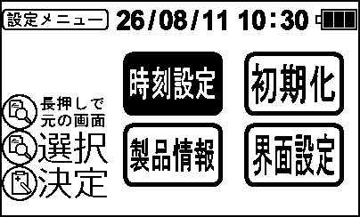
<sub>設定メニュー</sub>

### 4.2 時刻設定

<sub>実装: SETTIME／SETYEAR／SETDAYS／SETHOUR／描画 `disp_SETTIME` ほか</sub>

現在時刻の確認と分単位の修正を行う入口画面である。中央に年月日と時：分を表示し、「＋」「－」「セット」「中止」を DISP=選択・MEM=決定で操作する。

- 「＋」「－」: 分を 1 増減する（長押しで 10 増減。59↔0 で時が繰り上げ／繰り下げ。日には波及しない）。
- 「セット」: 表示中の時刻を RTC へ書き込み設定メニューへ戻る。「中止」: 書き込まずに戻る。

年・月日・時分を桁単位で設定する画面（SETYEAR／SETDAYS／SETHOUR）は基板調整モードの日時設定と共通実装である（§5）。

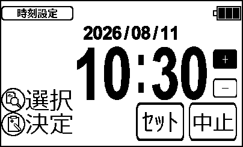
<sub>時刻設定</sub>

### 4.3 初期化

<sub>実装: RESET／描画 `disp_RESET`</sub>

初期化の対象は以下の 4 項目である。**校正・調整係数、測定履歴、時刻には触れない。**

| 対象 | 変数 | 初期値 | 永続化先 |
|---|---|---|---|
| 測定モード | `Meas_Mode` | MLSS（`MEAS_MODE_MLSS`） | page12（`eep_write_setting`） |
| 相関式選択 | `MLSS_MODE` | 内部値 0 ＝ 相関式 No.1（`INI_MLSS_MODE`） | page12（同上） |
| 界面しきい値 | `Interface_Threshold` | 8000 mg/L（`INI_INTERFACE_THRESHOLD`） | page5（同上） |
| ガイダンス表示フラグ | `guide_disp_flag[]` | 全クリア（＝表示する） | page4（`eep_write_info`、電源 OFF 時に無条件） |

SS/透視度の相関式（`SS_MODE` / `TR_MODE`）は相関式 No. の概念が無く `EEP_CF_BASE_IDX` 固定のため対象外。DISP 押下で「以後は非表示」にしたガイダンス（§6）は、このクリアで表示復活する。

- 確認メッセージを表示し、DISP=戻る、MEM=実行。実行後は完了メッセージを一定時間表示してメニューへ戻る。
- 初期化した値は電源 OFF 時に EEPROM へ書き込まれる（`Req_SetupData_Write`）。プローブの ADC チャネルマスクは次回起動時の `Change_Meas_Mode` で揃うため、初期化時にプローブへは何も送らない。

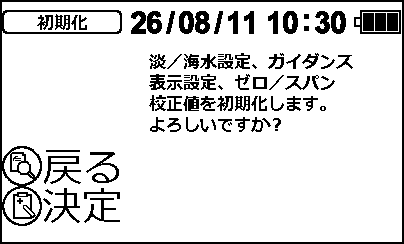
<sub>初期化 確認（DISP=戻る／MEM=実行）</sub>

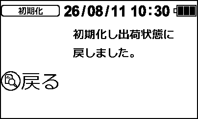
<sub>初期化 完了（一定時間表示後に自動で設定メニューへ戻る）</sub>

### 4.4 製品情報

<sub>実装: QR／描画 `disp_QR`</sub>

製品情報として最新エラー番号（エラー履歴、§7）を表示する。DISP=設定メニューへ戻る。

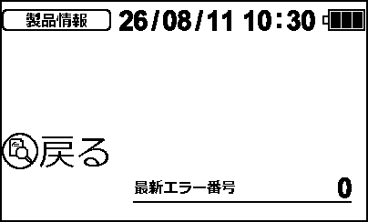
<sub>製品情報（最新エラーNo.）</sub>

---

## 5. 基板調整（ADBOAD）

<sub>実装: ADBOAD（PRGVER／EEPTEST／BATVOL／LOWRANGE0帯＝プローブ調整／SETYEAR／SETDAYS／SETHOUR）／`Adjust.c` の状態遷移・`IM_110.c` の調整演算</sub>

### 5.1 概要

基板調整モード（ADBOAD）は、製造時にプローブ基板の光学系・アナログ系を調整し、出荷時の基準となる係数を確定するための専用モードである。通常の測定・校正モードからは到達できない。仕様の真実源は `docs/adboad.md`。

本モードで確定する係数は「出荷時調整係数」であり、現場でユーザーが実施する校正（§3）とは独立に保持される。現場校正をいくら実施しても出荷時調整係数は書き換わらず、校正メニューの「校正リセット」（§3.6）で出荷時調整の状態へ復帰できる。

**起動方法**: 電源投入時に本体 CN2 の `PC4_nTEST_in` 端子が LOW（調整治具ケーブル接続）であることを検出すると ADBOAD で起動する。あわせて `use_UART_flag` が立ち、CN2 経由の UART デバッグコマンド（§5.11）が使用可能になる。同端子は読み取り直前に内部プルアップへ設定してフロート誤読を防いでいる。

**画面構成と操作の原則**: ADBOAD は 30 画面で構成し、操作は全画面共通である。

- 履歴（DISP）スイッチ短押し: 次の画面へ進む（廃止画面は読み飛ばす）。最終画面（30）の次は先頭（01）へ戻る。
- 記録（MEM）スイッチ短押し: 表示中の画面の調整を実行する。
- 履歴（DISP）スイッチ長押し: 出荷時調整の濃度点画面（17/18/20/21/23/24/25）に限り、基準器設定値の入力画面へ遷移する（これらの画面は左列最上段に「長押しで設定変更」を表示する）。

画面番号は `adboad.md` の項目番号に一致する。内部的には画面 4〜27 を `operation_mode = LOWRANGE0 | idx`（idx = 画面番号 − 4、`ADB_SCR_COUNT` = 24）の 1 スロットで管理し、画面 1〜3 と 28〜30 は個別の状態値を持つ。

**画面フローと廃止画面**: 次の画面は仕様廃止により画面フローから除外されており、DISP 遷移で読み飛ばされて到達しない（実装は残置）。

| 画面 | 名称 | 除外の理由 |
|---|---|---|
| 05/06/08/09 | 空中AD調整 | 空中 1450mV 正規化（SADS）の廃止による。正規化を行わないためプローブ出力は生の mV となり、1mV の重みが ch 間・個体間で揃う |
| 11/14 | Ref 温度補正 20℃ | 画面 04/07 の LED PWM 調整の収束時に 20℃ 点を捕捉するため不要 |
| 26 | 水深 出荷時ゼロ調整 | 水深のゼロ基準は電源投入時の大気圧を自動取得するため不要 |

到達可能な画面は 01〜04、07、10、12、13、15〜25、27〜30 の 23 画面である。

画面の遷移は原則番号順だが、Ref 温度補正の 4 画面のみ、恒温水槽の出し入れを最小にするため温度優先の **10（MLSS 5℃）→ 13（SS 5℃）→ 12（MLSS 35℃）→ 15（SS 35℃）** の順で遷移する（§5.4）。

**調整の推奨順序**（係数の依存関係による）

1. 画面 04/07（LED PWM 調整）— 20℃清水中で受光量を収束させ、同時に温度補正の 20℃基準点を捕捉する。以降の全調整の前提のため最初に実施する。
2. 画面 10/13/12/15（Ref 温度補正）— 5℃の清水中で MLSS・SS を続けて捕捉し、次に 35℃で同様に捕捉する（画面フローもこの温度優先順）。
3. 画面 16/19/22（出荷時調整 清水）— 各種別のゼロ点を確定する。
4. 画面 17/20、18/21（MLSS/SS スパン・中間）、23/24/25（透視度 90/60/30cm）— 基準液で濃度点を確定する。
5. 画面 27（水深スパン調整）— 6.00m 相当の気圧環境で水深の傾きを確定する。
6. 画面 28〜30（日時調整）— 内蔵時計を設定する。

**調整値の保存**: 調整で更新した係数は実行時点では本体の live 変数にのみ反映され、プローブフラッシュへの確定は電源切断時に一括して行う（§8。調整のたびに全ページを書くと約 2 秒の応答停止が生じるため）。**調整後は必ず電源スイッチで正常に電源を切ること**。確定前に電池を外すと調整値は失われる。UART コマンド `AWC` で任意時点の明示確定もできる。

### 5.2 画面01〜03 本体基板系

**画面01 プログラムVer.表示**（`disp_PRGVER`）: 本体 FW バージョンを大サイズ数字（小数第 2 位）で表示する。ADBOAD の先頭画面。DISP=次へ、MEM 長押し=エラー発生日・エラー番号の記録を消去（製造時試験のエラー履歴を出荷前に消すための機能）。

**画面02 EEPROM R/Wテスト**（`disp_EEP1`〜`3`）: 本体 EEPROM（M95256）の読み書き試験。MEM で開始し、全ページに 0xAA／0x55／0x00 の書込・ベリファイ 6 工程を実行して OK/NG を表示する。結果表示への移行時に初期パラメータを再設定する。

**画面03 電池電圧表示**（`disp_BATVOL`）: 電池電圧を小数第 2 位まで表示する。実行操作は無い。

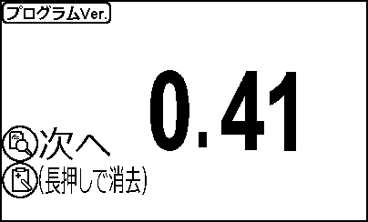
<sub>画面01 プログラムVer.表示</sub>


<sub>画面02 EEPROM R/Wテスト</sub>

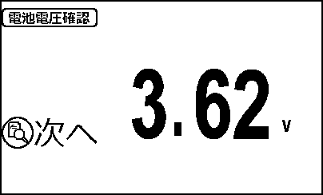
<sub>画面03 電池電圧表示</sub>

### 5.3 画面04/07 LED PWM調整（20℃温度点捕捉 兼用）

<sub>実装: 描画 `disp_ADBOAD_PROBE2` / 実行 `Adj_LED_Auto`, `Adj_TempC_Capture20_Inst`</sub>

MLSS 系統（画面 04、ch1・ch2）／SS 系統（画面 07、ch3・ch4）の LED 駆動 PWM デューティを調整し、あわせて温度補正の 20℃基準点を捕捉する。**20℃の清水中にプローブを浸けて実行する。**

- 表示: 上段に受光（ch1/ch3）、下段に Ref（ch2/ch4）の瞬時値（mV）。瞬時値を用いるのは調整中の追従性のため（平均窓が効くと鈍る。隣接サンプルのばらつきは標準偏差 0.03mV 程度で表示は安定する）。
- MEM 押下で次を順に実行する:
  1. 対象 2ch のうち出力の大きい方が目標 1750mV（`LED_ADJ_TARGET_MV`）へ収束するよう、デューティを比例制御で最大 8 回更新する（`Adj_LED_Auto`。許容幅 ±30mV）。
  2. 収束した場合に限り、その時点の瞬時値から Ref・受光を温度補正の 20℃スロットへ捕捉する（未収束時は捕捉しない。移動平均はデューティ変更前の値を含むため使わない）。
  3. 収束時はプローブへ `WPP` を発行しデューティをプローブ側フラッシュへ保存する。
- 収束まで数秒〜十数秒を要し、実行中は待機アイコンを 0.5 秒周期で切り替える。

LED 駆動は TIM3 CH1 の 1 系統のみで、系統ごとにデューティ（`LED_Out[0]`=MLSS 系／`[1]`=SS 系）を保持し、A/D チャネルマスク（SADC）で切り替える。透視度は SS と同じ ch3 を共用するため、画面 07 の調整が透視度の受光量も決定する。

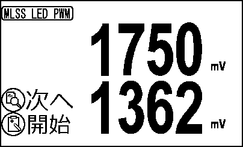
<sub>画面04 MLSS LED PWM調整</sub>

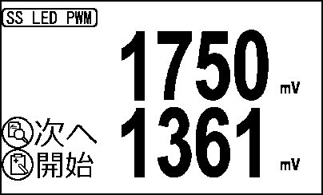
<sub>画面07 SS LED PWM調整</sub>

### 5.4 画面10/12/13/15 Ref 温度補正（5℃・35℃）

<sub>実装: 描画 `disp_ADBOAD_PROBE2` / 実行 `Adj_TempC_Capture`</sub>

%温度補正（付録A）の捕捉点を取得する。画面 10/12 が MLSS の 5℃／35℃、画面 13/15 が SS の 5℃／35℃である。**当該温度付近の清水中で実行する。**

画面フローは恒温水槽の出し入れを最小にするため温度優先で、**10（MLSS 5℃）→ 13（SS 5℃）→ 12（MLSS 35℃）→ 15（SS 35℃）** の順に遷移する。同じ温度の水槽に浸けたまま MLSS・SS を続けて捕捉し、水槽の移動は 5℃→35℃ の 1 回で済む。

- 表示は画面 04 と同じ受光／Ref の 2 値（mV）。
- MEM 押下で、その時点の Ref・受光の mV を該当温度スロットへ捕捉する。捕捉点そのものがランタイム係数として機能するため、フィット計算は行わない。単一の点だけの後日取り直しも可能である。
- 20℃点は画面 04/07 で捕捉済みのため、本系統で取得するのは 5℃と 35℃の 2 点である。
- 温度差が不十分な捕捉（Ref 差 10mV 未満）は傾き 0＝補正なしに落ち、0 除算やノイズ幅の過大補正は起きない。
- 透視度は SS の補正結果を流用するため、透視度専用の温度補正点は存在しない。

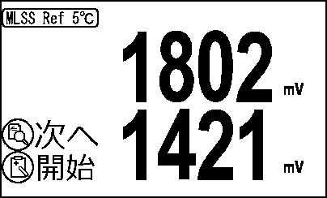
<sub>画面10 MLSS Ref 温度補正 5℃</sub>

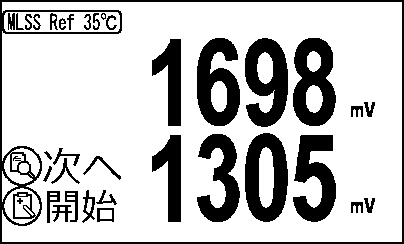
<sub>画面12 MLSS Ref 温度補正 35℃</sub>

### 5.5 出荷時調整の共通仕様（画面16〜25）

<sub>実装: `Adj_ShipPoint`（`IM_110.c`）</sub>

画面 16〜25 は MLSS・SS・透視度の出荷時調整係数を確定する。設計の考え方は次のとおりである。

**調整係数は常に存在する（常設モデル）。** 各種別の係数（受光 mV＋設定値の組）が常時存在し、新品時から既定式と自己整合する初期値が入っている。「点が無い」状態は存在しない。

| 係数 | 内容 | 初期値（MLSS / SS / 透視度） |
|---|---|---|
| ゼロ | 0 とする受光 mV | 1750mV（3 種別とも） |
| スパン | スパン設定値とする受光 mV＋設定値 | 8000 / 1000 / —（透視度は 90cm 点） |
| 中間 | 中間設定値とする受光 mV＋設定値 | 4000 / 500 / —（透視度は 60・30cm 点） |

**1 係数ずつ、任意の順序で実施できる。** MEM 押下でその画面の係数だけを現在の受光 mV で置き換え、**常に全点から式を再計算**して即座に反映する。吸光度は再計算のたびに現在のゼロ係数から導出するため、どの係数をどの順に単独実施しても整合する。

**受光 mV は温度補正後の値で捕捉する。** ゼロ点・各濃度点とも補正後 mV で一貫させることで、20℃以外の環境で調整しても 20℃相当の係数となる。

MLSS/SS の各画面の実行時動作:

- ゼロ実行（16/19）: ゼロ係数を置換して再計算。清水中であれば表示は直ちに 0 になる。
- スパン実行（17/20）: スパン係数を置換し、あわせて中間係数を「吸光度でスパンの 1/2」の位置（mV ではゼロ点とスパン点の相乗平均）・設定値 1/2 に再設定する。結果として式は実質 1 次式となる。したがってスパン点を取り直したら中間点も取り直す。
- 中間実行（18/21）: 中間係数のみを置換して再計算。式は 2 次式（曲線）となる。

**基準器設定値の変更**: 濃度点画面（17/18/20/21/23/24/25）では DISP 長押しで設定値入力画面へ遷移する。操作は数値設定系の共通操作（§2.7）: MEM=桁送り（最終桁の次は先頭桁へ戻るループ）、DISP 短押し=編集桁の数値 +1、**DISP 長押し=確定して元の画面へ**（中止経路は無い）。桁数はモード別（MLSS=5 桁／SS=4 桁 0001〜2000／透視度=4 桁＋小数点 000.1〜200.0）。画面左列の案内は「長押しで元の画面」「切替」「次へ」。設定値は係数と対で保存され（統合ストア Page16）、電源再投入後も保持される。


<sub>基準器設定値入力（画面17 MLSS スパン、5桁）</sub>

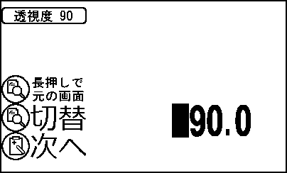
<sub>基準器設定値入力（画面23 透視度 90cm、4桁＋小数点）</sub>

### 5.6 画面16〜18 MLSS 出荷時3点調整

<sub>実装: 描画 `disp_ADBOAD_PROBE`（16）, `disp_ADBOAD_SHIP`（17/18）/ 実行 `Adj_ShipPoint`</sub>

- **画面16 清水**: 現在の MLSS 値（整数 mg/L）を表示する。MEM 押下で現在の受光 mV（温度補正後・移動平均）をゼロ係数として**現場枠と出荷時枠の両方**に設定し、3 点から 2 次式を再計算する（出荷直後は現場校正値＝出荷時値とする考え方。以後ユーザーのゼロ校正は現場枠のみを上書きし、校正リセットで出荷時枠へ復帰する）。
- **画面17 スパン（初期設定値 8000mg/L）／画面18 中間（4000mg/L）**: 上段に現在の MLSS 値（10mg/L 単位）、下段に基準器設定値を表示する。標準液にプローブを浸し、基準器の表示値を設定値として入力したうえで MEM を押すと、現在の受光 mV を当該係数として確定する。

確定した基準式は No.21〜30 の全スロットへ複写され、未調整スロットの初期値となる。

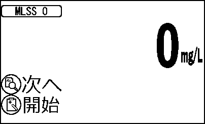
<sub>画面16 MLSS 清水</sub>

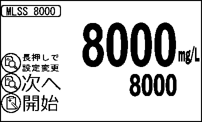
<sub>画面17 MLSS スパン</sub>

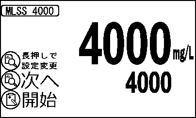
<sub>画面18 MLSS 中間</sub>

### 5.7 画面19〜21 SS 出荷時3点調整

動作は MLSS（§5.6）と同一で、対象が SS、初期設定値がスパン 1000mg/L・中間 500mg/L である点が異なる。SS は相関式番号を持たない単一式のため、確定した式は直ちに測定へ反映される。

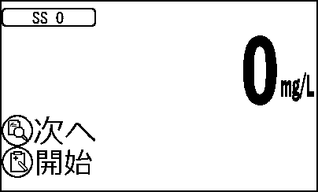
<sub>画面19 SS 清水</sub>

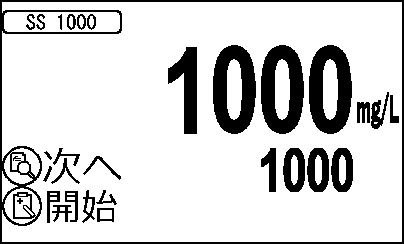
<sub>画面20 SS スパン</sub>

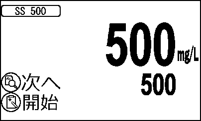
<sub>画面21 SS 中間</sub>

### 5.8 画面22〜25 透視度 出荷時4点調整（4点3次式）

<sub>実装: 描画 `disp_ADBOAD_PROBE`（22）, `disp_ADBOAD_SHIP`（23〜25）/ 実行 `Adj_ShipPoint`, `tr_refit_ship_poly`</sub>

透視度は清水（22）＋90cm（23）＋60cm（24）＋30cm（25）の **4 点 3 次式**で出荷時ベースカーブを確定する（付録A）。

**画面22 清水（ゼロ点）**: **20℃の清水中で実行する。** 現在の透視度（小数第 1 位、100cm 超は 100.0＋OVER）を表示する。MEM 押下で次を行う。

1. 現在の受光 mV（温度補正後）を透視度のゼロ係数として現場枠・出荷時枠の両方に設定する。
2. **清水そのものはフィット点として使用しない**（清水は減衰がなく理論上 100cm 超のため）。かわりに 100cm／90cm／60cm／30cm の 4 点を「新しいゼロ点から既定の mV 差分だけ下げた予想点」として設定する。差分は 3.7／4.2／6.7／14.9mV（既定ゼロ 1750mV と各点の既定 mV の差）である。
3. この 4 点から 3 次式 `透視度cm = Q0 + Q1·ABS + Q2·ABS² + Q3·ABS³` を厳密フィットする（`tr_refit_ship_poly`）。

予想点方式を採るのは、既定点が絶対 mV のままだと、LED PWM 収束許容幅（±30mV）内で実測ゼロが既定点を下回った個体で「基準液が清水より明るい」矛盾点となり、カーブが破綻するためである。

清水中は吸光度がほぼ 0 となり計算値は Q0（約 233cm）となって**安定して 100.0＋OVER を表示する**。100.0 を表示するのは受光がゼロ点から 3.7mV 低下した時点であり、100cm 点をゼロと同一にすると清水が境界に乗って 99↔OVER で揺れるため、意図的に余裕を設けている。既定・予想点は凸カーブ上にあるため Q3＜0 が保証され、空中・遮光では計算値が負に発散して測定画面では「-.-」表示となる。

**画面23 90cm／画面24 60cm／画面25 30cm**: 既知の透視度を持つ標準液で各点を実測に置き換える（初期設定値 90.0／60.0／30.0cm）。上段に現在の透視度、下段に基準器設定値を表示し、MEM で当該点を確定する。90cm 点は他の点と同じ常設モデルで、ストア Page15 に保存される。100cm 点に対応する実測画面は無く、予想点のまま運用する。

透視度の光学系は減衰が非常に小さく（60cm の試料でも清水から 7mV 程度の低下）、意味のある測定範囲はゼロ点から 15mV 程度に収まる。**動作確認には実際の試料水が必要であり、空気中や遮光による確認はできない。**

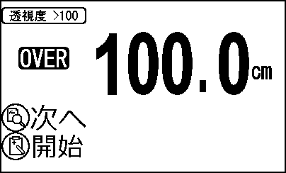
<sub>画面22 透視度 清水（100.0＋OVER）</sub>

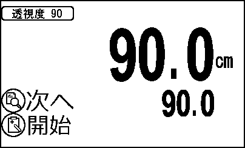
<sub>画面23 透視度 90cm</sub>

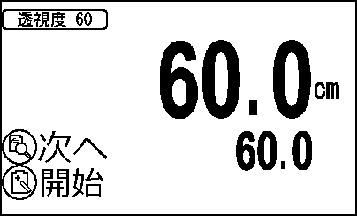
<sub>画面24 透視度 60cm</sub>

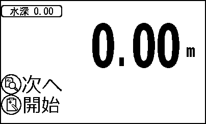
<sub>画面25 透視度 30cm</sub>

### 5.9 画面27 水深 出荷時スパン調整

<sub>実装: 描画 `disp_ADBOAD_PROBE` / 実行 `Depth_Calib_Span6m`</sub>

6.00m 相当の気圧環境で水深換算の傾きを確定する。現在の水深を小数第 2 位まで表示する。表示にはゼロクランプ前の値（`Depth_raw`、−0.99〜6.00 に制限）を用い、起動時基準からの負方向ドリフトを可視化する（測定画面の水深表示はゼロクランプを維持）。

MEM 押下で傾き `k_depth = 6.0 ÷（現在の気圧 − 電源投入時の気圧）` を算出して設定する（1 点による傾き校正）。水深のゼロ基準は電源投入時の自動取得のみで、ゼロ調整画面（26）は廃止されている。


<sub>画面27 水深 スパン調整</sub>

### 5.10 画面28〜30 日時調整

<sub>実装: 描画 `disp_SETYEAR`, `disp_SETDAYS`, `disp_SETHOUR`</sub>

内蔵時計（RTC）の年（28）・月日（29）・時分（30）を設定する。設定メニューの時刻設定（§4.2）と共通実装である。

- 編集前は DISP=次へ（次画面）・MEM=開始（編集開始）。一定周期で時計を読み直して表示を更新する。
- 編集中は DISP=選択（項目移動）・MEM=決定。「セット」で表示中の年月日時分を RTC へ書き込み、「中止」で破棄して編集前へ戻る。
- 年（28）は「＋」「−」一組で 1 年ずつ増減する（範囲 2019〜2050）。
- 月日（29）・時分（30）は各 2 桁×2 値の**桁ごと**に「＋」「−」を持ち、十の位=10・一の位=1 ずつ増減する。月は 1〜12、日は月とうるう年に応じた月末で丸め、時は 0〜23、分は 0〜59 に収まる。

画面 30 の編集前で DISP を押すと画面 01 へ戻り、ADBOAD の画面を一巡する。


<sub>画面28 日時調整 年</sub>


<sub>画面29 日時調整 月日</sub>

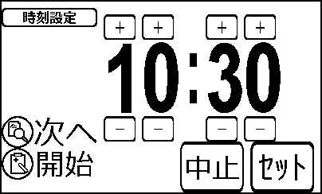
<sub>画面30 日時調整 時分</sub>

### 5.11 調整係数と保存先

ADBOAD で確定する係数の保存先は、プローブフラッシュの統合ストア（800B＝32B×25 ページ。付録D）である。本体 EEPROM には同一直列化形式の控えを保持する。

| 係数 | 確定する画面 | 保存先ページ |
|---|---|---|
| A/D スパン正規化 | 05/06/08/09（廃止） | Page1 |
| LED PWM デューティ | 04/07 | Page2 |
| 水深換算の傾き | 27 | Page3 |
| MLSS ゼロ（出荷時枠・現場枠） | 16 | Page4 |
| MLSS 1次演算式（基準式） | 16〜18 | Page5 |
| MLSS 相関式 No.21〜30 | 16〜18（全スロットへ複写） | Page6〜10 |
| SS ゼロ（出荷時枠・現場枠） | 19 | Page11 |
| SS 1次演算式 | 19〜21 | Page12・13 |
| 透視度 ゼロ（出荷時枠・現場枠） | 22 | Page14 |
| 透視度 90cm 点 | 22（予想点）／23（実測） | Page15 |
| 校正点設定値 | 各設定値入力画面 | Page16 |
| 出荷時3点調整 捕捉点 | 16〜25 | Page17〜19 |
| 温度補正 捕捉点 | 04/07/10/12/13/15 | Page23・24 |

透視度の 1 次演算式（3 次式係数 Q0〜Q3）は保存しない。ゼロ点（出荷時枠）と捕捉点（Page19＋Page15）が真実源であり、読み出し時に毎回再フィットする。点を真実源とすることで、ゼロ点変更時に式が自動的に整合する。

**出荷時枠と現場枠**: ゼロ係数のみ 2 枠を持つ。出荷時枠は ADBOAD の 16/19/22 でのみ書き換わり、現場校正では変化しない。現場枠はユーザーのゼロ校正で書き換わり、測定に使用するのはこちらである。16/19/22 の実行時は両枠に同じ値を設定し、校正リセット（§3.6）で現場枠を出荷時枠へ復帰できる。1 次演算式も、出荷時の基準式と現場のスパン補正式（SP）が分離されており、現場校正が出荷時の式を書き換えることはない。

### 5.12 UART デバッグコマンド

ADBOAD 起動中（`use_UART_flag` 有効時）は本体 CN2 経由の UART コマンドが使用できる。通信条件は **9600bps／8bit／パリティなし／ストップ 1bit**、行末 CRLF。実装は `LinkSerial.c`、詳細は `docs/protocol-adjust-uart.md`。

**プローブ透過中継（`P_` 系）**: `P_` に続けてプローブ用コマンドを送ると、本体は `P_` を除いた文字列をプローブへ転送し、以降 4 秒間はプローブの応答を PC へ透過中継する。本体⇔プローブ 38400bps と PC⇔本体 9600bps の速度非対称は内部 2KB バッファで吸収する。

| コマンド | 機能 |
|---|---|
| `P_VR` | プローブの製品名・FW バージョン取得（世代判別） |
| `P_MD` / `P_MDR` | 測定値 1 回送信／生 mV 取得 |
| `P_RPP` / `P_WPP` / `P_RPI` | Flash パラメータ一覧／保存／初期値リセット（RAM のみ） |
| `P_RPG` | 統合ストア全 25 ページを 16 進で転送 |
| `P_RPF` | 統合ストアを**新品既定値で初期化**（本体側グローバルも既定化される。調整全破棄のため注意） |
| `P_SP,<idx>,<duty>` / `P_SADC,<XXXX>` / `P_SADA,<N>` / `P_SID,<N>` | LED duty／有効 ch マスク／移動平均／Probe ID の直接設定 |
| `P_SADS,<N>` | 空中 span 記録（正規化廃止により通常は使用しない） |

**調整・確認コマンド（本体）**: 画面操作と同じ処理を呼ぶため結果は同一である。

| コマンド | 機能 | 対応画面 |
|---|---|---|
| `AMV` | 受光・Ref の mV、吸光度、1 次演算式出力、最終測定値を返す | — |
| `AMIR` | 統合ストアの状態（起動時ロード結果 BOOT、接続状態、EEP控え、主要係数、通信診断） | — |
| `RAD` | 統合ストア全係数の一括ダンプ（調整結果の確認に最有用。TR は Q0〜Q3・90cm 点を含む） | — |
| `RER` | エラー情報・本体情報（EEPROM page4）の一括読出 | — |
| `AST` / `AMODE,<0-2>` / `AEQ,<21-30>` | 状態表示／測定モード設定／相関式選択 | — |
| `ALDA,<duty>` / `ALD,<duty>` | LED デューティ自動調整（収束後保存）／手動設定（揮発） | 04/07 |
| `ATC` / `ATCF` | 温度補正点の捕捉／係数一式の明示 flash 確定 | 10/12/13/15 |
| `AZC` / `AZCS` / `AZRI` | ゼロ捕捉（現場枠のみ）／ゼロ捕捉（出荷時枠。透視度は画面 22 と同一処理）／現場枠を出荷時枠へ復帰 | 16/19/22 |
| `ACRI` | 相関式 No.21〜30 を出荷時基準式で初期化 | — |
| `AMC,<基準値>` / `AMCF` / `AMCU` / `AMD` / `AMR` | フィット点捕捉／出荷時基準式フィット／選択スロットフィット／点一覧／バッファリセット（MLSS/SS） | 17/18/20/21 |
| `AWD6` / `AWDS` | 水深スパン校正／水深デバッグ情報 | 27 |
| `AWC` | 実行時係数一式のプローブフラッシュへの明示確定 | — |
| `AAD0` | 空中 A/D 調整の一括実行（正規化廃止により通常は使用しない） | 05/06/08/09（廃止） |
| `MIGV` | 本体側の全校正係数を統合ストアへ手動書出 | — |

`AMCP`（透視度の累乗フィット）は透視度の 4 点 3 次式化により廃止されており、常に NG を返す。透視度の調整は画面 22〜25 または `AZCS` を用いる。

**保守コマンド（本体）**: `VR`（本体バージョン）／`BVR`（電池電圧）／`TR`・`TW`（RTC 読み書き）／`REP`（EEPROM ページ読出）／`EPT`（EEPROM 試験）／`IEP`・`SIP`（EEPROM 初期化）／`WAD`（基板調整パラメータ書込）／`CDG`（ガイダンスフラグリセット）／`AAS`（自動調整モード）／`ERR`（エラー画面の強制表示、§7）／`MD`（表示中の測定値を「日時,モード,表示値,受光mV,RefmV[,水深]」で返す。受光/Ref は移動平均後の値で小数 2 桁。表示規則どおりの丸め・クランプ、無応答時は「----」）／`SADA,<N>`（本体側 ADC 移動平均件数を 1〜255 に変更。0 は 1 に矯正。RAM のみで電源 OFF で既定 10 件へ戻る）／`OFF`（電源断）。

**プローブ FW 更新（`FUP`）**: プローブがケース固定で SWD（J4）を使えない場合に、本体経由の UART でプローブ FW を書き換える（手順詳細は `docs/fup-procedure.md`）。

1. PC を 9600bps・パリティなしに設定し、本体 CN2 へ `FUP,45063` を送信する。
2. 本体が `P:FUP` を返してブリッジモードへ移行し、プローブへ `FUP,45063` を発行してプローブを ROM ブートローダーへ移行させる。
3. PC 側を **9600bps・偶数パリティ**へ切り替え、`stm32flash` 等で書き込む（本体は透過中継）。
4. 書き込み後は**本体・プローブとも電源を入れ直す**（ブリッジモードは電源断でのみ解除）。

注意: 本体とプローブのボーレート世代が一致しないと `P:FUP` は返るがプローブが移行せず、書込ツールが初期化タイムアウトになる。現行本体は 38400bps のため、9600bps 世代のプローブ（Ver.0.24 以前）の更新には本体へ一時的に 9600bps 世代 FW を書き込む必要がある。更新後のプローブは旧世代ストアが無効判定となり**新品既定値で自動初期化される**ため、調整のやり直しが必要である。

---

## 6. ガイダンス表示

<sub>実装: ERRMSG（gui_INDI〜gui_STORE）／描画 `disp_GUIDE1`〜`disp_GUIDE5`</sub>

校正や測定に関する案内を割込表示する画面群である。5 種（校正の目安／スパン校正方法／ゼロ校正方法／測定方法／保管方法）が定義され、共通レイアウト（タイトル・注意枠・メッセージ・案内アイコン）で表示される。

- MEM（OK／終了）: ガイダンスを閉じて発生元の画面へ戻る。
- DISP（以後は非表示）: そのガイダンスを以後表示しない設定にして戻る。設定メニューの「初期化」（§4.3）で復活する。

**1 日 1 回制御**: 表示フラグ `guide_disp_flag[]` は EEPROM（page4 の空きバイト）に永続化される。日付が変わった最初の起動で「表示済み」フラグがリセットされ、再び表示可能になる。現行 FW で起動時・電源 OFF 時にトリガされるのは「保管方法」（測定モードでの電源 OFF 時に 1 日 1 回）のみで、「校正の目安」「測定方法」の起動時トリガは無効化されている（判定ロジックは残置）。

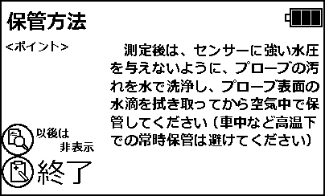
<sub>ガイダンス（保管方法）</sub>

---

## 7. エラー表示

<sub>実装: ERRMSG（ERRDSP1/2・ERRWAIT1/2）／描画 `disp_error_page1/2`（共通テンプレート）</sub>

エラー画面は、QR コードを表示する**ページ1**と対処手順を表示する**ページ2**の 2 ページ構成で、レイアウト定義テーブルの差し替えにより全エラーで共通の描画処理を用いる。

**共通の操作**（全エラー確認待ち方式、自動解除タイマは無い）

- ページ1: MEM=解除して発生元へ復帰（一部エラーは解除不可）、DISP=ページ2（対処手順）へ。
- ページ2: MEM=解除、DISP=ページ1へ。
- エラー発生時はエラー履歴（発生日＋エラー番号）を記録し、製品情報（§4.4）の最新エラーNo. に反映する。

**エラー一覧**（実動作で発生するもの）

| No. | 名称 | 発生条件 | 画面 | 解除 | 備考 |
|---|---|---|---|---|---|
| 1 | ゼロ校正 前回ゼロとの差大（Err1） | ゼロ校正安定成立後、新ゼロと前回ゼロの差が前回ゼロの 10% 超 | ERROR1 | MEM | 校正不成立。文面は暫定で No.3 と同一（QR のリンク先のみ別） |
| 2 | ゼロ校正 出力低下＝寿命予告（Err2） | 新ゼロが出荷時ゼロ×0.70 未満（No.1 より優先判定） | ERROR2 | MEM | 校正不成立。文面は暫定で No.3 と同一（同上） |
| 3 | 演算エラー（センサー異常） | 校正・演算の不成立（透視度 k ガード範囲外を含む） | ERROR3 | MEM | |
| 4 | 水深センサー 水中電源ON | 起動時気圧 > 1100hPa | ERROR4 共用 | MEM | 警告のみ。実測値をゼロ基準に採用 |
| 5 | 水深センサー 気圧妥当域外 | 起動時気圧 < 300hPa または > 1700hPa | ERROR4 共用 | MEM | ゼロ基準は公称 1013hPa にフォールバック |
| 6 | 水深センサー 通信途絶 | 気圧値 ≦ 0 | ERROR4 共用 | MEM | 基準未取得のまま次サンプル再試行 |
| — | 本体故障 | `SYS_ErrorNo` が 80 以上のときの測定開始、測定履歴・後校正記録の書込失敗、測定履歴の消去失敗 | ERROR6 | MEM | 画面に本体エラー番号を併記。手順表示（ページ2）へは遷移できない |
| — | バッテリーエラー | 電池電圧低下 | ERROR7 | **不可** | 電池交換を要求するため MEM で解除できない |

水深エラー No.4〜6 は起動時の水深ゼロ基準取得で判定し、1 起動につき 1 回・測定モードでのみ表示する。`err_num` の enum 値は No.4→4、No.5→5 だが、**No.6 は 17**（`err_DEPTH_COMM`）である。enum の 6 番は `err_METER` が先に使っていたため末尾に追加され、履歴記録時のみ番号 6 へ明示マップされる。

**本体エラー番号（`SYS_ErrorNo`）**

ERROR6 の画面に「No.XX」として併記され、そのままエラー履歴に記録される。値が 0 のまま ERROR6 が発生した場合は 92 で記録される。

| 番号 | 意味 | 設定箇所 |
|---|---|---|
| 80 | RTC 電源投入検知（PON） | `Rtc.c` |
| 81 | RTC クロック停止（XST） | `Rtc.c` |
| 82 | RTC 電源電圧降下（VDET） | `Rtc.c` |
| 90 | 起動時に EEPROM パラメータを読めなかった | `main.c` |
| 91 | 電源 OFF 時の EEPROM 書込失敗 | `mainSub.c` |
| 92 | ERROR6 発生時に番号が未設定だった場合の汎用値 | `Normal.c`（記録時のみ） |
| 93 | 測定履歴の消去失敗 | `Normal.c` |
| 94 | 測定履歴の書込失敗（後校正記録の書込失敗も共用） | `Normal.c` |

`SYS_ErrorNo` は電源 ON で 0 クリアされる。値が 80 以上の間は `start_measure()` が NG を返すため、**その電源サイクル中は測定開始とゼロ校正開始が ERROR6 になる**。通常測定の継続（`MSR_1` ループ）には影響しない。

93／94 は RO-105S Rev5 の番号体系に合わせたものである。従来この 2 箇所は本体エラー番号を持たず、特に履歴書込失敗は `err_DISABLE`（センサー使用不可）を表示して MEM 解除もできなかったが、障害内容と一致しないため ERROR6 に統一した。

**画面一覧**

画面はレイアウトテーブル `error1_table`（ページ1）／`error2_table`（ページ2）の添字で選ばれる。ページ2 へは確認待ち（ERRWAIT1）の DISP でのみ遷移するため、ページ1 に「手順表示」を出さない ERROR6 にはページ2 が無い。

| 画面 | `err_num` | ページ1 | ページ2 | 画面上のタイトル | 備考 |
|---|---|---|---|---|---|
| ERROR1 | `err_ZDIFF`（1） | ✓ | ✓ | センサー異常 | 素材は ERROR3 と共通 |
| ERROR2 | `err_ZLOW`（2） | ✓ | ✓ | センサー異常 | 素材は ERROR3 と共通 |
| ERROR3 | `err_OUT`（3） | ✓ | ✓ | センサー異常 | |
| ERROR4 | `err_DEPTH_PWR`（4）／`err_DEPTH_RANGE`（5）／`err_DEPTH_COMM`（17） | ✓ | ✓ | 水深センサー異常 | 3 エラーで共用 |
| ERROR6 | `err_METER`（6） | ✓ | — | 本体故障 | 本体エラー番号を併記。DISP 無効 |
| ERROR7 | `err_BATT`（7） | ✓ | ✓ | バッテリーエラー | ページ1 に解除アイコン無し |
| ERROR8 | `err_CAL`（8） | ✓ | ✓ | センサー校正不可 | **現行 FW に発生元が無い**（後述） |
| ERROR9 | `err_DISABLE`（9） | ✓ | ✓ | センサー使用不可 | **現行 FW に発生元が無い**（後述） |

**ERROR8 / ERROR9 について**: どちらも描画関数と `ERRDSP1` の分岐は存在するが、`oc_err_num` に代入する箇所が無く実動作では発生しない。ID-200T では 1Wire センサー認証チップの判定（`WAG_Flag_SEnd == 15` 等）から発生していたが、IM-110 のプローブに 1Wire 認証は無いため発生元ごと移植されなかった。ページ2 の素材は ERROR4 と共用（`err_guide4`）のため、現状は水深センサー向けの文面が表示される（作業残件）。

**未実装の画面**: `error1_table` / `error2_table` には ERROR5（センサー寿命）・ERROR17（自動校正条件NG）・ERROR19（保管温度異常）の行と素材も残っているが、ERROR5 は `ERRDSP1` に分岐が無く、ERROR17 / ERROR19 は描画関数自体が存在しない。**いずれも実機では表示できない** ID-200T からの残骸であり、本仕様書では扱わない。

**デバッグコマンド `ERR,<No.>`**: 保守 UART から `err_num` の enum 値を指定して、任意のエラー／ガイダンス画面を強制表示できる（RO-105S Rev5 からの移植）。実エラーと同じ経路（`operation_mode = ERRMSG`）を通す擬似発生のため、**エラー履歴にも記録される**。解除後の戻り先は測定画面固定。範囲外の値には `NG` を返す。上記のとおり ERROR5 / 17 / 19 はこのコマンドでも表示できない。

**画面図**

実装の描画コードから再現した図で、QR コード（`qrcode_err_disp`）の中身は省略し `err_QR` の枠のみを描いている。ERROR6 の本体エラー番号は代表値 90。


<sub>ERROR1 ページ1</sub>


<sub>ERROR1 ページ2（手順表示）</sub>


<sub>ERROR2 ページ1</sub>

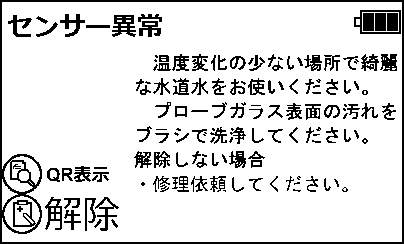
<sub>ERROR2 ページ2（手順表示）</sub>

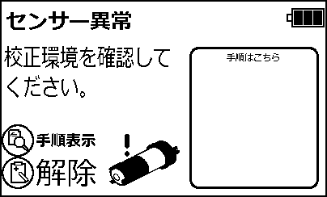
<sub>ERROR3 ページ1</sub>


<sub>ERROR3 ページ2（手順表示）</sub>

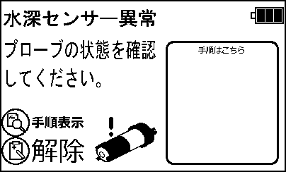
<sub>ERROR4 ページ1（水深エラー No.4〜6 共用）</sub>

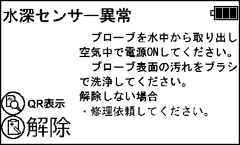
<sub>ERROR4 ページ2（手順表示）</sub>

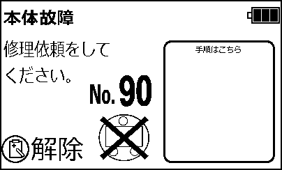
<sub>ERROR6 ページ1（本体故障。ページ2 は無い）</sub>

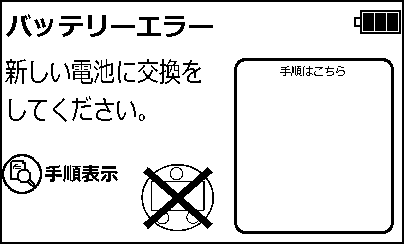
<sub>ERROR7 ページ1（解除アイコン無し）</sub>

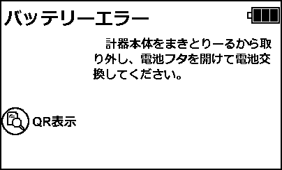
<sub>ERROR7 ページ2（手順表示）</sub>

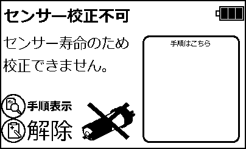
<sub>ERROR8 ページ1（現行 FW では発生しない）</sub>

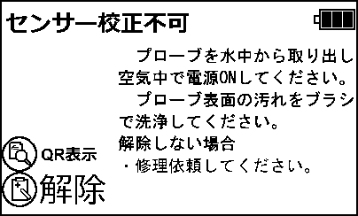
<sub>ERROR8 ページ2（素材は ERROR4 と共用）</sub>

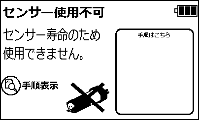
<sub>ERROR9 ページ1（現行 FW では発生しない）</sub>

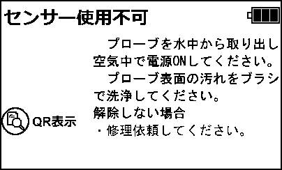
<sub>ERROR9 ページ2（素材は ERROR4 と共用）</sub>

---

## 8. 電源・共通動作

**電源 OFF シーケンス**（電源スイッチ押下 → `shutt_down`）

1. 測定モードで「保管方法」ガイダンスが未表示の日であれば表示する（§6）。
2. **統合ストアの一括書戻し**: RAM 上の校正・調整係数を封緘し、現控えと差分があればプローブフラッシュ（WPG×25＋WSC）と本体 EEPROM 控え（page19-43）へ同一 ID・同一最終更新日で書き込む（変更が無ければ書かない。詳細は付録D）。
3. 設定データ（測定モード・相関式選択・ガイダンスフラグ・エラー履歴等）を EEPROM へ書き込み、LCD・プローブ給電を落として電源保持を解除する。

**起動時の係数ロード**: 既定値（層1）→ 本体 EEPROM 控え（層2）→ プローブフラッシュ（層3＝最終真実源）の順に上書き適用する 3 層モデルである（付録D）。プローブ読取失敗時は控えのまま測定を継続する。

**電池監視**: 電池電圧から残量 0〜3 を算出し、電池残量アイコンを約 500ms 周期で更新する。電圧低下でバッテリーエラー（§7）を表示する。

**LCD 自動消灯**: 各画面は表示保持タイマー（`lcd_off_timer`）を持ち、無操作で LCD を消灯して省電力化する。スイッチ操作で再点灯する。

**水深ゼロ基準**: 電源 ON 直後の初回気圧計測を水深 0 の基準として自動取得する（妥当性判定は §7 の No.4〜6）。水深 = (現在気圧 − 基準気圧) × 傾きで算出し、負値は 0.0 にクランプする（付録A）。

---

# セクションB：プローブ

> プローブは画面を持たず、本体から RS-232C で制御される。通信仕様の真実源は `docs/protocol-rs232c.md`。

## B-1 プローブ概要・役割

IM-110T プローブ基板は、水質計測用のアナログ信号取得を担うモジュールである。操作スイッチ・表示器を持たず（基板上のスイッチはリセット用 S1 のみ）、本体がマスターとして制御する。

本体とプローブは RS-232C ケーブル（38400bps。FUP ブリッジと本体 CN2 デバッグ UART は 9600bps）で接続される。コマンドはすべて本体からプローブへ発行される。測定値の取得は本体主導のポーリングで、本体が 500ms 周期で `MD` を送信して 1 行応答を受信する。プローブの自律送信機能（MS）はプローブ単体試験用にコマンドとして残置されているのみである。

プローブはバッテリーを搭載せず、本体 CN4 からケーブル経由で供給される 5V（VIN）のみで動作する。ケーブルを抜くとプローブの電源は断たれる。単独デバッグ時は外部から +5V 供給が必要である。

## B-2 ハードウェア構成（電源・MCU）

プローブ基板の MCU は STM32G070KBT6（LQFP32、Cortex-M0+、最大 64MHz、Flash 128kB／SRAM 36kB）である。本体（STM32L452RET6、Cortex-M4）とは MCU 系列が異なり、HAL ドライバ・ピン配置・ペリフェラルに互換性はない。

電源構成:

- 本体 CN4 から `VIN`（5V）が供給され、Q1（RQ5A030AP、P-MOSFET）の逆接保護を経て `+05P` レールとなる。
- `+05P` → MAX8881EUT33-T（IC14）→ `+3.3V` → FB3 フェライトビーズ → `+3.3VA`（アナログ）。
- `+05P` → LM27761DSGT（IC15）インバーティング・チャージポンプ → `+05A`／`-05A`（アナログ ±5V）。
- LM336BMX-2.5（IC9）＋2SC2712（IC8）で +2.5V 基準、R39/R40 分圧＋C49 で `1V_REF` を生成。

## B-3 計測フロントエンド（アナログ信号系）

- オペアンプ: TSX562IST × 7（IC1〜IC7）。低オフセット・CMOS 入力のレール to レール。
- アナログマルチプレクサ: TMUX4053BQBR × 2（IC10、IC11）。`SEL`／`SEL3` ネットでチャネル切替。
- 外部 ADC: MCP3424T-E/SL（IC19）。4ch・18bit ΔΣ、I2C1 接続。計測系に STM32 内蔵 ADC は使用しない。
- 入力保護: IC19 の各差動入力に 1N4148WS（D4〜D11）クランプ。
- 気圧センサ: HSPPAD143A（I2C2）。水深計測用の気圧を周期取得する。

## B-4 測定チャネルとMD応答

プローブは `MD` コマンドに対し、現在の測定値を 1 回送信する。

```
<mV[0]>, <mV[1]>, <mV[2]>, <mV[3]>, <mV[4]>, <pressure hPa>\r\n
```

6 個の float をカンマとスペースで区切って送信する。前半 5 個は内部配列 `AD_AVE_mV[5]`（mV）、6 番目は気圧センサ値である。プローブの移動平均回数の起動時既定は 0（瞬時値）で、平均は本体側（`update_main_ave`、10 件×MD 500ms ≈ 5 秒窓）が担う。

| 配列 index | 対応する物理計測 | 用途 |
|---|---|---|
| `AD_AVE_mV[0]` | MCP3424 CH1 | MLSS 受光 |
| `AD_AVE_mV[1]` | MCP3424 CH2 | MLSS Ref |
| `AD_AVE_mV[2]` | MCP3424 CH3（SEL3=LOW） | SS 受光（透視度と共有） |
| `AD_AVE_mV[3]` | MCP3424 CH4 | SS Ref（透視度と共有） |
| `AD_AVE_mV[4]` | （旧 ch5、廃止） | 更新されない（`PROBE_CH5_ENABLED 0`、`SS` コマンドは常に NG） |

有効化した ch のみ更新され、無効 ch は直前値が残留する。気圧は実測 hPa が固定書式の 6 番目に入る。

## B-5 RS-232Cコマンド仕様

コマンドは本体（マスター）→プローブ方向のみ、コマンド名は大文字のみ有効、終端は CR+LF である。

| # | コマンド | パラメータ | 応答 | 機能 |
|---|---|---|---|---|
| 1 | VR | なし | 値応答1行 | 製品名・FW バージョン取得 |
| 2 | SP / SP,idx,duty | X.XX（0.0〜1.0）、または idx（0〜4）＋duty | OK / NG | LED PWM duty 設定。引数1個=LED_Out[0]（互換）、2個=LED_Out[idx]。[0]=MLSS系(ch1,2)／[1]=SS系(ch3,4) |
| 3 | SEL | N（0,1,2） | OK / NG | SEL（PA6）出力モード |
| 4 | SS | N（0,1） | **NG（常時）** | SEL3 切替（旧 ch5 用）。ch5 廃止により無効化・SEL3 は LOW 固定 |
| 5 | MS / MS,N | N（0,1）または省略 | OK | 測定データ自律送信の制御（**単体試験用の残置**。本体は MD ポーリングのみ使用） |
| 6 | MD | なし | 値応答1行 | 現在の測定値を1回送信（§B-4）。本体が 500ms 周期でポーリング |
| — | MDR | なし | 値応答1行 | 生 AD 値 mV（span 非依存・平均前）を1回取得（調整・デバッグ用） |
| 7 | SID | N（uint32 10進） | OK / NG | Probe ID 設定 |
| 8 | SADZ | N（0〜4） | OK / NG | 【廃止扱い・残置】ADC_Zero を設定するが計算では未使用 |
| 9 | SADS | N（0〜3） | OK / NG | 空中生 mV を ADC_Span に記録する span 正規化（ターゲット 1450mV）。0 以下のみ NG。**現行の調整フローでは実施しない**（span=既定 1450 のまま＝出力は生 mV。コマンドは残置） |
| 10 | SADA | N（0〜255） | OK / NG | ADC 移動平均回数設定（既定 0=瞬時値。デバッグ用残置） |
| 11 | SADC | XXXX（4文字 '0'/'1'） | OK / NG | ADC 有効 ch ビットマスク（CH1〜CH4） |
| 12 | RPP | なし | 複数行応答 | Flash パラメータ一覧出力 |
| 13 | WPP | なし | 固定文字列 | 現在のパラメータを内蔵 Flash に保存 |
| 14 | RPI | なし | 固定文字列 | パラメータを初期値にリセット（RAM のみ） |
| — | RPF | なし | OK / NG | 【保守・製造用】統合ストア（800B）を既定値で初期化し flash 確定する新品化リセット。本体は `P_RPF` 中継時に本体側グローバルも既定化する |
| — | RPG | なし または N（0〜24） | 複数行応答 | 統合ストアの 32B ページ読出（全 25 ページ一括または単一ページ）。ストア無効時は NG |
| — | WPG | N（0〜24）,64hex | OK / NG | 統合ストア RAM 像の page N を更新（末尾 XOR 検証） |
| — | WSC | なし | OK / NG | 統合ストア RAM 像を封緘して flash へ確定する commit（800B 一括） |
| M | FUP,45063 | magic 固定値 | OK→BL移行 / NG | 【リペア・製造用】ROM ブートローダーへ移行（ブリッジは 9600bps） |

上記いずれにもマッチしない受信行、パラメータの欠落・形式不正・範囲外には NG を返送する。

## B-6 ゼロ点・スパン補正（SADZ/SADS）

- SADZ（ゼロ点）: オフセット減算の廃止により計算未使用。過去互換のため残置（副作用があるため本体側はリトライ対象外）。
- SADS（スパン）: 指定 ch の空中生 mV を `ADC_Span` に記録し、span 正規化「出力 = 生 mV × 1450 / ADC_Span」で空中出力を 1450mV に合わせる能動コマンド。0 以下のみ NG。**現行の調整フローでは実施しない**（span=既定 1450 のまま＝プローブ出力は生 mV となり、ch 間で 1mV の重みが揃う。%温度補正が比率形で正規化不変であることを利用した仕様）。
- SADA（移動平均）: 起動時既定 0（瞬時値）。平均は本体側が担う。
- SADC（有効 ch マスク）: 4 文字の '0'/'1' で CH1〜CH4 の有効・無効を指定する。本体は測定モード切替時に MLSS=ch1,2／SS・透視度=ch3,4 を設定する。

これらの設定はまず RAM 上の live パラメータへ反映され、恒久化は WPP による。校正係数・調整パラメータの本命の保管先は統合ストア（probe_store_t、25 ページ×32B=800B）であり、ページ単位の WPG＋封緘 WSC で保存する。運用中の校正・調整は本体 RAM に反映し、電源 OFF の一括書戻し窓でプローブと本体 EEPROM 控えの双方へ同一 ID・同一最終更新日で書き込む（付録D）。

## B-7 補正式・調整パラメータ

生 mV から物理量への換算はすべて本体側で実行する。プローブが担うのは AD 値の mV 化（span 既定のため実質生 mV）と気圧の取得までである。

補正に用いる全係数と調整パラメータは、プローブフラッシュの統合ストアを最終真実源として保管する。本体 EEPROM は「最後に採用・確定した係数の控え」（層2）としてこの直列化形式をそのまま保存する。本体基板のみの交換でもプローブの付け替えでも測定値が正しく出るよう、既定値（層1）→EEP控え（層2）→プローブフラッシュ（層3）の順に上書き適用する 3 層モデルで整合を保つ。転送は 32B ページ単位（RPG／WPG／WSC）で、共有 struct の生バイト列をそのまま送るため往復誤差は生じない。

具体的な補正式（出荷時 2 次式、TR 4 点 3 次式、ゼロ・%温度補正、k_No 等）とページ意味論は付録A・付録D および `mlss-calc-reference.md` を参照。

## B-8 エラー処理・タイムアウト

プローブは、解釈できないコマンドとパラメータ不正に `NG\r\n` を返送する（理由コードなし）。

コマンド応答のタイムアウトとリトライは本体側で管理する。タイムアウトは fast 500ms／slow 3000ms の 2 区分で、flash 操作・複数行ダンプを伴うコマンド（RPP・WPP・RPF・RPG・WSC）は slow に分類される。応答タイムアウト時は原則 1 回リトライするが、SADS・SADZ（AD 値ドリフトの副作用）と MS 引数省略形（トグルの副作用）はリトライ対象外である。

flash 書込中の CPU ストールで発生し得るオーバーラン（ORE）は、プローブ側の `HAL_UART_ErrorCallback()` が PE/FE/NE/ORE フラグを浄化して受信を再アームすることで復旧する。

本体側の受信・送信は次の 3 点で堅牢化されている。①コマンド間ギャップ `Probe_CmdGap()`: プローブの最終応答受信から 20ms 経過するまで次コマンドを送らない。②LPUART1 通常受信は生 RXNE 割込。③複数行バースト応答（RPG／RPP）はバルク受信 `Probe_BulkCmd()`: ISR は 2KB 配列へ詰めるだけとし、終端まで待ってから静止した配列をパースする。

---

# 付録

## 付録A 計算式・補正式

本付録は、IM-110 が MLSS・SS・透視度および水深を算出する計算式・補正式を、現行実装（本体 `IM_110.c`、プローブ `IM_110.c`）を真実源として記載する。詳細な導出・経緯は `mlss-calc-reference.md` を参照。

計算チェーンは「プローブ: AD 値の mV 化 → 本体: %温度補正 → 吸光度 ABS → ベース式（相関式）→ スパン校正」である。受光暗時オフセット（ADZR 減算）、機差補正 kiza、加算 mV 形の温度補正は存在しない。

（プローブ側：生 mV 化 — 共通）

```
プローブ出力mV = 生mV * ADC_SPAN_INI / ADC_Span[ch]
生mV = digit * LSB          （LSB = 0.0625 mV/digit, PGA=1）
```

- `ADC_SPAN_INI` = 1450.0。現行の調整フローでは空中 SADS を実施しないため `ADC_Span` は既定 1450 のままで、プローブ出力 = 生 mV である。
- プローブ既定 `SADA=0`（瞬時値）のため、平均は本体側 `update_main_ave`（10 件×MD 500ms）が行う。本体内では平均値 `ADC_mV_ave[ch]`、瞬時値 `ADC_mV[ch]`。

（本体側：%温度補正と吸光度 ABS — MLSS）

Ref を温度プロキシとし、受光 生 mV を「20℃清水だったら出ていたはずの受光」へ比率換算してから、清水ゼロ基準との比の常用対数を ABS とする（`tempc_comp_mv()`／`mlss_fabss_with_mode()`）。

```
a5  = (MLSS_05 - MLSS_20) / (Ref_05 - Ref_20)
a35 = (MLSS_35 - MLSS_20) / (Ref_35 - Ref_20)
f(Ref) = MLSS_20 + a * (Ref - Ref_20)    ... a = a5 (Ref >= Ref_20) / a35 (Ref < Ref_20)
Y0c = Y0 * MLSS_20 / f(Ref)              ... %温度補正（無効時は Y0c = Y0）
ABS = log10(MLSS_ZR / Y0c)               ... 分母 0 以下は 0.001 にクランプ
```

- `Ref_05/20/35`・`MLSS_05/20/35`: 5／20／35℃清水中で捕捉した Ref／受光 mV（6 パラメータ）。実体は統合ストア Page23（MLSS）の捕捉点そのもので、フィット係数を持たず毎サンプル直接計算する。20℃点は ADBOAD の LED PWM 調整（20℃清水 1750mV 収束）成功時に捕捉する。
- `f(Ref)` は 20℃を閾値とした 1 次式 2 本。捕捉範囲外は直線延長。片側の |Ref_x − Ref_20| が `TEMPC_DREF_MIN_MV`（10mV）未満のときその側の傾きは 0（補正なしに帰着）。20℃点未捕捉／MLSS_20 ≤ 0／f(Ref) ≤ 0 も補正なし。
- `MLSS_ZR`: 清水中ゼロ基準（初期値 1750.0）。清水ゼロ校正が補正後 mV の実値で上書きする。出荷時枠 `MLSS_ZR_Ship` と現場枠の 2 枠を持つ。
- ZR 捕捉・出荷時 3 点捕捉・ABS 計算はすべて補正後 mV で行う。温度補正の捕捉点自体は生 mV。後校正（履歴 raw mV 再計算）は補正なし（`ref_mv=-1` の明示指定）。

（本体側：SS）

SS も MLSS と同形（パラメータ独立）。受光 `ADC_mV_ave[2]`、Ref `ADC_mV_ave[3]`、捕捉点は Page24、ゼロ基準 `SS_ZR`（初期値 1750.0）。

（本体側：透視度）

透視度は受光 ch3（`ADC_mV_ave[2]`、SS と共有）を用い、SS の %温度補正後 mV をそのまま使用する（固有の温度係数なし）。ゼロ基準 `TR_ZR` は清水中受光で、ADBOAD の清水実行が現場枠・出荷時枠の両方を置換する。

```
ABS = log10(TR_ZR / Y0c_SS)
```

（ベース式：ABS → 物理量 — MLSS）

```
eval_modecf(c, ABS) = c[0] + c[1]*ABS + c[2]*ABS^2 + ...（最大6次、実体は2次）
FABSS(No.1〜20)  = eval_modecf(MLSS_Mode_CF[0], ABS) * k_No_MLSS[idx]
FABSS(No.21〜30) = eval_modecf(MLSS_Mode_CF[idx], ABS)
```

- No.1〜20 は基準 2 次式（No.1）× 傾きゲイン k_No（No.1=1.0000〜No.20=2.8879、等間隔 step ≈ 0.099364 の FW 定数表）。No.21〜30 は各スロット独立の 2 次式（ゲイン 1.00 固定）。

（ベース式：透視度 = 4 点 3 次式）

```
FABSS = Q0 + Q1*ABS + Q2*ABS^2 + Q3*ABS^3
```

- Q0〜Q3 は 100cm／90cm／60cm／30cm の 4 点を `ABS_i = log10(TR_ZR_Ship / mV_i)` で ABS 化して 3 次厳密フィットした係数（`tr_refit_ship_poly`）。
- 清水（=ZR）はフィット点にしない（清水=理論上 100cm 超）。ADBOAD の清水実行時は 4 点を「新ゼロ − 既定 mV 差分」（−3.7／−4.2／−6.7／−14.9mV）の予想点にセットし直し、90／60／30cm は実測で正式置換する（100cm 点は予想点のまま運用）。
- 係数はストアへ保存せず、`trzr_ship`＋捕捉点（Page19・Page15）から読出時に毎回再フィットする。
- 清水中は ABS ≈ 0 → FABSS = Q0 ≫ 100 で安定して 100.0＋OVER。既定・予想点は凸カーブ上にあるため Q3 < 0 が保証され、空中・暗すぎでは負に発散して「-.-」表示となる。計算上のクランプは持たない（頭打ちは表示側のみ）。

（スパン校正：FABSS → 最終出力）

```
MLSS = MLSS_SP_A * FABSS^2 + MLSS_SP_B * FABSS + MLSS_SP_C   （SS・透視度も同形）
```

- 初期値 SP_A=0／SP_B=1／SP_C=0（未校正時は出力 = FABSS）。MLSS/SS は現場 2 点／3 点校正で係数を作る。
- 透視度は k 傾き 1 点方式: 常に SP_A=0／SP_C=0／SP_B=k=設定値÷実測 FABSS（k ガード 0.7〜1.3、範囲外は係数不変で演算エラー No.3）。
- 界面判断バー用の瞬時値 `MLSS_inst` も同式で、瞬時 mV から求めた FABSS に適用する。

（水深）

```
Depth = (P - Depth_offset) * Depth_k
```

- `Depth_offset`: 電源 ON 直後の初回計測で取得した大気圧（自動ゼロ。妥当性判定は §7 No.4〜6）。
- `Depth_k`: 水深換算の傾き。初期値 1.0/100.0（100hPa/m 相当）。ADBOAD の水深スパン調整（6m 相当加圧時に 6.0m）で `Depth_k = 6.0 / (P − Depth_offset)` として更新する。
- 表示は負値を 0.0 にクランプする（計算値はクランプしない）。

## 付録B EEPROM割付表

本体 EEPROM（M95256、32KB、SPI）のページ割付である。1 ページ = 32 バイトで、各ページ末尾 1 バイト（offset 31）は XOR チェックサム（実データは 31B/ページ）。実運用範囲は page 0〜125（`EEP_PAGE_MAX = 126`）。起動時に page 0 のヘッダ（"IM-110"）を検査し、不一致なら page 0〜125 を初期値で再構築する。

| page | 領域名（マクロ） | 用途 | 備考 |
|---|---|---|---|
| 0 | `EEP_HEADER_PAGE` | "IM-110" ヘッダ + 予備 | 起動時整合性チェックの基準 |
| 1-3 | `EEP_BOARDADJ_PAGE` | 本体基板調整 予備領域 | 将来拡張枠 |
| 4 | `EEP_INFO_PAGE` | エラー情報・本体情報 | LastDate、最新エラー（発生日＋No.）、EEP/RTC リトライ・エラーカウンタ、ガイダンス表示フラグ `guide_disp_flag[5]`（[3..5]=校正の目安/スパン校正方法/ゼロ校正方法、[27..28]=測定方法/保管方法）。UART `RER` で一括読出可 |
| 5 | `EEP_INTERFACE_PAGE` | 界面測定設定 | `Interface_Threshold`（float）。マジック 0x3C |
| 6-11 | — | 共通設定 拡張用 予備（上流側） | |
| 12 | `EEP_COMMON_PAGE` | 共通設定 | `Meas_Mode`、`MLSS_MODE`/`SS_MODE`/`TR_MODE`（相関式内部値 0..29）。マジック 0xA5。校正設定値 SetVal は統合ストア Page16 一本（旧バイトは読み捨て） |
| 13-15 | — | 共通設定 拡張用 予備（下流側） | |
| 16-18 | `EEP_PCAL_MLSS/SS/TR_PAGE` | 後校正記録（16=MLSS／17=SS／18=透視度） | 各 1 page＝3 件リング。マジック 0xC3（offset 30） |
| 19-43 | `EEP_STORE_PAGE` | 統合ストア EEP控え（probe_store_t 800B = 25×32B） | `EEP_STORE_COUNT = 25` = `STORE_NPAGE` |
| 44-60 | — | 統合ストア 拡張用 予備 | ストアのページ追加はここへ（最大 page80 まで基底移動なし） |
| 61-80 | `EEP_STORE_PAGE_OLD` | 旧 統合ストア控え位置 | 移行読出し専用。新規書込しない |
| 81-95 | `EEP_HIS_MLSS_PAGE` | MLSS/界面 測定履歴 | 15 page、30 件（2 件/page） |
| 96-110 | `EEP_HIS_SS_PAGE` | SS 測定履歴 | 15 page、30 件 |
| 111-125 | `EEP_HIS_TR_PAGE` | 透視度 測定履歴 | 15 page、30 件 |
| 126-1023 | （範囲外） | 未使用・予約 | EEPROM クリア対象外 |

- **EEP控え（page 19-43）**: プローブが保持する `probe_store_t`（800B）の直列化形式をそのまま保存した「最後に採用・確定した係数の控え」（層2）。各ページ byte31 の XOR は媒体固有（EEPROM は seed 0xFF／統合ストアは seed 0）のため、読出時（`eepstore_load_raw`）に統合ストアの正準形へ復元する。旧 legacy 校正係数領域はアクセサごと撤去済みで読み書きされない。
- **測定履歴レコード**（15B×2 件/page）: year/month/day/hour/min（uint8×5）、value（float）、depth（float、SS/TR は 0 固定）、raw_mv_x10（int16、後校正の逆算用）。
- **後校正記録レコード**（10B×3 件/page、offset 0/10/20）: year/month/day/hour/min（uint8×5）、value（int16。MLSS/SS=mg/L、透視度=cm×10）、raw_mv_x10（int16）、予備 1B。先頭が最新で、書込は先頭シフト（最古を押し出し）。水深は保存しない。有効判定はマジック＋XOR（測定履歴と同式）、件数は先頭から連続する月 1〜12 の個数。

## 付録C 相関式・項目別演算

**相関式の統一形（MLSS No.1〜30）**

```
FABSS = curve(ABS) * k
  No.1〜20 : curve = 出荷時2次式(基準=No.1),  k = k_No (No.1=1.00 ... No.20=2.8879)
  No.21〜30: curve = 各スロット独立の2次式,    k = 1.00 (固定)
```

- k_No は全プローブ共通の FW 定数表（下表）。フラッシュには保存せず、保存されるのは選択中の No. のみ。

| No. | k_No | No. | k_No | No. | k_No | No. | k_No |
|---|---|---|---|---|---|---|---|
| 1 | 1.0000 | 6 | 1.4968 | 11 | 1.9936 | 16 | 2.4905 |
| 2 | 1.0994 | 7 | 1.5962 | 12 | 2.0930 | 17 | 2.5898 |
| 3 | 1.1987 | 8 | 1.6955 | 13 | 2.1924 | 18 | 2.6892 |
| 4 | 1.2981 | 9 | 1.7949 | 14 | 2.2917 | 19 | 2.7886 |
| 5 | 1.3975 | 10 | 1.8943 | 15 | 2.3911 | 20 | 2.8879 |

- 出荷時 3 点調整を実施するまでの基準カーブは 1 次直線であり、MLSS の既定傾きは C1=21315、SS は専用値 C1=2908.532 である。
- No.21〜30 は現場 3 点校正で統合ストアの係数を上書きして作る。未調整スロットは出荷時基準のコピーで、No.1 と同結果になる。

**測定項目別の演算構成**

| 測定項目 | 相関式 No. | 出荷時ベースカーブ | 上に乗る校正 | 受光/Ref ch (code index) |
|---|---|---|---|---|
| MLSS | No.1〜20 (k_No) + No.21〜30 (独立2次) | 2次式（基準=No.1） | スパン SP（2次） | 受光=ch1 [0] / Ref=ch2 [1] |
| SS | 単一式のみ | 2次式 | スパン SP（2次） | 受光=ch3 [2] / Ref=ch4 [3] |
| 透視度 | 単一式のみ | 4点3次式 Q0+Q1·ABS+Q2·ABS²+Q3·ABS³ | k 傾き1点（SP_B=k, A=C=0） | 受光=ch3 [2]（SS と共有）/ Ref=ch4 [3] |
| 界面機能 | （MLSS を流用） | MLSS と同じ | MLSS の SP を流用 | 瞬時値 ADC_mV[0]/[1] |

- 界面機能は独立した相関式を持たない。界面判断バーは瞬時 MLSS（`MLSS_inst`）、界面深度ホールドは瞬時 MLSS がしきい値を越えた瞬間の水深捕捉である。

**演算チェーン全体**

```
プローブ AD (mV。span 既定 1450 のまま = 実質 生mV)
  → 本体: Y0c = Y0 × J20 / f(Ref)          (%温度補正)
  → ABS = log10( ZR / Y0c )                (清水ゼロ基準)
  → FABSS = curve(ABS) * k                 (相関式。TR は 4点3次式)
  → 物理量 = SP_A*FABSS² + SP_B*FABSS + SP_C   (スパン校正。TR は SP_B=k のみ)
```

## 付録D 調整機能とパラメータ記憶

**D.1 責務分界**

- プローブは AD 値（mV）を出力し、係数・調整パラメータを自身のフラッシュに保管するだけである。補正・濃度換算は行わない。
- プローブ側の計算で使うパラメータは span 傾き `ADC_Span[]`（既定 1450 のまま＝出力は生 mV）と LED PWM duty `LED_Out[]`（系統別）のみ。それ以外の係数はプローブが保管するだけで、適用計算はすべて本体が行う。

**D.2 調整順序（出荷時／基板調整＝ADBOAD）**

| 順 | 調整 | ADBOAD 画面 | 内容 | 保存先 |
|---|---|---|---|---|
| 1 | LED PWM 調整 兼 20℃温度点捕捉 | 04（MLSS）／07（SS） | 20℃清水中で対象 2ch の大きい方を 1750mV へ収束させ、成功時に整定値の Ref/受光を 20℃スロットへ捕捉 | Page2 `LED_Out`／Page23-24 20℃点 |
| 2 | 温度補正 5℃／35℃点捕捉 | 10／12（MLSS）、13／15（SS） | 各温度の清水中で Ref/受光 平均 mV を捕捉（単点の後日取り直し可。フィット処理なし） | Page23（MLSS）／Page24（SS） |
| 3 | 清水ゼロ・出荷時 3 点調整 | 16-18（MLSS）、19-21（SS）、22-25（TR） | ゼロ＋スパン＋中間の 3 係数を常設モデルで置換し、常に 3 点から式を再計算（TR は清水＋90/60/30cm の 4 点 3 次式） | Page5／Page12／Page15／Page17-19 |

空中 SADS 正規化（旧 05/06/08/09）はフローに存在しない。画面仕様の詳細は §5。

**D.3 記憶方式（グローバル一本化＋3層モデル）**

- **RAM 上の真実源は本体のグローバル変数群**である。`probe_store_t` は flash/EEPROM 読み書きの瞬間だけ使う直列化バッファ（`store_iobuf` 1 本）で、常駐しない。pack/unpack は全フィールド無条件で、unpack∘pack は恒等である。
- **永続層の最終真実源はプローブフラッシュ**の統合ストア `probe_store_t`（800B＝25 ページ×32B、`STORE_AD`＝flash Page63）である。本体故障交換時も再調整は不要、プローブ交換時のみ再調整となる。
- **本体 EEPROM page19〜43 は「最後に採用・確定した係数の控え」（層2）**である（`eepstore_*`）。byte31 の XOR シード差は読出時に正準形へ復元する。
- ストアの整合性は magic＋各ページ XOR＋全体 checksum の 3 段で検証する。旧レイアウト（23/20/17 ページ）は読出時に自動移行する。
- 既定値の永続書込はプローブ新品時の自動初期化と明示 `RPF`（`P_RPF`）のみ。`P_RPF` 中継時は本体側グローバルも既定化される。新品既定値の単一ソースは `probe_store.h` の `store_set_new_probe_defaults()`（両リポ共有・バイト同一）。

**D.4 転送と電源 OFF 一括書戻し**

転送は 32B ページ単位の 3 コマンド（RPG=読出／WPG=ページ書込／WSC=封緘・確定）。ワイヤ表現は 1 ページ＝64 hex 文字。

起動時ロード: `Probe_Store_BootLoad()` が RPG（リトライ×3、バルク受信）でプローブ像を取得・検証し、有効なら live グローバルへ展開して EEP控えも更新する。読取失敗時は何もしない（層2 のまま測定継続）。

電源 OFF 書戻し（`Probe_Store_ShutdownWriteBack`）:

1. RPG でプローブ現状を先行取得し、**プローブ所有フィールド（ADC_Span／LED_Out／Probe_ID）はプローブ側の値を採用**する。
2. live グローバルを封緘し、本体 RTC 由来の日付（packed YYYYMMDD）を `hdr.last_update` へ設定する（RTC 不正時は既存値維持）。
3. 現控えとの差分があるときだけ WPG×25＋WSC でプローブへ確定し、EEP控えも同一内容へ更新する（差分判定はページ payload [0..30]、byte31 除外）。変更が無ければ flash を消費しない。

ADBOAD の調整値・校正モードの校正確定値は、いずれも live セットのみで即時書込せず、この一括書戻しで永続化される。

**D.5 統合ストア ページ割付（25 ページ・800B）**

| Page | 機能 | 内容（32B、末尾1B=XOR） |
|---|---|---|
| 0 | ヘッダ | magic＋Probe_ID＋最終更新日（packed YYYYMMDD）＋Product_Name＋checksum |
| 1 | ADC span | ADC_Span[ch1-5]（既定 1450 のまま） |
| 2 | LED PWM duty | LED_Out[0..4]（[0]=MLSS系／[1]=SS系／[2..4] 予備） |
| 3 | 水深係数＋設定 | k_depth, SADA, SADC, 選択中相関式No.(MLSS), Meas_Mode |
| 4 | MLSS ゼロ/温度 | ZR_出荷時, ZR_現場, refZR, B, B2（refZR/B/B2 は予約・未使用） |
| 5 | MLSS ベース/校正 | 出荷時2次(c0,c1,c2), SP_A, SP_B, SP_C |
| 6-10 | MLSS No.21-30 | 独立2次式×10（2式/ページ）。初期値=Page5 のコピー |
| 11 | SS ゼロ/温度 | 同 Page4（refZR/B/B2 は予約） |
| 12 | SS ベース/校正 | 同 Page5 |
| 13 | SS No.21 | 独立2次式×1 |
| 14 | TR ゼロ/校正 | TRZR（現場枠）, trzr_ship（出荷時枠）, SP_A, SP_B(=k), SP_C。1次演算式係数は保存せず読出時に再フィット |
| 15 | TR 出荷時4点目 90cm | x4=受光mV, y4=設定値(90.0)。Page19 の 3 点と合わせ常時 4 点 3 次式でフィット |
| 16 | 校正点設定値 SetVal | MLSS/SS/TR × (SetVal1, SetVal2)＝6 float |
| 17-19 | 出荷時3点調整 捕捉点 | [0]=MLSS/[1]=SS/[2]=TR。x[3]=捕捉値, y[3]=基準器値（常設モデル） |
| 20-22 | 現場スパン校正 捕捉点 | [0]=MLSS/[1]=SS/[2]=TR。x=記録 raw mV, y=校正時基準値, valid（bit0=フル/bit1=中間） |
| 23-24 | 温度補正 捕捉点 | [0]=MLSS/[1]=SS。ref[3]/juko[3] mV, valid（bit0-2=5/20/35℃）。**%温度補正のランタイム係数の真実源** |

**D.6 検証・デバッグコマンド（本体 CN2 UART、読み取り専用）**

- `AMIR`: 起動時 3 層ロードの結果（BOOT 0=プローブ採用／2=読取失敗→層2 のまま）、EEP控え・live の ID/UPD、受信診断カウンタ、RPG 失敗内訳を出力する。
- `RAD`: 統合ストア 25 ページに記録される全変数・設定値の RAM live/staging 一括ダンプ。
- `RER`: エラー情報・本体情報（EEPROM page4）の一括読出。

CN2 調整系コマンドの全体は `docs/protocol-adjust-uart.md` を参照。

---

# 巻末: 未使用機能一覧

実装が残置されているが通常操作から到達しない画面（デッドコード）と、ソースから撤去済みの機能の一覧である。**製品仕様としては無効**であり、残置コードの整理判断の材料として残す。判定根拠は、各状態への `operation_mode` 代入と描画関数呼出元の全数確認（ロガー/BLE 系は到達不能関数の全数調査＝本体リポ コミット `1f72466`）。

| 機能 | 状態/実装 | 状態 |
|---|---|---|
| データロガー一式（測定・履歴・省電力画面、LI コマンド、BLE 転送） | LOG系/DISPLOG/`disp_LOG1/3/4/5`/`disp_DISPLOG`/`ble.c` | **撤去済み**（`disp_ECOMODE` のみ残置・呼出元なし） |
| BT初期化 | BT_RESET/`disp_BT_RESET` | **撤去済み**（BLE 全撤去に伴う） |
| 淡水/海水設定 | TANSUI/`disp_TANSUI`/`tansui_sw_flag` | **撤去済み**（タイトルは淡水固定化） |
| 測定モード設定（通常/ロガー） | MEASMODE/`disp_MEASMODE` | 到達不能（ロガー撤去に伴う残置） |
| 測定メニュー | M_MENU/`disp_M_MENU`/`nrm_meas_menu` | 到達不能（測定画面 DISP 長押しは測定モード選択 M_CHANGE 直行、相関式選択は MLSS 決定後に続けて表示。旧経路で唯一の生存進入元だった界面モードも選択除外済み） |
| 校正用相関式選択 | C_S_CORR/`nrm_c_corr_setting` | 到達不能（`operation_mode` への進入代入が無い） |
| 3点校正 設定値の連続入力（スパン→中間） | `span_setting_chain_mid` 分岐 | 到達不能（常に 0。3 点校正の設定は中間濃度のみ） |
| 通常測定切替メッセージ | MSR_8/9/`disp_MLSS_Meas_4` | 到達不能（ロガー撤去に伴う残置） |
| 界面測定モード | `MEAS_MODE_DEPTH` の全画面分岐 | 到達不能（測定モード選択は MLSS/SS/TR の 3 つのみ。界面判断バー・界面深度ホールド・界面しきい値設定の界面「機能」は MLSS 測定内で現役 — §2.3/§2.8） |
| 設定メニュー2 | MENU2 | 到達不能（設定メニューは MENU1 のみ） |
| 自動校正設定 | ACALSET/`disp_ACALSET` | 到達不能（呼出側コメントアウト） |
| アプリDL先表示 | APPDL/`disp_APPDL` | 到達不能（呼出側コメントアウト） |
| 相関式一覧選択方式 | `disp_Corr_setting` | 到達不能（現行は 2 桁入力方式 `disp_Corr_setting_30` のみ） |
| 校正メニュー旧レイアウト | `disp_C_MENU` の `cal_from_powerOn==0` 側 | 到達不能（進入経路は電源ON経由のみ） |
| DO計流用の調整・校正画面 | `disp_RANGE1/2`, `disp_WAT1/2`, `disp_ADCAL1/2/3`, `disp_AUTOCAL_COMP`, `disp_CALTEMP` | 到達不能（ID-200T 流用・呼出元なし） |
| ADBOAD 旧レンジ・水温状態群 | MIDRANGE0〜HIRANGE／WAT05C〜35C／CALTEMP | 到達不能（現行はプローブ調整 29 画面に集約） |
| QRコード表示切替 | QR_3/QR_4（`disp_QR` の qr_flg=1 側） | 到達不能（製品情報は情報表示のみ） |
| ID-200T 流用画面ファイル | `ID_200T_Display.c`（disp_SETMENU/MSR2/3/4 等） | 到達不能（ファイルごと残置） |

---

# 改訂時の齟齬・未確認事項（Ver.0.43 反映）

本改訂（本体 Ver.0.43、コミット `8bed323`。以降 Ver.0.44 のデバッグコマンド追加分を §5.12 に反映）で仕様書をコードと突き合わせた際に見つかった、実装側の不整合・未決事項・本書で確認できなかった点の一覧である。仕様として確定したものではなく、次の改修・確認の材料として残す。

- **画面ラベルと動作の不一致（数値設定系 5 画面）**: 相関式選択・界面しきい値設定・2点/3点校正の設定値入力・ADBOAD 基準器設定値入力の左列最上段は「長押しで戻る」「長押しで元の画面」の表示のままだが、実動作は DISP 長押し=**確定**して戻る（破棄経路なし）。ラベル素材を「長押しで確定」等へ差し替えるかは未指示。
- **ゼロ校正の待機画面だけ操作系が旧構成**: 開始は MEM **長押し**（「長押しで校正開始」）で、2点/3点校正の MEM 短押し開始と揃っていない。揃えるかは未指示。
- **後校正値選択画面のタイトル文言**: 素材名は `t_pcal_select`（Changelog 上は「後校正値選択」）だが、ビットマップからの再現図では「校正値選択」と読める。実機表示の確認が必要。
- **後校正記録の書込失敗エラー番号**: 測定履歴書込失敗と同じ `SYS_ErrorNo=94` を共用しており専用番号は未採番。§7 は共用として記載した。
- **`SYS_ErrorNo>=80` ゲートの副作用**: 94 が立った電源サイクル中はゼロ校正開始が ERROR6 になる（§7 記載どおり）。ゲートを起動時故障のみに限定するかは未決。
- **ERROR8／ERROR9**: 発生元が無い画面が残置（§7）。ページ2 は水深センサー向け文面の共用。扱いは未決。
- **CubeMX `.ioc`**: EEPROM nCS（PC8）の初期出力レベル HIGH 化は `main.c` 側のみで `.ioc` 未反映（コード再生成時に要設定。本書の記述対象外だが注意事項として残す）。
- **エラー画面の文面**: No.1／No.2 は暫定で No.3（ERROR3）と同一文面、QR リンク先は旧仕様ページのまま（No.1/2 と No.4〜6）。
- **本書で実機確認していない項目**: 水深エラー No.4〜6 の発生（確認手段なし）、透視度の 90cm 実測点、3 点校正の SS 側動作（コード上の SS 対応化のみ確認）。
