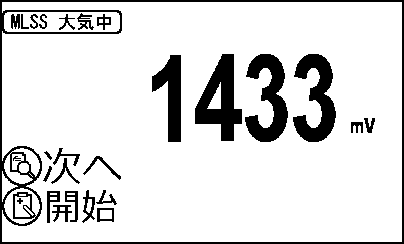
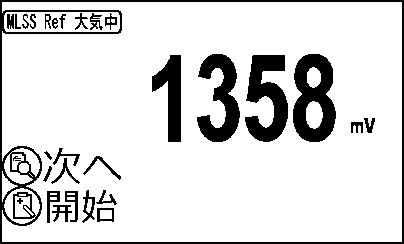
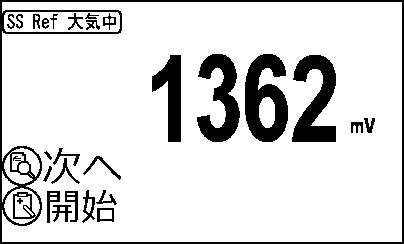
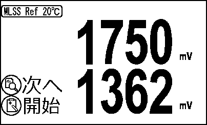
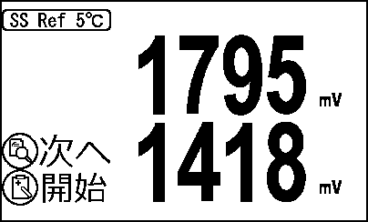
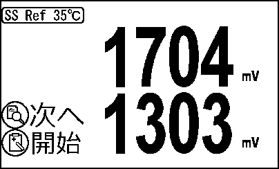
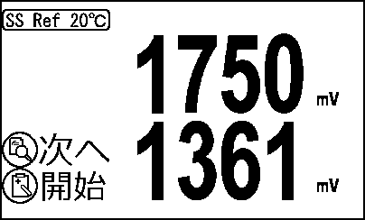

# IM-110 プローブ調整機能仕様書

> IM-110T 本体の **基板調整モード（ADBOAD）** の画面構成・操作・調整演算の動作仕様。製造時および保守時の調整作業で用いる機能を対象とする。

> **位置づけ**: 本書は `docs/adboad.md`（調整機能の仕様真実源）と本体ファームウェアの実装（`Adjust.c` の状態遷移、`Display.c` の描画、`IM_110.c` の調整演算）を突き合わせて清書したものである。仕様変更時は `adboad.md` を先に更新し、本書を追従させる。測定・校正モードの仕様は `IM-110プログラム仕様書.md`、通信仕様は `protocol-rs232c.md`、係数の意味と計算式は `mlss-calc-reference.md` を参照のこと。

> **画面図について**: 画面図はモノクロ LCD（400×240）である。本書の図は実装の描画コードとアイコンビットマップから生成した再現図であり、実機の撮影画像ではない。表示値は代表値である。生成スクリプトは `tools/spec-gen/adboad/`、画像は `docs/specs/assets/im-110/` に置く。

> 対象ファームウェア: 本体 Ver.0.41 / プローブ Ver.0.27（2026-08-06 時点）。文体はである調に統一する。

---

## 1. 概要

### 1.1 基板調整モードとは

基板調整モード（以下 ADBOAD）は、製造時にプローブ基板の光学系・アナログ系を調整し、出荷時の基準となる係数を確定するための専用モードである。通常の測定・校正モードからは到達できず、専用の起動操作を要する。

本モードで確定する係数は「出荷時調整係数」と呼び、現場でユーザーが実施する校正（ゼロ校正・スパン校正）とは独立に保持される。現場校正をいくら実施しても出荷時調整係数は書き換わらず、校正メニューの「校正リセット」により出荷時調整の状態へ復帰できる。

### 1.2 起動方法

実装: `main.c` 起動時の入力判定

電源投入時に本体 CN2 の `PC4_nTEST_in` 端子が LOW であることを検出すると、`operation_mode` を `ADBOAD` に設定して本モードで起動する。あわせて `use_UART_flag` を立て、CN2 経由の UART デバッグコマンドを使用可能にする。

同端子はケーブル未接続時のフロート誤読を避けるため、読み取り直前に内部プルアップ入力へ設定し、安定を待ってから読む。したがって調整治具のケーブルを接続していない限り、通常の測定モードで起動する。

### 1.3 画面構成と操作の原則

ADBOAD は 29 画面で構成する。画面の遷移と実行の操作は全画面で共通である。

- **履歴（DISP）スイッチ短押し**: 次の画面へ進む。最終画面の次は先頭へは戻らず、日時調整へ遷移する。
- **記録（MEM）スイッチ短押し**: 表示中の画面の調整を実行する。
- **履歴（DISP）スイッチ長押し**: 出荷時3点調整の 2 点目・3 点目の画面（17/18/20/21/23/24）に限り、基準器設定値の入力画面へ遷移する。

画面番号は `adboad.md` の項目番号に一致する。内部的には画面 4〜26 を `operation_mode = LOWRANGE0 | phase | idx`（`idx = 画面番号 − 4`）の 1 スロットで管理し、画面 1〜3 と 27〜29 は個別の状態値を持つ。

### 1.4 画面フローと廃止画面

実装: `adj_probe` の次画面決定処理

次の画面は仕様変更により廃止されており、実装は残置するが画面フローからは除外する。履歴（DISP）スイッチによる遷移では読み飛ばされ、到達しない。

| 画面 | 名称 | 除外の理由 |
|---|---|---|
| 05 / 06 / 08 / 09 | 空中AD調整 | 空中 1450mV 正規化（SADS）の廃止による。正規化を行わないため、プローブ出力は生の mV となる |
| 11 / 14 | Ref 温度補正 20℃ | 画面 04 / 07 の LED PWM 調整の収束時に 20℃ 点を捕捉するため不要 |
| 25 | 水深 出荷時ゼロ調整 | 水深のゼロ基準は電源投入時の大気圧を自動取得するため不要 |

到達可能な画面は、1〜4、7、10、12、13、15〜24、26〜29 の 22 画面である。

### 1.5 調整の推奨順序

係数の依存関係から、次の順序で実施する。

1. **画面 04 / 07（LED PWM 調整）** — 20℃ 清水中で受光量を目標値へ収束させ、同時に温度補正の 20℃ 基準点を捕捉する。以降のすべての調整がこの受光量を前提とするため、最初に実施しなければならない。
2. **画面 10 / 12 / 13 / 15（Ref 温度補正）** — 5℃ および 35℃ の清水中で温度補正点を捕捉する。
3. **画面 16 / 19 / 22（出荷時3点調整 清水）** — 各測定種別のゼロ点を確定する。
4. **画面 17 / 20 / 23（同 スパン点）**、**画面 18 / 21 / 24（同 中間点）** — 基準液で濃度点を確定する。
5. **画面 26（水深スパン調整）** — 6.00m 相当の気圧環境で水深の傾きを確定する。
6. **画面 27〜29（日時調整）** — 内蔵時計を設定する。

### 1.6 調整値の保存

調整で更新した係数は、実行の時点では本体の実行時変数（live）にのみ反映する。プローブ基板のフラッシュメモリへの確定は電源切断時に一括して行う。これは調整のたびに全ページを書き込むと約 2 秒の応答停止が生じ、操作性を損なうためである。

したがって **調整後は必ず電源スイッチで正常に電源を切ること**。確定前に電池を外すと調整値は失われる。なお UART コマンド `AWC` により、任意の時点で明示的にフラッシュへ確定することもできる。

---

## 2. 画面仕様

### 2.1 画面01 プログラムVer.表示

実装: 描画 `disp_PRGVER` / 遷移 `adj_dsp_progver`

本体ファームウェアのバージョンを表示する画面である。ADBOAD の先頭画面であり、電源投入直後に表示される。

表示要素は次のとおりである。

- 画面上部にタイトル「プログラムVer.」（`t_prog_Ver`）を表示する。
- ファームウェアバージョンを大サイズ数字で表示する。値は `FW_VER1` を 100 で除した数値で、小数第 2 位まで表示する。
- 左列に操作凡例として、履歴（DISP）スイッチに「次へ」、記録（MEM）スイッチに「長押しで消去」を表示する。

記録（MEM）スイッチを長押しすると、エラー発生日およびエラー番号の記録を消去し、消去完了の表示に切り替わる。これは製造時に試験で発生したエラー履歴を出荷前に消すための機能である。

**プログラムVer.表示**  
  
画面図 adboad_01 — BMP版: [adboad_01.bmp](assets/im-110/adboad_01.bmp)

### 2.2 画面02 EEPROM R/Wテスト

実装: 描画 `disp_EEP1` / 遷移 `adj_eep_test`

本体基板に搭載する EEPROM（M95256）の読み書き試験を行う画面である。ID-200T からの流用機能である。

表示要素は次のとおりである。

- 画面上部にタイトル（`t_EEP`）を表示する。
- 左列に操作凡例として、履歴（DISP）スイッチに「次へ」、記録（MEM）スイッチに「開始」を表示する。

記録（MEM）スイッチを押すと試験を開始し、全ページに対する書き込みと読み戻しの照合を行って結果を表示する。

**EEPROM R/Wテスト**  
  
画面図 adboad_02 — BMP版: [adboad_02.bmp](assets/im-110/adboad_02.bmp)

### 2.3 画面03 電池電圧表示

実装: 描画 `disp_BATVOL` / 遷移 `adj_dsp_battvol`

電池電圧（`V_BAT`）を表示する画面である。ID-200T からの流用機能である。

表示要素は次のとおりである。

- 画面上部にタイトル（`t_bat_vol`）を表示する。
- 電池電圧を大サイズ数字で小数第 2 位まで表示し、右側に単位「V」（`m_Voltage`）を添える。
- 左列に操作凡例として、履歴（DISP）スイッチに「次へ」を表示する。本画面に実行操作はない。

**電池電圧表示**  
  
画面図 adboad_03 — BMP版: [adboad_03.bmp](assets/im-110/adboad_03.bmp)

### 2.4 画面04 MLSS LED PWM調整（MLSS 20℃調整 兼用）

実装: 描画 `disp_ADBOAD_PROBE2` / 実行 `Adj_LED_Auto`, `Adj_TempC_Capture20_Inst` / 遷移 `adj_probe`

MLSS 系統（A/D ch1・ch2）の LED 駆動 PWM デューティを調整し、あわせて温度補正の 20℃ 基準点を捕捉する画面である。**20℃ の清水中にプローブを浸けた状態で実行する。**

表示要素は次のとおりである。

- 画面上部にタイトル「MLSS LED PWM」（`t_MLSS_LED_PWM`）を表示する。
- 上段に受光（ch1）の瞬時値を大サイズ数字で表示し、右下に単位「mV」を添える。
- 下段に Ref（ch2）の瞬時値を同様に表示する。
- 左列に操作凡例として、履歴（DISP）スイッチに「次へ」、記録（MEM）スイッチに「開始」を表示する。

表示値には移動平均ではなく瞬時値（`ADC_mV`）を用いる。調整中は現時点の受光量を確認したいため、平均窓が効くと追従が鈍くなるためである。隣接サンプルのばらつきは実測で標準偏差 0.03mV 程度であり、平均を取らずとも表示は安定する。

記録（MEM）スイッチを押すと、次の処理を順に実行する。

1. ch1・ch2 のうち**出力の大きい方**が目標値 1750mV に収束するよう、LED 駆動デューティを比例制御で最大 8 回まで更新する（`Adj_LED_Auto`）。各回でデューティを送信したのち整定を待ち、目標値との差が許容幅 ±30mV 以内になれば収束と判定する。
2. 収束した場合に限り、その時点の瞬時値から Ref・受光を温度補正の 20℃ スロットへ捕捉する（`Adj_TempC_Capture20_Inst`）。収束しなかった場合は捕捉しない。
3. 収束時はプローブへ `WPP` を発行し、デューティをプローブ側フラッシュへ保存する。

本処理は収束まで数秒から十数秒を要するため、実行中は待機アイコンを 0.5 秒周期で切り替えて動作中であることを示す。

捕捉に瞬時値を用いるのは、移動平均（10 件 × 約 500ms）がデューティ変更前の値を含むためである。

**MLSS LED PWM調整**  
  
画面図 adboad_04 — BMP版: [adboad_04.bmp](assets/im-110/adboad_04.bmp)

### 2.5 画面05・06 MLSS 空中調整【廃止・画面フロー除外】

実装: 描画 `disp_ADBOAD_PROBE` / 実行 `Adj_AD0_Channel` / 遷移 `adj_probe`

MLSS 受光（ch1）および MLSS Ref（ch2）の出力を、空気中で 1450mV となるよう傾きを調整する画面であった。空中正規化（SADS）の廃止にともない画面フローから除外しており、到達しない。実装および UART コマンドは残置する。

正規化を行わない現行仕様では、プローブの A/D スパンは既定値 1450 のままとなり、出力は生の mV となる。これにより 1mV あたりの重みがチャンネル間・個体間で揃う。

**MLSS 空中調整（画面05、参考）**  
  
画面図 adboad_05 — BMP版: [adboad_05.bmp](assets/im-110/adboad_05.bmp)

**MLSS Ref 空中調整（画面06、参考）**  
  
画面図 adboad_06 — BMP版: [adboad_06.bmp](assets/im-110/adboad_06.bmp)

### 2.6 画面07 SS LED PWM調整（SS 20℃調整 兼用）

実装: 描画 `disp_ADBOAD_PROBE2` / 実行 `Adj_LED_Auto`, `Adj_TempC_Capture20_Inst` / 遷移 `adj_probe`

SS 系統（A/D ch3・ch4）の LED 駆動 PWM デューティを調整し、あわせて温度補正の 20℃ 基準点を捕捉する画面である。**20℃ の清水中にプローブを浸けた状態で実行する。**

動作は画面 04 と同一であり、対象チャンネルが ch3・ch4、デューティの保存先が `LED_Out[1]`、捕捉先が SS の温度スロットである点のみが異なる。LED 駆動は TIM3 CH1 の 1 系統しかないため、系統ごとにデューティを保持し、A/D チャンネルマスク（`SADC`）で切り替える構成である。

透視度は SS と同じ ch3 を共用するため、本画面の調整は透視度の受光量も同時に決定する。

**SS LED PWM調整**  
  
画面図 adboad_07 — BMP版: [adboad_07.bmp](assets/im-110/adboad_07.bmp)

### 2.7 画面08・09 SS 空中調整【廃止・画面フロー除外】

SS 受光（ch3）および SS Ref（ch4）の空中調整画面であった。画面 05・06 と同じ理由で廃止し、画面フローから除外している。

**SS 空中調整（画面08、参考）**  
  
画面図 adboad_08 — BMP版: [adboad_08.bmp](assets/im-110/adboad_08.bmp)

**SS Ref 空中調整（画面09、参考）**  
  
画面図 adboad_09 — BMP版: [adboad_09.bmp](assets/im-110/adboad_09.bmp)

### 2.8 画面10・12 MLSS Ref 温度補正（5℃・35℃）

実装: 描画 `disp_ADBOAD_PROBE2` / 実行 `Adj_TempC_Capture` / 遷移 `adj_probe`

MLSS の温度補正係数を決めるための捕捉点を取得する画面である。**当該温度付近の清水中で実行する。**

表示要素は画面 04 と同一で、上段に受光（ch1）、下段に Ref（ch2）の瞬時値を mV で表示する。タイトルは画面 10 が「MLSS Ref 5℃」（`t_MLSS_Ref_05`）、画面 12 が「MLSS Ref 35℃」（`t_MLSS_Ref_35`）である。

記録（MEM）スイッチを押すと、その時点の Ref・受光の mV を該当温度スロット（5℃ または 35℃）へ捕捉する。捕捉点そのものが補正係数として機能するため、フィット計算は行わない。単一の点だけを取り直すことも可能である。

温度補正は捕捉した 3 点（5℃・20℃・35℃）を用い、20℃ を閾値とする 1 次式 2 本で補正比を求める方式である。詳細は `mlss-calc-reference.md` §8-T を参照のこと。20℃ 点は画面 04 で捕捉するため、本系統で取得するのは 5℃ と 35℃ の 2 点である。

なお、温度差が十分にない状態で捕捉した場合（Ref の差が 10mV 未満）は傾きを 0 として扱い、補正なしと同等になる。これは 0 除算と、ノイズ幅を温度変化と誤認した過大な補正の双方を防ぐためである。

**MLSS Ref 温度補正 5℃**  
  
画面図 adboad_10 — BMP版: [adboad_10.bmp](assets/im-110/adboad_10.bmp)

**MLSS Ref 温度補正 35℃**  
  
画面図 adboad_12 — BMP版: [adboad_12.bmp](assets/im-110/adboad_12.bmp)

### 2.9 画面11 MLSS Ref 温度補正 20℃【廃止・画面フロー除外】

20℃ の温度補正点を捕捉する画面であった。画面 04 の LED PWM 調整の収束時に同じ点を捕捉するため不要となり、画面フローから除外している。

**MLSS Ref 温度補正 20℃（参考）**  
  
画面図 adboad_11 — BMP版: [adboad_11.bmp](assets/im-110/adboad_11.bmp)

### 2.10 画面13・15 SS Ref 温度補正（5℃・35℃）

SS の温度補正係数を決めるための捕捉点を取得する画面である。動作は画面 10・12 と同一で、対象チャンネルが ch3・ch4、捕捉先が SS の温度スロットである点のみが異なる。

透視度は SS の補正結果を流用するため、透視度専用の温度補正点は存在しない。

**SS Ref 温度補正 5℃**  
  
画面図 adboad_13 — BMP版: [adboad_13.bmp](assets/im-110/adboad_13.bmp)

**SS Ref 温度補正 35℃**  
  
画面図 adboad_15 — BMP版: [adboad_15.bmp](assets/im-110/adboad_15.bmp)

### 2.11 画面14 SS Ref 温度補正 20℃【廃止・画面フロー除外】

画面 11 と同じ理由で廃止し、画面フローから除外している。

**SS Ref 温度補正 20℃（参考）**  
  
画面図 adboad_14 — BMP版: [adboad_14.bmp](assets/im-110/adboad_14.bmp)

### 2.12 出荷時3点調整の共通仕様（画面16〜24）

実装: `Adj_ShipPoint`（`IM_110.c`）

画面 16〜24 は MLSS・SS・透視度の 3 種別について、それぞれ 3 つの調整係数を確定する。設計の考え方は次のとおりである。

**調整係数は常に存在する。** 各種別に「ゼロ・スパン・中間」の 3 係数が常時存在し、新品時から既定式と自己整合する初期値が入っている。「点が無い」状態は存在しない。

| 係数 | 内容 | 初期値（MLSS / SS / 透視度） |
|---|---|---|
| ゼロ | 0 とする受光 mV | 1750mV（3 種別とも） |
| スパン | スパン設定値とする受光 mV ＋ 設定値 | 8000 / 1000 / 60 |
| 中間 | 中間設定値とする受光 mV ＋ 設定値 | 4000 / 500 / 30 |

**1 係数ずつ、任意の順序で実施できる。** 記録（MEM）スイッチを押すと、その画面に対応する係数だけを現在の受光 mV で置き換え、**常に 3 点から式を再計算**して即座に反映する。吸光度は再計算のたびに現在のゼロ係数から導出するため、どの係数をどの順に単独実施しても整合が保たれる。

**受光 mV は温度補正後の値で捕捉する。** ゼロ点・各濃度点とも補正後 mV で一貫させることで、20℃ 以外の環境で調整しても 20℃ 相当の係数となる。

各画面の実行時の動作は次のとおりである。

- **ゼロ実行（16 / 19 / 22）**: ゼロ係数を置換して再計算する。清水中であれば表示は直ちに 0 になる（透視度は後述のとおり 100.0 + OVER となる）。
- **スパン実行（17 / 20 / 23）**: スパン係数を置換し、あわせて**中間係数を「吸光度でスパンの 1/2」の位置**（mV では ゼロ点 と スパン点 の相乗平均）・設定値を 1/2 に再設定する。結果として式は実質 1 次式となる。
- **中間実行（18 / 21 / 24）**: 中間係数のみを置換して再計算する。結果として式は 2 次式（曲線）となる。

したがって、スパン点を取り直した場合は中間点も取り直す必要がある。一方、ゼロ点の取り直しは他の係数に影響しない。

**基準器設定値の変更**: 2 点目・3 点目の画面（17 / 18 / 20 / 21 / 23 / 24）では、履歴（DISP）スイッチの長押しで設定値の入力画面へ遷移する。記録（MEM）スイッチで編集中の桁を増加、履歴（DISP）スイッチで桁送りし、最終桁の次で確定して元の画面へ戻る。設定値は係数と対で保存されるため、電源再投入後も保持される。

### 2.13 画面16 MLSS 出荷時3点調整 清水

実装: 描画 `disp_ADBOAD_PROBE` / 実行 `Adj_ShipPoint(0, 0.0)` / 遷移 `adj_probe`

清水中の受光量を MLSS のゼロ点として確定する画面である。

表示要素は次のとおりである。

- 画面上部にタイトル「MLSS 0」（`t_MLSS_0`）を表示する。
- 現在の MLSS 測定値を大サイズ数字（整数）で表示し、右側に単位「mg/L」を添える。
- 左列に操作凡例として、履歴（DISP）スイッチに「次へ」、記録（MEM）スイッチに「開始」を表示する。

記録（MEM）スイッチを押すと、現在の受光 mV（温度補正後、移動平均）をゼロ係数として **現場枠と出荷時枠の両方** に設定し、3 点から 2 次式を再計算する。両枠に設定するのは、出荷直後は現場の校正値が出荷時値と一致すべきという考え方によるものである。以後ユーザーがゼロ校正を行うと現場枠のみが上書きされ、校正リセットで出荷時枠へ復帰する。

**MLSS 出荷時3点調整 清水**  
  
画面図 adboad_16 — BMP版: [adboad_16.bmp](assets/im-110/adboad_16.bmp)

### 2.14 画面17・18 MLSS 出荷時3点調整（スパン・中間）

実装: 描画 `disp_ADBOAD_SHIP` / 実行 `Adj_ShipPoint(1 or 2, 設定値)` / 遷移 `adj_probe`

既知濃度の標準液を用いて MLSS のスパン点（画面 17、初期設定値 8000mg/L）および中間点（画面 18、初期設定値 4000mg/L）を確定する画面である。

表示要素は次のとおりである。

- 画面上部にタイトルを表示する。
- 上段に現在の MLSS 測定値を大サイズ数字で表示し、右側に単位「mg/L」を添える。表示は測定画面と同じく 10mg/L 単位に丸める。
- 下段に基準器設定値を中サイズ数字で表示する。
- 左列に操作凡例として、履歴（DISP）スイッチに「次へ」、記録（MEM）スイッチに「開始」を表示する。

標準液にプローブを浸し、基準器の表示値を設定値として入力したうえで記録（MEM）スイッチを押すと、現在の受光 mV を当該係数として確定する。

**MLSS 出荷時3点調整 スパン**  
  
画面図 adboad_17 — BMP版: [adboad_17.bmp](assets/im-110/adboad_17.bmp)

**MLSS 出荷時3点調整 中間**  
  
画面図 adboad_18 — BMP版: [adboad_18.bmp](assets/im-110/adboad_18.bmp)

### 2.15 画面19〜21 SS 出荷時3点調整

SS の 3 点調整である。動作は MLSS（画面 16〜18）と同一で、対象が SS、初期設定値がスパン 1000mg/L・中間 500mg/L である点が異なる。

SS は相関式の番号を持たない単一式であるため、確定した式は直ちに測定に反映される。

**SS 出荷時3点調整 清水**  
  
画面図 adboad_19 — BMP版: [adboad_19.bmp](assets/im-110/adboad_19.bmp)

**SS 出荷時3点調整 スパン**  
  
画面図 adboad_20 — BMP版: [adboad_20.bmp](assets/im-110/adboad_20.bmp)

**SS 出荷時3点調整 中間**  
  
画面図 adboad_21 — BMP版: [adboad_21.bmp](assets/im-110/adboad_21.bmp)

### 2.16 画面22 透視度 出荷時3点調整 清水

実装: 描画 `disp_ADBOAD_PROBE` / 実行 `Adj_ShipPoint(0, 0.0)`, `tr_refit_ship_quad` / 遷移 `adj_probe`

透視度のゼロ点を確定する画面である。**20℃ の清水中で実行する。** 透視度は他の 2 種別と設計が異なるため、以下に詳述する。

表示要素は次のとおりである。

- 画面上部にタイトル「透視度 >100」（`t_TR_100`）を表示する。
- 現在の透視度を大サイズ数字（小数第 1 位）で表示し、右側に単位「cm」を添える。
- 100cm を超える場合は 100.0 で頭打ちとし、左側に OVER アイコンを表示する。
- 左列に操作凡例として、履歴（DISP）スイッチに「次へ」、記録（MEM）スイッチに「開始」を表示する。

記録（MEM）スイッチを押すと、次の処理を行う。

1. 現在の受光 mV（温度補正後）を透視度のゼロ係数として現場枠・出荷時枠の両方に設定する。
2. **清水そのものはフィット点として使用しない。** 清水は減衰がなく理論上 100cm を超えるためである。かわりに 100cm・60cm・30cm の 3 点を「新しいゼロ点から既定値の mV 差分だけ下げた予想点」として設定する。差分はそれぞれ 3.7mV・6.7mV・14.9mV であり、既定のゼロ 1750mV と各点（1746.3 / 1743.3 / 1735.1mV）の差に等しい。
3. この 3 点から 2 次式 `透視度cm = C0 + C1・ABS + C2・ABS²` を厳密フィットする。

予想点を設定するのは、既定の 60cm・30cm 点が絶対 mV で定義されているためである。LED PWM 調整の収束許容幅（±30mV）の範囲内で実測ゼロが 1743.3mV を下回ると、「60cm の液が清水より明るい」という物理的に矛盾した 3 点となり、2 次式が破綻する。実機ではこの状態で表示が 28.6cm に張り付く不具合が生じた。

この結果、**清水中では吸光度がほぼ 0 となり、計算値は C0（約 170cm）となって安定して 100.0 + OVER を表示する。** 100.0 ちょうどを表示するのは、受光量がゼロ点から 3.7mV 低下した時点である。100cm 点をゼロと同一にすると、清水がちょうど境界に乗って表示が 99cm と OVER の間で揺れるため、意図的に余裕を設けている。

60cm・30cm の予想点は画面 23・24 の実測により正式な点へ置き換わる。100cm 点に対応する実測画面は存在せず、予想点のまま運用する。

**透視度 出荷時3点調整 清水**  
  
画面図 adboad_22 — BMP版: [adboad_22.bmp](assets/im-110/adboad_22.bmp)

### 2.17 画面23・24 透視度 出荷時3点調整（60cm・30cm）

実装: 描画 `disp_ADBOAD_SHIP` / 実行 `Adj_ShipPoint(1 or 2, 設定値)` / 遷移 `adj_probe`

既知の透視度を持つ試料を用いてスパン点（画面 23、初期設定値 60cm）および中間点（画面 24、初期設定値 30cm）を確定する画面である。

表示要素は次のとおりである。

- 上段に現在の透視度を大サイズ数字（小数第 1 位）で表示し、右側に単位「cm」を添える。100cm 超は 100.0 で頭打ちとし OVER アイコンを表示、2.0cm 未満は 2.0cm で頭打ちとする。
- 下段に基準器設定値を中サイズ数字（小数第 1 位）で表示する。
- 左列の操作凡例は他の 3 点調整画面と同一である。

スパン実行時は、中間係数を「100cm 点とスパン点の吸光度の中点」・設定値を両者の平均に再設定する。他の 2 種別と同じ考え方である。

透視度の光学系は減衰が非常に小さく、60cm の試料でも清水から 7mV 程度しか受光量が下がらない。このため意味のある測定範囲はゼロ点から 15mV 程度の狭い範囲に収まる。空気中や遮光状態では吸光度が大きくなりすぎ、2 次式の頂点を超えて計算値が反転上昇するため OVER 表示となる。**動作確認には実際の試料水が必要であり、空気中や遮光による確認はできない。**

**透視度 出荷時3点調整 60cm**  
  
画面図 adboad_23 — BMP版: [adboad_23.bmp](assets/im-110/adboad_23.bmp)

**透視度 出荷時3点調整 30cm**  
  
画面図 adboad_24 — BMP版: [adboad_24.bmp](assets/im-110/adboad_24.bmp)

### 2.18 画面25 水深 出荷時ゼロ調整【廃止・画面フロー除外】

大気中で水深を 0.00m とするゼロ調整画面であった。水深のゼロ基準は電源投入時の大気圧を自動取得する方式に一本化したため不要となり、画面フローから除外している。実装は残置するが到達しない。

**水深 出荷時ゼロ調整（参考）**  
  
画面図 adboad_25 — BMP版: [adboad_25.bmp](assets/im-110/adboad_25.bmp)

### 2.19 画面26 水深 出荷時スパン調整

実装: 描画 `disp_ADBOAD_PROBE` / 実行 `Depth_Calib_Span6m` / 遷移 `adj_probe`

6.00m 相当の気圧環境で水深換算の傾きを確定する画面である。

表示要素は次のとおりである。

- 画面上部にタイトル「水深 6.00」（`t_Depth_600`）を表示する。
- 現在の水深を大サイズ数字（小数第 2 位）で表示し、右側に単位「m」を添える。
- 左列の操作凡例は他画面と同一である。

表示値にはゼロクランプ前の水深（`Depth_raw`）を用いる。これにより起動時基準からの負方向のドリフトが負値として可視化される。表示レイアウト保護のため −0.99〜6.00 の範囲に制限するが、測定画面の水深表示はゼロクランプを維持する。

記録（MEM）スイッチを押すと、傾き `k_depth = 6.0 /（現在の気圧 − 電源投入時の気圧）` を算出して設定する。1 点による傾き校正である。

**水深 出荷時スパン調整**  
  
画面図 adboad_26 — BMP版: [adboad_26.bmp](assets/im-110/adboad_26.bmp)

### 2.20 画面27〜29 日時調整

実装: 描画 `disp_SETYEAR`, `disp_SETDAYS`, `disp_SETHOUR` / 遷移 `set_YEAR`, `set_DAYS`, `set_HOUR`

内蔵時計（RTC）の日時を設定する画面である。年（画面 27）、月日（画面 28）、時分（画面 29）の順に遷移する。ID-200T からの流用機能である。

表示要素は次のとおりである。

- 画面上部にタイトルを表示する。
- 設定対象の数値を大サイズ数字で表示する。
- 増加「＋」・減少「−」・「中止」・「セット」の各項目を配置し、選択中の項目を反転表示で点滅させる。
- 左列に操作凡例として、履歴（DISP）スイッチに「選択」、記録（MEM）スイッチに「決定」を表示する。

履歴（DISP）スイッチで項目を移動し、記録（MEM）スイッチで決定する。「セット」を選ぶと値を RTC へ書き込み、「中止」を選ぶと変更を破棄する。

画面 29 で履歴（DISP）スイッチを押すと画面 01（プログラムVer.表示）へ戻り、ADBOAD の画面を一巡する。

**日時調整 年**  
  
画面図 adboad_27 — BMP版: [adboad_27.bmp](assets/im-110/adboad_27.bmp)

**日時調整 月日**  
  
画面図 adboad_28 — BMP版: [adboad_28.bmp](assets/im-110/adboad_28.bmp)

**日時調整 時分**  
  
画面図 adboad_29 — BMP版: [adboad_29.bmp](assets/im-110/adboad_29.bmp)

---

## 3. 調整係数と保存先

### 3.1 係数の一覧

ADBOAD で確定する係数と、その保存先は次のとおりである。保存先はプローブ基板のフラッシュメモリ上の統合ストア（512 バイト、32 バイト × 16 ページ）であり、本体 EEPROM には同一内容の控えを保持する。

| 係数 | 確定する画面 | 保存先ページ |
|---|---|---|
| A/D スパン正規化 | 05 / 06 / 08 / 09（廃止） | Page1 |
| LED PWM デューティ | 04 / 07 | Page2 |
| 水深換算の傾き | 26 | Page3 |
| MLSS ゼロ（出荷時枠・現場枠） | 16 | Page4 |
| MLSS 1次演算式（基準式） | 16 / 17 / 18 | Page5 |
| MLSS 相関式 No.21〜30 | 16 / 17 / 18（全スロットへ複写） | Page6〜10 |
| SS ゼロ（出荷時枠・現場枠） | 19 | Page11 |
| SS 1次演算式 | 19 / 20 / 21 | Page12・13 |
| 透視度 ゼロ（出荷時枠・現場枠） | 22 | Page14 |
| 校正点設定値 | 各設定値入力画面 | Page16 |
| 出荷時3点調整 捕捉点 | 16〜24 | Page17〜19 |
| 温度補正 捕捉点 | 04 / 07 / 10 / 12 / 13 / 15 | Page23・24 |

透視度の 1 次演算式（2 次式の係数）は保存しない。ゼロ点（出荷時枠）と Page19 の 3 点が真実源であり、読み出し時に毎回再フィットして求める。これは点を真実源とすることで、ゼロ点を変更した際に式が自動的に整合するためである。

### 3.2 出荷時枠と現場枠

ゼロ係数のみ、出荷時枠と現場枠の 2 つを持つ。

- **出荷時枠**: ADBOAD の画面 16 / 19 / 22 でのみ書き換わる。現場校正では変化しない。
- **現場枠**: ユーザーのゼロ校正で書き換わる。測定に使用するのはこちらである。

画面 16 / 19 / 22 の実行時は両枠に同じ値を設定する。校正メニューの「校正リセット」により、現場枠を出荷時枠の値へ復帰できる。

1 次演算式についても、出荷時に確定した基準式と現場校正で作るスパン補正式（2 次）が分離されており、現場校正が出荷時の式を書き換えることはない。

---

## 4. UART デバッグコマンド一覧

ADBOAD で起動している間（および `use_UART_flag` が立っている状態）は、本体 CN2 経由の UART コマンドが使用可能である。通信条件は **9600bps / 8bit / パリティなし / ストップ 1bit**、行末は CRLF である。

本章は調整作業で用いるコマンドを網羅する。本体コマンドの実装は `LinkSerial.c` の `CheckSerialCMD()`、プローブコマンドの仕様は `protocol-rs232c.md` §3.1 を参照のこと。

### 4.1 プローブ透過中継コマンド（`P_` 系）

実装: `LinkSerial.c` の `P_` 判定 → `ProbeRelay_Run()`

`P_` に続けてプローブ用コマンドを送ると、本体は `P_` を除いた文字列をそのままプローブへ転送し、以降 4 秒間はプローブからの応答をバイト単位で PC へ透過中継する。プローブの状態を直接確認・操作する唯一の手段であり、調整の検証で最も多用する。

本体⇔プローブ間は 38400bps、PC⇔本体間は 9600bps と速度が非対称なため、中継中の滞留分は本体内部の 2KB バッファに蓄えてから送出する。

主なコマンドを次に挙げる。プローブ側の詳細仕様は `protocol-rs232c.md` §3 を参照のこと。

| コマンド | 応答 | 機能 |
|---|---|---|
| `P_VR` | 値応答 1 行 | プローブの製品名・ファームウェアバージョンを取得する。世代判別に用いる |
| `P_MD` | 値応答 1 行 | 現在の測定値（A/D 6 チャンネル分）を 1 回送信させる |
| `P_MDR` | 値応答 1 行 | 各チャンネルの**生 mV** を取得する（Ver.0.18 以降） |
| `P_MS,1` / `P_MS,0` | `OK` | 測定値の自律送信を開始／停止する。引数省略の `P_MS` はトグル動作のため、新規の手順では明示指定を用いる |
| `P_RPP` | 複数行応答 | フラッシュ上のパラメータ一覧（A/D スパン・LED デューティ・Probe ID 等）を出力する |
| `P_RPG` | 複数行応答 | 統合ストア全 16 ページを 32 バイト単位の 16 進で転送させる |
| `P_WPP` | 固定文字列 | 現在のパラメータをプローブのフラッシュへ保存する |
| `P_RPI` | 固定文字列 | パラメータを初期値へ戻す（RAM 上のみ。永続化には続けて `P_WPP` が必要） |
| `P_RPF` | 固定文字列 | 統合ストアを**新品既定値で初期化**する（Ver.0.18 以降）。調整をすべて破棄するため実行には注意を要する |
| `P_SP,<idx>,<duty>` | `OK`/`NG` | LED 駆動デューティを直接設定する。`idx` は 0=MLSS 系、1=SS 系 |
| `P_SADC,<XXXX>` | `OK`/`NG` | A/D 有効チャンネルのビットマスクを設定する（4 文字の `0`/`1`）。例 `P_SADC,0011` で ch1・ch2 を有効化 |
| `P_SADA,<N>` | `OK`/`NG` | プローブ側の移動平均回数を設定する。既定 0（瞬時値）であり、平均は本体側で行う |
| `P_SADS,<N>` | `OK`/`NG` | 指定チャンネルの空中生 mV を A/D スパン基準として記録する。**空中正規化の廃止により通常は使用しない** |
| `P_SID,<N>` | `OK`/`NG` | Probe ID を設定する |

なお、プローブのファームウェア更新に用いる `FUP,45063` は `P_` を付けずに**本体へ**送る。本体がブリッジモードへ移行して自らプローブへ `FUP` を発行する仕組みのためである（後述 §4.4）。

### 4.2 調整・確認コマンド（本体）

実装: `LinkSerial.c`

ADBOAD の各画面に対応する調整を UART からも実行できる。画面操作と同じ処理を呼ぶため、結果は同一である。

| コマンド | 機能 | 対応する画面 |
|---|---|---|
| `AMV` | 現在の受光・Ref の mV、吸光度、1 次演算式の出力、最終測定値を返す | — |
| `AMIR` | 統合ストアの状態を返す。起動時のロード結果（`BOOT`）、プローブ接続状態（`CONN`）、EEPROM 控えの有無、実行時の主要係数、通信診断カウンタを含む | — |
| `RAD` | 統合ストアの全係数を一括ダンプする。調整結果の確認に最も有用である | — |
| `AST` | 現在の測定モード・相関式番号・捕捉点数・温度捕捉フラグを返す | — |
| `AMODE,<0/1/2>` | 測定モードを設定する（0=MLSS / 1=SS / 2=透視度） | — |
| `AEQ,<21-30>` | 相関式番号を選択する（MLSS のみ） | — |
| `ALDA,<duty>` | LED デューティを自動調整し、収束後にプローブへ保存する | 04 / 07 |
| `ALD,<duty>` | LED デューティを手動設定する（揮発。保存はしない） | — |
| `ATC` | 現在の温度に応じたスロットへ温度補正点を捕捉する | 10 / 12 / 13 / 15 |
| `ATCF` | 温度補正点を含む係数一式をフラッシュへ明示確定する | — |
| `AZC` | ゼロ点を捕捉する（**現場枠のみ**） | — |
| `AZCS` | ゼロ点を捕捉する（**出荷時枠**。透視度は画面 22 と同一処理） | 16 / 19 / 22 |
| `AZRI` | ゼロの現場枠を出荷時枠の値へ復帰する | — |
| `ACRI` | 相関式 No.21〜30 を出荷時基準式で初期化する | — |
| `AMC,<基準値>` | 1 次演算式のフィット用の点を捕捉する（透視度は cm） | — |
| `AMCF` | 捕捉点から出荷時基準式をフィットする（MLSS / SS） | 17 / 18 / 20 / 21 |
| `AMCU` | 捕捉点から選択中の相関式スロットをフィットする（MLSS / SS） | — |
| `AMD` | 捕捉点の一覧をダンプする | — |
| `AMR` | 捕捉バッファをリセットする | — |
| `AWD6` | 水深スパン校正を実行する（6m 相当の加圧環境で傾きを算出） | 26 |
| `AWDS` | 水深のデバッグ情報（水深・クランプ前の値・オフセット・傾き）を返す | — |
| `AWC` | 実行時の係数一式をプローブのフラッシュへ**明示確定**する | — |
| `AAD0` | プローブの空中 A/D 調整を一括実行する。**空中正規化の廃止により通常は使用しない** | 05 / 06 / 08 / 09（廃止） |
| `MIGV` | 本体側の全校正係数をプローブの統合ストアへ手動で書き出す | — |

`AMCP`（透視度の累乗フィット）は、透視度の 1 次演算式を 3 点 2 次式へ変更したことにより**廃止**しており、常に `NG` を返す。透視度の調整は画面 22〜24 または `AZCS` を用いる。

### 4.3 本体の保守コマンド

| コマンド | 機能 |
|---|---|
| `VR` | 本体のファームウェアバージョンを返す |
| `BVR` | 電池電圧を返す |
| `TR` / `TW` | RTC の日時を読み出す／書き込む |
| `REP` | EEPROM の指定ページを読み出す |
| `EPT` | EEPROM の読み書き試験を行う |
| `IEP` | EEPROM を初期設定する |
| `SIP` | 全 EEPROM パラメータを初期化する |
| `WAD` | 基板調整パラメータを EEPROM へ書き込む |
| `CDG` | ガイダンスの 1 日 1 回表示フラグをリセットする |
| `AAS` | 基板自動調整モードを設定する |
| `OFF` | 電源を切る |

### 4.4 プローブのファームウェア更新（`FUP`）

実装: `LinkSerial.c` の `FUP,45063` 判定 → `main.c` の `ProbeFupBridge_Run()`

プローブがケースに固定され SWD 端子（J4）を使えない場合に、本体経由の UART でプローブのファームウェアを書き換える機能である。手順の詳細は `fup-procedure.md` を参照のこと。

1. PC を 9600bps・パリティなしに設定し、本体 CN2 へ `FUP,45063` を送信する。
2. 本体が `P:FUP` を返してブリッジモードへ移行する。同時に本体はプローブへ `FUP,45063` を発行し、プローブは ROM ブートローダーへ移行する。
3. PC 側を **9600bps・偶数パリティ**へ切り替え、`stm32flash` 等で書き込む。本体は PC とプローブの間を透過中継する。
4. 書き込み後は**本体・プローブとも電源を入れ直す**。ブリッジモードは電源切断でしか解除されない。

注意点を次に挙げる。

- 本体とプローブのボーレートが一致していないと、`P:FUP` は返るがプローブがブートローダーへ移行せず、書き込みツールが初期化タイムアウトとなる。本体の現行ファームウェアは 38400bps であり、9600bps 時代のプローブ（Ver.0.24 以前）を更新するには、本体へ一時的に 9600bps 世代のファームウェア（Ver.0.32 等）を書き込む必要がある。
- 更新後のプローブは、旧世代の残存ストアが新ファームウェアから無効と判定されるため、**統合ストアを新品既定値で自動初期化する**。したがって更新後は調整をやり直す必要がある。

## 5. 改訂履歴

| 日付 | 内容 |
|---|---|
| 2026-08-07 | 初版作成。本体 Ver.0.41 / プローブ Ver.0.27 時点の実装に基づく |
